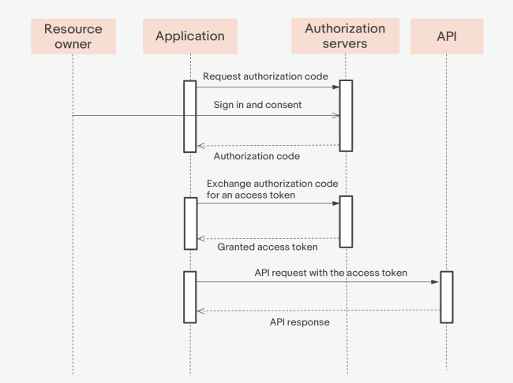
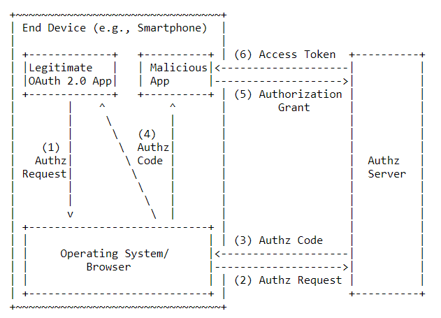
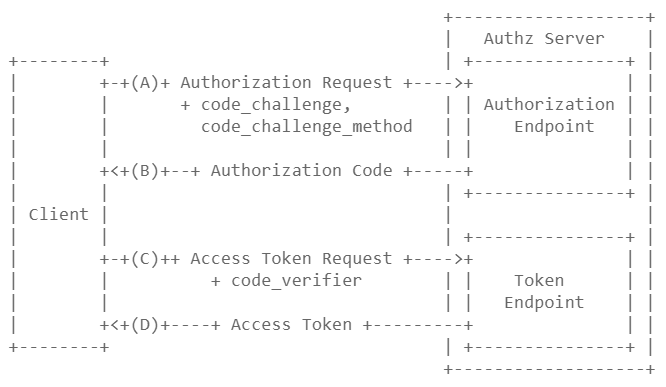

# OAuth 인증 방식

## 종류

|          | Confidential Client                 | Public Client      |
| -------- | ----------------------------------- | ------------------ |
| 3-legged | Authorization Code                  | Implicit           |
| 2-legged | Resource Owner Password Credentials | Client Credentials |

### 3-legged vs 2-legged

3-legged는 3개의 부분으로 되어있다.

- Resource Owner
- Client
- Authorization Server

이에 반해 2-legged는 3-legged에서 **Resource Owner가 제외된 방법**이다.

<br>

2-legged는 사용자 이름과 비밀번호를 Client에게 제공해야 하기 때문에 지양해야 한다.

### Confidential Client vs Public Client

Confidential client는 **인증 서버로부터 안전하게 인증을 받을 수 있는 방식**이다.

반대로 Public Client는 **Client Secret을 사용할 수  없을 때 사용된다.**


## Authorization Code Grant Type

> Google의 기준으로 작성되었다.
>
> [구글 플레이그라운드](https://developers.google.com/oauthplayground/)에서 경험해보면 이해하는데 도움이 된다.

Client가 AccessToken을 받고싶을 때 사용된다.

**Client임을 검증하는 코드를 사용하기 때문에 보안에 효과적이다.**

**앱이 로그인 페이지를 띄워줌으로써 인증을 시작**한다.

<br>

Access Token을 얻기 전, **인증 코드를 획득하는 과정**이 있기 때문에 보안에 더 좋다.

### 인증 과정



#### 1. Resource Server에게 Redirect 요청

우선 Resource Server에게 다음과 같은 요청을 보내게 된다.

| Param              | Explain                                                      |
| ------------------ | ------------------------------------------------------------ |
| response_type=code | code를 요청한다.                                             |
| client_id          | 개발자가 OAuth에 Application을 등록했을 때 받은 식별자이다.  |
| redirect_uri       | 요청을 승인해준 후에 Authorization Code와 함께 사용자를 보낼 uri이다. |
| state              | Application에서 임의로 문자열을 보내서 다시 같은 값이 반환되는지 확인한다.<br />이를 통해 CSRF 공격을 예방할 수 있다. |
| scope              | 접근할 수 있는 Resource Owner의 권한 목록                    |

``` http
GET /auth HTTP/1.1
Host: server.example.com

response_type=code
    &client_id=s6BhdRkqt3&state=xyz
    &redirect_uri=https%3A%2F%2Fclient%2Eexample%2Ecom%2Fcb
    &scope=create+delete
    &state=xcoiv98y3md22vwsuye3kch
```

그러면 다음과 같이 redirect시켜준다.

``` http
HTTP/1.1 302 Found
Location: https://accounts.google.com/o/oauth2/v2/auth?redirect_uri=https%3A%2F%2Fdevelopers.google.com%2Foauthplayground&prompt=consent&response_type=code&client_id=407408718192.apps.googleusercontent.com&scope=https%3A%2F%2Fwww.googleapis.com%2Fauth%2Fuserinfo.email+https%3A%2F%2Fwww.googleapis.com%2Fauth%2Fuserinfo.profile+openid&access_type=offline
```

#### 2. Resource Owner가 로그인한 후 Redirect URL로 이동한다.

Authorization Code와 함께 Redirect URL로 이동한다.

### 3. Authorization Code를 통해 Access Token을 발급받는다.

Authorization Code를 Resource Server에게 보내서 Access Token을 발급받는다.

| Param                         | Explain                                                      |
| ----------------------------- | ------------------------------------------------------------ |
| grant_type=authorization_code | 인증 방식을 authorization_code로 설정한다.                   |
| client_id                     | 개발자가 OAuth에 Application을 등록했을 때 받은 식별자이다.  |
| client_secret                 | 개발자가 OAuth에 Application을 등록했을 때 받은 식별자이다.<br />Resource Server와 Client만이 알고있어야 한다. |
| redirect_uri                  | 요청을 승인해준 후에 Authorization Code와 함께 사용자를 보낼 uri이다. |
| code                          | 아까 Redirect하며 받은 Authorizationzation Code값이다.       |
| format                        | 반환 타입을 설정한다. 기본값은 json이다.                     |


``` http
POST /token HTTP/1.1
Host: oauth2.googleapis.com
Content-length: 261
content-type: application/x-www-form-urlencoded
user-agent: google-oauth-playground

code=4%2F0AX4XfWjSJTPp_TaAFsQEGYx5Dv4ElpsvnUf8Z97PIHd1oUJqzlIRU5CcCIcSeNMFHygfEQ
	&redirect_uri=https%3A%2F%2Fdevelopers.google.com%2Foauthplayground
	&client_id=407408718192.apps.googleusercontent.com
	&client_secret=
	&scope=
	&grant_type=authorization_code
```

위와 같이 요청을 보내면 다음과 같은 response가 온다.

``` http
HTTP/1.1 200 OK
Content-length: 1558
X-xss-protection: 0
X-content-type-options: nosniff
Transfer-encoding: chunked
Expires: Mon, 01 Jan 1990 00:00:00 GMT
Vary: Origin, X-Origin, Referer
Server: scaffolding on HTTPServer2
-content-encoding: gzip
Pragma: no-cache
Cache-control: no-cache, no-store, max-age=0, must-revalidate
Date: Wed, 29 Dec 2021 23:31:22 GMT
X-frame-options: SAMEORIGIN
Alt-svc: h3=":443"; ma=2592000,h3-29=":443"; ma=2592000,h3-Q050=":443"; ma=2592000,h3-Q046=":443"; ma=2592000,h3-Q043=":443"; ma=2592000,quic=":443"; ma=2592000; v="46,43"
Content-type: application/json; charset=utf-8

{
  "access_token": "åccessToken", 
  "id_token": "id_token", 
  "expires_in": 3599, 
  "token_type": "Bearer", 
  "scope": "openid https://www.googleapis.com/auth/userinfo.profile", 
  "refresh_token": "refresh_token"
}
```

여기서 id_token이 뭔지 모를수도 있는데, **실질적으로 유저정보가 담긴 JWT 토큰**이다.

scope에서 명시한 정보들이 id_token에 담겨있다.

이렇게 **id_token을 포함방식을 OIDC(OpenID Connect)라고 부른다.**

> 표준 Response에서 필수적인 요소들만 보면 다음과 같다.
>
> ``` http
> HTTP/1.1 200 OK
> Cache-Control:no-store
> Content-Type:application/json
> Pragma:no-cache
> 
> {
> 	"access_token":“O91G451HZ0V83opz6udiSEjchPynd2Ss9......",
> 	"token_type":"Bearer",
> 	"expires_in":"3600",
> }
> ```

### 4. AccessToken을 통해 서비스에 접근한다.

### 5. AccessToken이 만료된 경우, 토큰을 재발급한다.

다음과 같이 토큰 재발급 요청을 보내게 되면 새로운 토큰을 발급해 준다.

``` http
POST /token HTTP/1.1
Host: oauth2.googleapis.com
Content-length: 223
content-type: application/x-www-form-urlencoded
user-agent: google-oauth-playground

client_secret=
	&grant_type=refresh_token
	&refresh_token=refresh_token
	&client_id=407408718192.apps.googleusercontent.com
```

다음과 같은 response가 오게 된다.

``` http
HTTP/1.1 200 OK
Content-length: 1432
X-xss-protection: 0
X-content-type-options: nosniff
Transfer-encoding: chunked
Expires: Mon, 01 Jan 1990 00:00:00 GMT
Vary: Origin, X-Origin, Referer
Server: scaffolding on HTTPServer2
-content-encoding: gzip
Pragma: no-cache
Cache-control: no-cache, no-store, max-age=0, must-revalidate
Date: Wed, 29 Dec 2021 23:36:18 GMT
X-frame-options: SAMEORIGIN
Alt-svc: h3=":443"; ma=2592000,h3-29=":443"; ma=2592000,h3-Q050=":443"; ma=2592000,h3-Q046=":443"; ma=2592000,h3-Q043=":443"; ma=2592000,quic=":443"; ma=2592000; v="46,43"
Content-type: application/json; charset=utf-8

{
  "access_token": "access_token",
  "scope": "https://www.googleapis.com/auth/userinfo.email",
  "expires_in": 3599,
  "token_type": "Bearer",
  "id_token": "id_token"
}
```

## PKCE

Authorization Grant Code방식의 확장 버전으로 **Authorization Code가 탈취되었을 때 보안을 보장**해 준다.

Single Page Application이나 모바일 앱 같은 경우에는 다음과 같은 문제가 발생할수도 있다.



1. 인증을 요청한다.
2. 인증 코드가 반환된다.
3. 인증 코드를 **우리가 원했던 앱 뿐만 아니라 악의적인 앱이 탈취**한다.
4. 해당 인증코드를 통해 권한을 부여받고 토큰을 발급받는다.

SPA나 앱 등과같은 경우`(Public Client)`에는 **항상 같은 Client Credential을 사용**하고, **Credential이 하드코딩**되어 들어있기 때문에 이러한 문제가 발생할 수 있다.

> Credential이 외부에 탈취되지 않았다는걸 증명할 방법이 없기 때문이다.
>
> 따라서 Public Client에서는 Client의 Secret에 기반한 작업이 추천되지 않는다.

### PKCE가 이를 예방하는 방법

PKCE는 **정말 Client App이라는 증거를 제공**한다.

이를 위해 code_verifier, code_challenge와 code_challenge_method를 증거로 사용한다.

- **code_verifier:** 43~128자의 랜덤 문자열로, `A-Z`, `a-z`, `0–9`, `-`, `.`, `_`, `~`만 포함될 수 있다.
- **code_challenge:** code_verifier를 SHA256 암호화 한 후 BASE64 URL Encoding 된 결과물.
  code_verifier 그 자체를 넣어줄수도 있지만, 보안상 좋지 않다.
- **code_challenge_method:** code_verifier가 code_challenge로 변경되는 방식을 설명하는 것.
  code_verifier와 code_challenge가 같다면 plain을 넣어주면 된다.`(안넣어줘도 plain이라고 판단한다.)`

위 값들은 Client에 의해 생성된다.



기존의 방식에서 다음과 같은 차이점이 있다.

1. Authorization Code를 요청할 때 code_challenge와 code_challenge_method를 전송한다.

   ``` http
   GET /auth HTTP/1.1
   Host: server.example.com
   
   response_type=code
       &client_id=s6BhdRkqt3&state=xyz
       &redirect_uri=https%3A%2F%2Fclient%2Eexample%2Ecom%2Fcb
       &scope=create+delete
       &state=xcoiv98y3md22vwsuye3kch
   	&code_challenge=HVoKJYs8JruAxs7hKcG4oLpJXCP-z1jJQtXpQte6GyA
   	&code_challenge_method=S256
   ```

2. Access Token을 요청할 때, code_verifier를 함께 보낸다.

   ``` http
   POST /token HTTP/1.1
   Host: oauth2.googleapis.com
   Content-length: 261
   content-type: application/x-www-form-urlencoded
   user-agent: google-oauth-playground
   
   code=4%2F0AX4XfWjSJTPp_TaAFsQEGYx5Dv4ElpsvnUf8Z97PIHd1oUJqzlIRU5CcCIcSeNMFHygfEQ
   	&redirect_uri=https%3A%2F%2Fdevelopers.google.com%2Foauthplayground
   	&client_id=407408718192.apps.googleusercontent.com
   	&client_secret=
   	&scope=
   	&grant_type=authorization_code
   	&code_verifier=EAp91aanXdoMcoOc2Il55H3UDDIV909k9olEEcl6L24J6_9X
   ```

   

code_verifier나 code_challenge는 **하나의 Access Token 요청에서 한 번만 사용되어야 한다.**

> 만약 code_verifier와 code_challenge가 같고, 공격자가 HTTP 요청에 접근할 수 있다면 **PKCE를 사용할 필요가 없다.**
>
> 물론 Client와 Authorization Server가 HTTPS 통신을 해야한다.

## Implicit Grant Type

Javascript의 SPA처럼 안전한 저장공간이 따로 없는 상황에 OAuth 인증을 해야할 때를 위해 만들어진 방법이다.

Authorization Code Grant Type에 비해 단순한 대신 보안상에 단점이 있다.

### 인증 과정


### 1. Resource Server에게 Redirect 요청을 보낸다.

다음과 같은 요청을 보내게 된다.

```http
GET /auth HTTP/1.1
Host: server.example.com

response_type=token
	&client_id=s6BhdRkqt3&state=xyz
	&redirect_uri=https%3A%2F%2Fclient%2Eexample%2Ecom%2Fcb
	&scope=create+delete
	&state=xcoiv98y3md22vwsuye3kch
```

### 2. Resource Owner가 로그인한 후 Redirect URL로 이동한다.

AccessToken과 함께 Redirect URL로 이동하게 된다.

``` http
HTTP/1.1 302 Found
Location: https://example-app.com/redirect
    #access_token=g0ZGZmNj4mOWIjNTk2Pw1Tk4ZTYyZGI3
    &token_type=Bearer
    &expires_in=600
    &state=xcoVv98y2kd44vuqwye3kcq
```

## Resource Owner Password Credentials Grant Type