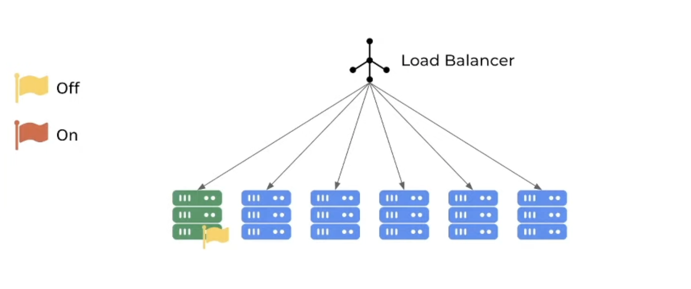
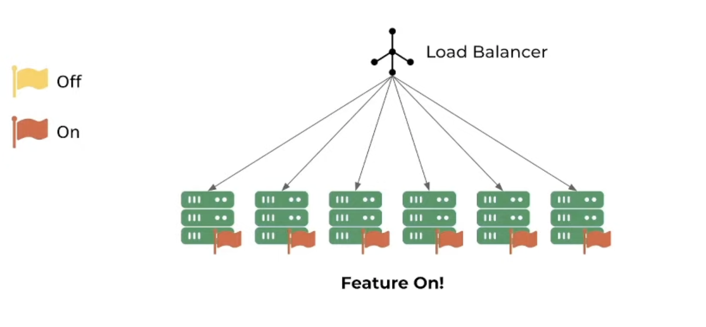
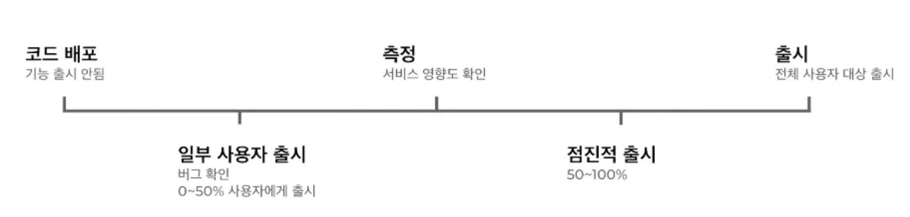
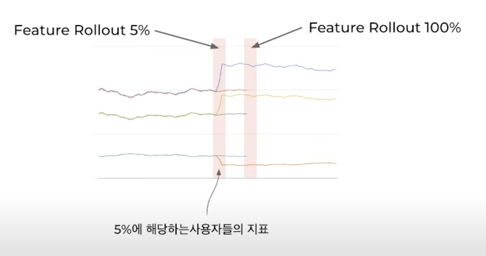
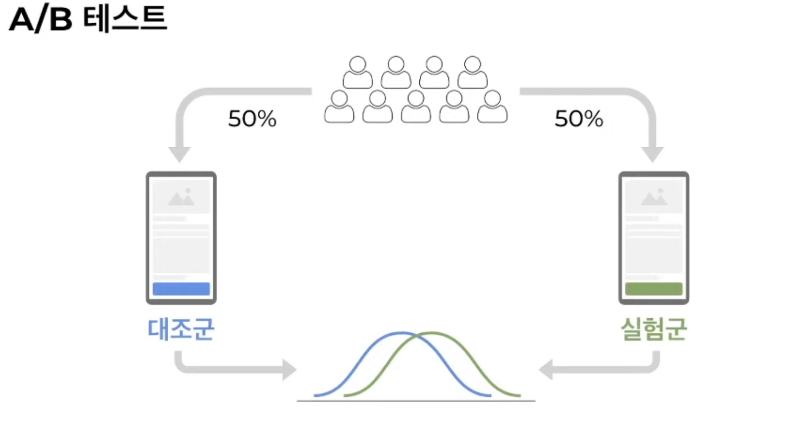

> 핵클 웨비나

# Progressive Delivery(점진적 전달)

**기능 출시를 제어** 하는 것을 의미한다.

예를 들어  로그인과 글 쓰기 기능이 있을 때, 모든 유저들은 로그인만 할 수 있고 특정 유저들은 글 쓰기까지 모두 가능한 것을 의미한다.

이를 통해 신규 기능을 특정 유저`(베타테스터 등)`에게만 먼저 적용해 주고 지표를 측정한다.

만약 지표에 이상이 있다면 신규 기능에 문제가 있다는걸 의미할 수 있고, 해당 서비스를 롤백시킬 수 있다.

# 배포 전략

## Blue/Green 배포


위와 같이 V1이 배포된 상황에서 V2를 배포하게 된다면 다음과 같이 로드 밸런서만 바꿔주면 된다.


단순히 Load Balancer를 V2서버에 옮기면 되기 때문에 사용자 입장에선 **서버의 다운이 없다고 느낄 수 있다.**

또한 V2에서 문제가 생겨도 다시 V1으로 로드 밸런서를 변경하기만 하면 롤백시킬 수 있다.

하지만 단점으로는 **V1 서버와 V2 서버 모두가 켜져있는 상태여야 한다.**

## Canary 배포


Canary 배포는 위와 같이 전체 서버 중 하나씩 하나씩 **점진적으로 배포**하는 형태를 의미한다.

하지만 기능의 출시와 코드의 배포가 동시에 일어나게 되고, 사용자 입장에서 V1과 V2 API가 공존하기 때문에 UX가 별로일수도 있다.

## Feature Flag

마지막으로 오늘 자세히 알아볼 기능 플래그이다.



위와 같이 Flag가 Off인 상태로 신규 기능을 적용하게 되면, 항상 이전 기능만 동작한다.

이런식으로 모두 배포한 후에 다음과 같이 Flag를 모두 On으로 바꿔주면 다음과 같이 V2의 버전이 적용되게 된다.



물론 만약 V2에서 문제가 발생하게 되면 V1으로 간단하게 Switch할 수 있다.

또한 **V1과 V2가 동시에 존재하는 시간을 줄일 수 있다.**

# 기능 플래그

## Feature Flag(기능 플래그)

점진적 전달을 가능하게 해주는 기술로, 다음과 같은 특징이 있다.

- **어떤 기능을 오픈할지 막을지 선택**할 수 있다.

- **점진적으로 트래픽을 늘려갈수도 있다.**

  만약 서버에 성능 이슈가 있다면 높은 트래픽을 감당하기 힘들기 때문에 지표를 확인하고 다른 서비스들에게 영향을 주지 않고 해당 기능을 보완할수도 있다.

- **특정 유저에게만 기능을 공개**할 수 있다.

만약 우리가 어떤 기능을 오픈할지 말지를 코드로 구현하려고 하면 다음과 같이 할 수 있다.

``` java
Boolean isFeature = client.isFeatureOn(NEW_FEATURE);		// 사용자에게 기능을 출시해야 하는지 받아옴

if(isFeature) {
    // 신규 버전
} else {
    // 이전 버전
}
```

## 기능 플래그를 이용한 점진적 전달

1. 개발자들 에게만 신규 기능을 적용시킨다.
2. QA분들에게만 신규 기능을 적용시킨다.
3. 일부 사용자에게만 기능을 출시시킨다.
4. 특정 그룹에게만 기능을 출시시킨다.
5. 전체 사용자에게 기능을 출시한다.
6. 만약 문제가 생겼다면 **간단하게 flag만 바꿔서 롤백시킬 수 있다.**

### 장점 - 배포와 출시의 분리

- 코드를 배포해도 기능 출시는 되지 않음
- 운영환경에서 쉬운 테스트
- 점진적 롤백으로 영향도 최소화
- 쉬운 롤백

### 데이터 측정



위와 같이 데이터를 점진적으로 측정해 보다가, 만약 아무 문제가 없을 때 전체 사용자를 대상으로 출시할 수 있다.

따라서 **버그나 서비스에게 주는 영향을 미리 측정**할 수 있다.

### 영향도 확인



위와 같이 기능 트래픽을 5%만 노출시켰을 때에는 전체 Application에 별다른 영향을 끼치지 않는다.

하지만 5% 사용자들의 지표만 확인한다면 문제가 있는걸 확인할 수 있다.

이럴 때에 **트래픽을 100% 노출시키지 않고 롤백시켰다면 이러한 일을 미리 방지**할 수 있다.

<br>

신규 기능은 에러 수, 지연 시간 등 시스템 지표나 비지니스 지표를 변하게 한다.

하지만 지표에 영향을 끼치는 외부 요인은 너무도 많다.

따라서 A/B 테스트를 진행할 수 있다.

### A/B 테스트



사용자들을 기존의 API와 신규 API로 나누어 테스트를 진행하게 되면 다른 외부적 요인 없이 신규 기능으로 변한 지표만을 확인할 수 있다.

#### 기능 플래그 + A/B 테스트

- 배포와 출시를 분리
- 적은 트래픽으로도 영향도 확인 가능
- 출시한 기능으로 인한 영향도를 확인할 수 있다.
- 롤백이 간단하다.

### 사례

#### Coupang

쿠팡에서는 **독자적인 실험 플랫폼**을 사용한다.

A/B 테스트를 통해 기능 플래그를 통해 극소량의 트래픽만으로도 지표를 만들 수 있다.

따라서 배포에 대한 압박감을 줄일 수 있고, 문제를 미연에 예방하는 효과가 있다.

#### Netflix

Netflix나 기능 플래그로 미리 테스트를 진행한다.

따라서 모든 제품의 변경은 A/B 테스트를 진행한 후에 변경한다.

#### Uber

Uber 또한 A/B 테스트를 진행한 후에 실제 유저에게 배포를 한다.

