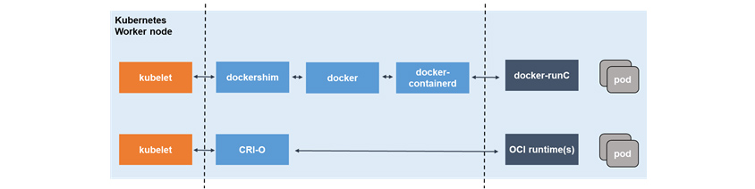

# Kubernetes 개념

## 왜 사용할까?

우리가 CI/CD를 이용할 때, 모든 명령어를 각각 컨테이너들마다 적어줘야 했다.

이런 상태에서 배포할 서버가 하나 늘어나게 된다면 **그 서버에 대한 스크립트를 추가**해 줘야 했다.

 

또한 만약 프록시 서버를 통하여 요청을 처리하는 경우에는 **서비스가 추가될때마다 서버 설정을 추가**해야 하며, 로드밸런서와 같은 **추가 설정**이 필요할때도 많다.

결국 배포의 편리함을 위해 도커를 사용했지만, **결국 관리가 다시 어려워지게 된다.**

 

이래서 등장한 것이 **컨테이너 오케스트레이션**이다.

 

## Container Orchestration

Container Orchestration이란 **컨테이너의 배포, 관리, 확장, 네트워킹**을 간단하게 하는 기술을 의미한다.

 

### Kubernetes

> 그리스어로 배의 키를 잡는 사람 이란 뜻 으로, `k + 8글자 + s` 라는 의미로 k8s 라고도 불린다.

원래 구글 내부에서 사용하던 컨테이너 오케스트레이션 툴 이었는데, 오픈소스로 바꾼 것이다.

다음 기능들을 지원한다.

- **Load Balancing**

  쿠버네티스는 어느 컨테이너에 트래픽이 몰리게 되면 트래픽을 로드밸런싱 해준다.

- **Storage Orchestration**

  쿠버네티스는 로컬 저장소와 같이 원하는 저장소를 탑재할 수 있다.

- **Automatic RollOut and Rollback**

  쿠버네티스를 통해 원하는 때로 컨테이너의 상태를 설명하고, 원하는 속도에 맞춰 실제 상태를 수정할 수 있다.

- **Automatic Bin Packing**

  쿠버네티스 클러스터 노드를 제공하기 때문에 각 컨테이너가 필요로 하는 CPU, RAM을 잘 할당해 준다.

- **Automatic Self Healing**

  쿠버네티스는 문제가 발생한 컨테이너를 재시작해 주고, 교체해 주며, 죽이기도 한다.

  이러한 과정들은 클라이언트에게 보여지지 않는다.

- **Secret and Configuration Management**

  SecretKey나 토큰과 같이 중요한 정보를 저장 및 관리할 수 있다.

 

### 특징

- 컨테이너의 유형에 제약을 받지 않는다. 즉 **컨테이너에서 잘 돌아가면 쿠버네티스에서도 잘 돌아간다.**
- 소스코드를 배포하지 않고, 빌드하지도 않는다. 즉 **CI/CD는 조직의 취향에 따른다.**
- 애플리케이션 레벨의 서비스를 제공하지 않는다. 즉 MySQL과 같은 것을 사용하려 하면 전용 컨테이너에서 돌려야 한다. 백업 관련도 직접 책임을 져야 한다.
- 로깅, 모니터링, 경고를 제공하지 않는다.

 

### Docker Swarm

Docker Swarm은 **도커에서 공식적으로 만든 오케스트레이션 툴**이다.

대부분 **K8S와 비슷**하게 **컨테이너들을 관리**해 준다.

 

비교하면 다음과 같다.

| DockerSwarm                                                  | Kubernetes                                                   |
| ------------------------------------------------------------ | ------------------------------------------------------------ |
| Service 객체만 존재. 서비스 객체는 1개 이상의 컨테이너로 구성되어 있다. | pod(컨테이너 집합) 객체, deployment(배포 담당)객체,  Service 객체가 있다. |
| 클러스터의 상태를 변경하면 즉시 반영                         | 텀을 두고 반영                                               |
| Docker만 설치하면 됨                                         | Docker, K8S 모두 설치해야 함.                                |
| Service만 제공하기 때문에 상세 조정 힘듬                     | 상세 조정 가능                                               |
| 유연하고 신뢰성이 높음                                       | 간단하고 리소스 사용이 적음.                                 |

 

## Kubernetes와 Docker

> [참고](https://www.samsungsds.com/kr/insights/docker.html)

Docker는 컨테이너 런타임 인터페이스인 **CRI를 준수하지 않는다.**

하지만 Kubernetes는 표준을 준수하기 때문에 **2021년 말(v 1.2.2)부터 도커를 지원하지 않게 된다.**

도커를 개발 도구로 사용하지 못하는 것은 아니다. 기존의 이미지는 CRI 환경에서 잘 작동한다.

**도커가 만들어내는 이미지는 OCI 이미지**이기 때문에 CRI-O나 Containerd가 가져와서 실행할 수 있다.

 

즉 우리는 이미지는 그대로 두되, 컨테이너 런타임(컨테이너 실행 환경)을 Containerd나 CRI-O 등으로 변경해야 한다.

 

> 번외로, 도커는 여러 문제들을 가지고 있었다.
>
> 도커는 Docker CLI와 Docker Daemon으로 구성되는데, 그 중 Docker Daemon이 **너무 많은 역할**을 담당하고 있어서 **모든 컨테이너를 자식 프로세스**로 가지게 된다.
>
> 이로 인해서 **무겁고, 장애 발생 시 모든 자식 프로세스 들에게 영향**을 끼쳐, **단일 실패점(Single point of failure)**이 될 위험이 있다.
>
> 또한 **도커의 모든 명령어는 루트 사용자 에게서만 실행 가능**해서 보안에 문제가 발생할 수 있다.

 

### CRI-O

CRI와 OCI에서 유래된 프로젝트.

위가 도커, 아래가 CRI-O가 작동하는 방식이다.

**도커를 간소화**하기 위해 노력했기 때문에 **이미지 빌드나 컨테이너 생성은 지원하지 않는다.**

이러한 상황은 결국 도커를 필요로 하기 때문에 개발자들은 Buildah, Podman, Skopeo를 만들었다.

 

- Buildah

  CRI-O에서 이미지를 빌드할 때 **도커의 종속성을 제거**하기 위해 개발되었다.

  Dockerfile 없이 다른 스크립트 언어로 컨테이너 이미지를 빌드하는데에 목적을 뒀다.

- Podman

  이미지를 pull받는 것과 같이 **이미지를 유지, 관리하고 수정에 도움**이 되기 위해 등장했다.

  또한 **컨테이너 작성, 실행 등의 작업**도 할 수 있다. 즉 Docker CLI에서 할 수 있는 것들을 지원한다.

- Skopeo

  **이미지 저장소에서 다양한 작업**을 수행하는 도구이다.

  기존에 도커가 다른 레지스트리에 이미지를 복사하기 위해 pull, tag, push를 사용했다면 skopeo는 간단하게 copy를 지원한다.