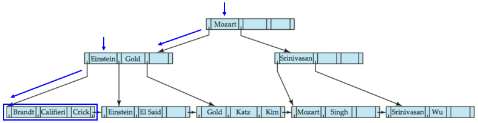
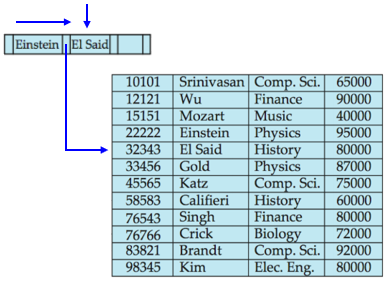
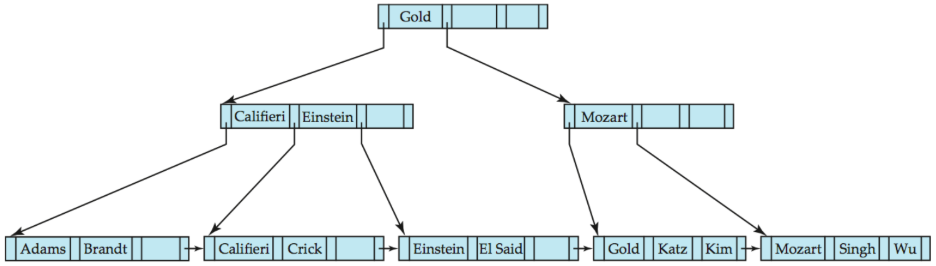

# DB Index

## INDEX가 등장하게된 이유

### 기존의 시스템

만약 우리가 직접 데이터베이스에 저장하게 되면 **데이터 블록**으로 저장되게 된다.

이러한 블록들은 접근할 때 **최소 단위**가 된다.

> `These blocks are accessed in their entirety, making them the atomic disk access operation`
>
> 즉 이러한 블록들에 접근하게 되면, 블록 단위로 접근할 수 있다.

블록들은 **연결리스트와 비슷한 형태**를 가지고 있는데, 공통점은 아래와 같다.

- 데이터를 섹션으로 나눠서 저장한다.
- 다음 블록의 주소를 가지고 있다.
- 연속적으로 연결될 필요가 없다.

자료들이 하나의 필드로만 정렬될 수 있다는 특징 때문에 우리는 정렬되지 않은 필드로 검색하려 하면 **선형 검색**을 해야한다.

> 선형 검색(Linear Search)란 **처음부터 끝까지** 순회하며 **각각 모두 비교** 해서 탐색하는 방법이다.

이러한 선형 검색은 평균적으로 **`블록 개수/2`** 만큼의 블록을 탐색해야 원하는 자료를 검색할 수 있다.

> UNIQUE한 필드라면 제일 처음 찾은 후 탐색을 종료해도 되기 때문이다.

만약 UNIQUE한 필드가 아니라면 **블록 개수**만큼의 블록을 **전부** 탐색해야 하는 일이 발생한다.

> 이러한 일을 Full Scan이라고 한다.

만약 정렬 된 속성이라면 **이진 검색 알고리즘**을 사용할 수 있다.

> 이진 검색 알고리즘은 `log₂ N`의 시간 복잡도를 가지고 있는데, **정렬이 되어있을 때**만 사용할 수 있다.

또한 키가 아닌 필드에 따라 정렬되었기 때문에 원하는 값을 발견했다면 더 높은 값을 탐색할 필요가 없다.

> `since the data is sorted given a non-key field, the rest of the table doesn’t need to be searched for duplicate values, once a higher value is found. Thus the performance increase is substantial.`

## Index란?

**추가적인 공간**을 활용해서 **조회의 성능 향상**을 위해 사용되는 자료구조 이다.

**여러가지 필드**를 통해 자료를 **정렬**하는 것을 의미한다.

> 만약 index가 없을 때 id가 10000인 데이터를 찾으려면, 테이블의 모든 데이터를 순회하며 찾아야 한다.

Index란 **지정한 컬럼**을 기준으로 **목차**를 생성하는 것으로, **조회의 성능 향상**을 목적으로 사용된다.

반대로 삭제, 수정, 삽입의 성능은 떨어지게 된다.

> 원래 수정, 삭제는 작업 전 조회를 하게 되는데, 여기서 전체적인 작업(조회 + 삭제)이 느려지는게 아니라 삭제 작업만 느려지게 된다.
>
> 즉 **전체적인 수정/삭제 작업의 속도가 느려
는건 아니고, 오히려 빨라질수도 .**

그림으로 보면 다음과 같다.

즉 인덱스를 사용하게 되면 직접 테이블에 접근하는게 아니라, **INDEX를 통해 실제 테이블에 간접적으로 접근한다.**

인덱스에 접근한 후에, KEY - VALUE 형태로 되어있는 INDEX에서 **주소를 찾아 실제 테이블에 접근한다.**

> 자세히 설명하면 실제 자료들에서 추출된 몇몇 속성들로 이루어진 자료구조를 만들게 된다.
>
> 해당 자료 구조는 실제에서 자료들의 주소를 가지고 있고, 정렬되어 있어 2진 탐색을 할 수 있다.

#### 성능이 느려지는 이유

DBMS가 조회를 사용하려 하면 INDEX를 항상 최신 상태로 유지해야 한다.

> 삽입이 일어났는데 INDEX가 수정되지 않았다면, INSERT된 값은 조회 결과로 들어오지 않기 때문이다.

따라서 삽입, 수정, 삭제 시에 **INDEX를 수정하기 위한 추가 오버헤드가 발생한다.**

- 삽입

  새로운 데이터를 인덱스에 추가한다.

- 삭제

  삭제된 데이터의 인덱스를 **사용하지 않도록 함**

- 수정

  기존의 인덱스를 **미사용 처리**하고 **갱신된 데이터를 인덱스에 추가**한다.

## INDEX의 장단점

### 장점

- 테이블 조회 성능을 증가시킬 수 있다.

- 전반적인 시스템의 부하를 줄일 수 있다.

  만약 INDEX가 없을 때 FULL SCAN이 발생할 상황을 훨씬 쉽고 부하가 적게 조회한다.

### 단점

- 인덱스를 관리하기 위한 공간이 필요하다.

  > DB의 10% 정도 차지하게 된다.

- 인덱스 관리를 위한 추가 작업이 필요하다.

- 잘 못 사용할 경우, 오히려 성능이 저하될 수 있다.

  이유는 삭제와 수정이 인덱스를 **삭제하지 않고 사용하지 않음 처리하기 때문이다.**

  즉 수정 삭제가 빈번한 테이블에 인덱스를 사용하게 되면 **실제 데이터보다 훨씬 더 많은 인덱스 때문에 성능이 저하된다.**

따라서 사용하지 않는 인덱스는 지워주는게 좋다.

### 인덱스를 사용하면 좋은 경우

- 규모가 큰 테이블
- 삽입, 수정, 삭제가 자주 일어나지 않는 컬럼
- JOIN, ORDER BY, WHERE이 자주 일어나는 컬럼
- 데이터 중복도가 낮은 컬럼

### 자료구조

#### Hash 인덱스 알고리즘

**컬럼의 해시 값**을 계산해서 인덱싱 하는 알고리즘

하지만 값을 변형하기 때문에, `like`나 `<`(부등호 연산)의 사용이 불가능하다.

주로 메모리 기반 데이터베이스 (redis 등)에서 사용된다.

시간 복잡도가 O(1)로, 굉장히 빠르다.

#### B+Tree 알고리즘

B Tree의 알고리즘의 변형된 형태로, 기존의 B Tree가 노드에 key와 value를 저장했던 것에 반해 B+Tree는 **노드에 key만 담아두고, value는 저장하지 않는다.**

오직 리프 노드에만 데이터를 저장하기 때문에 메모리를 더 확보할 수 있고, 더 많은 key들을 수용할 수 있다는 장점이 있다.

대부분의 인덱싱 알고리즘에서 사용된다.

특정 컬럼의 값을 변형하지 않고 원래 값을 이용해 인덱싱 한다.

즉 **`like`를 통한 검색이나 부등호 탐색이 가능**하기 때문에 index에서 사용할 때, 동등 연산에 특화된 해쉬 알고리즘보다 인덱스에 적합하다.

#### 구조

B+ Tree의 각 노드는 **포인터와 키**가 번갈아서 저장된다.

Leaf node의 각 포인터는 **키에 맞는 데이터의 실제 위치**를 저장하고, 마지막 포인터는 **다음 Leaf node의 위치**를 저장한다.

> Leaf Node란 **맨 밑에 위치한 노드**를 의미한다.

Leaf node가 아닌 노드들도 포인터와 키가 번갈아서 저장되는데, Leaf node가 아닌 노드들의 포인터는 **Child Node의 위치**를 저장한다.

| 포인터 | 키   | 포인터 | 키   | 포인터 |
| ------ | ---- | ------ | ---- | ------ |

키를 기준으로 **왼쪽은 key보다 작은 key들이 저장된 노드, 오른쪽은 key보다 크거나 같은 key들이 저장된 노드의 위치**를 의미한다.

#### 삽입

삽입은 다음의 과정을 거친다.

1. 해당 Key 값을 찾는다.
    - 존재한다면 Key의 포인터를 따라가서 실제 데이터를 수정한다.
2. 존재하지 않으면 DB에 데이터를 삽입한다.
3. leaf node에 공간이 있다면 **Pointer와 key를 삽입**한다,.
4. 빈 공간이 없다면 **해당 노드를 Split 한 후 빈 공간에 삽입**한다.

여기서 split이란 새로 삽입할 노드를 포함한 n개의 pointer/value 쌍이 있을 때, n/2 번째 쌍을 첫번째 쌍으로 갖는 새 노드를 만드는 것을 의미한다.

위 트리에서 "Adams"라는 걸 삽입해 보자

가장 먼저 Adams 라는 키를 탐색해 본다.

하지만 해당 Key가 존재하지 않기 때문에 수정이 아닌 삽입을 한다.

해당하는 Leaf node인 가장 왼쪽 아래 노드에 삽입을 해야하는데, 공간이 없다.

따라서 해당 노드를 split 해야한다.

기존 3개의 키 + 새로 넣을 키 = 4개 이기 때문에, 2개 2개로 나뉘어야 한다.

뒤 2개 키를 따로 빼서 새로운 노드를 만든다.

또한 부모 노드에서도 새로운 키-포인터를 추가해 주어야 한다.

만약 부모 노드에도 자리가 없었다면 부모 노드 또한 split 해야한다.

#### 탐색

1. Root 노드에서 출발한다.
2. leaf 노드가 아닐때까지 다음 작업을 반복한다.
    * 원하는 키 보다 크거나 같은 **최초의 키**를 찾는다.
    * 만약 원하는 키와 해당 키가 같다면 **오른쪽의 포인터**가 가르키는 곳으로 이동한다.
    * 만약 해당 키가 포인터보다 크다면 **왼쪽의 포인터**가 가르키는 곳으로 이동한다.
    * 만약 해당하는 키가 없다면 **null이 아닌 마지막 포인터**로 이동한다.
3. leaf 노드에 도착했다면 target과 같은 key를 찾는다.
4. 해당 포인터에서 데이터를 가져온다.

예제로 쉽게 알아보자

위와 같은 B+ Tree가 있고 El Said 라는 정보를 찾고 싶다고 가정하자.

우선 Mozart의 알파벳이 El Said보다 크기 때문에 왼쪽 노드를 따라간다.

Child Node에서 **El Said보다 빠른 첫 key**를 찾는다.

여기선 Gold 이므로 **Gold의 왼쪽 노드를 따라간다.**

이제 leaf node이기 때문에 key를 찾고, 해당 key의 왼쪽 포인터를 찾아가면 데이터가 있다.

#### 삭제

1. Key 값을 검색한다.
2. 데이터의 위치를 찾아 DB에서 데이터를 삭제한다.
3. B+ Tree에서 데이터 쌍을 삭제한다.
4. 삭제 후 **해당 노드에 데이터가 거의 남지 않아 형제 노드와 병합이 가능하다면 병합**한다.
5. 삭제 후 **해당 노드에 데이터가 거의 없지만 병합이 불가능 하다면 redistribute 한다.**

위 노드에서 Srinivasan 이라는 데이터를 지운다고 가정하자.

우선 위 트리를 탐색해서 해당 데이터를 찾고, 삭제한다.

그럼 위와 같은 형태가 되는데, 마지막 leaf node에 데이터가 하나밖에 안남게 된다.

따라서 형제 노드와 **merge**해 준다.

그럼 위 그림과 같은 형태가 되는데, 이제는 부모 노드가 비어져 버렸다.

따라서 형제 노드에서 **redistribute**해준다.

> 쉽게 말해서 형제 노드에서 데이터를 하나 빌리는 것이다.

그럼 위와 같이 안정된 상태가 된다.

#### 의문점

만약 형제 노드 또한 빌려줄 데이터가 존재하지 않으면 redistribute는 어떻게 동작하는가?

내부적으로 비교 연산 시 어떤 방식으로 조회할까?
