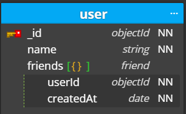
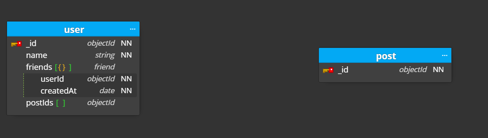
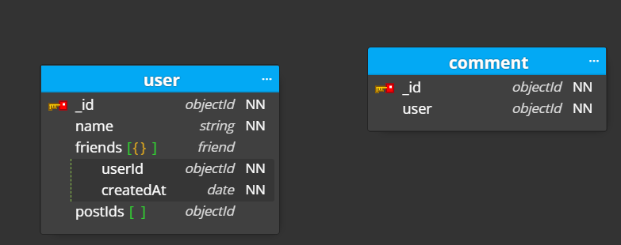
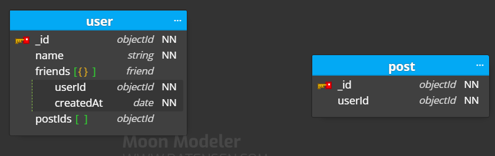
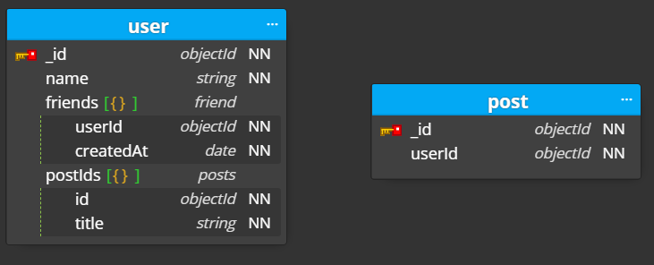
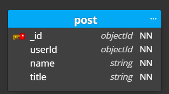

# MongoDB 스키마 설계 원칙

시작하기 앞서서, MongoDB에서 **하나의 Document는 16MB를 넘길 수 없다.**

## 6가지 규칙

- **🕐피할 수 없는 이유가 없다면 Document에 포함되어야 한다.**
- **:clock2:객체에 직접 접근할 필요가 있다면 문서에 포함되지 않아야 함**
- **:clock3:배열이 크다면 새로운 Collection을 만들어 관계를 맺어줘야 한다.**
- **:clock4: RDS 수준의 indexing을 지원하기 때문에 Application 단위의 Join을 두려워 하지 않아도 된다.**
- **:clock5:반정규화는 읽기와 쓰기 사이의 비율을 고려해서 해야 한다.**
- **:clock6:MongoDB에서 데이터 모델링은 Application들의 접근 패턴에 달렸다.**

## :one: One to Few

일대다 관계 중 **N쪽의 수가 적은 관계**일때 사용된다.

**쿼리 한번에 모든 정보를 조회**할 수 있다는 장점이 있지만, **특정 도큐먼트를 독자적으로 가져올 수 없다**는 단점이 있다.

위와 같이 많지 않고, 특정한 요소만 가져올 상황이 적을 때 사용할 수 있다.

> 물론 친구가 수백 수천명을 넘어갈 수 있는 경우라면 제외지만, 소규모 서비스 이기 때문에 friend를 embeddedDocument로 넣어줬다.

## :two:One to Many

일대다 관계중 **N쪽의 수가 많은 관계**일때 사용된다.

**Application 단위에서 Join**을 해줘야 한다.

즉 Application에서 user를 조회한 후에 postId로 추가적인 조회가 필요하다.

장점이라면 다대다 관계로 전환하기 쉽지만, DB에 여러번 접근해야 한다.

## :three:One to Squillion

> Squillion이란 엄청나게 많은 수 를 의미한다.

로그와 같이 **너무 많은 수가 있다면 One to Many 방식으로 해결하기 힘들다.**

따라서 **자식에서 부모의 Id를 가지게 하는게 좋다.**

## :four:Two way Referencing

양방향으로 관계를 표현하고 싶을때는 다음과 같이 하면 된다.

양방향 관계에서는 **조회가 간단**하지만, 그 대신 **삭제 시 여러 Collection에 접근**해야 한다는 단점이 있다.

따라서 원자적인 수정이 불가능 하다.

## :five:Many to One 반정규화

Many to One의 조회 횟수를 줄일 수 있도록 반정규화 할 수 있다.

위와 같이 하면 post의 title을 조회할 때 user만 조회해도 되기 때문에 성능상 이점이 있다.

하지만 **수정/삭제시 user까지 수정**해야 하기 때문에 수정이 적고 조회가 잦을 때 사용하면 좋다.

## :six:One to Many 반정규화

아래와 같이 설정해주면 된다.

이렇게 하면 여러개를 update 해야하지만, 조회에서는 이점을 얻을 수 있다.

