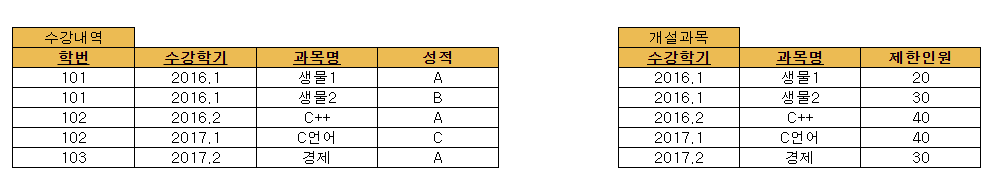
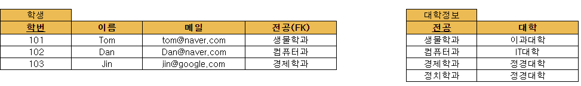

# 데이터베이스의 정규화

### 정규화란

- 정의

  > 관계형 데이터베이스의 설계에서 중복을 최소화하게 데이터를 구조화 하는 프로세스.
  >
  > 즉, 중복 최소화

- 정규형 이란

  > 정규화 된 정도

- 특징

  > 보통 3NF(제 3 정규형)이 되었다면 정규화가 되었다고 말한다.
  >
  > 대부분의 3NF는 삽입, 변경, 삭제의 이상이 없다.
  >
  > 대부분의 3NF는 BCNF, 4NF, 5NF이다.

### 제 1차 정규형(FIRST NORMAL FORM)

- 정의

  > 릴레이션에 속한 모든 속성의 도메인들이 원자 값들로만 구성되어 있는 상태.

  > 반복되는 그룹이 존재하면 안된다.

  > 모든 행은 식별자로 구분되어야 한다.

- 예제

> 위와 같은 형태는 이름, 학번, 메일, 대학이 중복되어 있다.
>
> 그렇기 때문에, 제 1 정규형 이라고 할 수 없다.

- 정규화 하기

1. 반복 부분 체크 -> 학번, 이름, 메일, 대학, 전공

2. PK를 제외한 반복되는 부분 분리

3. 테이블을 나누고 반복되는 행 삭제

> 위와 같은 과정을 거친 후, 아래와 같이 제 1 정규형이 완성된다.

> PK는 학번, 수강학기, 과목명을 합친 복합키 이다.

### 제 2차 정규형(SECOND NORMAL FORM)

- 정의

  > 제 1 정규형에 속하며, 기본키가 아닌 모든 속성이 기본키에 함수 종속되면 제 2 정규형 이다.

  > 복합키인 경우에만 제 2 정규화의 대상이 된다.

- 예제

  > 위 테이블의 경우엔, 제한인원이 복합키들에게 종속된 것 같지 않기 때문에, 분리하여 줘야 한다.

### 제 3차 정규형(THIRD NORMAL FORM)

- 정의

  > 제 2 정규형에 속하면서(PK가 하나라면 기본적으로 속한다.) 기본키가 아닌 모든 속성이 이행적 함수 종속이 되지 않으면 제 3 정규형 이다.
  >
  > 쉽게 말해, 키가 아닌 모든 컬럼이 키에게만 종속해야 한다.

- 예제

  > 위 테이블의 경우. 학생 테이블의 전공과 대학은 종속 관계가 성립되기 때문에 정규화가 필요하다.

### BCNF(Boyce-Codd Normal Format)

> 솔직히, 3 정규형만 되어도 대부분의 상황에서 별 문제가 없다고 한다.
>
> 하지만, 만약 후보키가 여러개인 경우에는 BCNF를 위반하지 않았는지 확인할 필요가 있다.

- 정의

  > X -> Y는 trivial FD이거나, X는 릴레이션 R의 슈퍼키 이다.
  >
  > 조금 더 쉽게 말하면, 모든 결정자가 KEY 인 경우이다.

- 예제

> 위 테이블은 3NF를 충족하지만 삽입, 삭제, 갱신에 문제가 발생할 수 있다.

- 문제

  - 삽입 이상

    > 새로운 수업(COURSE)이 열렸을 때, 수강생이 없다면 INSERT가 불가능하다. (STUDENT가 KEY)

  - 갱신 이상

    > 누군가가 담당하는 강의(INSTRUCTOR)가 바뀌게 되었을 때, 하나라도 빠뜨린다면 오류가 발생할  확률이 높다.

  - 삭제 이상

    > STUDENT가 사라지게 되어서 어떤 수업의 수강생이 없어지면 해당 수업의 강사도 함께 사라진다.

- 해결

  > 위 테이블에서 INSTRUCTOR는 후보키가 아니다.

  > 그렇기 때문에 분리해줄 필요성이 있다.

  > 분리 전의 결정자 역할을  했던 속성을 키로 해 준다.

