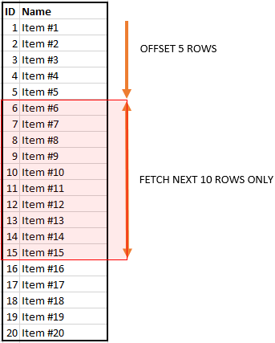

# Pagination

## Offset

우리가 자주 사용하던 방식으로, 대부분의 라이브러리에서 이 방법을 채택한다.

``` sql
SELECT
	title,
	content
FROM board
WHERE writer_name = "hello"
ORDER BY id
LIMIT 10
OFFSET 5
```

위 쿼리를 만들게 되면 다음과 같이 동작한다.



하지만 위 방법에는 큰 단점이 있다.

**15개의 Row를 모두 Fetch**한다는 것 인데, 만약 10000 ~ 10015번을 조회하고 싶다면 **모두 조회한 후 10000개를 그냥 버리게 된다.**

또 다른 문제도 있다.

1. 한 사용자가 ID가 2~6까지인 1 페이지를 보고있다.
2. 다른 사용자가 ID가 1인 게시글을 추가했다.
3. 다른 사용자가 2페이지로 넘어가면 6~10번까지로, 6번이 겹친다.

가장 간단하고 어디서나 적용될 수 있기 때문에 많은 라이브러리나 프레임워크 등에서 채택되는 방법이다.

### Index로 성능 향상하기

위 방법을 유지해야 한다면, Index를 통해 성능을 향상시킬 수 있다.

아까 쿼리에선 `writer_name`을 index로 등록하면 성능 향상을 기대할 수 있다.

## Where + Limit

```sql
SELECT
	title,
	content
WHERE
	writer_name = "hello"
	AND id < {마지막으로 조회된 id}
ORDER BY id DESC LIMIT 10
```

그렇지만 이렇게 하면 정말 10개만 가져오게 되고, 다음 페이지가 어떻게 될지는 알 수 없다.

따라서 10개를 가져오고 싶다면 LIMIT을 11로 설정해서 다음 페이지의 첫 게시글의 id와 다음 페이지 존재 여부를 가져올 수 있다.

### 한 번에 여러 페이지를 불러오고 싶은 경우


위와 같이 한 번에 여러 페이지 목록을 띄우고, 특정 페이지로 이동하고 싶다면 어떻게 해야할까?

<br>

먼저, **필요한만큼 SELECT 해오는 방법**이 있다.

예를 들어 10개씩 10페이지 라면, LIMIT을 101로 설정하는 방법이다.

이를 통해 몇 페이지까지 있고, 그 페이지의 id는 어떻게 보내줘야 하는지 알 수 있다.

또 다른 방법은 **다음 페이지만을 위한 쿼리를 하나 더 날리는 방법**이다.

둘 다 큰 차이는 없으니 원하는걸 고르면 된다.

