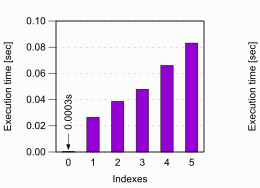

# DB Save Deepdive

## 일반 테이블의 Save

별다른 순서가 없는 일반적인 Heap 테이블일 경우에는 자리가 있는 아무 Block에 저장된다.

> 여기서 Block이란 DB의 최소 I/O 단위이다.

대부분 Main 메모리에서 굉장히 빠르게 처리되는 작업이다.

 

## Indexed 테이블의 Save

만약 Index가 있는 테이블이라면, Index에도 추가해줘야 한다.

따라서 각각의 Index에 Insert 해주어야 하는데, **Heap 메모리에 Insert 하는것보다 훨씬 비싸다.**

B+Tree의 구조를 유지해야하기 때문인데, 따라서 Index는 항상 최소한으로 유지하는게 좋다.

