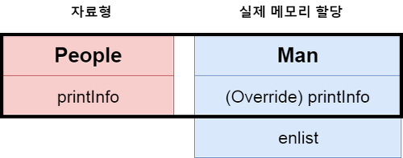

# 다형성

### 다형성이란?

다형성이란 **하나의 객체가 여러 타입을 가질 수 있는** 객체 지향의 특징이다.

B를 상속받은 A라는 객체는 A와 B 모두 타입으로 가질 수 있지만,

B 라는 객체는 A라는 타입밖에 가질 수 없다.

### 다형성 예제

```java
public class Animal {
    public void breathe() {
        System.out.println("숨을 쉰다");
    }
    
    public void bark() {
        System.out.println("짖는다.");
    }
}

public class Tiger extends Animal {
    
    @Override
    public void bark() {
        System.out.println("어흥");
    }
}

public class Bear extends Animal {
    
    @Override
    public void bark() {
        System.out.println("크왕");
    }
    
    public void tear() {
        System.out.println("찢는다.");
    }
}

public class Main {
    public static void main(String[] args) {
        Animal a1 = new Animal();
        Animal a2 = new Tiger();
        Animal a3 = new Bear();
        
        a1.bark(); 		// 짖는다.
        a2.bark();		// 어흥
        a3.bark();	  	// 크왕
        
        a1.breathe();	// 숨을 쉰다.
        a2.breathe();	// 숨을 쉰다.
        a3.breathe();	// 숨을 쉰다.
        
        a1.tear();		// 에러
        a2.tear();		// 에러
        a3.tear();		// 에러
        
        Bear a4 = (Bear)a3;
        a4.tear();		// 찢는다
    }
}
```

a3라는 객체는 분명 bear 라는 객체이고, a3.tear() 이라는 bear의 메소드를 호출했지만 오류가 발생한다.

그 이유는 tear() 이라는 메소드는 bear 객체에 소속되어 있지만 아래와 같은 형태로 **Animal에서 접근할 수 있는 것은 Animal에 해당하는 것 뿐 이다.**



즉 tear() 메소드는 메모리에 할당되었지만, Animal이라는 타입은 tear() 메소드에 접근할 수 없기 때문에 오류가 발생한다.

즉, 실제 메모리에 할당되어있긴 하기 때문에 **강제로 타입을 다시 바꿔주면 접근할 수 있다.**

### 용어

- Up-Castring

  업 캐스팅이란 자료형이 자식 -> 부모로 형 변환 되는것을 의미한다.

  자동으로 형 변환이 가능하다.

  > 위에서 만들었던 테스트에서
  >
  > `Animal a3 = new Bear();` 와 같은 형태가 Bear -> Animal로 Up-Casting 된 것이다.

- Down-Casting

  다운 캐스팅이란 자료형이 부모 -> 자식으로 형 변환 되는 것을 의미한다.

  강제 형 변환을 해 주어야 한다.

  > 위 테스트에서
  >
  > `Bear a4 = (Bear)a3;` 와 같이 Animal -> Bear로 형변환 시키는 것을 의미한다.
  >
  > 위 예제에선 Bear -> Animal -> Bear 과 같이 Bear로 생성되었지만, 바라보는 객체가 바뀐 것 뿐이기 때문에 가능하다.
  >
  > 하지만 `Bear a5 = (Bear) Animal();`과 같이 사용하면 불가능하다.

- instanceof

  A 객체가 B의 자식인지 검증해 준다.

  `A instancecof B`와 같이 사용할 수 있다.