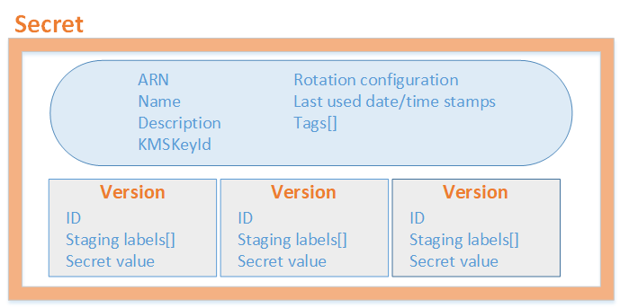

# AWS Secret Manager

## 소개

AWS Secret Manager란, DB 접근 정보와 같이 **유출되면 안되는 정보 관리 시스템**정도로 이해하면 된다.

원래 기존의 시스템에서는 비밀번호와 같은 중요한 정보들은 properties에서 관리하고 github 같은 곳에 업로드 하지 않는 정도로 사용했다.

하지만 이러한 시스템에서 비밀번호의 변경같은 작업이 발생하면 굉장히 비효율적이게 하나하나 바꿔줘야 한다.

<br>

하지만 AWS Secret Manager를 사용하면 하드코딩 하던 정보들을 **API 호출 형식**으로 안전하게 사용할 수 있게 된다.

더이상 정보들이 코드에 존재하지 않기 때문에 개발자의 실수 등으로 인한 **코드의 변경으로부터 안전을 보장**해준다.

또한 기존의 시스템은[Secret](#Secret)들을 주기적으로 바꿔줘야 했는데 **일정 기간마다 자동으로 변경**을 지원한다.

<br>

기본적으로 JSON 형태를 가지게 된다.

만약 Secrets Manager가 지원되는 DB를 선택했다면 rotation function이 요구하는 값들을 정의한다.

하지만 지원되지 않는 DB라면 람다 함수를 지원하지 않는다.

<br>

Secrets Manager가 지원하는 DB라면 **Secrets Manager가 Parsing 부터 모든 과정을 대신 해준다.**

하지만 만약 지원하지 않는 DB라면, secret 텍스트를 어떻게 찾아서 어떻게 사용할지 조정해야 한다.

<br>

### 예제

``` json
{
  "host" : "ProdServer-01.databases.example.com",
  "port" : "8888",
  "username"   : "administrator",
  "password"   : "My-P@ssw0rd!F0r+Th3_Acc0unt",
  "dbname"     : "MyDatabase",
  "engine"     : "mysql"
}
```

> Secret Manager는 binary data를 지원하지 않지만, CLI 환경이라면 Secret에 binary data를 저장할 수 있다.

<br>

### Scenario


1. DB 관리자가 **데이터베이스를 위한 인증 정보**들을 생성한다.

2. DB 관리자가 Secrets Manager에 **인증 정보를 저장**한다.

   저장할 때 암호화 되어 보호받게 된다.

3. 내 Application이 DB에 접근할 때 Application이 SecretsManager에게 **인증 정보를 요청**한다.

4. Secrets Manager는 **인증 정보를 찾고, 복호화 한 후에 HTTPS로 반환**하게 된다.

5. Application이 **인증 정보와 접속 정보를 Parsing**하고 그 정보들로 DB에 접근하게 된다.

<br>

## 기본 구조



> 파란 부분이 Meta Data, 밑쪽이 Version이다.

### Meta Data

Meta Data는 secret의 이름과 같은 **기본적인 정보**들을 담고있다.

AWS Keys Management Service의 ARN은 Secrets Manager가 **암호화 혹은 복호화**를 할 때 사용된다.

지정하지 않으면 **해당 계정의 KMS를 사용**한다.

또한 **유저가 지정한 태그**들을 통해 Grouping 할 수 있다.

<br>

### Versions

말 그대로 하나 이상의 **암호화된 키들의 버전들**을 의미한다.

활성화된 키가 하나만 존재하더라도, **rotation에 의해 여러의 version들은 존재할 수 있다.**

또한 사용자가 직접 secret을 바꿔도 새로운 버전이 생성된다.

**각각의 버전을 식별하기 위한 하나 이상의 labels를 가진다.**

<br>

## 용어

### Secret

Secret Manager에서 secret은 **인증 정보의 모음**이라고 할 수 있다.

**보안 서비스에 사용되는 정보**들인 아이디와 비밀번호, 연결 설정(URL이나 포트 등) 등의 정보들을 **안전하게 저장**하고 **권한이 있는 사용자만 접근 가능**하도록 보장해 준다.

### Secrets Manager

Secret들을 관리해주는 것으로, **IAM 인증 방식**을 사용하여 **인증된 사용자만 secret에 접근 및 수정**할 수 있도록 **보장**한다.

이러한 권한들은 특정 유저가 어떤 secret들에만 접근할 수 있을지 제한을 걸 수 있다.