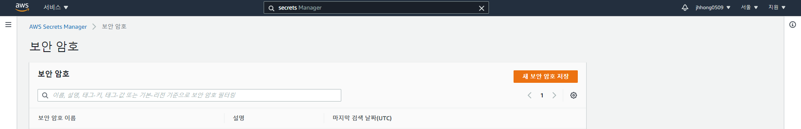
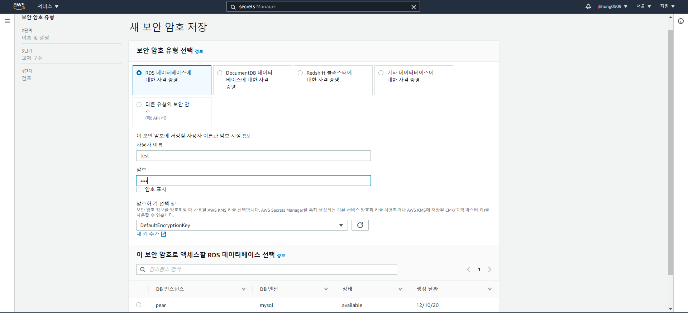
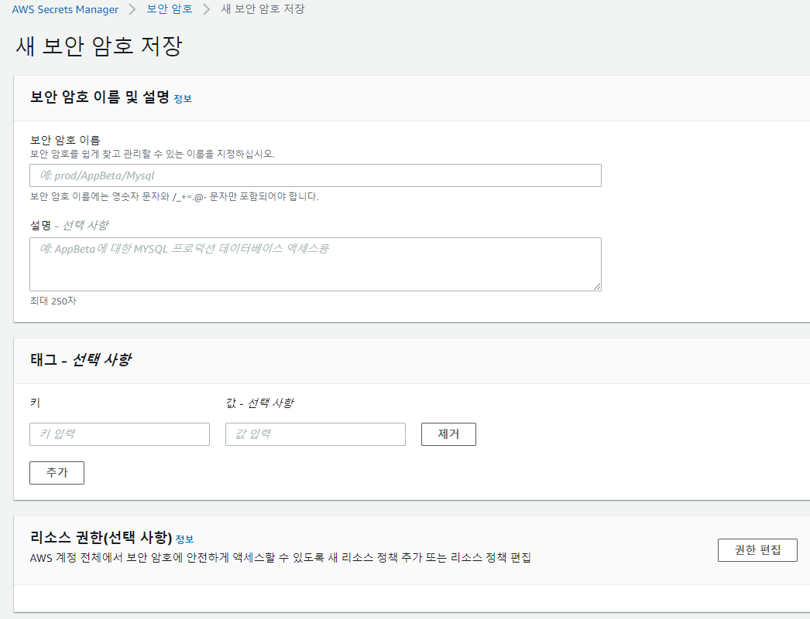
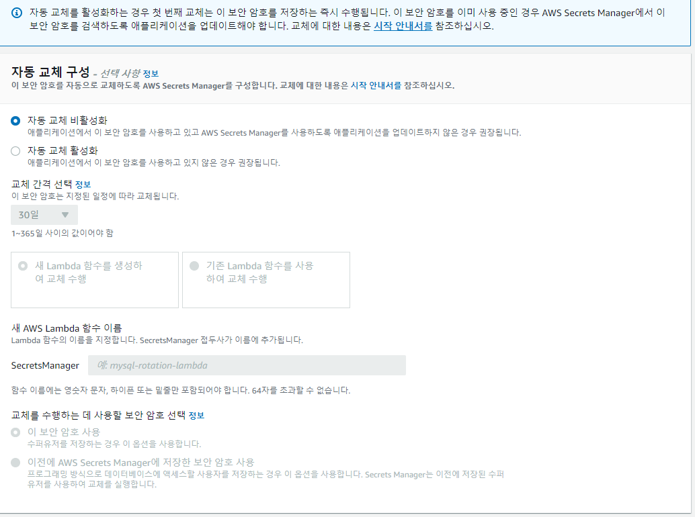
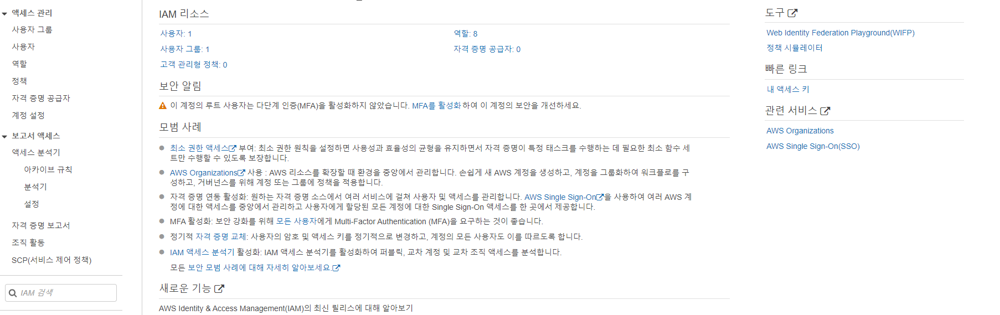
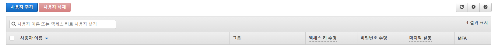
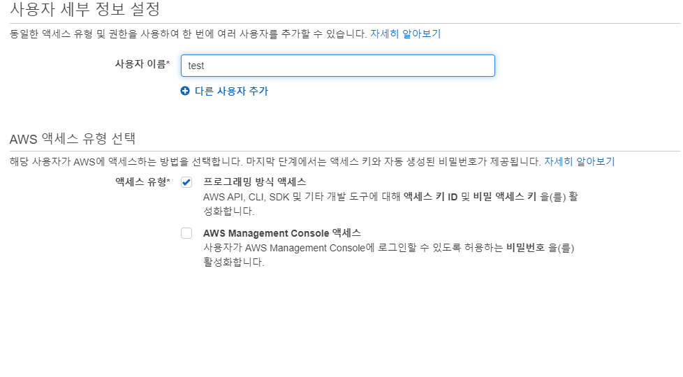
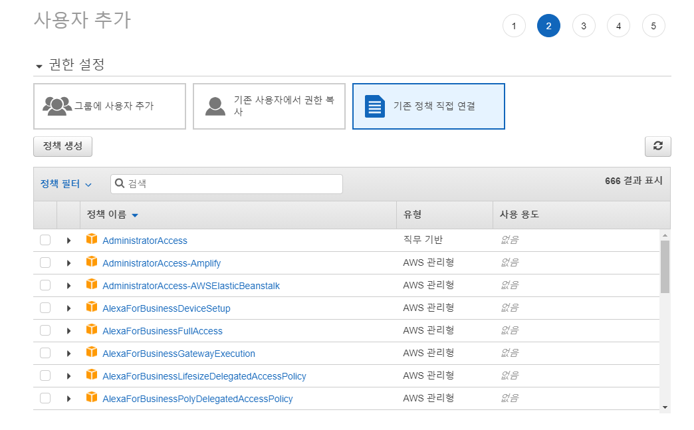

# aws-secretsmanager-jdbc

## 소개

처음 build될 때 설정 파일을 읽어서 별도의 설정 없이 **바로 secrets manager에 연동되어 db connection 정보를 연동**해서 편하게 이용할 수 있게 하는 라이브러리 이다.

## 세팅

### Secret 생성

우선 AWS에 들어가서 Secret을 만들어 줘야 한다.

AWS로 들어가 **Secrets Manager**를 검색하면 다음과 같은 화면이 나온다.



여기서 **새 보안 암호 저장**을 눌러 새로운 시크릿을 만들어줄 수 있다.

누르면 다음과 같은 화면이 나온다.



우선 테스트로 **RDS 데이터베이스를 위한 자격 증명**을 선택해서 **RDS로 접근할 수 있는 시크릿**을 만든다.

사용자 이름이나 암호에는 **실제 DB의 username과 password**를 적어줘야 한다.

암호화 키는 다른걸로 할 수 있지만 일단 Default로 해준다.

그리고 아래에서 **어떤 RDS에 접근할지 선택**할 수 있는데, 해당 시크릿으로 어떤 DB에 접근할지 선택해 준다.

그리고 다음을 누르면 다음과 같은 화면이 나온다.



여기서 보안 암호 이름을 지어줘야 하는데, **단순히 Secret의 이름**을 의미한다.

나머지는 그대로 둔 채로 다음을 눌러준다.

그러면 다음과 같은 화면이 나온다.



여기서 자동 교체 구성이란, **Secrets Manager가 Secret을 자동으로 바꿔주는 것**을 의미한다.

테스트 할 때에는 굳이 안해도 되지만, 실제 서비스 할 때에는 해주는게 좋다.

### IAM 생성

이제 위 Secret에 접근할 IAM을 생성해 주어야 한다.

AWS에서 IAM을 검색하면 다음과 같은 화면이 나온다.



이제 여기서 **사용자** 를 선택해서 이동한다.



그리고 사용자 추가를 선택해서 새로운 IAM 계정을 생성한다.

그럼 다음과 같은 화면이 나오는데, 사용자 이름을 지정하고 **프로그래밍 방식 엑세스**를 선택해 준다.



그러면 다음과 같은 화면이 나오게 된다.



여기서 필요한 정책들을 추가해 준다.

우리는 `SecretsManagerReadWrite`와 `AWSKeyManagementServicePowerUser`, `AmazonEC2FullAccess`만 추가해 주면 된다.

그리고 난 다음 끝날 때 까지 계속을 눌러주면 **엑세스 키 ID와 비밀 엑세스 키**가 있는 화면이 나오게 되는데, **잘 보관해 두어야 한다.**

## 사용

### build.gradle

```groovy
implementation 'com.amazonaws.secretsmanager:aws-secretsmanager-jdbc:1.0.5'
```

위 의존성만 추가하면 끝이다.

aws sdk나 spring cloud도 추가할 필요 없다.

### application.yml

``` yaml
spring:
  datasource:
    url: jdbc-secretsmanager:mysql://pear.c6gcx2prjdrq.ap-northeast-2.rds.amazonaws.com:3306/test_mydb?serverTimezone=UTC&characterEncoding=UTF-8&allowPublicKeyRetrieval=true
    driver-class-name: com.amazonaws.secretsmanager.sql.AWSSecretsManagerMySQLDriver
    hikari:
      username: arn:aws:secretsmanager:ap-northeast-2:537331658860:secret:pear_db_secret-Abow5j
  jpa:
    database-platform: org.hibernate.dialect.MySQL5Dialect
```

> 최소한의 설정이다.

### 환경 변수

환경변수에 다음 값들을 정의해 두어야 한다.

``` shell
AWS_ACCESS_KEY_ID=IAM의 ACCESS KEY ID
AWS_SECRET_ACCESS_KEY=IAM의 SECRET ACCESS KEY
AWS_REGION=지역
```

