# Message Queue

## Message Queue란

Message Queue는 Message Oriented Middleware(MOM)을 구현한 시스템을 말하며, 말 그대로 **Message를 Queue에 담아주는 미들웨어**를 지칭한다.

프로그래밍에선 **프로세스/프로그램이 데이터를 교환**할 때 사용된다.

 

## RabbitMQ

### 소개

RabbitMQ란 **오픈소스 AMQP 브로커**이다.

### AMQP

AMQP란 Advanced Message Queuing Protocol의 약자로 **Application 간의 메세지 처리를 위한 표준**이다.

기존에도 MOM(Message Oriented Middleware)를 구현한 MQ들이 많았지만, 성능에 이슈가 많았기 때문에 통일을 위해 등장한 것이 AMQP이다.

 

AMQP가 지향하는 점은 다음과 같다.

- 모든 broker들은 똑같은 방식으로 동작
- 모든 client들은 똑같은 방식으로 동작
- 전송 명령어들의 표준화
- 언어와 관계없는 중립적인 개발

 

AMQP는 다음과 같은 Component들로 구성된다.

- Exchange
- Queue
- Binding

AMQP는 위 Component들 간의 통신을 정의했다고도 볼 수 있다.

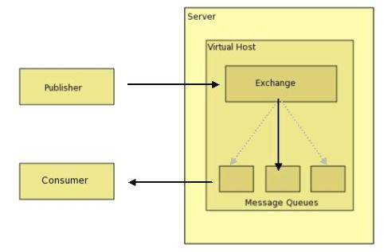

#### Exchange

Publisher로 부터 수신한 메세지를 적절한 큐나 exchange로 분배하는 **라우터 기능**을 담당한다.

각각의 큐나 다른 exchange에 바인드 된다.

exchange나 큐는 binding 이란것을 통해 다른 exchange에 바인드 되어있고, exchange는 binding에 따라 메세지를 큐나 exchange나 큐로 라우팅 시켜준다.

바인딩을 위한 라우팅 알고리즘을 정의한걸 Exchange Type 이라고 부른다.

Broker는 여러 exchange type을 가진 인스턴스를 가질 수 있다.

 

정리하면 라우팅을 결정해 주는 알고리즘은 exchange type이라고 부르고, 라우팅을 시켜주는 테이블을 binding이라고 할 수 있다.

 

#### Queue

우리가 일반적으로 아는 큐다.

메모리나 디스크에 메세지를 저장하고, 그걸 Consumer에게 전달해 준다.

 

#### Routing Key

Publisher에서 보내준 헤더에 포함되는 가상 주소라고 할 수 있다.

Exchange는 라우팅 할때 이 키를 사용한다.

 

#### Standard Exchange Type

MQ에서 사용할만한 알고리즘들을 미리 만들어둔 것이다.

라우팅 키에에 기반한 3개의 알고리즘이 있다.

 

##### Direct Exchange

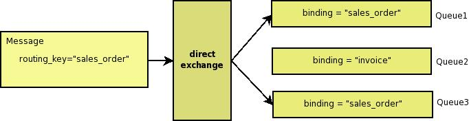

라우팅 키를 큐에 1:N으로 매칭시키는 방법

일반적으로 큐의 이름을 바인딩하고자 하는 라우팅 키와 동일하게 작성하는 방법이다.

위와 같은 경우에는 1, 3번에 전달된다.

 

##### Topic Exchange

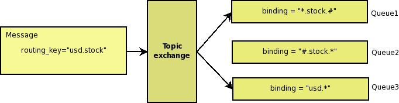

라라우팅 키는 `.`으로 구분된 여러 단어의 집합으로 간주된다.

위와 같이 `*`은 하나의 단어, `#`은 여러 단어를 의미하며, 위 경우에는 1, 3번에 전달된다.

 

##### Fanout Exchange

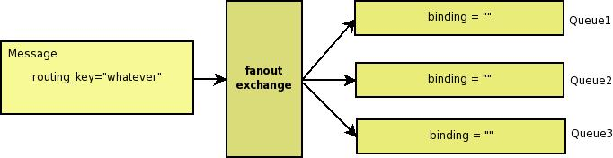

가장 간단하게 모든 큐로 라우팅 한다.

 

##### Headers Exchange

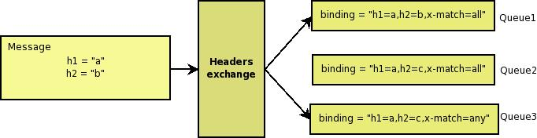

key-value로 정의된 헤더에 의해 결정된다.

x-match라는 argument로 헤더를 어떻게 해석하고 바인딩할지 결정한다.

x-match가 all이면 바인딩 조건을 모두 충족, any면 하나만 충족시키면 된다.

 

RabbitMQ도 마찬가지로 위 4가지 종류가 있다.

### RabbitMQ의 message flow

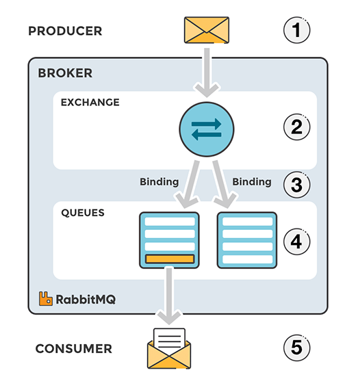

1. Producer가 exchange에게 메세지를 발행한다.

2. exchange는 메세지를 받아서 규칙에 따라 라우팅 시킨다.

   Queue마다 Binding이 존재해야 한다.

3. 메세지는 Consumer에 의해 사용될때 까지 Queue에 존재한다.

4. Consumer가 메세지를 사용한다.

 

## Kafka

Kafka는 기본적으로 **Pub/Sub 모델의 MQ**이다.

분산 환경에 특화되어있으며, Event, Producer, Consumer, Topic으로 구성되어 있다.

 

### 장점

#### 높은 처리량과 실시간 처리

방대한 데이터를 처리할 수 있다.

또한 **디스크를 장기 보존을 목적으로 영속화**한다.

 

#### 임의의 타이밍에 데이터를 읽는다

꼭 실시간이 아니어도 처리를 할 수 있다.

 

#### 메세지를 읽지 않는다

메세지가 중복되더라도 **데이터를 잃으면 안된다.**
 

#### 전달 보증

#### Ack

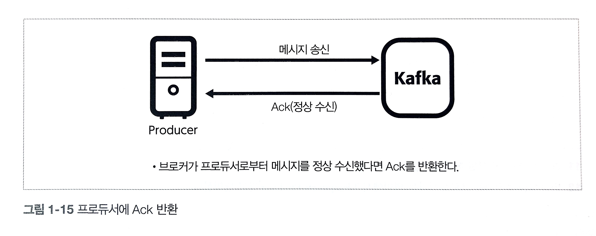

브로커가 메세지를 수신했을 때 프로듀서에게 반환하는 프레임

 

#### Offset Commit

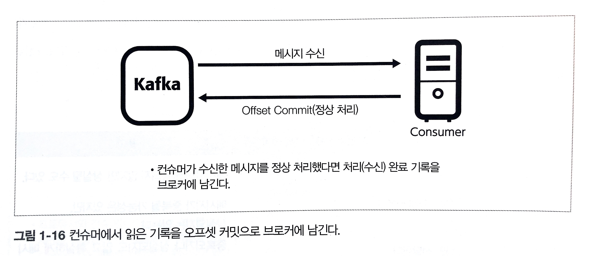

컨슈머가 브로커에서 메세지를 받을 때 컨슈머가 어디까지 메세지를 받았는지 관리한다.

 

### 구조

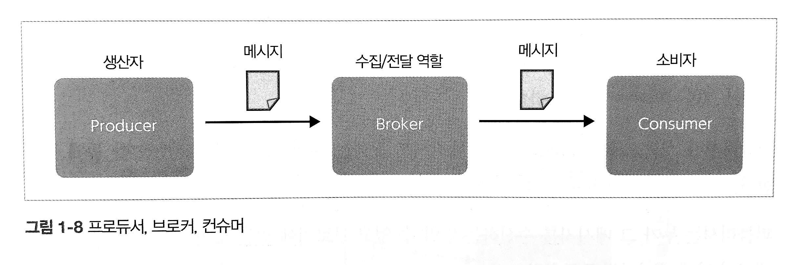

카프카는 **MQ Model과 Pub/Sub Model 모두 포함**하고 있다.

MQ Model과 같이 **여러 컨슈머가 분산 처리로 메세지를 소비**하고, Pub/Sub Model과 같이 **Subscriber들에게 동일한 메세지를 전달**한다.

 

좀 더 넓은 범위에서 보면 다음과 같다.

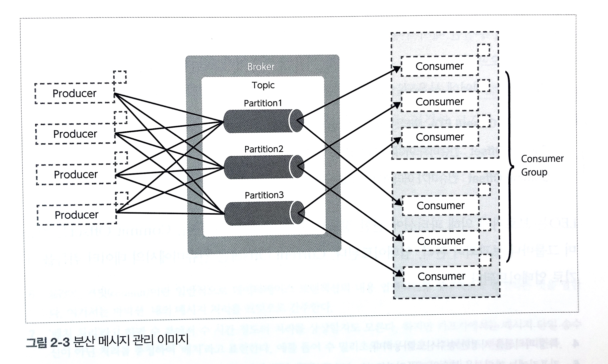

전체적인 흐름을 보면 위와 같다.

 

#### Broker

Broker는 **메세지를 전달하는 서비스**이다.

인스턴스당 하나의 프로세스로 동작하며, 메세지 수신 혹은 전달 요청을 받아들인다.

여러개의 클러스터로 구성할수도 있고, 브로커를 추가해서 **수신/전달의 처리량을 향상하거나 스케일 아웃**이 가능하다.

브로커가 받은 모든 데이터는 **디스크로 전송(영속화)**된다.

 

#### Partition

토픽에서 대량의 메세지 입출력을 위해 **브로커에서 데이터의 입출력을 파티션 이란 단위로 분할**한다.

토픽 내부의 파티션들은 Broker Cluster 내부에 분산 배치된다.

Producer로부터 메세지를 수신하고 Consumer에게 배달을 실시함으로써 대규모 데이터 송수신을 가능하게 한다.

Partition의 개수는 메세지의 처리 속도, 스레드 수 등을 동시에 고려해야 한다.

주의할점은 **파티션은 증가할수는 있지만 다시 줄일수는 없다**

 

#### Producer

Producer는 **브로커에 메세지를 송신하기 위한 Application**이다.

1. Producer가 Topic의 Partition에게 메세지를 송신할 때 버퍼처럼 Producer의 메모리에 일정량을 축적한 후에 송신한다.

2. 일정 크기까지 축적되거나 일정 시간 후에 전송된다.

3. 토픽에 메세지 전송시 파티셔닝

   - Key의 해쉬값을 이용해서 송신하는 경우, 메세지의 Key를 통해 파티션을 결정한다.
     동일한 Key를 가지게 되면 동일한 ID의 파티션에게 전송하게 된다.
     메세지의 순서 보장은 가능하지만, 특정 Partition에 메세지가 몰릴 수 있다.

     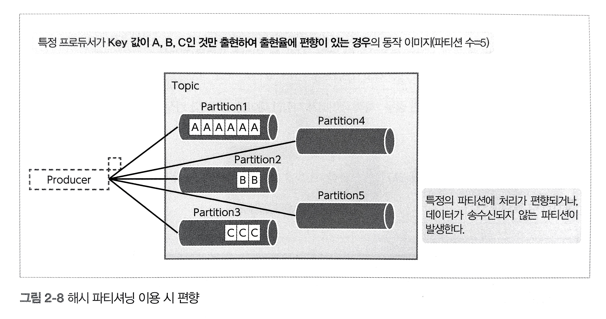

   

   - RoundRobin을 이용하는 경우 메세지의 Key를 null로 하게 되면 메세지를 Round Robin 방식으로 처리한다.

4. 브로커로 메세지 송신 결과를 비동기처리 할 수 있다.

 

#### Consumer

메세지를 소비하는 소비자이다.

Push 방식이 아닌 **Pull 방식을 사용한다.**

RabbitMQ와 달리 **메세지가 디스크에 저장된 동안은 메세지를 획득할 수 있다.**

 

#### Consumer Group

Kafka에서는 **Consumer가 Kafka Cluster에서 메세지를 얻어서 처리한다.**

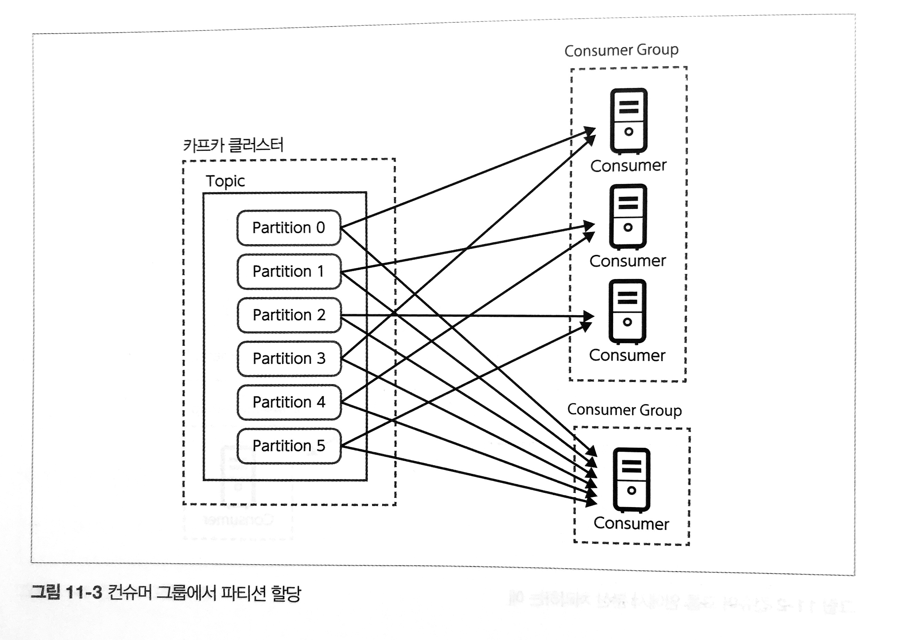

위 그림에서 볼 수 있듯이 Consumer는 Consumer Group을 형성하여 메세지를 받는다.

여기서 Group ID는 Consumer를 생성할 때 **group.id 라는 파라미터로 지정**할 수 있다.

Consumer는 하나의 Consumer Group에만 속할 수 있고, Kafka Cluster에서 메세지는 **Consumer Group중 하나의 Consumer가 수신**한다.

> 어떤 Consumer가 수신할지에 대해서는 파티션과 컨슈머를 패밍해 줄 수 있다.

Consumer는 여러 Partition이 할당될 수 있지만, Consumer는 반드시 하나의 Partition에 할당되어야 한다.

즉 **파티션의 개수는 Consumer 그룹에 속한 Consumer보단 많아야 한다.**

그렇지 않으면 Consumer에게 Partition이 할당되지 않는 상황이 발생할 수 있다.

 

### Offset

Kafka에서 파티션이 수신한 메세지들에게는 각각의 일련번호가 주어진다.

메세지 위치를 나타내는 Offset 이라는 정보를 이용해 **Consumer가 획득하는 메세지를 제어**한다.

- **Long-End-Offset: **해당 파티션의 데이터 끝을 의미한다.
- **Current Offset: **Consumer가 어디까지 메세지를 읽었는지를 의미한다.
- **Commit Offset: **Consumer가 메세지를 받았고, 이를 확인한게 어디까지인지를 의미한다.

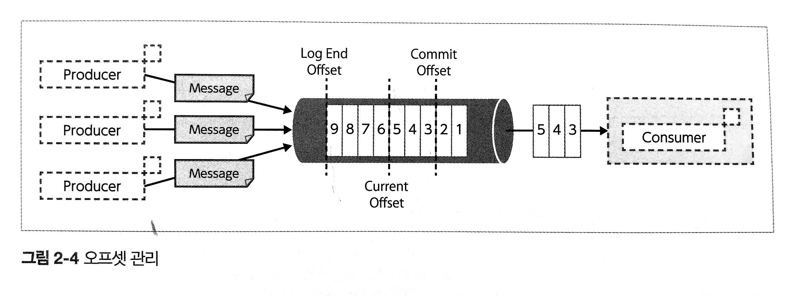

 

#### Offset Commit

Consumer는 **메세지 처리를 어디까지 했는지 기록**할 수 있다.

따라서 다음에 수신하고 처리할 메세지를 알 수 있다.

Offset Commit은 단순히 **처리 완료한 메세지 중 가장 큰 Offset을 기록**한다.

Kafka는 Partition 내부의 메세지를 연속적으로 처리한다는걸 가정하고 있기 때문이다.

`__consumer_offsets` 토픽에 기록된다.

수동 커밋과 자동 커밋이 있는데, 수동 커밋은 메세지 손실이 없지만 커밋 주기가 짧기 때문에 Kafka에 부하가 늘어날 수 있다.

 

### Zookeeper

원래 Zookeeper는 클러스터의 설정 정보 관리, 동기화 등 **클러스터 서버들이 공유하는 데이터 관리**를 위해 사용된다.

 

## Apache Kafka vs RabbitMQ

| 종류           | Kafka                                                        | RabbitMQ                                                     |
| -------------- | ------------------------------------------------------------ | ------------------------------------------------------------ |
| 프로토콜       | Kafka만의 Custom TCP/IP통신(Cluster - 어플리케이션 사이)     | AMQP, MQTT, STOMP 등을 지원(더 많은 상황 지원)               |
| 직관성         | 상대적으로 낮음                                              | 상대적으로 높음                                              |
| 처리량         | 상대적으로 많음                                              | 상대적으로 부족                                              |
| 방식           | pub/sub                                                      | Message Broker                                               |
| 용량           | 무거움                                                       | 가벼움                                                       |
| 소비자 Scaling | partition으로 어느 consumer group이 소비할지 결정 원하는 consumer가 처리하도록 할 수 있음 | Publish가 소비보다 빠르다면 큐는 넘치게 된다. 이 때 몇개의 Consumer가 메세지를 처리할지 설정 가능 따라서 여러 Consumer들에게 메세지가 분배될 수 있음 |
| 브로커 Scaling | Cluster에 Node를 추가하거나 Topic에 Partition 추가 RabbitMQ의 CPU나 메모리를 받는거보다 쉬울 수 있음 Scaling하기 더 좋지만, 굳이 필요하진 않음 | 수평적인 스케일링, 수직적인 스케일링 가능 Clustring 사이의 Node 필요해서 성능이 하락할 수 있음 따라서 수직적인 스케일링(add power)이 좋음 따라서 machine의 성능을 올려야 하는 한계가 있음 |
| 압축           | Log를 압축해서 마지막 메세지를 손쉽게 저장 저장 기한을 무제한으로 해서 DB처럼 사용 가능 | 없음                                                         |
| push/pull      | Pull 방식 Offset에 따라 Message를 전달                  | Push 방식 미리 limit을 적절하게 걸어두는게 중요 Pull 방식도 가능하지만 비추 |
| 모니터링       | 여러 기능이 있는 Opensource Project 이용 가능                | 유저 친화적인 Web UI                                         |
| 큐             | Lazy queue를 사용함 따라서 Ram 사용량을 줄이는 대신 처리 시간을 늘림 | 즉시 Consume 가능                                            |
| 접근           | 비교적 간단한 라우팅만 지원 간단한 곳에서 사용하기 좋음 | 여러 라우팅 방법을 지원함 복잡한곳에서 사용하기 좋음    |
| 사용           | 일정 시간이나 일정량 쌓이면 전송 디스크에 저장          | Consumer가 생길때까지 MQ에 저장 ACK 신호를 받으면 Queue에서 삭제 |
| 우선순위       | 우선 순위를 설정할 수 없다.                                  | 메세지를 발행할 때 우선순위 설정 가능 적절한 우선순위 큐에 적재될 수 있도록 한다 |
| ACK            | 각 Partition마다 Offset이 존재. 정기적으로 commit offset을 수정하거나 수동 commit offset에 따라 재전송 등을 할 수 있음 | 메세지 전송할 때 전송 소비된 후에 Consumer가 수동으로 전송 전송 실패시 부정 응답 프레임을 제공하고 재전송 해줌 |

여기서 Ack란 Acknowledgment로, **MQ가 정상적으로 전달되었는지 확인하기 위한 프레임**이다.

MQ는 메세지가 Consumer에게 정상적으로 Handle 되었는지 확인할 필요가 있다.

 

Kafka에서 한 메세지를 여러번 다시 전송해야 하는 상황이 있다면 다시 한번 고민해볼 필요가 있다.

이벤트를 여러번 실행하는 것은 한번만 일어나야 하는 작업이 여러번 발생하는 상황의 원인이 될 수 있다.

 

### RabbitMQ가 적절한 상황

RabbitMQ는 **MSA 사이의 Message Broker에 적합**하다.

또한 백그라운드 작업이나 파일 작업과 같이 **오래 걸리는 작업**을 처리하기 적합하다.

예를 들어 이메일 전송과 같은 작업에선 MQ에 이메일 등의 정보로 Message를 넣고, Consumer 쪽에서 해당 Message 정보로 이메일을 보낼 수 있다.

이렇게 하면 반환시간을 훨씬 빠르게 할 수 있다.

 

### Kafka가 적절한 상황

Kafka는 **실시간 처리**에 좋다.

RabbitMQ가 더 성숙하다 라는 의견도 있지만, Kafka가 2011년에 출시했고 RabbitMQ가 2007년에 출시했으니 큰 차이는 없다.

