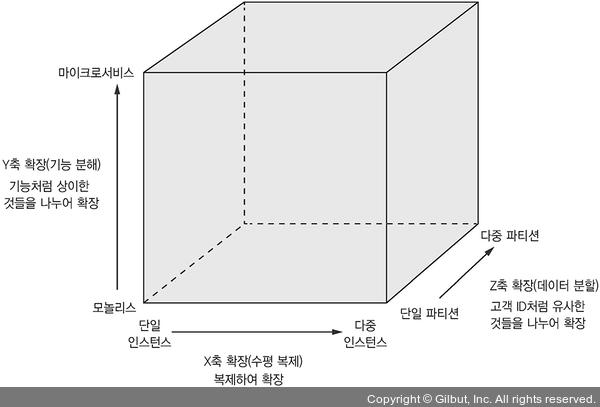
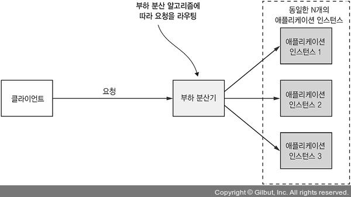
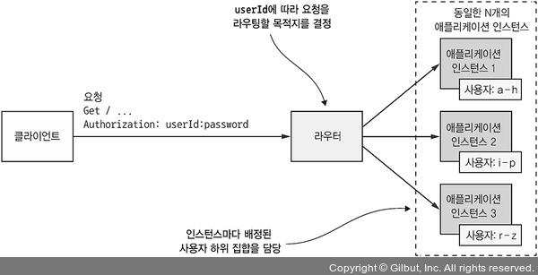
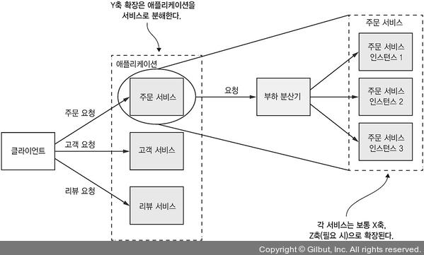
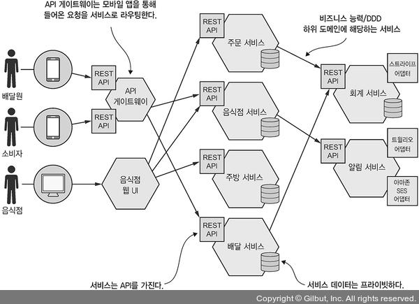

# 1.4.0 마이크로 서비스 아키텍쳐란 무엇일까?

> 이것 또한 이 책의 저자의 개인적인 생각이므로, 정답은 아니다.

말 그대로 코드가 100줄 미만인 작은 어플리케이션을 지징할수도 있고, 개발하는데 2주정도 걸리는 서비스 라는 말도 있다.

과거 넷플릭스에서 근무했던 `Adrian Cockcroft`는 **Bounded Context가 존재**하고 **Element들이 느슨하게 결합**되어 있는 **서비스 지향 아키텍쳐(SOA)**라고 말했다.

> Bounded Context란 DDD에서 **Model이 특정한 Context에서 완전한 의미를 가질 때, 해당 Context를 지칭**하는 말 이다.
>
> 즉 쉽게 말하면 **업무의 구분에 따라 Context로 구분**한 것이다.

> 서비스 지향 아키텍쳐는 MSA 이전에 Monolithic Architecture에서 탈피하기 위한 시도였다.
>
> 실패했지만 현재의 MSA와 비슷한 시도였다.

 

# 1.4.1 확장 큐브와 마이크로 서비스

이 책의 필자는 마이크로 서비스를 The Art of Scalability라는 책에 나오는 **3차원 확장 큐브**에서 영감을 받았다.

## X축 확장

X축 확장은 **복제해서 확장**으로 **단일 인스턴스에서 다중 인스턴스**로의 변환을 의미한다.

중간의 부하 분산기가 **요청을 고르게 분배**해줘서 하중을 감소시켜 준다.

 

## Z축 확장

인스턴스 별로 **특정 데이터만 처리**하도록 하는 것이다.

쉽게 말하면 a~h까지는 인스턴스 A가, i~p까지는 인스턴스 B가, r~z까지는 인스턴스 C가 처리하도록 하는 것이다.

데이터 파티셔닝이 쉬워서 속도나 데이터 볼륨 면에서 좋다.

> 파티셔닝은 예를 들어 일정의 데이터가 너무 많다면 1월, 2월, 3월... 식으로 테이블을 나눠주는걸 말한다.

위와 같이 **라우터를 통해 해당 인스턴스로 라우팅**시켜준다.

 

## Y축 확장

X/Z축 확장은 애플리케이션 능력과 가용성은 늘어날지 몰라도, 복잡도는 해결되지 않는다.

따라서 복잡도의 해결을 위한 **기능 분할**이 필요하다.

다음과 같이 원래 Monolithic했던 서비스를 분리하는 것이다.

각각의 서비스는 X/Z축 확장이 자유롭고, **각 서비스가 하나의 집중되고 응집된 책임**을 가지고 있다.

 

# 1.4.2 마이크로서비스는 모듈성을 가지고 있다

모듈성은 크고 복잡한 애플리케이션 개발에서 꼭 필요한 개념이다.

요즘 애플리케이션의 복잡도가 증가해서 개인이 모두 이해할 수 없기 때문에 **하나의 애플리케이션을 여러개의 모듈로 분해**한다.

하나의 모듈이 다른 모듈이 어떻게 구현되어 있는지 알 필요가 없도록 해서 애플리케이션의 유지보수성과 확장성을 올려준다.

 

Monolithic Application은 Build Artifact나 Package로 모듈을 정의하지만, 이렇게 논리적으로만 구분된 모듈은 문제가 많아서 Big ball of Mud가 되기 쉽다.

> Big ball of mud란 이해가 되는 아키텍쳐가 없는 소프트웨어 시스템을 지칭하는 말이다.
>
> 처음에는 쉽고 간단하게 애플리케이션을 구축할 수 있어서 편하지만, 점점 코드의 이해도가 떨어져서 피해야할 디자인 패턴 중 하나이다.

 

MSA는 서비스를 모듈의 단위로 사용한다.

각각의 서비스는 API라는 경계선이 있어서 다른 서비스는 해당 서비스를 마음대로 조작할 수 없다.

따라서 모듈성을 유지하기 쉽고, 독립적인 배포/확장이 가능하다.

 

# 1.4.3 서비스마다 DB가 따로 있다.

마이크로서비스는 서로 느슨한 결합을 가지고 있고 API로만 서로 접근할 수 있다.

각각의 서비스는 각각 자체 DB를 가지고 있는데, 이렇게 하면 다른 사람들과 협의 없이 본인의 서비스 스키마를 변경할 수 있다.

또한 서비스가 완전히 분리되어 있기 때문에 DB가 Lock되어 Blocking될 일은 없다.

 

# 1.4.4 예제 마이크로서비스 아키텍처

FTGO 라는 Legacy Application을 마이크로 서비스로 전환하는 과정을 살펴볼 것이다.

먼저 이 프로젝트에 Y축 확장을 적용하면 어떻게 되는지 짚어보자

위와 같이 API 게이트웨이는 소비자, 배달원의 앱이 접속하는 Rest API를 제공한다.

그리고 음식점은 웹 UI를 가지고, 주문을 처리할 수 있도록 되어있다.

 

이러한 애플리케이션은 **각각의 자체 DB를 가지고, RestAPI로 통신하는 여러 서비스로 구성**되어 있다.

- 주문 서비스
- 배달 서비스
- 음식점 서비스
- 주방 서비스
- 회계 서비스

 

이렇게 서비스들이 나누어졌기 때문에 **각각의 서비스는 독립적으로 개발/배포/테스트 할 수 있다.**

또한 한 서비스에서 **API 외의 방법으로 다른 서비스에 직접적으로 접근할 수 없기 때문에 모듈성 유지 차원에서도 적합**하다.

 

# 1.4.5 MSA와 SOA

MSA는 SOA에서 발전했을 뿐이지, 새로운 것이 아니다 라고들 말한다.

고수준에서 바라보면 둘 다 하나의 Monolithic Application을 여러 서비스로 구성하는 아키텍쳐이다.

하지만 좀 더 깊이 들어가보면 차이점이 있다.

 

| 구분             | SOA                                                          | MSA                                                          |
| ---------------- | ------------------------------------------------------------ | ------------------------------------------------------------ |
| 서비스 간의 통신 | 무거운 프로토콜을 응용한 ESB 중심의 smart pipe               | Rest나 gRPC와 같은 경량화 된 프로토콜을 응용한 메세지 브로커 또는 서비스 간의 통신 중심 dumb pipe |
| 데이터           | 전역 데이터 모델, 공유 DB                                    | 서비스마다 개별적인 DB                                       |
| 규모             | 대규모 Monolithic Application을 여러개 두어 큰  Application 들의 통합을 위해 사용됨. | 소규모 서비스들의 통합                                       |

- ESB란 여러 서비스의 연결을 위해서 SOA에서 했던 시도이다.
- smart pipe는 무거운 네트워크, dumb pipe는 가볍고 간단한 네트워크 라고 이해하면 된다.