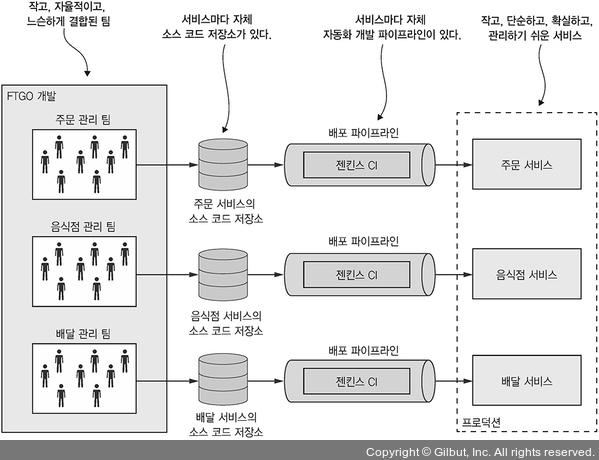

# 1.5.1 MSA 장점

- **크고 복잡한 애플리케이션을 지속적으로 전달/배포 할 수 있다.**
- **서비스별 규모가 작아 관리가 쉽다.**
- **서비스를 독립적으로 배포/확장할 수 있다.**
- **서비스별로 팀이 자유롭게 움직일 수 있다.**
- **결합 격리가 잘 된다.**
- **새로운 기술을 도입/실험하기 쉽다.**

이제 해당 장점들을 자세히 알아보자

 

## 크고 복잡한 애플리케이션을 지속적으로 전달/배포 할 수 있다.

MSA로 구축하면 복잡한 애플리케이션에서 CI/CD를 자주, 빠르게, 확실하게 할 수 있다.

> 기존의 Monolith Application은 테스트에 몇일, 배포에도 몇시간씩 걸릴 수도 있기 때문에 CI/CD를 자주 하긴 어려웠다.

CI/CD는 비지니스 측면에서 이점도 많다.

- 제품의 릴리스 시간 단축
- 고객의 피드백에 대한 빠른 대응
- 확실한 수준의 서비스 제공
- 급한 불을 끄는데 급급한게 아니라서 Application의 품질을 높이는데에 더 많은 시간 투자 가능

MSA에선 다음 세가지 방법으로 CI/CD를 지킨다.

 

### 테스트

CI/CD를 위해선 테스트 자동화가 꼭 필요하다.

각각의 마이크로서비스들은 크기가 작아 테스트를 자동화 시키기 쉽고, 실행 시간이 짧으며, 버그도 적은 편이다.

 

### 배포

각각의 마이크로서비스는 독립적인 배포가 가능하다.

따라서 담당자가 자신의 서비스를 변경하고 배포할 때 굳이 다른 개발자들과의 협의가 필요 없다.

따라서 반영이 훨씬 수월한 편 이다.

 

### 자유롭고 느슨한 결합

하나의 큰 팀이 아니라, 여러 작은 팀들로 구성된 기술 조직을 만들어나갈 수 있다.

팀별로 자신의 서비스만 담당하면 되서 개발 속도는 더 빨라질 수 있다.

 

정리하면 다음과 같다.

 

## 서비스를 독립적으로 배포/확장 할 수 있다.

각각의 마이크로서비스는 X축/Z축 확장이 가능하고, 서비스마다 조건에 맞는 하드웨어에 배포할 수 있다.

예를 들어 CPU 작업이 많은 서비스는 고사양의 CPU를 장착한 서버에, 메모리가 많이 필요한 서비스는 메모리가 많은 서버에 배포할 수 있다.

한곳에 배포해야 해서 서버의 성능을 높이려면 전체 서버의 성능을 높여야 하는 Monolithic Architecture보다 확장성이 좋다.

 

## 결함 격리가 잘 된다.

MSA에서는 결함격리가 잘 된다.

만약 어느 서비스에서 결함이 발견되어도 해당 서비스만 영향을 받고, 다른 서비스는 정상적으로 동작한다.

이는 Monolithic Architecture에서 결함이 발견되었을 때 전체 서비스에 영향을 주는것과는 다르다.

 

## 신기술을 시험/도입하기 쉽다.

특정 기술 스택을 연구하느라 시간을 쏟을 필요가 없다.

새로운 서비스를 개발할 때, **그 서비스에 맞는 언어나 프레임워크를 사용해서 기술을 자유롭게 선택**할 수 있다.

또한 서비스의 규모가 작기 때문에 **더 나은 기술로 다시 작성**하기 쉽다.

기존의 Monolithic Architecture이 초반에 선택한 기술에 심한 제약을 받는것과는 대비된다.

 

# 1.5.2 마이크로서비스 아키텍쳐의 단점

세상에 만병통치약은 없듯이, MSA에도 많은 단점이 있다.

- **딱 맞는 서비스를 찾기 어렵다.**
- **개발, 테스트, 배포가 어렵다.**
- **여러 서비스에 걸친 기능이라면 배포할 때 신중해야 한다.**
- **도입 시기를 결정하기 어렵다.**

이제 단점에 대해서도 자세히 알아보자

 

## 딱 맞는 서비스를 찾기 어렵다.

MSA에 맞게 **시스템을 여러 서비스로 분해하는 알고리즘은 없다.**

만약 시스템을 잘 못 분해하게 되면 MSA와 Monolith의 단점만 모아둔 Distributed Monolith를 구축하게 될수도 있다.

따라서 개발자의 역량, 현재 상황에 알맞게 분해해야 한다.

 

## 분산 시스템은 복잡하다.

분산 시스템 이라는 복잡성은 개발자가 감당해야 한다.

서비스간의 통신에 필수적인 IPC 역시 단순한 메소드 호출보단 어렵고, 지연 시간이나 실패한 서비스도 처리해 주어야 한다.

 

- 소비자의 요구를 구현하려면 익숙하지 않은 기술이더라도 동원해야 한다.
- 여러 DB를 상대로 한 트랜잭션을 구현하는게 어렵다.

> 그래서 MSA에선 SAGA 라는 기술을 통해 데이터 일관성을 유지한다	(4장)

- 그리고 단순한 쿼리로는 여러 서비스의 데이터를 조회할 수 없다.

> API를 조합하거나, CQRS 뷰를 이용해야 한다	(7장)

- 우리가 자주 쓰는 IDE는 Monolithic Application을 초점으로 두었기 때문에 MSA는 따로 지원하지 않는다.
- 여러 서비스에 걸친 테스트를 자동화 하기 힘들다.

 

따라서 뛰어난 소프트웨어 개발/전달 능력을 가진 개발자가 필요하다.

 

또한 MSA는 운영 복잡도 또한 늘린다.

여러 서버에 여러 인스턴스들이 떠있으니, 관리해줄 사람이 더 필요하다.

따라서 다음 기술들로 플랫폼을 자동화 해야 한다.

- **Netflix Spinnaker(배포 자동 툴)**
- **Pivotal Cloud Foundrty/Red Hat OpenShift(즉시 사용 가능한 Paas)**
- **Docker Swarm/Kubernetes(컨테이너 오케스트레이션 툴)**

> 자세한건 12장에서 설명된다.

 

## 여러 서비스에 걸친 기능이라면 배포할 때 신중해야 한다.

여러 서비스에 걸친 기능을 배포할 때 여러 팀들간의 회의 후 신중하게 결정해야 한다.

따라서 **서비스간의 의존성**에 따라 배포 계획을 잘 수립해야 한다.

 

## 도입 시기를 결정하기 어렵다.

한 Application의 생명 주기 중 언제 도입해야 할지 결정하기도 어렵다.

초기 버전을 개발할 때에는 MSA로 해야 할 이유가 거의 없다.

오히려 정교한 분산 아키텍쳐를 사용하면 고려할 점이 많아 **개발 속도가 늦춰지고 신속한 Iteration도 어렵다.**

따라서 **Application을 빠르게 발전시켜야 하는 스타트업은 Monolithic이 더 낫다.**

 

그 이후에 점점 복잡해져서 복잡성을 줄일 필요가 있을 때 Application을 분해하는게 좋다.

물론 여러 서비스 간의 의존성이 있어 어려울 수 있다.

 

우리는 마이크로서비스를 도입할 때 다양한 설계나 아키텍쳐에서 발생하는 이슈들을 해결해야 한다.

이슈들의 솔루션은 대부분 Trade-off가 존재한다. 따라서 **완벽한 정답은 없다.**

그래서 좀 더 나은 선택을 위한 **마이크로서비스 아키텍쳐 패턴 언어**가 있다.