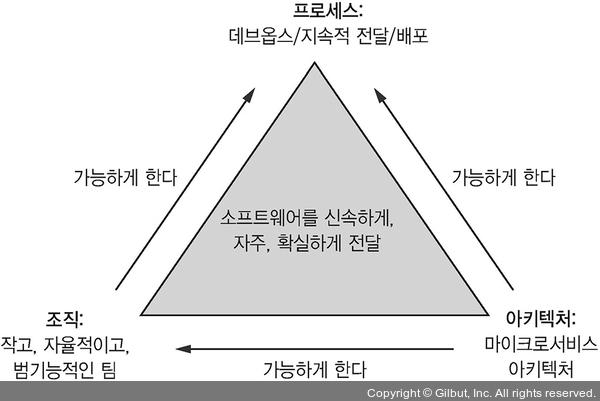
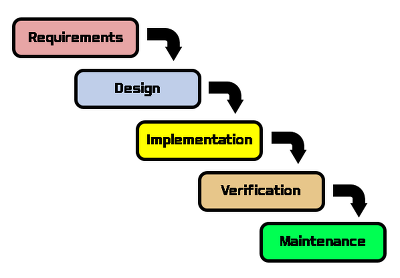
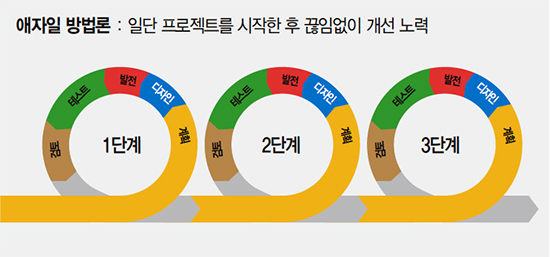

# 서론

> 이제 MSA에 대한 설명은 끝났고, 이제 조직과 프로세스에 대해 알아보자

큰 프로젝트에서 MSA는 정답에 가깝다.

하지만 제대로된 조직, 개발 프로세스와 배포 프로세스가 수립되어야 비로소 성공적인 소프트웨어 개발이 가능하다.

위 그림에서 볼 수 있다싶이 소규모의 작은 팀에서 자주 CI/CD를 하고 다양한 DevOps 기술들을 사용해야 한다.

# 1.7.1 소프트웨어 개발/전달 조직

Fred Brooks의 The Mythical Man-Month에 따르면 크기가 N인 팀은 소통을 할 때 O(N²)만큼의 오버헤드를 갖는다고 한다.

따라서 팀의 규모는 작게 유지하는게 좋다.

 

비지니스 관점에서 팀의 목적은 **어떤 기능이나 비지니스 능력을 지닌 서비스를 개발하고 운영**하는 것이다.

한 팀에서 모든것을 처리할 수 있는 능력을 지니고 있다면, **다른 팀들과의 회의 없이 독자적으로 서비스 개발**이 가능하다.

 

## Reverse Conway Maneuver

MSA에서 소프트웨어를 효과적으로 전달하려면 콘웨이의 법칙에 대해 이해할 필요가 있다.

 

*시스템을 설계하는 조직은 그들이 소통하는 구조를 그대로 옮겨 놓은 듯한 결과물을 낼 수밖에 없는 한계가 있다*

`멜빈 콘웨이(Melvin Conway)`

 

즉 **Application의 아키텍쳐는 그것을 개발하는 조직의 커뮤니케이션 구조를 가져가야 한다**는 의미이다.

이를 이용해 개발팀과 서비스의 관계를 느슨하게 유지시킬 수 있다.

 

**거대한 한 팀 보다는 작은 여러 팀의 움직임이 훨씬 수월하고 빠르다.**

MSA는 팀을 자유롭게 움직일 수 있도록 하고 다른 팀과의 협업 없이 서비스를 개발/배포/확장할 수 있다.

Service Layer Agreement를 충족하지 못한 서비스가 있다면 어느 팀에게 연락을 해야 할지도 분명하다.

그리고 무엇보다 개발 조직의 확장성이 늘어난다.

팀을 늘려 조직 자체를 키울 수 있고, 어떤 팀이 커지면 다시 서비스별로 나눌 수 있다.

따라서 거대한 팀에서 발생하는 **소통 오버헤드는 걱정하지 않아도 되고, 생산성에 영향 없이 인원 보강이 가능**하다.

 

# 1.7.2 소프트웨어 개발/전달 프로세스

WaterFall 개발 프로세스로 MSA를 구축하는 것은 MSA로 얻는 모든 이익들을 날려버리는 것이다.

> WaterFall이란 개발 방법론 중 하나로 말 그대로 폭포수가 떨어지듯 각 단계별로 순차적인 진행을 하는것을 의미한다.
>
> 
>
> 다음과 같은 순서로 이루어져 있다.
>
> 1. 요구사항 분석
> 2. 설계
> 3. 구현
> 4. 검증
> 5. 유지보수
>
> 이러한 WaterFall 방법에는 장단점이 있다.
>
> **장점**
>
> - 오래되어서 자료가 풍부하다.
> - 각 과정을 이해하기 쉽다.
> - 결과물을 관리하기 쉽다.
>
> **단점**
>
> - 각 관계가 수직적인 관계를 가져서 각 단계를 병행할 수 없다.
> - 오류에 대한 즉각적인 피드백이 힘들다.
> - 개발이 완료되기 전 사용자의 피드백을 담아내기 힘들다.

Agile 개발 프로세스와 Scrum과 Kanban을 실천해야 하고, CI/CD를 도입해야 한다.

> 애자일이란 소프트웨어 개발 방법론은 구체적인 개발 프로세스가 아닌 개발 지침이나 철학에 가깝다. 따라서 100% 정해진 형태는 없다.
>
> **변화를 수용**하고 협업과 제품의 출시를 강조하는 **반복적 개발 기법**으로, 문서화보단 **코드나 소프트웨어 자체를 중요시 한다.**
>
> 개발 도중 요구사항의 변화는 불가피하기 때문에 **변화를 피하는게 아니라 변화에 대응**을 목적으로 한다.
>
> 하지만 기존의 WaterFall 방법은 설계 기간이 길어 재작업까지 오래 걸리기 때문에 변화에 대응하기 힘들다.
>
>  
>
> **애자일 소프트웨어 개발 선언**
>
> 우리는 소프트웨어를 개발하고, 또 다른 사람의 개발을
> 도와주면서 소프트웨어 개발의 더 나은 방법들을 찾아가고
> 있다. 이 작업을 통해 우리는 다음을 가치 있게 여기게 되었다:
>
> - 공정과 도구보다 **개인과 상호작용**
> - 포괄적인 문서보다 **작동하는 소프트웨어**
> - 계약 협상보다 **고객과의 협력**
> - 계획을 따르기보다 **변화에 대응**
>
> 위 4가지를 가치 있게 여긴다. 이 말은, 왼쪽에 있는 것들도 가치가 있지만,
> 우리는 오른쪽에 있는 것들에 더 높은 가치를 둔다는 것이다.
>
>  
>
> **12가지 원칙**
>
> 1. 좋은 소프트웨어를 빠르게 제공함으로써 고객을 만족시키는 것을 최우선으로 해라.
> 2. 항상 요구사항 변경을 기꺼이 수용해라. 애자일 프로세스는 변화에 유연하게 대처해 상품의 경쟁력을 높여준다.
> 3. 2주에서 2개월 주기로 소프트웨어를 배포하되 더 짧은 시간 단위를 선호해라.
> 4. 매일 비지니스 담장자와 개발자들이 모여 프로젝트 전체에 걸쳐 일해라.
> 5. 동기가 부여된 개인들을 중심으로 프로젝트를 구성한다. 구성원들이 필요로 하는 환경과 지원을 제공하고, 그들이 자신의 업무를 끝낼 것이라 신뢰한다.
> 6. 개발팀으로의 정보 전달이나  팀 내부에서의 정보 전달을 하려면 가장 효과적, 효율적으로 정보를 전달하는 방법은 대면 대화이다.
> 7. 작동하는 소프트웨어가 진척의 척도이다.
> 8. 애자일 프로세스는 지속 가능한 개발을 장려한다. 스폰서와 개발자, 사용자들이 일정한 속도를 계속 유지할 수 있어야 한다.
> 9. 기술적 탁월성과 좋은 설계에 대한 지속적인 관심으로 기민함(Agile)을 향상시킨다.
> 10. 단순성(아직 하지 않은 작업량을 최대한 세분화하는 기술) 은 필수적이다.
> 11. 최고의 아키텍처, 요구사항 및 설계는 자기 조직적인 팀에서 비롯된다.
> 12. 팀은 정기적으로 더 효과적인 방법을 찾아서 반영한 다음, 그에 따라 업무 활동을 조율하고 조정한다.
>
>  
>
> 특징은 다음과 같다.
>
> - **고객과 개발자가 지속적으로 소통:** 이를 통해 요구사항의 변화를 빠르게 수용한다.
> - **개발자 개인의 가치 < 팀의 목적 < 고객의 의견**
> - **팀원들과의 주기적인 회의:** 제품 시현과 주기적 회의를 통해 제품을 점검한다.
> - **프로그램의 시행:** 진행하면서 프로그램을 시행해 보고, 고객들에게 피드백을 받는다.
>
> 애자일 방법론은 다음과 같은 개발 프로세스를 거친다.
>
> 1. **계획:** 고객과 사용자가 원하는 바를 파악해서 타당성을 검사하고, 명세서를 작성하고, 문제 영역을 이해하는 단계
> 2. **설계:** 계획에 맞게 소프트웨어를 설계하고 디자인 추가/수정을 한다.
> 3. **개발:** 설계에서 만들어진 명세서를 기반으로 코딩, 디버깅, 테스팅을 한다.
> 4. **테스트:** 오류를 발견하고 수정하는 단계
> 5. **검토:** 결과물과 기획에 따라 수정할 부분을 제시하는 단계
>
> *처음부터 반복*
>
> 
>
> **장점**
>
> - 계획에 걸리는 시간을 최소화 할 수 있다.
> - 점진적인 테스트가 가능하다.
> - 수정과 변경에 유연하다.
> - 프로토타입 모델을 빠르게 출시할 수 있다.
> - 빠르게 개발할 수 있다.
>
> **단점**
>
> - 계획이 부족할 수 있어서 반복적인 수정이 많다.
> - 요구사항이 크게 변경되면 모델이 무너질 수 있다.
> - 팀 중심이기 때문에 회의가 많을 수 있다.
> - 속도는 빠르지만, 부족한 기능들에 대한 대처가 필요하다.
> - 계획이 확정되지 않으면 개발할 때 이해하지 못했을 수 있다.
>
>  
>
> 스크럼과 칸반은 애자일 개발 프로세스의 일종이다.

 

CI의 핵심은 **소프트웨어를 언제나 Release 할 수 있는 상태로 유지**시키는 것이기 때문에, 테스트 자동화 등 높은 수준의 자동화는 필수다.

CD는 여기서 한발짝 더 나아가 릴리즈 가능한 코드를 자동으로 배포해주는 것이다. CD를 실천하는 프로젝트는 하루에도 여러번씩 배포가 가능하고, 사고는 거의 없고 발생해도 빠르게 복구할 수 있다.

> 소프트웨어 개발 수준을 평가하는 네가지 기준이 있다.
>
> - **배포 빈도(Deployment Frequency):** 소프트웨어를 얼마나 자주 배포하는가?
> - **리드 타임(Lead Time):** 개발자가 변경 사항을 파악한 후 배포까지 걸린 시간
> - **평균 복구 시간(Mean Time To Recover):** 프로덕션의 복구에 걸린 시간
> - **변경분 실패율(Change Failure Rate):** 프로덕션에 문제를 일으킨 변경 사항의 비율

