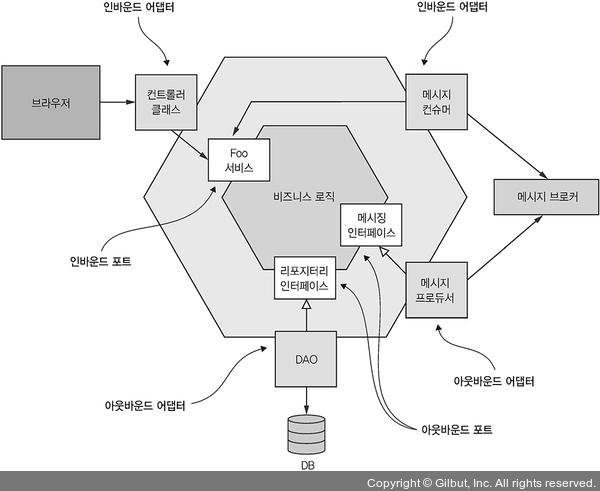
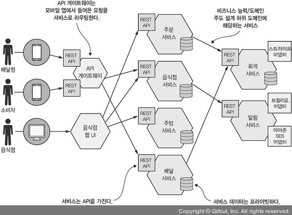

# 2.1.1 소프트웨어 아키텍쳐의 정의와 중요성

많은 개발자들이 더 나은 아키텍쳐를 꿈꾸며 연구하고 노력하고 있다.

그런데 아키텍쳐가 뭐길래 왜 그렇게 많은 개발자들이 더 나은 아키텍쳐를 꿈꾸고 있는걸까?

 

## 소프트웨어 아키텍쳐의 정의

소프트웨어 아키텍쳐는 다양한데다가, 소프트웨어의 품질에 영향을 주기 때문에 신중하게 선택해야 한다.

마이크로 서비스 아키텍쳐도 소프트웨어 아키텍쳐중 일종으로 관리, 테스트, 배포성이 높은 아키텍쳐 이다.

 

소프트웨어 아키텍쳐에 대해 정의하는 문구는 많지만, 그 중 `Len Bass` 라는 사람이 내린 정의는 다음과 같다.

*컴퓨팅 시스템의 소프트웨어 아키텍쳐는 소프트웨어 엘리먼트와 그들과의 관계, 그리고 이 둘의 속성으로 구성된 시스템을 추론하는 데 필요한 구조의 집합이다.*

추상적이라 이해하기 힘들 수 있지만, 핵심은 **애플리케이션 아키텍쳐가 여러 엘리먼트로 분해된다는 것과 엘리먼트 간의 연관성**이다.

분해가 중요한 이유는 다음과 같다.

- **업무와 지식의 분할 :** 전문 지식을 가진 사람들이 함께 애플리케이션 작업을 할 수 있다.	(?)
- **소프트웨어 엘리먼트의 상호작용을 기술한다.**

 

## 소프트웨어 아키텍쳐의 4+1 뷰 모델

애플리케이션 아키텍쳐를 바라보는 관점은 다양하다.

`Phillip Krutchen`은 소프트웨어 아키텍쳐가 4+1 모델 이라는 유명한 논문을 발표했다.

4+1 모델은 **아키텍쳐를 바라보는 4가지 관점**을 정의한다.

각각의 뷰는 아키텍쳐의 특정 측면을 기술하고, 다른 소프트웨어 엘리먼트와의 관계를 기술한다.

 

 

### Logical View 

개발자가 작성한 소프트웨어 엘리먼트. 즉 **개발자의 관점**이다.

객체 지향 언어라면 클래스, 패키지에 해당하고, **클래스와 패키지나 상속이나 종속성 같은 것들 사이의 관계를 의미한다.**

 

### Implementation View

빌드 시스템의 결과물. 즉 Java라면 JAR이나 WAR 파일과 같이 *실행 가능한 파일*이나 *패키징된 코드*를 의미한다.

**모듈간의 Dependency나 Component와 Module간의 조합 관계**가 포함된다.

 

### Process View

Runtime Component로, **각각의 개별 프로세스가 엘리먼트**이고, **IPC가 프로세스 간의 관계**를 나타낸다.

 

### Deployment View

프로세스가 머신에 매핑되는 방법.

**물리/가상 머신과 프로세스가 엘리먼트**이고, **머신간의 관계인 네트워킹, 프로세스와 머신간의 관계**가 이 View에서 기술된다.

 

### Scenario

4개의 관점 외에도 하나의 관점이 더 있는데, **뷰를 구동시키는 Scenario가 있다**

 

이렇듯 4+1 View Model은 **아키텍쳐를 명쾌하게 하기 위한 수단**이다.

4개의 View들은 **아키텍쳐 측면**을, Scenario는 **View의 엘리먼트가 협동하는 과정**을 명시한다.

 

## 아키텍쳐의 중요성

애플리케이션의 요구 조건은 크게 두 종류로 나뉜다.

- **기능적 요구 조건: **보통 Use Case나 사용자의 Story 포맷으로 작성한다. 아키텍쳐와는 거의 무관하다.

- **서비스의 품질에 관한 요구 조건: **반응성, 안정성과 같이 ~성 으로 끝나는 요구 조건들. 아키텍쳐는 이 조건들을 충족할 수 있게 설계해야 한다. 확장성, 신뢰성 외에도 관리성, 테스트성, 배포성 또한 품질에 해당된다.

  물론 아키텍쳐들은 각각 Trade-Off가 있기 때문에 정답은 없다. 하지만 자신에 상황에 맞는 아키텍쳐를 선택함으로써 원하는 품질 요건을 만족시킬 수 있다.

 

# 2.1.2 아키텍쳐 스타일 개요

아키텍쳐 스타일 개념은 특성과 상황에 따라 다른 양식을 따른다.

`David Garlan`과 `Mary Shaw`는 아키텍쳐 스타일을 다음과 같이 정의한다.

*아키텍쳐 스타일은 체계적인 조직의 관점에서 시스템 군을 정의한다.*

*좀 더 구체적으로 말하면 아키텍쳐 스타일은 해당 스타일로 만들어진 인스턴스에서 사용할 수 있는 Component와 Connector의 용어 사전, 그리고 이들을 조합할 수 있는 제약조건을 결정한다.*

 

특정 아키텍쳐 스타일은 엘리먼트(컴포넌트)의 컴포넌트간의 관계(커넥터)의 한정된 팔레트를 제공하며, 이를 토대로 애플리케이션 아키텍쳐의 View를 정의할 수 있다.

> MSA를 예로, 각각의 서비스(엘리먼트)와 커넥터(IPC)들 사이에는 한정된 팔레트(API)를 제공해서 아키텍쳐의 View를 정의할 수 있다.

애플리케이션은 대부분 **아키텍쳐 스타일을 조합**해서 사용한다.

Monoltihic Architecture도 구현 뷰를 하나의 실행 가능한 컴포넌트(JAR)로 구성한 아키텍쳐 스타일 이다.

MSA는 애플리케이션을 느슨하게 결합된 여러 서비스로 구성하는 아키텍쳐 스타일 이다.

 

## 계층화 아키텍쳐 스타일

소프트웨어 엘리먼트를 계층별로 구성하는 Layered Architecture는 전형적인 아키텍쳐 스타일 이다.

계층마다 정의된 역할을 분담하고, 계층간의 의존 관계는 아키텍쳐로 제한한다.

따라서 어떤 계층은 하위 계층에만 의존한다.

 

계층화 아키텍쳐 에서는 앞에서 배운 4가지 View 모두 적용할 수 있다.

우리가 평소에 사용하던 3계층 아키텍쳐가 계층화 아키텍쳐를 Logical View에 적용한 사례로, 애플리케이션을 다음과 같이 분리한 경우이다.

- **표현 계층: **사용자 인터페이스 또는 API가 구현된 계층
- **비지니스 로직 계층: **비지니스 로직이 구현된 계층
- **영속화 계층: **DB 상호작용 로직이 구현된 계층

많이 사용되는 계층화 아키텍쳐 이지만, 몇가지 흠이 있다.

1. **표현 계층이 하나밖에 없다: **하나의 애플리케이션을 호출하는 시스템이 여러개일 수 있다.
2. **영속화 계층이 하나뿐이다: ** 애플리케이션이 작용하는 DB가 여러개일 수 있다.
3. **비지니스 로직 계층이 영속화 계층에 의존한다: **따라서 DB없이 비지니스 로직의 테스트가 불가능하다.

또한 계층화 아키텍쳐에선 의존 관계를 잘못 나타는 경우도 있다.

일반적으로 비지니스 로직 계층은 인터페이스나 데이터 접근이 가능한 인터페이스 레포지토리를 정의하고,

영속화 계층은 레포지토리 인터페이스를 구현한 DAO 클래스를 정의한다.

즉, 실제 의존 관계가 정 반대로 되어있다.

 

## 육각형 아키텍쳐 스타일

육각형 아키텍쳐 스타일은 위에서 계층형 아키텍쳐의 문제점을 보완하기 위해서 등장한 **논리 뷰를 비지니스 로직 중심으로 구성**하는 아키텍쳐 스타일 이다.

애플리케이션의 표현 계층 대신 비지니스 로직을 호출해서 외부의 요청을 처리하는 **Inbound Adapters**를 두고,

비지니스 로직에 의해 호출되는 외부 애플리케이션을 호출하는 **Outbound Adapters**를 둔다.

**비지니스 로직이 어댑터들에게 전혀 의존하지 않고, 오히려 어댑터가 비지니스 로직에 의존**한다.

 

비지니스 로직에는 하나 이상의 포트가 있고, 포트는 비지니스 로직이 외부와 상호작용 하는 방법이 정의된 Operation이다.

> 여기서 말하는 포트는 우리가 평소에 알던 포트가 아니다.
>
> Java에서 사용하던 인터페이스와 같은 개념 이라고 생각하면 된다.

포트의 종류는 다음과 같다.

- **인바운드 포트: **비지니스 로직이 표출된 API로, 외부 애플리케이션의 요청을 받는 포트.

  예를 들어 public 메소드가 정의된 서비스 인터페이스 라고 생각하면 된다.

- **아웃바운드 포트: **비지니스 로직이 외부 시스템을 호출하는 방법에 관한 것.

  예를 들어 데이터 접근이 정의된 레포지토리 인터페이스를 의미한다.

위 그림에서 볼 수 있다싶이, **어댑터가 비지니스 로직을 감싸고 있다.**

- **인바운드 어댑터: **외부의 요청을 인바운드 포트를 호출해서 처리한다.

  예를 들어 Rest Endpoint나 MVC Controller, Message Broker 등이 있다.

- **아웃바운드 어댑터: **비지니스 로직에서 들어온 요청을 외부 서비스를 호출해서 처리해 준다.

  예를 들어 DB 작업이 구현된 DAO나 원격 서비스를 호출하는 Proxy 클래스 등이 있다.

 

이러한 방식의 가장 큰 장점은 **비지니스 로직의 표현/데이터 접근 로직이 어댑터와 분리**되어 있기 때문에 비지니스 로직이 **다른 계층에 의존하지 않는다**는 점 이다.

 

제각기 특정 API나 UI가 구현된 인바운드 어댑터가 비지니스 로직을 호출하고, 비지니스 로직은 다양한 외부 시스템을 호출하는 아웃바운드 어댑터를 호출하는 구조이다.

육각형 아키텍쳐는 MSA의 각각 서비들에게 적합한 아키텍쳐 이다.

계층화`(표현/비지니스 로직/영속화)`와 육각형`(포트, 어댑터, 비지니스 로직)` 아키텍쳐 모두 3계층 아키텍쳐 형태로, Logical View를 구성한다.

또한 아키텍쳐 구성 요소를 정의해서 그들간의 제약 조건을 둔다는 공통점이 있다.

 

## 2.1.3 MSA는 일종의 아키텍쳐 스타일 이다.

4+1 View 모델과 아키텍쳐 스타일에 대해 이야기 했었는데, 이제 Monoithic/MicroService Architecture를 정의할 차례이다.

먼저 Monolithic Architecture는 Implementation View를 단일 컴포넌트로 구성한 아키텍쳐 스타일 이기 때문에 다른 View는 등장하지 않는다.

Monolithic Application은 육각형 아키텍쳐로 구성된 Logical View를 가질 수 있다.

 

MSA도 아키텍쳐 스타일의 일종으로, **Deployment View를 다수의 컴포넌트로 구성**한다는 차이점이 있다.

여기서 컴포넌트는 서비스를 의미하고, **각각의 서비스는 자체적인 Logical View를 가지고 있다.**

전형적인 육각형 아키텍쳐로, 커넥터는 서비스들끼리 통신할 수 있도록 하는 통신 프로토콜이다.

 

MSA의 핵심은 **서비스를 느슨하게 결합**하는 것이기 때문에, 여러 서비스가 연결되어 있을 때 제약사항이 있다.

먼저 서비스가 뭔지, 느슨한 결합이 뭔지 이해해야 한다.

 

## 서비스란?

서비스는 **어떤 기능이 구현되어 단독적인 배포가 가능한 소프트웨어 컴포넌트**이다.

서비스는 클라이언트가 자신의 기능에 접근할 수 있도록 Command, Query, Event로 구성된 API를 제공한다.

서비스 작업은 Command와 Query로 나뉘게 된다.

> `createOrder()` 이라는 커맨드는 주문을 생성하고, `findOrderById()`라는 쿼리는 데이터를 조회한다.

서비스는 클라이언트가 소비할 OrderCreated 와 같은 이벤트를 발행해서 처리하기도 한다.

 

서비스 API는 **내부 구현을 캡슐화**한다.

Monolithic Application과 달리 개발자가 API를 우회해서 서비스에 접근할 수 없기 때문에 **MSA는 모듈성이 보장**된다.

 

각각의 Micro Service들은 자체적인 아키텍쳐를 가지고 있기 때문에 **기술 스택을 독자적으로 구축**할 수 있다.

하지만 대부분 육각형 아키텍쳐 형태를 사용한다.

서비스에 구현된 비지니스 로직과 소통하는 어댑터를 통해 API를 구현한다.

- **Operation Adapter: **비지니스 로직을 호출한다.
- **Events Adapter: **비지니스 로직이 준 이벤트를 발행한다.

위와 같이 Operation Adapter는 **서비스의 구현체가 캡슐화된 API**가 있어서 클라이언트의 호출은 여기 정의되어 있다.

 

## 느슨한 결합

서비스간의 느슨한 결합은 MSA의 주요 특성 중 하나이다.

서비스는 API를 통해서만 상호작용 하기 때문에 **클라이언트에 영향을 주지 않고 구현 코드를 수정할 수 있다.**

이렇게 느슨하게 결합된 서비스는 다음 장점들이 있다.

- 유지보수성 증가
- 테스트성 증가
- 개발 시간 단축
- 개발자가 서비스를 이해하기 쉽다.

 

서비스는 느슨하게 결합되고 API를 통해서만 동작하기 때문에 **서비스와 DB의 직접적인 통신은 불가능**하다.

개발자가 자신의 스키마를 변경할 때 다른 서비스 개발자와 상의하지 않아도 되게 하기 위해 서비스의 필드같은 것들은 private로 유지해야 한다.

서비스간의 테이블을 공유하지 않기 때문에 **Runtime에서 Isolation 수준도 향상**된다.

서비스 별로 DB가 따로 있기 때문에 **특정 서비스가 DB Lock을 획득하여 다른 서비스들을 블로킹할 수 없다**

 

## 공유 라이브러리의 역할

개발자들은 여러 애플리케이션에서 사용할 수 있도록 라이브러리로 패키징 하는건 당연하다.

그래서 MSA에서도 공유 라이브러리를 쓰고싶을 수 있는데, 조심해서 사용해야 한다.

코드의 중복을 줄이는건 좋지만 **의도치 않은 서비스간의 결합도 증가**를 가져올 수 있기 때문이다.

 

만약 비지니스 로직에서 공통된 코드를 하나의 라이브러리로 만들어서 공유한다고 가정해 보자.

만약 라이브러리에서 코드의 변경이 생기면 그 라이브러리를 사용하는 **모든 서비스들을 다시 배포**해야 한다.

따라서 변경 가능성이 조금이라도 있으면 별도의 서비스로 구현하는게 좋다.

 

## 서비스의 규모는 별로 중요하지 않다. 

마이크로 서비스에서 마이크로 라는 용어 때문에 서비스를 아주 작게 만들어야 할 것 같지만, 크기는 딱히 중요하지 않다.

크기보다는 **작은 팀이 가장 짧은 시간에, 다른 팀과 협동하는 부분을 최소로 하여 개발 가능한 서비스**를 설계해야 한다.

다른 서비스가 변경되었을 때 자신의 서비스도 계속 바꿔야 한다면, 서비스가 느슨하게 결합되지 않았다는 반증이다.

