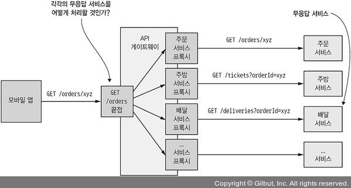

RPI는 클라이언트가 서비스에 요청을 보내면 **서비스가 처리 후 응답을 반환하는 IPC**이다.

클라이언트들은 Blocking될수도 Non-Blocking일수도 있지만 어쨋든 응답이 제때 도착함을 보장한다.


RPI는 위 그림과 같이 동작하는데, 다음 순서로 동작한다.

1. 비지니스 로직에서 Proxy Interface를 호출한다.
2. Proxy Interface는 RPI Proxy Adapter로 구현해서 요청을 전달한다.
3. RPI 서버 어댑터 클래스가 요청을 받는다.
4. 서비스 인터페이스로 비지니스 로직을 호출한다.
5. RPI Proxy에게 결과를 반환한다.
6. 클라이언트 비지니스 로직에게 반환된다.

# 3.2.1 동기 RPI 패턴: REST

REST는 거의 항상 **HTTP로 통신하는 IPC**이다.

Rest의 창시자인 `Roy Fielding`의 논문에서는 다음과 같은 말을 했다.

`REST는 컴포넌트 상호 작용의 확장성, 인터페이스 일반화, 컴포넌트의 독립적 배포, 상호 작용 지연을 줄이기 위해 중간 컴포넌트, 보안 강화, 레거시 시스템의 캡슐화에 역점을 둔 아키텍처 제약 조건 세트를 제공한다`

Resource는 Rest의 핵심 개념으로, Customer나 Product와 같은 비지니스 객체들을 의미한다.

Rest는 HTTP Method로 URL의 Resource를 가공/조작한다.

> 만약 HTTP Method와 Endpoint가 각각 POST, `/comment`라면 comment 라는 Resource를 Post한다는 의미이다.

<br>

많은 개발자들이 자신이 만든 API가 Restful하다고 생각하는 사람이 많지만, 다음 성숙도 모델을 보고 생각해보자

## REST 성숙도 모델

`Leonard Richardson`은 REST의 성숙도를 알 수 있는 4단계의 Model을 제시했다.

- **레벨 0:** Client는 서비스별 Method에 관계없이 유일한 Endpoint에 HTTP 요청을 하여 서비스를 호출한다.

  요청마다 URI에 액션, 대상, 매개변수를 담는다.

  > 즉 Comment 서비스라면 `/save?target=comment&postId=1`와 같은 방식으로 사용한다.

- **레벨 1:** 0레벨에서 추가 서비스는 Resource 개념을 지원한다.

  > `/save/comment?postId=1`과 같이 사용

- **레벨 2:** 서비스는 HTTP Method를 활용해서 요청에서는 필요한 매개변수를 지정한다.

- **레벨 3:** HATEOS 원칙에 따라서 설게한다.

  > HATEOS란 GET 요청을 보낼 때, 하이퍼링크도 함께 보내주는걸 의미한다.

## IDL

API는 IDL로 정의해야 한다고 했지만, REST는 따로 IDL이 없었다.

인터이스를 기반으로 Client Stub과 Server Skeleton을 생성해주는 툴을 포함하고 등장한것이 스웨거 이다.

## 문제점

### 한번에 많은 Resource를 가져오기 어렵다.

Rest는 Customer, Order과 같은 비지니스 객체를 중심으로 자원을 가져온다.

하지만 만약 주문과 그에 대한 사용자를 조회해야 한다면 순수 RestAPI일때 적어도 주문, 사용자 2번을 통신해야 한다.

하지만 지연시간이 급증하기 때문에 클라이언트는 리소스를 요청할 때 연관된 리소스를 정의하고, API는 연관된 리소스의 접근을 허용하는 방법이다.

`GET /orders/121231?expand=consumer`

하지만 복잡하고 구현이 어려워서 GraphQL이나 Falcor가 각광받고 있다.

### HTTP Method와 작업을 매핑하기 어렵다.

예를 들면 HTTP Method를 PUT으로 할지, PATCH로 할지 고민이 될수도 있다.

그냥 막 설정하게 되면 REST답지 않게 되어버리게 되기에 고민해야할 부분이다.

## 장단점 정리

### 장점

- 단순하고 익숙함
- HTTP API 테스트를 간편하게 할 수 있다.
- Request/Response 스타일의 통신을 지원한다.
- 방화벽의 입장에서 접근이 쉽다.
- Broker가 없기 때문에 단순하다.

### 단점

- Request/Response만 지원한다.

- 가용성이 떨어지다. Request/Response가 완료될때까지 서버/클라이언트 모두 실행중이어야 한다.

- 서비스 인스턴스들의 URL를 클라이언트가 모두 알고있어야 한다.

  > 요즘은 Service Discovery Mechanism을 통해 클라이언트가 동적으로 찾을 수 있기 때문에 큰 문제는 아니다.

- 요청 한 번으로 여러 Resource를 가져오기 힘들다.

- HTTP 동사에 매핑이 힘들수도 있다.

# 3.2.2 동기 RPI 패턴: gRPC

RestAPI설계가 생각보다 쉽지 않아서 등장한것이 gRPC이다.

gRPC는 **다양한 언어로 서버/클라이언트를 작성할 수 있는 프레임워크**로, 이진 메세지 포맷을 사용하기 때문에 API 우선적으로 개발하도록 강제해준다.

gRPC는 Protocol Buffer 기반의 IDL로 정의하고, Compiler로 Client Stub과 Server Skeleton을 생성해준다.

그리고 HTTP/2 위에서 동작한다.

<br>

gRPC는 Service와 Request/Response definition으로 구성된다.

여기서 Service Definition은 Java Interface와 비슷하게 **정적 타입 메소드를 모아둔 것**이다.

gRPC는 스트리밍도 지원한다.

<br>

gRPC는 간결하고 효율적인 **Protocol Buffer Message Format**을 사용한다.

메세지를 보낼 때 필드마다 번호를 가지며, 수신자는 원하는 필드만 추출할 수 있기 때문에 하위 호환성을 유지할 수 있다.

<br>

다음은 예제 gRPC 코드이다.

``` protobuf
service OrderService {
  rpc createOrder(CreateOrderRequest) returns (CreateOrderReply) {}
  rpc cancelOrder(CancelOrderRequest) returns (CancelOrderReply) {}
  rpc reviseOrder(ReviseOrderRequest) returns (ReviseOrderReply) {}
  …
}


message CreateOrderRequest {
  int64 restaurantId = 1;
  int64 consumerId = 2;
  repeated LineItem lineItems = 3;
  …
}


message LineItem {
  string menuItemId = 1;
  int32 quantity = 2;
  }


message CreateOrderReply {
  int64 orderId = 1;
  }
…
```

CreateOrderRequest와 CreateOrderReply는 **타입이 정해진 메세지**이다.

int형의 restaurantId는 태그 값이 1이고, consumerId는 2를 할당받았다.

### gRPC의 장점

- 다양한 업데이트가 포함된 API를 설계하기 쉽다.
- 큰 메세지를 보낼 때 효율적이다.
- 양방향이 가능하기 때문에 RPI, Messaging 모두 가능하다.
- 다양한 언어 사이의 연동이 가능하다.

### gRPC의 단점

- JS Client가 할 작업이 REST에 비해 늘어난다.
- 구형 방화벽이라면 HTTP/2를 지원하지 않는다.

# 3.2.3 부분 실패 처리: 회로 차단기 패턴

분산 시스템에서 다른 서비스를 동기 호출하면 부분 실패의 가능성이 항상 존재한다.

클라이언트나 서비스는 모두 개별 프로세스로 동작하기 때문에 제때 응답할 수 없거나 여러 원인으로 인해 서버가 내려갔을 수도 있다.

이러한 상황에서 동기 통신을 사용하고 있다면 서비스에서 발생한 문제는 클라이언트의 클라이언트까지 이어진 실패가 될 수 있다.

<br>

이러한 상황을 해결하기 위한 회로 차단기 패턴은 **연속 실패 횟수가 임계치를 초과하면 일정 시간동안 호출 자체를 거부하는 RPI Proxy**이다.


위 그림과 같이 주문 서비스가 묵묵부답이라면, 주문 서비스 프록시를 그냥 구현하면 무한대로 블록킹 될 것이다.

이를 해결하기 위한 방법엔 2가지 종류가 있다.

## 1. 견고한 RPI Proxy 설계

넷플릭스 기술 블로그에 따르면 다른 서비스를 동기 호출할 때 스스로를 방어하는 방법이 잘 나와있다.

### Network Timeout

응답 대기를 무한정 대기하지 않고 **Timeout을 설정**하면 된다.

### 미처리 요청 개수 제한

클라이언트가 요청을 보낼 때 실패의 개수를 제한한다.

만약 서비스A가 서비스B를 호출하고 있을 때 100개가 실패했다면 그 이상의 요청은 무의미하다고 판단하고 바로 실패를 시켜버린다.

### 회로 차단기 패턴

위에서 설명했듯 일정 이상의 실패율에 도달하면 그 이후는 모두 실패처리 한다.

Timeout 이후에 클라이언트가 재시도해서 성공했다면 회로 차단기는 닫힌다.

<br>

Netflix의 Hystrix는 이러한 패턴들이 구현된 라이브러리 이다.

만약 JVM 환경이라면 Hystrix를 사용해도 괜찮다.

## 2. 불능 서비스 복구

Hystrix와 같은 라이브러리는 부분적인 솔루션에 불과하다.

무응답 서비스를 어떻게 복구하면 좋을지는 그때그때 유동적으로 대응해야 한다.



위와 같이 주문 요청이 실패한다면 그냥 예외를 반환하는게 클라이언트 입장에서 더 좋다.

<br>

부분 실패 시 기본값이나 대체 값을 반환하는 방법도 있다.

<br>

모든 서비스들의 데이터가 중요하진 않기 때문에 캐싱된 데이터를 주거나, 오류를 반환해도 된다.