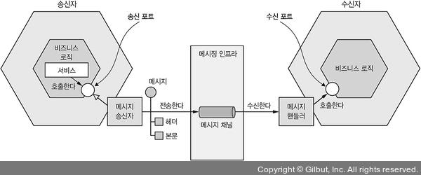
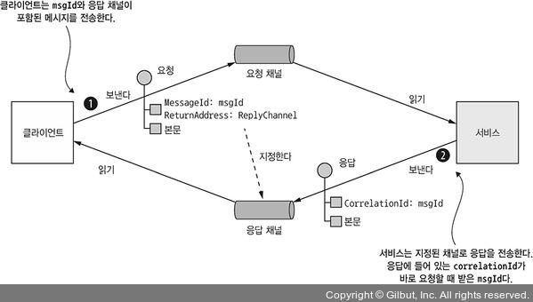

# 소개

메세징은 **서비스간의 비동기적 통신**을 주고 받는 **통신 방식**이다.

메세징 기반 Application은 보통 Message Broker를 두지만, 서비스끼리 직접 통신하는 Brokerless 아키텍쳐도 있다.

클라이언트가 서비스에 요청을 보냈을 때 서비스 인스턴스가 응답할 수 있다면 메세지를 Client에게 반환한다.

비동기 통신이기 때문에 **Client는 응답을 바로 받지 못할 것 이라는 전제를 가지고 블록킹 되지 않는다.**

# 3.3.1 메세징 개요

메세지는 **메세지 채널**에 의해 교환된다.

Publisher가 채널에 메세지를 발행하면 Subscriber는 해당 채널에서 메세지를 받아온다.

## 메세지

Message란 **Header와 Body로 이루어진 데이터 프레임**이다.

Header에는 송신한 데이터에 대한 MetaData에 해당하는 Key-Value값이 들어가게 된다.

그 외에도 메세지의 ID, 응답이 출력될 메세지 채널의 반환 주소가 있을 수 있다.

 

메세지의 종류는 여러가지가 있지만 대표적으로 다음 3가지가 있다.

- **Document:** Data만을 포함한 일반적인 메세지. 해석은 Client의 몫으로 남겨둔다.
- **Command:** RPC 요청같은 메세지. 호출할 Method와 필요한 매개변수가 정의되어 있다.
- **Event:** 송신자에게 어떠한 일이 발생했다는걸 알리는 메세지. 대부분 도메인 객체의 변경을 알리는 도메인 이벤트다.

## 메세지 채널

메세지는 채널을 통해 교환되는데, 다음과 같은 방식으로 전송된다.

1. 송신자측의 비지니스 로직은 **실제 통신 메커니즘을 캡슐화 한 송신 포트 인터페이스를 호출**한다.

   해당 인터페이스는 메세지 송신자 어댑터에 의해 구현된다.

2. 메세징 인프라를 추상화한 **메세지 채널로 메세지를 전달**한다.

3. 메세징 인프라가 **수신자에게 메세지를 전달**한다.

4. 수신자쪽 메세지 핸들러 어댑터가 **메세지 처리를 위해 호출**된다.

5. 메세지 핸들러 어댑터 클래스는 **비지니스 로직으로 구현된 수신 포트 인터페이스를 호출**한다.

 

이러한 메세지 타입에는 두가지 종류가 있다.

- **Point to Point 채널:** 채널을 읽고있는 Consumer 중 딱 한 Consumer에게만 메세지를 전송한다. 주로 Command 메세지에서 사용된다.
- **Pub/Sub 채널:** 같은 채널을 바라보고 있는 모든 Consumer들에게 메세지를 전달한다. 일대다 관계일 때 주로 사용된다.

# 메세징 상호 작용 스타일 구현

## Request/Response 및 Async Request/Response

비동기 Request/Response든 그냥 Request/Response든 결국 요청을 보내면 서비스가 응답을 반환한다.

메세징 자체가 비동기이기 때문에 즉시 응답이 올거라고 기대하지 않는 비동기 Request/Response만 지원한다.

> 하지만 클라이언트가 Request를 보낸 후 Response가 올때까지 Client를 Blocking 시킬수는 있다.

 

1. Client가 요청 채널에 실행할 서비스와 매개변수가 담긴 커맨드 메세지를 보낸다. 여기서 ReturnAddress 라는 이름으로 어떤 응답 채널을 사용할지 결정한다.
2. 서비스는 요청을 처리한다.
3. 응답 채널에 메세지를 반환한다.
4. Client는 CorrelationId로 이 요청이 내가 보낸 요청이 맞는지 확인한다.

## 단방향 알림

One way Notification은 비동기 메세징으로 직관적이게 구현할 수 있다.

단지 위와 같은 형태에서 응답 채널을 빼면 된다.

## Publish/Subscribe

메세징은 기본적으로 Pub/Sub스타일의 상호작용을 지원한다.

Client는 여러 Consumer가 읽는 채널에 메세지를 발행하고, 서비스는 도메인 객체의 변화를 알리는 이벤트를 발행한다.

> 만약 Order 엔티티가 수정되었다면 Order라는 채널에 이벤트를 발행하고, Client쪽은 자신이 원하는 엔티티 채널을 구독한다.

## Publish/Async Response

발행/비동기 응답 패턴은 **Pub/Sub 패턴과 Async Request/Response 패턴을 조합**한 고수준 상호 작용 스타일이다.

1. Client는 응답 채널 헤더가 명시된 메세지를 Pub/Sub 채널에 발행한다.
2. Consumer가 CorrelationId가 포함된 Response 메세지를 응답 채널에 작성한다.
3. Client는 CorrelationId로 응답을 취합한다.

