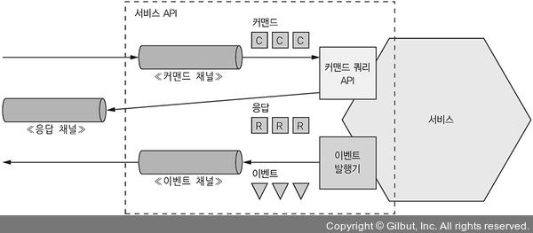
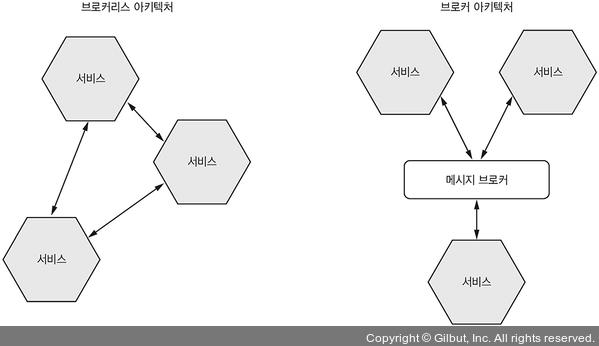

# 소개

메세징은 **서비스간의 비동기적 통신**을 주고 받는 **통신 방식**이다.

메세징 기반 Application은 보통 Message Broker를 두지만, 서비스끼리 직접 통신하는 Brokerless 아키텍쳐도 있다.

클라이언트가 서비스에 요청을 보냈을 때 서비스 인스턴스가 응답할 수 있다면 메세지를 Client에게 반환한다.

비동기 통신이기 때문에 **Client는 응답을 바로 받지 못할 것 이라는 전제를 가지고 블록킹 되지 않는다.**

# 3.3.1 메세징 개요

메세지는 **메세지 채널**에 의해 교환된다.

Publisher가 채널에 메세지를 발행하면 Subscriber는 해당 채널에서 메세지를 받아온다.

## 메세지

Message란 **Header와 Body로 이루어진 데이터 프레임**이다.

Header에는 송신한 데이터에 대한 MetaData에 해당하는 Key-Value값이 들어가게 된다.

그 외에도 메세지의 ID, 응답이 출력될 메세지 채널의 반환 주소가 있을 수 있다.

 

메세지의 종류는 여러가지가 있지만 대표적으로 다음 3가지가 있다.

- **Document:** Data만을 포함한 일반적인 메세지. 해석은 Client의 몫으로 남겨둔다.
- **Command:** RPC 요청같은 메세지. 호출할 Method와 필요한 매개변수가 정의되어 있다.
- **Event:** 송신자에게 어떠한 일이 발생했다는걸 알리는 메세지. 대부분 도메인 객체의 변경을 알리는 도메인 이벤트다.

## 메세지 채널

메세지는 채널을 통해 교환되는데, 다음과 같은 방식으로 전송된다.

1. 송신자측의 비지니스 로직은 **실제 통신 메커니즘을 캡슐화 한 송신 포트 인터페이스를 호출**한다.

   해당 인터페이스는 메세지 송신자 어댑터에 의해 구현된다.

2. 메세징 인프라를 추상화한 **메세지 채널로 메세지를 전달**한다.

3. 메세징 인프라가 **수신자에게 메세지를 전달**한다.

4. 수신자쪽 메세지 핸들러 어댑터가 **메세지 처리를 위해 호출**된다.

5. 메세지 핸들러 어댑터 클래스는 **비지니스 로직으로 구현된 수신 포트 인터페이스를 호출**한다.

 

이러한 메세지 타입에는 두가지 종류가 있다.

- **Point to Point 채널:** 채널을 읽고있는 Consumer 중 딱 한 Consumer에게만 메세지를 전송한다. 주로 Command 메세지에서 사용된다.
- **Pub/Sub 채널:** 같은 채널을 바라보고 있는 모든 Consumer들에게 메세지를 전달한다. 일대다 관계일 때 주로 사용된다.

# 메세징 상호 작용 스타일 구현

## Request/Response 및 Async Request/Response

비동기 Request/Response든 그냥 Request/Response든 결국 요청을 보내면 서비스가 응답을 반환한다.

메세징 자체가 비동기이기 때문에 즉시 응답이 올거라고 기대하지 않는 비동기 Request/Response만 지원한다.

> 하지만 클라이언트가 Request를 보낸 후 Response가 올때까지 Client를 Blocking 시킬수는 있다.

 

1. Client가 요청 채널에 실행할 서비스와 매개변수가 담긴 커맨드 메세지를 보낸다. 여기서 ReturnAddress 라는 이름으로 어떤 응답 채널을 사용할지 결정한다.
2. 서비스는 요청을 처리한다.
3. 응답 채널에 메세지를 반환한다.
4. Client는 CorrelationId로 이 요청이 내가 보낸 요청이 맞는지 확인한다.

## 단방향 알림

One way Notification은 비동기 메세징으로 직관적이게 구현할 수 있다.

단지 위와 같은 형태에서 응답 채널을 빼면 된다.

## Publish/Subscribe

메세징은 기본적으로 Pub/Sub스타일의 상호작용을 지원한다.

Client는 여러 Consumer가 읽는 채널에 메세지를 발행하고, 서비스는 도메인 객체의 변화를 알리는 이벤트를 발행한다.

> 만약 Order 엔티티가 수정되었다면 Order라는 채널에 이벤트를 발행하고, Client쪽은 자신이 원하는 엔티티 채널을 구독한다.

## Publish/Async Response

발행/비동기 응답 패턴은 **Pub/Sub 패턴과 Async Request/Response 패턴을 조합**한 고수준 상호 작용 스타일이다.

1. Client는 응답 채널 헤더가 명시된 메세지를 Pub/Sub 채널에 발행한다.
2. Consumer가 CorrelationId가 포함된 Response 메세지를 응답 채널에 작성한다.
3. Client는 CorrelationId로 응답을 취합한다.

# 3.3.3 메세징 기반 서비스의 API 명세 작성

비동기 API 명세는 평소와는 약간 다른 구조를 가진다.

또한 위 그림에서 볼 수 있다싶이 커맨드와 이벤트는 서로 방식 자체가 다르기 때문에 문서화 하는 방법도 다르다.

## 비동기 작업 문서화

서비스는 가지 방식 중 하나로 호출할 수 있다.

- **Request/Async Response:** 서비스의 커맨드 메세지 채널과 서비스가 받는 메세지의 타입, 반환하는 응답 메세지의 타입과 포맷으로 구성된다.

  일반적인 HTTP 통신의 API 명세와 비슷하다고 할 수 있다.

- **단방향 알림:** 서비스의 커맨드 메세지 채널, 서비스가 받는 커맨드 메세지의 타입과 메세지 포맷으로 구성된다.

## 발행 이벤트의 문서화

서비스는 Pub/Sub Model로도 이벤트를 발행할 수 있다.

다음 내용을 API 명세에 포함시켜야 한다.

- 이벤트 채널
- 서비스가 채널에 발행하는 이벤트 메세지
- 메세지 포맷

메세지와 메세징 채널 모델은 비동기 API를 설계하는 좋은 방법이지만, 메세징 기술을 선택해야 하고 그 기술의 기능으로 어떤 방향으로 개발할지 결정해야 한다.

# 3.3.4 메세지 브로커

대부분의 메세징 기반 Application에서 **서비스간의 통신할 수 있도록 하는 인프라 서비스로써 사용하는 것이 Message Broker**이다.

Client와 Service를 직접 연결해주는 Brokerless 기반 Messaging Architecture도 있지만, 일반적으로 Broker가 존재하는 편이 더 좋다.

> 이 책은 Broker 기반의 아키텍쳐를 주로 사용하지만 BrokerLess도 잠깐 살펴보자

## Brokerless Messaging

Brokerless Architecture 서비스는 **메세지를 직접 교환**한다.

ZeroMQ는 잘 알려진 Brokerless Messaging 서비스이다.

TCP, 유닉스형 Domain Socket, Multicast 등 다양한 전송 기술을 지원하며 여러 언어를 지원하는 라이브러리 세트다.

장점은 다음과 같다.

- 송신자가 보낸 메세지가 Message Broker를 거치지 않기 때문에 **트래픽이 가볍고 지연 시간이 짧다.**

- **MQ에서 병목 현상이 일어날 일도 없고 SPOF가 될 일도 없다.**

  SPOF란 Single Point Of Failure의 약자로 한 부분이 동작하지 않으면 전체 서비스가 마비되는 포인트를 의미한다.

- **Message Broker를 설정/관리 할 필요가 없다.**

다음과 같은 단점도 있다.

- **서비스가 서로의 위치를 알고 있어야 한다.**

  따라서 Service Discovery 메커니즘을 사용해야 한다.

- **송/수신자 모두 실행되어야 한다.**

  따라서 가용성이 떨어진다.

- 전달 보장과 같은 메커니즘을 구현하기 힘들다.

이러한 단점들을 고려하면 결국 동기 Request/Response와 크게 차이가 없다.

## Broker 기반 Messaging

Message Broker는 **모든 메세지가 지나가는 중간 지점**이다.

송신자가 MQ에 메세지를 보내면 Message Broker는 메세지를 수신자에게 전달한다.

MQ의 가장 큰 장점은 **송신자가 수신자의 위치를 몰라도 된다**는 것이다. 또한 Consumer가 메세지를 처리할 수 없을 때 MQ에 메세지를 Buffer할 수 있다.

대표적으로 ActiveMQ, RabbitMQ, Kafka, AWS SQS 등이 있다.

 

MQ를 선택할 때에는 다음 항목들을 검토해 보아야 한다.

- **프로그래밍 언어 지원 여부:** 다양한 언어를 지원할수록 좋다.
- **메세징 표준 지원 여부:** AMQP나 STOMP 등 표준 프로토콜을 지원하는지를 확인해 보아야 한다.
- **메세지 순서:** 메세지의 순서가 보장되는지 보장되지 않는지 확인해 보아야 한다.
- **전달 보장:** 어떤 방식으로 메세지의 전달을 보장하는지 확인해 보아야 한다.
- **영속화:** MQ가 고장나도 디스크에 정보가 저장이 되는지 확인해 보아야 한다.
- **내구성:** Consumer가 Message Broker에 재접속 한 경우 그동안 있던 메세지들을 받을 수 있는지 확인해 보아야 한다.
- **확장성:** 얼마나 확장성이 좋은지 알아보아야 한다.
- **지연 시간:** Endpoint 사이의 지연 시간은 얼마나 되는가?
- **경쟁사 Consumer:** 다른 경쟁사의 Consumer를 지원하는가?

MQ마다 각각의 장단점이 있다. 하지만 **메세지의 순서를 유지하고 확장성은 필수 요건**이다.

## Message Broker로 메세지 채널 구현

메세지 채널은 Message Broker마다 구현 방식이 다르다.

| MQ                     | 점대점 채널      | Pub/Sub 채널                      |
| ---------------------- | ---------------- | --------------------------------- |
| JMS                    | Queue            | Topic                             |
| Apache Kafka           | Topic            | Topic                             |
| AMQP ex) RabbitMQ | exchange + Queue | Fanout Exchange, Consumer별 Queue |
| AWS Kineses            | Stream           | Stream                            |
| AWS SQS                | Queue            | 불가능                            |

## Broker 기반 메세징의 장점

### 느슨한 결합

Client는 적절한 채널에 메세지를 보내기만 하면 요청할 수 있어서 **Client는 서비스 인스턴스를 알 필요가 없다.**

따라서 Service Discovery 메커니즘도 필요없다.

### Message Buffering

Message Broker는 **Service가 요청을 처리할 수 있을때까지 메세지를 버퍼링**해준다.

HTTP와는 다르게 Service가 요청을 처리할 수 없다면 단지 해결할 수 있을때까지 큐에 메세지가 쌓이게 된다.

### 유연한 통신

메세징은 **지금까지 설명한 모든 상호작용을 지원**한다.

### 명시적 IPC

RPC는 원격 서비스가 마치 로컬에 있는 서비스인 것 처럼 호출할 수 있도록 해주지만, 부분 실패의 가능성 등으로 인해 실제 로컬 서비스와는 많은 차이가 있다.

하지만 메세징은 IPC를 온전히 자신의 

## Broker 기반 메세징의 단점

### 성능 병목의 가능성

MQ는 **성능이 병목되는 포인트가 될 수 있다.**

하지만 MQ는 대부분 확장성이 좋기 때문에 해결된다.

### 단일 장애점 가능성

MQ는 가용성이 높아야 한다.

그렇지 않으면 시스템 전체의 신뢰성에 금이갈 수 있다.

요즘 Broker는 고가용성이 보장되기 때문에 해결된다.

### 운영 복잡도

Message Broker도 설치/구성/운영해야 하는 컴포넌트이기 때문에 운영 복잡도가 증가하게 된다.