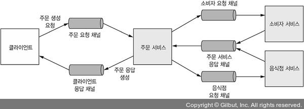
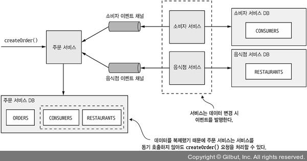
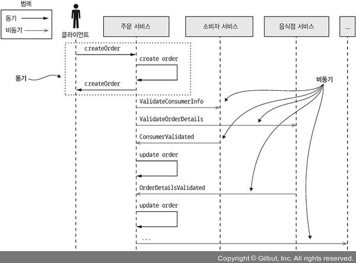

# 3.4.1 동기 통신으로 인한 가용성 저하

Rest는 대중적이고 쉽기 때문에 좋아보이지만, 동기 IPC이기 때문에 **가용성을 크게 저하**시킨다는 단점이 있다.

 

다음 예제로 보자

다음과 같은 서비스 구조를 가지고 있고, 서비스끼리는 Rest 통신을 하는 Application이 있다.

1. Client가 Orders에 POST요청
2. `/consumer/id`에 소비자 정보를 요청
3. `/restaurant/id`에 음식정 정보를 요청
4. 올바른 주문인지 확인한다.
5. 주문을 생성한다.
6. Client에게 정보를 반환한다.

여기서는 모두 HTTP를 사용하기 때문에 주문 생성이 성공하려면 **세 서비스 모두 가동 중 이어야 한다.**

한 서비스라도 내려가면 주문 생성이 불가능해진다.

 

위와 같은 상황이라면 Rest 통신 뿐만 아니라 **동기 IPC, 비동기 IPC 모두 가용성이 떨어진다고 할 수 있다.**

# 3.4.2 동기 상호 작용 제거

비동기 API만을 짜서 해결할수도 있지만, 항상 그럴 수 있는건 아니다.

예를 들어 외부 API는 웬만하면 REST 방식을 사용하기 때문에 동기 API를 어쩔 수 없이 사용해야 할 수 있다.

따라서 동기 요청을 하지 않고 우회해서 동기 요청을 처리하는 방법을 채택한다.

## 비동기 상호 작용 스타일

모든 트랜잭션에서는 비동기 상호 작용 스타일로 처리하는게 가장 좋다.

다음과 같은 서비스가 있다고 가정하자.

1. 클라이언트는 비동기 Request/Response로 주문 생성 요청을 주문 요청 채널에 전달한다.
2. 주문 요청 채널이 주문 서비스에 요청을 전달한다.
3. 다른 API들을 비동기로 호출한다.

이러한 모델에서는 **어느쪽도 Blocking되지 않는다.**

이러한 아키텍쳐는 **메세지가 소비되는 시점까지 Message Broker가 메세지를 버퍼링**하기 때문에 매우 탄력적이다.

하지만 동기 프로토콜을 사용하는 외부 API가 필요한 서비스도 필요할 수 있다.

## 데이터 복제

서비스 요청 시 필요한 데이터의 Replica`(복제본)`을 유지하는 방법이다.

주문 서비스 DB에서는 **Consumers와 Restaurant 등 필요한 정보들을 담아둔다.**

그리고 만약 소비자 또는 음식점이 변경되면 **이벤트를 발행해서 주문 서비스의 Consumer나 Restaurant를 변경**해준다.

 

이렇게 Replica를 유지하는 방법도 괜찮아 보이지만, 대용량 데이터에 대한 Replica는 너무 많은 공간을 잡아먹는다는 문제가 있다.

## Response 를 반환한 후에 처리

동기 통신을 제거하는 또 다른 방법은 다음과 같다.

1. 로컬의 데이터로만 요청을 검증한다.
2. Outbox 테이블을 이용해서 DB를 업데이트 한다.
3. Client에게 메세지를 전달한다.

> 다시 짚어보자면 Outbox 테이블은 트랜잭션 처리를 위해 존재하는 테이블로, 하나의 트랜잭션 안에서 해당 테이블에 Insert를 하고 그 테이블을 읽어서 Message를 전송하는 방식이다.

위와 같은 방식의 서비스는 **다른 서비스와 동기적인 통신을 하지 않는다.**

그 대신 **다른 서비스에 메세지를 전송**하게 된다.

 

만약 주문 서비스가 이러한 방식을 사용하게 되면  다음과 같은 순서로 호출된다.

1. 주문 서비스가 PENDING 상태의 주문을 생성한다.
2. 주문 서비스가 주문 ID가 포함된 Response를 Client에게 전달한다.
3. 주문 서비스는 ValidateConsumerInfo 메세지를 소비자 서비스에 전달한다.
4. 주문 서비스는 ValidateOrderDetails 메세지를 음식점 서비스에 전달한다.
5. 소비자 서비스는 ValidateConsumerInfo 메세지를 받고 ConsumerValidated 메세지를 주문 서비스로 돌려준다.
6. 음식점 서비스는 ValidateOrderDetails 메세지를 받고 올바른 항목인지 검증하고 OrderDetailsValidated라는 메세지를 반환한다.
7. 주문 상태를 PENDING에서 VALIDATED로 변경한다.

 

여기서 특징은 **순서에 관계없이 수신한 메세지에 따라 주문 상태를 변경**한다.

만약 소비자 서비스에서 먼저 validate가 되었다면 CUSTOMER_VALIDATED로, 음식점 서비스에서 먼저 validate가 되었다면 ORDER_VALIDATED로 바꾸게 된다.

 

이렇게 주문 서비스는 주문에 대한 검증을 한 후에 나머지 프로세스를 처리하게 된다.

이렇게 하면 만약 **중간에 인스턴스 하나가 꺼져도 다시 Message Broker에서 메세지를 가져오면 된다.**

하지만 복잡도가 너무 높기 때문에 