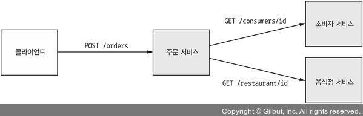

# 3.4.1 동기 통신으로 인한 가용성 저하

Rest는 대중적이고 쉽기 때문에 좋아보이지만, 동기 IPC이기 때문에 **가용성을 크게 저하**시킨다는 단점이 있다.

 

다음 예제로 보자

다음과 같은 서비스 구조를 가지고 있고, 서비스끼리는 Rest 통신을 하는 Application이 있다.

1. Client가 Orders에 POST요청
2. `/consumer/id`에 소비자 정보를 요청
3. `/restaurant/id`에 음식정 정보를 요청
4. 올바른 주문인지 확인한다.
5. 주문을 생성한다.
6. Client에게 정보를 반환한다.

여기서는 모두 HTTP를 사용하기 때문에 주문 생성이 성공하려면 **세 서비스 모두 가동 중 이어야 한다.**

한 서비스라도 내려가면 주문 생성이 불가능해진다.

 

위와 같은 상황이라면 Rest 통신 뿐만 아니라 **동기 IPC, 비동기 IPC 모두 가용성이 떨어진다고 할 수 있다.**

