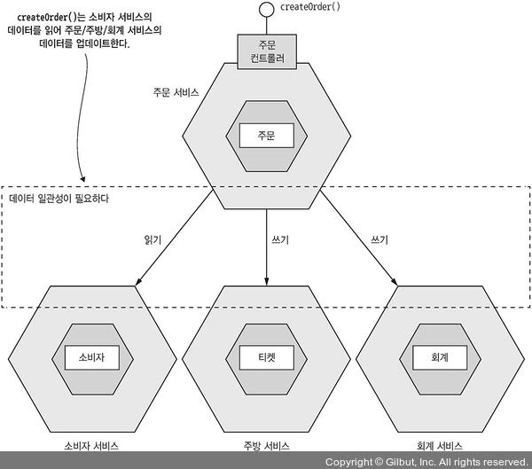
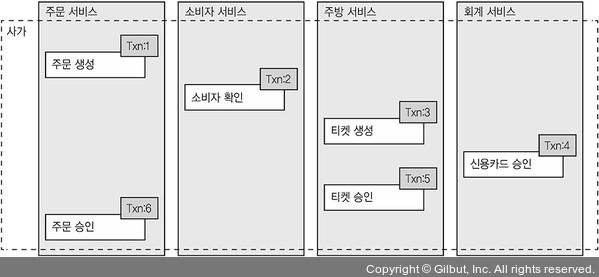
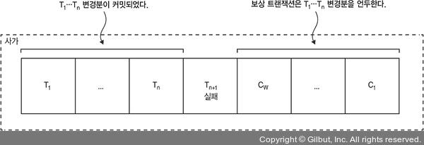

# 4.1.1 분산 트랜잭션의 필요성

기존의 Monolithic Architecture에서는 그냥 `@Transactional` 어노테이션을 붙이면 트랜잭션 처리가 가능했다.

하지만 데이터가 여러 서비스에 걸쳐져 있는 MSA에서는 평소와는 다르게 훨씬 복잡하다.

서비스별로 DB를 따로 가지기 때문에 일관성을 유지할 수 있는 다른 방법을 찾아야 한다.

# 4.1.2 분산 트랜잭션의 문제점

이전에는 분산 트랜잭션으로 서비스부터 DB, Message Broker에 걸쳐 데이터 일관성을 유지했다.

X/Open DTP`(Distributed Transaction Processing)`모델은 분산 트랜잭션 관리의 표준에 가까울만큼 많이 사용되었다.

XA는 2단계 커밋을 이용해서 **한 요청에 필요한 모든 트랜잭션들이 커밋되어야지만 트랜잭션이 커밋되고, 하나라도 실패하면 롤백을 보장**한다.

XA는 XA와 호환되는 기술끼리 Transaction의 ID가 전파되도록 하는 프로세스 사이의 메커니즘으로 동작한다.

 

하지만 이러한 분산 트랜잭션은 NoSQL이나 현대의 Message Broker에서 지원하지 않는다는 문제가 있다.

따라서 **분산 트랜잭션을 사용하게 되면 좋은 기술들을 사용하지 못할 수도 있다.**

또한 **동기 IPC 형태이기 때문에 가용성이 저하**된다는 단점이 있다.

요즘 Architecture들은 **일관성보다 가용성을 우선시**하기 때문에 이러한 단점들은 치명적이다.

 

이러한 단점들을 해결하기 위해 비동기적으로 데이터 일관성을 유지하는 메커니즘이 사가 패턴이다.

# 4.1.3 사가를 이용한 데이터 일관성 유지

 사가는 **MSA에서 분산 트랜잭션 없이 데이터 일관성을 유지하는 메커니즘**이다.

**비동기 메세징으로 구현한 일련의 로컬 트랜잭션**으로, 각 로컬 트랜잭션들은 **서비스별 데이터를 업데이트**한다.

 

요약하자면 시스템 작업은 Saga의 첫 단계를 시작한다.

하나의 로컬 트랜잭션이 끝나게 되면 다음 로컬 트랜잭션이 시작된다.

 

## 사가 - 주문 생성 예시

위 예제는 주문을 생성하는 사가이다.

다음과 같은 순서로 진행된다.

1. 주문 서비스는 주문 생성 요청에 의해 Saga가 시작된다.
2. 주문 서비스는 주문을 APPROVAL_PENDING 상태로 생성한다.
3. 소비자 서비스는 사용자가 주문이 가능한 소비자인지 확인한다.
4. 주방 서비스는 티켓을 CREATE_PENDING 상태로 생성한다.
5. 회계 서비스가 사용자의 신용카드를 승인한다.
6. 주방 서비스는 티켓의 상태를 AWAITING_ACCEPTANCE 상태로 변경한다.
7. 주문 서비스는 주문을 APPROVED 상태로 변경한다.

하나의 서비스는 자신의 일을 완수한 후에 다음 사가 단계를 실행시킨다.

**메세지를 통해 참여자들을 느슨하게 결합**시키고, **사가의 완료를 보장**한다.

> 다음 사가를 실행시킨다는 의미는 나중에 이어서 설명한다.

### 트랜잭션 롤백 방법

Saga에서는 로컬 트랜잭션과는 달리 자동으로 롤백해주지 않고 서비스별로 롤백시켜야 한다. 즉 N+1번째 트랜잭션에서 문제가 발생한다면 N개의 

예를 들어 만약 신용카드 승인 단계에서 문제가 발생하게 되면 이전 단계를 모두 롤백시켜야 한다.

 

트랜잭- 션1은 보상 트랜잭션1, 트랜잭션 2는 보상 트랜잭셔2와 같이 **하나의 커밋된 트랜잭션은 하나의 보상 트랜잭션과 매핑**된다.

Saga는 위와 같이 **커밋된 트랜잭션들을 역순으로 Undo**하면 된다.

 

주문 Saga 트랜잭션이 실패할 이유는 여러가지가 있을 수 있다. 예를 들면 다음과 같다.

- 소비자 정보가 옳지 않거나 주문할 수 없는 소비자
- 음식점 정보가 옳지 않거나 주문 접수가 불가능한 음식점
- 소비자 신용카드가 승인 거절

 

만약 로컬 트랜잭션이 실패하게 되면 다음과 같이 보상 트랜잭션이 동작하면 된다.

| 단계 | 서비스        | 트랜잭션                | 보상 트랜잭션  | 명칭                 |
| ---- | ------------- | ----------------------- | -------------- | -------------------- |
| 1    | 주문 서비스   | createOrder()           | rejectOrder()  | 보상 트랜잭션        |
| 2    | 소비자 서비스 | verifyConsumerDetails() | -              | 보상 트랜잭션        |
| 3    | 주방 서비스   | createTicket()          | rejectTicket() | 보상 트랜잭션        |
| 4    | 회계 서비스   | authorizeCreditCard()   | -              | 피폿 트랜잭션        |
| 5    | 주방 서비스   | approveTicket()         | -              | 재시도 가능 트랜잭션 |
| 6    | 주문 서비스   | approveOrder()          | -              | 재시도 가능 트랜잭션 |

- **1~3단계:** 실패할 가능성이 있는 트랜잭션에 있기 때문에 보상 트랜잭션 이라고 부른다.

- **4단계:** Saga에서 중간점 이라고도 하는 Pivot 트랜잭션이다.

  이후 트랜잭션들은 반드시 실행됨을 보장하게 된다.

  마지막 보상 트랜잭션이거나, 첫 재시도 가능 트랜잭션일 수 있다.

- **5~6단계:** Pivot 뒤에 오고, 성공할때까지 재시도를 해서 무조건 성공을 보장하기 때문에 재시도 가능 트랜잭션이라고 부른다.

여기서 중요한것은 **모든 트랜잭션에 대해 보상 트랜잭션이 존재해야 하는것은 아니라는 것**이다.