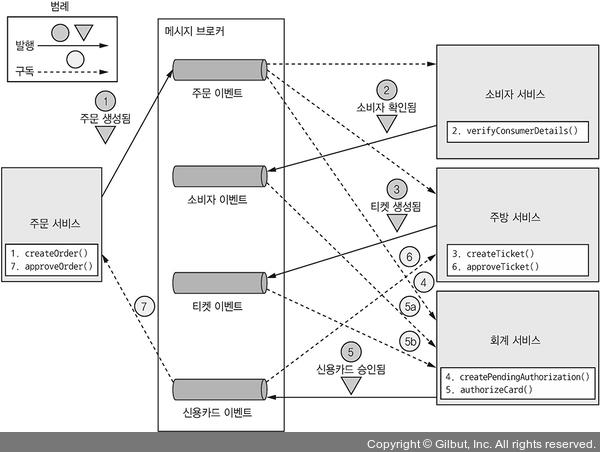
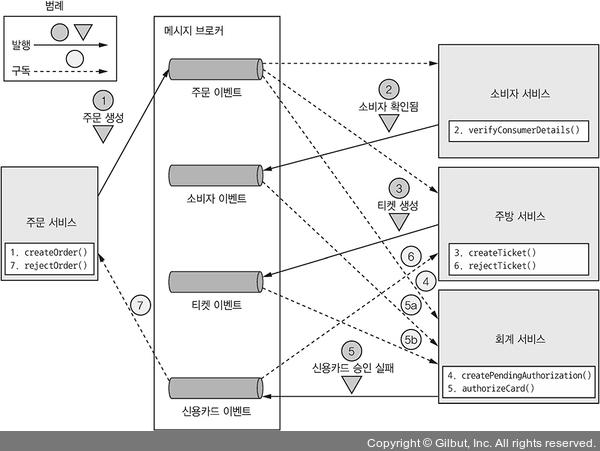
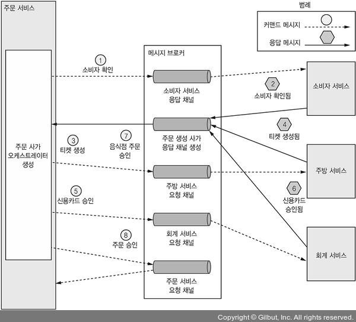
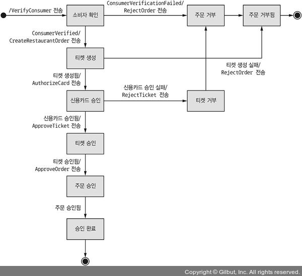

# 4.2.1 Choreography Saga

주로 이벤트 교환 방식으로 통신하며, **의사 순서의 결정을 참여자에게 위임**하는 사가의 일종이다.

이 방식은 Saga 참여자가 할 일을 알려주는 중앙 관리자가 따로 없고, **사가 참여자끼리 이벤트를 구독**해서 반응하는 방식이다.

## Choreography 방식으로 주문 Saga 구현

먼저 전체적인 흐름을 그림으로 보면 다음과 같다.

조금 복잡해보이지만, 다음과 같은 순서로 실행된다고 보면 된다.

1. **주문 서비스**
   1. 승인 대기중인 주문을 생성한다.
   2. 주문 이벤트에 주문이 생성되었다는 이벤트를 발행한다.
2. **소비자 서비스**
   1. 주문이 생성되었다는 이벤트를 수신한다.
   2. 해당 소비자가 주문을 생성할 수 있는지 검증한다.
   3. 만약 할 수 있다면 소비자 이벤트에 소비자 확인 이벤트를 발행한다.
3. **주방 서비스**
   1. 주문이 생성되었다는 이벤트를 수신한다.
   2. 주문 내역을 확인하고, 티켓을 보류중인 상태로 생성한다.
   3. 티켓 이벤트에 티켓이 생성되었다는 이벤트를 발행한다.
4. **회계 서비스**
   1. 주문이 생성되었다는 이벤트를 받는다.
   2. 신용카드 승인을 보류 상태로 생성한다.
5. **회계 서비스**
   1. 티켓 생성/소비자 확인 이벤트를 받는다.
   2. 소비자 신용카드에서 결제를 한다.
   3. 신용카드가 승인되었다는 이벤트를 발행한다.
6. **주방 서비스**
   1. 신용카드 승인 이벤트를 수신한다.
   2. 티켓의 상태를 승인 대기중 상태로 변경한다.
7. **주문 서비스**
   1. 신용카드 승인 이벤트를 수신한다.
   2. 주문 상태를 승인됨 상태로 변경한다.
   3. 주문 승인됨 이벤트를 발행한다.

 

만약 각 트랜잭션마다 실패 이벤트가 발행되게 되면 Saga는 **보상 트랜잭션을 실행**해야 한다.

예를 들어 `5. 회계 서비스`에서 소비자의 신용카드 승인이 거부될 경우 이벤트 순서는 다음과 같다.

> 당연히 `4. 회계 서비스`까지는 똑같다.

1. **주문 서비스**
   1. 승인 대기중인 주문을 생성한다.
   2. 주문 이벤트에 주문이 생성되었다는 이벤트를 발행한다.
2. **소비자 서비스**
   1. 주문이 생성되었다는 이벤트를 수신한다.
   2. 해당 소비자가 주문을 생성할 수 있는지 검증한다.
   3. 만약 할 수 있다면 소비자 이벤트에 소비자 확인 이벤트를 발행한다.
3. **주방 서비스**
   1. 주문이 생성되었다는 이벤트를 수신한다.
   2. 주문 내역을 확인하고, 티켓을 보류중인 상태로 생성한다.
   3. 티켓 이벤트에 티켓이 생성되었다는 이벤트를 발행한다.
4. **회계 서비스**
   1. 주문이 생성되었다는 이벤트를 받는다.
   2. 신용카드 승인을 보류 상태로 생성한다.
5. **회계 서비스**
   1. 티켓 생성/소비자 확인 이벤트를 받는다.
   2. 소비자 신용카드에서 결제를 한다.
   3. 신용카드가 거부되었다는 이벤트를 발행한다.
6. **주방 서비스**
   1. 신용카드 거부 이벤트를 수신한다.
   2. 티켓의 상태를 거절됨 상태로 변경한다.
7. **주문 서비스**
   1. 신용카드 거부 이벤트를 수신한다.
   2. 주문 상태를 거절됨 상태로 변경한다.

## 신뢰할 수 있는 이벤트 기반 통신

Choreography 방식의 Saga에서는 두가지 통신 이슈를 해결해야 한다.

1. **자신의 DB를 Update하고 같은 트랜잭션에서 메세지를 발행**해야 한다.

   즉 앞에서 설명했던 Transactional Messaging을 사용해야 한다.

   

2. **Saga 참여자들은 수신한 이벤트와 자신의 데이터 간의 연관 관계를 맺어야 한다.**

   즉 DB 외래키와 같이 주문과 소비자, 주문과 티켓 등 데이터간의 연관 관계를 가져야 한다.

   이를 해결하기 위해 이벤트를 발행할 때 ID값을 포함해서 이벤트를 발행한다.

   즉 만약 주문이 생성되었다는 이벤트를 발행할 때에는 주문 ID를 메세지에 담고, 주방 서비스에서는 이를 통해 티켓을 생성하게 된다.

## Choreography 방식의 장단점

### 장점

- **단순함:** 단순히 이벤트를 발행하기만 하면 된다.
- **낮은 결합도** 이벤트를 구독할 뿐 다른 서비스를 직접적으로 알 필요가 없다.

### 단점

- **높은 이해 난이도:** 여러 서비스에 구현 로직들이 흩어져있기 때문에 Saga가 전반적으로 어떤 흐름을 가지고 있는지 파악하기 힘들다.

- **서비스간의 순환 의존성 문제 가능성:** 참여자가 서로를 구독하기 때문에 순환 의존성이 발생할수도 있다.

  반드시 문제가 생기는건 아니지만, 잠재적 설계 취약점이 될 수 있다.

- **강결합의 위험성:** 장점으로 낮은 결합도를 가지고 있지만, 회계 서비스와 같은 경우에는 과금/환불을 하는 모든 이벤트를 구독해야 한다.

  따라서 이 서비스는 주문 서비스의 주문과 생명 주기가 맞몰릴 수도 있다.

위와 같은 문제점들 때문에 복잡한 사가에서는 주로 Orchestration 방식을 사용한다.

# 4.2.2 Saga Orchestration

Orchestration Saga에서는 **Saga 참여자가 할 일을 알려주는 Orchestrator Class를 정의**한다.

Orchestrator는 **Command요청/비동기 응답**을 사용해서 Saga 참여자와 통신한다.

 

간단하게 보면 다음과 같은 순서라고 할 수 있다.

1. Command 요청에 **무슨 일을 해야하는지**에 대한 정보를 담아 Orchestrator에게 보낸다.
2. **Saga 참여자는 작업을 마치고 Orchestrator에게 Response**를 보낸다.
3. **Orchestrator는 Response를 처리**한다.
4. Orchestrator는 **다음에 실행될 Saga참여자를 선택**한다.

## Orchestration 방식으로 주문 Saga 구현

먼저 전체적인 흐름을 그림으로 보면 다음과 같다.

이 또한 복잡해 보이는데, 다음 순서로 실행된다.

1. 주문 서비스가 주문 생성 Saga Orchestrator를 생성한다.
2. 주문 서비스가 승인 대기중인 상태의 Order를 생성한다.
3. Saga Orchestrator가 소비자 확인 커맨드를 소비자 서비스에게 전송한다.
4. 소비자 서비스는 소비자를 확인하고 생성 가능 여부를 반환한다.
5. 성공 메세지가 반환된다면 Saga Orchestrator는 티켓 생성 커맨드를 주방 서비스에 전송한다.
6. 주방 서비스는 티켓을 생성하고 티켓 생성에 성공했는지 여부를 반환한다.
7. 성공 메세지가 반환된다면 Saga Orchestrator는 신용카드 승인 커맨드를 회계 서비스에 전달한다.
8. 회계 서비스는 신용카드 승인 여부를 반환한다.
9. 만약 성공했다면 티켓 승인 커맨드를 주방 서비스에 전달한다.
10. 마찬가지로 `8.`이 성공했다면 주문 승인 커맨드를 주문 서비스에 전달한다.

마지막 단계에서 직접 주문을 수정하지 않고 굳이 주문 서비스에 요청을 보내는 것은 **일관성 차원에서 주문 서비스 또한 하나의 참여자로 취급**하기 위함이다.

 

위 예제는 단순히 성공하는 하나의 경우만 생각한 것이다.

소비자, 주방, 회계 서비스 중 한곳에서 문제가 발생할 가능성이 있기 때문에 모든 시나리오들을 기술하는 형태로 사가를 모델링하면 편하다.

## Saga Orchestrator를 State Machine으로 모델링 하기

State Machine이란 **유한개의 상태를 가질 수 있는 수학적 모델**로, **한번에 하나의 상태**만 가지게 되며, **상태는 일련의 이벤트로 인해 변경 가능**하다.

이러한 State Machine은 상태 전이와 전이마다의 액션으로 이루어져 있다.

 

Saga Orchestrator에서의 State Machine도 같은 의미를 지니는데, Saga Orchestrator는 하나의 상태를 지니며, Local Transaction의 결과에 따라서 결정하는 형태를 의미한다.

조금 더 자세히 말하자면, **Saga 참여자가 로컬 트랜잭션을 커밋할 때 상태의 전이가 발생**하고, 그 **상태에 따라 액션이 결정**되는 형태이다.

 

그림으로 보면 다음과 같다.

1. **소비자 확인 상태:** 초기의 상태로, 소비자 서비스가 주문 가능한 소비자인지 확인할때까지 이 상태를 유지한다.
2. **티켓 생성 상태:** 티켓 생성 커맨드에 대한 응답을 기다리는 상태
3. **신용카드 승인 상태:** 회계 서비스가 소비자 신용카드를 승인할때까지 기다리는 상태
4. **주문 승인 상태:** Saga가 성공적으로 완료된 상태
5. **주문 거부 상태:** 참여자 중 하나가 주문을 거부했음을 나타내는 상태

위와 같이 State Machine은 다양한 상태들의 전이도 정의한다.

예를 들어 주문 거부, 티켓 거부 등의 상태들이 주문 거부 상태로 전이되게 된다.

또한 어떻게 되든 **승인 완료 혹은 주문 거부 둘 중 하나의 상태로 귀결**된다.

## Saga Orchestration과 Transactional Messaging

Orchestration Saga는 **매 단계마다 DB를 수정하고, 메세지를 전송**한다.

따라서 각 서비스는 3장에서 소개했듯이 Transactional Messaging을 통해서 **원자적으로 메세지를 발행**해야 한다.

Saga Orchestrator에서의 Transactional Messaging은 4.4장에서 자세히 나온다.

## Saga Orchestrator의 장단점

### 장점

- **의존 관계의 단순화:** Orchestrator가 참여자를 호출하긴 하지만, 참여자가 Orchestrator를 호출할 일은 없기 때문에 순환 의존성이 발생하지 않는다.

  따라서 서비스 간의 의존 관계가 훨씬 단순화될 수 있다.

- **낮은 결합도:** 각 서비스들은 Orchestrator가 호출하는 API를 구현하기만 하면 되기 때문에 Saga 참여자가 발행하는 이벤트는 알 필요가 없다.

- **관심사를 분리하고 도메인과 비지니스 로직의 단순화:** Saga 편성 로직에 대한 책임을 Orchestrator에게 모두 위임하기 때문에 도메인 객체는 단순해지기 때문에 Order를 예로 들면 Order의 상태는 APPROVAL_PENDING에서 PENDING으로, 2개만 있으면 된다.

### 단점

- **Orchestrator에게 너무 많은 책임이 존재:** 비지니스 로직을 너무 많이 Orchestrator에게 넘겨주면 Orchestrator가 간단한 로직들을 담은 Service들에게 할 일을 시키는 형태가 될 수 있다.

물론 이러한 문제는 Orchestrator에게 너무 많은 책임을 줘서 그런 것 이기 때문에 Orchestrator에게 **Saga의 순서화에 대한 책임**만 주면 해결된다.