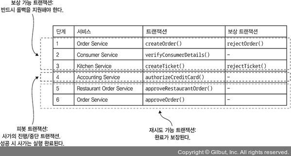

# 4.3.0 Saga에서의 격리성

ACID에서 Isolation이란 **동시에 실행된 트랜잭션에서 쿼리의 동일함을 보장하는 속성**이다.

이로 인해서 개발자는 동시에 실행되는 여러 트랜잭션들이 실행되는 상황 속에서 비지니스 로직을 비교적 쉽게 작성할 수 있다.

 

그런데 **Saga에서는 격리성 이라는 속성이 존재하지 않는다.**

따라서 Saga에서의 ACID는 다음과 같다.

- **Atomicity:** Saga는 트랜잭션을 모두 완수하거나, 모두 Undo한다.
- **Consistency:** 서비스 내의 참조 무결성 로컬 DB가, 여러 서비스에 걸친 참조 무결성은 서비스가 처리해 준다.
- **Isolation:** 존재하지 않음
- **Durability:** 로컬DB에 의존한다.

따라서 하나의 Saga가 실행중일 때 다른 Saga가 데이터를 바꿔치기 할수도 있고, 하나의 Saga에서 수정을 하기 전의 데이터를 다른 Saga가 읽을수도 있다.

따라서 일관성이 위협받을 수도 있다.

> 예를 들면 한 Saga에서 Order를 생성중일때, Order는 승인 대기중인 상태로 Order서비스의 LocalDB에 존재하게 된다.
>
> 이 때 다른 Saga가 Order 목록을 조회하게 되면 승인 대기중인 Order도 함께 보여지게 된다.
>
> 하지만 이때 Order 생성 Saga가 RollBack된다면 일관성이 위협받게 된다.

비격리는 절대 용납되지 않는 규칙이 아니다.

완전한 비격리를 구현하려 하면 성능이 많이 떨어지게 되서 어느정도 성능과 타협해서 격리 수준을 정하는게 일반적이다.

# 4.3.1 Arnomaly(이상) 개요

비격리로 인한 이상현상은 여러가지 종류가 있다.

## 소실된 업데이트

소실된 업데이트란 **한 Saga의 변경사항을 다른 Saga가 덮어쓸 때 발생**하는 상황이다.

다음과 같은 상황에서 발생한다.

1. 주문 생성 Saga에서 주문을 생성한다.
2. 주문 생성 Saga 실행 중 주문 취소 Saga가 실행된다.
3. 주문 취소 Saga에서 주문을 취소 상태로 변경한다.
4. 주문 생성 Saga 마지막에 주문을 승인 상태로 바꾼다.

결국 고객은 **주문을 취소했음에도 주문이 승인 상태로 변경**되는 문제가 생긴다.

## Dirty Read

Dirty Read는 **한 Saga가 수정중인 데이터를 다른 Saga가 읽을 때 발생**한다.

예를 들어 다음과 같은 3개의 서비스가 있다고 가정하자

- 통장 잔고를 늘리는 소비자 서비스
- 주문을 취소 상태로 변경하고, 돈을 다시 반환해 주는 주문 취소 서비스

만약 주문 취소 Saga와 주문 생성 Saga가 동시에 실행중 일 때, 만약 주문 취소에 실패하게 되었다.

그러면 다음과 같이 Saga들끼리 꼬여버릴 수도 있다.

1. 주문 취소 Saga가 동작하며 돈 액수를 늘린다.
2. 주문 Saga에서 주문을 하고, 돈 액수를 줄인다.
3. 주문 취소 Saga가 실패하며 돈 액수를 다시 줄이는 보상 트랜잭션이 동작한다.

큰 문제가 없어보일수도 있겠지만, 위 상황에서는 **소비자의 통장 잔고보다 더 비싼 물건을 주문할 수 있다.**

이러한 상황은 큰 문제를 야기할 수 있기 때문에 꼭 피해야 한다.

## Fuzzy/Unrepeatable Read

Fuzzy/Unrepeatable Read는 **하나의 Saga에서 같은 요청으로 조회를 했을 때 결과가 다른 이상 현상**을 의미한다.

A Saga가 Order 목록을 조회했는데 B Saga가 Order를 추가하게 되면 **A Saga가 다음번에 Order 목록을 조회하게 되면 다른 결과가 나오게 된다.**

# 4.3.2 비격리 대책

개발자는 **Saga에 Isolation이 없는것에 대한 대책**을 세워야 한다.

참고로 거창하지 않아도 우리가 앞서서 `_PENDING`과 같이 상태를 부여한 것 또한 Isolation을 가능하게 하는 방법 중 하나이다.

상태를 엔티티에 저장함으로써 다른 Saga에게 할 동작을 정의하는 것이다.

예를 들어, Order가 아직 생성중인데 다른 Saga에서 Order 목록을 조회하려 하면 상태가 `CREATED`인 Order만 조회해가면 된다.

이러한 방식을 **시멘틱 락 대첵**이라고 한다.

 

이 외에도 다음과 같은 종류들이 있다.

- **Semantic Lock`(시멘틱 락)`:** Application 수준에서 처리하는 Lock
- **Communicate Update`(교환적 수정)`:** 애초부터 설계할 때 수정의 순서와 관계 없도록 한다.
- **Pessimistic View`(비관적 시점)`:** Saga 순서를 바꿔서 엉키더라도 비지니스 로직이 받는 영향을 최소화 한다.
- **Reread Value`(값 다시 읽기)`:** 데이터를 덮어쓰기 직전에 변경사항은 없는지 확인하기 위해 값을 다시 DB에서 조회한다.
- **Version file`(버전 파일)`:** 순서를 재조정할 수 있게 수정을 기록한다.
- **by value:** 요청별 비지니스 위험성을 기준으로 동시성 메커니즘을 동적으로 선택해 준다.

## Saga의 구조

Saga는 다음 3가지 트랜잭션으로 구성된다.

- **보상 가능 트랜잭션:** 보상 트랜잭션으로 롤백시킬 수 있는 트랜잭션

- **피봇 트랜잭션:** Saga의 중단 지점으로, 이 트랜잭션이 커밋되면 Saga는 어떻게는 완료할때까지 실행된다.

  마지막 보상 가능 트랜잭션이거나, 첫번째 재시도 가능 트랜잭션 일수도 있다.

- **재시도 가능 트랜잭션:** 피봇 트랜잭션 이후의 트랜잭션들로, 반드시 성공함을 보장한다.

 

보상 가능 트랜잭션들은 **자신의 수정을 Undo하는 보상 트랜잭션을 갖는다.**

> 물론 Read Only 보상 가능 트랜잭션은 되돌릴게 없으므로 보상 트랜잭션이 없다.

그리고 피봇 트랜잭션인 `authorizeCreditCard()`이 성공하게 되면 이 Saga는 항상 끝까지 성공함을 보장한다.

## 비격리에 대한 대책

### Semantic Lock

보상 가능 트랜잭션이 생성 혹은 수정하는 테이블에 무조건적으로 상태를 설정하는 방법이다.

> 쉽게 말하면 **롤백될 수도 있는 트랜잭션**에 APPROVED와 같은 상태를 주는 것이다.

이러한 방식을 사용하게 되면 Saga에서 변경 중일때 다른 Saga가 해당 데이터를 조회하게 되면 상태를 기준으로 아예 조회를 막거나, 조회 후 해당 정보를 처리할 때 조심하도록 해줄 수 있다.

이러한 상태 값은 **보상 트랜잭션 혹은 보상 트랜잭션이 실행되면서 해제**된다.

 

Order 테이블의 state 컬럼을 예로 들 수 있다.

처음에는 `APPROVAL_WAITING` 상태로 Order를 만들고, 성공했다면 `APPROVED` 상태로 변경한다.

만약 실패해서 보상 트랜잭션이 동작하게 되면 `REJECTED` 상태로 변경하게 된다.

 

Semantic Lock을 사용했다면 잠금된 Record에 대한 처리도 고민해야 한다.

만약 상태가 `APPROVAL_WAITING`인 Order를 다른 Saga에서 지우려고 한다면, 다음과 같은 방법들로 해결할 수 있다.

- **재시도 요구:** Client에게 나중에 다시 요청을 보내도록 한다. 이렇게 하면 서버의 구현은 간단하지만 Client의 로직이 복잡해진다.

- **Blocking:** Order가 APPROVED 상태가 될때까지 요청을 한 Client를 Blocking 시킬 수 있다.

  Application에서 Lock을 부담해야 하기 때문에 부담스러울수도 있지만, ACID의 본질을 살릴 수 있다.

### Communicate Update

**수정 순서에 관련 없이 Update가 실행 가능하게 설계**하면 된다.

예를 들어 다른 사람에게 돈을 보낼 때, 한 사람에게서 돈을 빼는걸 먼저 하든 다른 한 사람에게 돈을 추가하든 상관이 없다.

### Pessimistic View

비관적 관점은 **Dirty Read로 인한 비지니스 로직의 피해를 최소화**하기 위해 **Saga의 순서를 변경**하는 방법이다.

아까 전에 Dirty Read를 소개할 때의 상황에서는 다음과 같은 순서로 동작했다.

1. 주문 취소 Saga가 동작하며 돈 액수를 늘린다.
2. 주문 Saga에서 주문을 하고, 돈 액수를 줄인다.
3. 주문 취소 Saga가 실패하며 돈 액수를 다시 줄이는 보상 트랜잭션이 동작한다.

그런데 여기서 주문 취소 Saga의 순서를 다음과 같이 순서를 변경하면 Dirty Read가 발생하지 않을 수 있다.

1. 주문을 취소 상태로 변경한다.
2. 배달 서비스가 배달을 취소한다.
3. 신용 카드의 잔액을 늘린다.

이렇게 하면 신용 카드의 잔고를  재시도 가능 트랜잭션에서 실행하기 때문에 **Dirty Read를 예방**할 수 있다.

### Reread Value

값을 다시 읽는 전략은 **다른 Saga에서 수정한 사항을 소실하지 않도록 다시 조회**하는 방법이다.

값을 다시 읽었는데 만약 먼저 읽었던 값과 다르다면 **Saga를 중지하고 나중에 다시 시도**한다.

일종의 낙관적 오프라인 락 이라고도 할 수 있다.

> 낙관적 오프라인 락 이란
>
> 
>
> 하나의 트랜잭션에서 수정하는 데이터가 다른 트랜잭션에서도 수정되지 않도록 하는 방법이다.

### Version File

버전 파일은 **Record에 대한 수정을 기록**하는 방식이다.

NonCommunicative한 작업을 Communicative 한 작업으로 변경하는 것이다.

 

예를 들어 주문 추가 Saga와 주문 취소 Saga가 동시에 실행된다고 가정하자.

만약 주문을 추가하고 있는 도중에 주문 취소 Saga가 주문을 취소해버리면 우리가 기대하지 않았던 상황이 발생할 수도 있다.

따라서 요청이 도착했을 때, 기록해두었다가 정확한 순서로 실행하면 된다.

위 예제대로라면 주문 취소 요청이 오면 기록해 두었다가, 해당 주문을 추가하는 요청이 왔을 때 **주문 추가 Saga를 실행하지 않아도 된다는걸 인지할 수 있다.**

### By value

비지니스 위험성을 기준으로 동시성 메커니즘을 선택하는 방법이다.

각 요청의 속성을 보고 **분산 트랜잭션과 Saga를 쓸지 선택**한다.

 

실제 서비스에서는 위에서 소개한 방법들을 상황에 따라 적절히 사용할 것이다.

