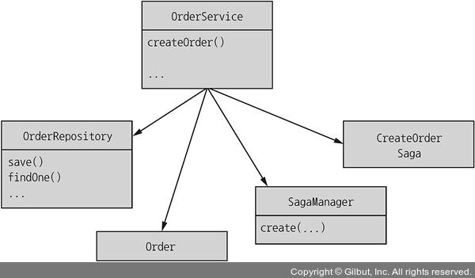
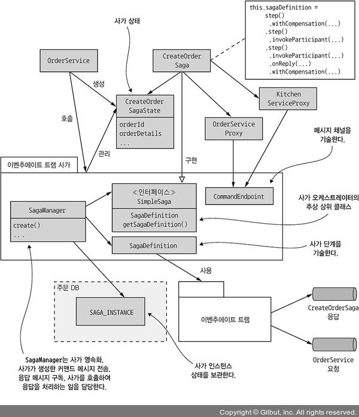
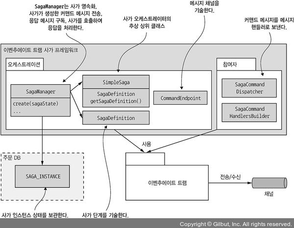
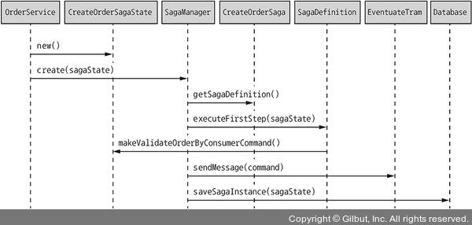
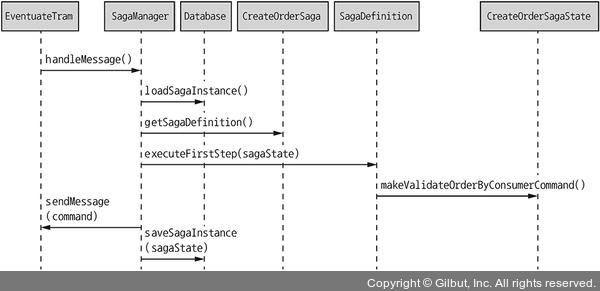

# 4.4.0 전체 구조 소개

이제 앞서 배웠던 Saga 패턴을 Order 생성 서비스에 적용해 보자.


위 그림은 다음과 같은 클래스들로 이루어진다.

- **OrderService나 OrderEntity와 같은 일반적인 클래스**

- **Order Saga를 담당하는 여러 Saga 클래스**

  Saga Orchestrator인 OrderService는 여러가지 Saga들을 가질 수 있다

- **OrderService를 호출해서 command message들을 관리하는 OrderCommandHandlers Adapter 클래스**

  OrderService 또한 Saga의 참여자 중 하나이기 때문에 Saga에서 OrderService에게 보낸 Command 메세지를 관리하는 클래스가 필요하다.

## 4.4.1 OrderService 클래스

OrderService는 주문의 생성과 관리를 담당하는 도메인 서비스이다.

다음과 같은 관계를 가지게 된다.



1. OrderRepository를 호출해서 Order를 저장/수정한다.

2. SagaManager로 CreateOrderSaga와 같은 Saga들을 생성한다.

   > 여기서 SagaManager는 Eventuate Tram Saga Framework에서 기본으로 제공되는 클래스로, Saga Orchestrator나 Saga Participant를 정의할 때 사용된다.

<br>

우선 OrderService의 `createOrder()` 메소드에 집중하자

```java
@RequiredArgsConstructor
@Transactional
public class OrderService {

	private final SagaManager<CreateOrderSagaState> createOrderSagaManager;

	private final OrderRepository orderRepository;

	private final DomainEventPublisher eventPublisher;

	public Order createOrder(OrderDetails orderDetails) {
    	ResultWithEvents<Order> orderAndEvents = Order.createOrder(…);
    	Order order = orderAndEvents.result;
	    OrderRepository.save(order);
        
        eventPublisher.publish(Order.class, Long.toString(order.getId()), orderAndEvents.events);
        CreateOrderSagaState state = new CreateOrderSagaState(order.getId(), orderDetails);
        CreateOrderSagaManager.create(state, Order.class, order.getId());
        return order;
    }
}
```

1. Order에 대한 정보가 담긴 OrderDetails를 파라미터로 받는다.
2. Order를 생성한다.
3. OrderRepository로 Order를 저장한다.
4. 새로 저장된 Order의 Id와 orderDetails에 대한 정보가 담긴 CreateOrderSagaState를 생성한다.
5. `CreateOrderSagaManager.create()`를 호출해서 Saga 인스턴스를 생성한다.
6. 첫 번째 Saga 참여자에게 Command 메세지가 전달된다.
7. Saga Orchestrator를 DB에 저장한다.

<br>

CreateOrderSaga의 전체적인 구조는 다음과 같다.



# 4.4.2 주문 생성 사가

주문 생성 사가는 다음 역할들을 수행한다.

- **CreateOrderSagaState:** Saga의 StateMachine을 정의한 클래스로, 싱글톤으로 사용한다.

  Saga의 저장 상태를 가지고 있고, Command 메세지를 생성할 때 사용된다.

- **CreateOrderSaga:** CreateOrderSagaState를 이용해서 실제 Command 메세지를 생성하고, Saga 참여자 Proxy 클래스의 메세지 채널을 이용해 메세지를 전달한다.

- **Saga 참여자 Proxy 클래스:** Command 채널, 메세지 타입, 반환 형으로 구성된 Saga 참여자의 Messaging API를 정의한다.

이러한 클래스들을 작성하기 쉽게 하기 위해서 Eventuate Tram Saga 프레임워크를 사용한다.

해당 프레임워크는 DSL을 지원하며, Saga의 State Machine을 실행, Saga를 저장, Saga 참여자간의 메세지 전달을 간편하게 하도록 도와준다.

## CreateOrderOrchestrator

``` java
public class CreateOrderSaga implements SimpleSaga<CreateOrderSagaState> {
    
	private final SagaDefinition<CreateOrderSagaState> sagaDefinition;
    
	public CreateOrderSaga(OrderServiceProxy orderService, ConsumerServiceProxy consumerService,
                           KitchenServiceProxy kitchenService,
                           AccountingServiceProxy accountingService) {
        this.sagaDefinition =
            step()
            .withCompensation(orderService.reject,
                              CreateOrderSagaState::makeRejectOrderCommand)
            
            .step()
            .invokeParticipant(consumerService.validateOrder,
                               CreateOrderSagaState::makeValidateOrderByConsumerCommand)
            
            .step()
            .invokeParticipant(kitchenService.create,
                               CreateOrderSagaState::makeCreateTicketCommand)
            .onReply(CreateTicketReply.class,
                     CreateOrderSagaState::handleCreateTicketReply)
            .withCompensation(kitchenService.cancel,
                              CreateOrderSagaState::makeCancelCreateTicketCommand)
            
            .step()
            .invokeParticipant(accountingService.authorize, CreateOrderSagaState::makeAuthorizeCommand)
            
            .step()
            
            .invokeParticipant(kitchenService.confirmCreate,
                               CreateOrderSagaState::makeConfirmCreateTicketCommand)
            
            .step()
            
            .invokeParticipant(orderService.approve,
                               CreateOrderSagaState::makeApproveOrderCommand)
            .build();
    }
    
	@Override
	public SagaDefinition<CreateOrderSagaState> getSagaDefinition() {
		return sagaDefinition;
	}
    
}
```

위 코드는 SagaDeginition을 설정해 주는 코드이다.

처음 보는 `step()`이나 `invokeParticipant()`와 같은 메소드들은 프레임워크에서 제공하는 DSL이니, 당장 정확한 역할을 이해하지 않고 흐름만 이해해도 된다.

대충 설명하자면 다음과 같다.

- `invokeParticipant()`: Saga 참여자를 실행시킴. 첫번째 파라미터로는 메세지 채널, 두 번째 파라미터로는 Command 메세지를 받는다.

  해당 커맨드 메세지를 해당 메세지 채널에 발행하는 역할을 한다.

- `onReply()`: 성공 응답을 반환했을 때 실행할 메소드로, 여기서는 반환 값으로 온 OrderId를 SagaState에 저장시켰다.

- `withCompensation()`: 보상 트랜잭션

## CreateOrderSagaState

CreateOrder의 SagaState 클래스는 주로 **Saga의 상태를 저장하고 Saga 참여자에게 보낼 메세지를 생성**한다.

Eventuate Tram Saga Framework는 자동으로 이 인스턴스를 DB에 저장해 준다.

``` java
@NoArgsConstructor
public class CreateOrderSagaState {

    @Getter
	private Long orderId;
    private OrderDetails orderDetails;
    private long ticketId;

	public CreateOrderSagaState(Long orderId, OrderDetails orderDetails) {
	    this.orderId = orderId;
    	this.orderDetails = orderDetails;
	}

	public CreateTicket makeCreateTicketCommand() {
    	return new CreateTicket(getOrderDetails().getRestaurantId(),
                                getOrderId(), makeTicketDetails(getOrderDetails()));
	}

	public void handleCreateTicketReply(CreateTicketReply reply) {
	    logger.debug("getTicketId {}", reply.getTicketId());
		setTicketId(reply.getTicketId());
	}

	public CancelCreateTicket makeCancelCreateTicketCommand() {
		return new CancelCreateTicket(getOrderId());
	}
}
```

## KitchenProxyService

대표적인 Saga 참여자의 Proxy 클래스이다.

다음 3가지 API를 정의한다.

- **create:** 티켓 생성
- **confirmCreate:** 생성 확인
- **cancel:** 티켓 취소

``` java
public class KitchenServiceProxy {


	public final CommandEndpoint<CreateTicket> create =
        CommandEndpointBuilder
        .forCommand(CreateTicket.class)
        .withChannel(KitchenServiceChannels.kitchenServiceChannel)
        .withReply(CreateTicketReply.class)
        .build();


	public final CommandEndpoint<ConfirmCreateTicket> confirmCreate =
        CommandEndpointBuilder
        .forCommand(ConfirmCreateTicket.class)
        .withChannel(KitchenServiceChannels.kitchenServiceChannel)
        .withReply(Success.class)
        .build();


	public final CommandEndpoint<CancelCreateTicket> cancel =
        CommandEndpointBuilder
        .forCommand(CancelCreateTicket.class)
        .withChannel(KitchenServiceChannels.kitchenServiceChannel)
        .withReply(Success.class)
        .build();
}
```

이러한 Proxy 클래스는 필수가 아니다.

Saga에서 직접 메세지를 전달할수도 있지만, 두가지 이점이 있다.

1. Proxy 클래스는 타입이 정해진 Endpoint를 사용하기 때문에 Service에서 엉뚱한 메세지를 발행하는걸 막아준다.
2. 코드 이해나 테스트가 쉽다.

## Eventuate Tram Saga Framework

Eventuate Tram Saga Framework는 다음과 같은 구조를 가지고 있다.



Sagas나 Orchestrator쪽이 이 프레임워크에서 가장 복잡한 부분이다.

SagaManager는 Saga를 저장, 생성한 Command 메세지를 전송, 응답 메세지를 구독, Saga를 호출해서 응답해준다.

<br>

OrderService에서 해당 프레임워크를 통해 Saga를 생성하는 순서는 다음과 같다.



1. OrderService가 CreateOrderSagaState를 생성한다.
2. OrderService가 SagaManager를 호출해서 Saga 인스턴스를 생성한다.
3. SagaManager는 SagaDefinition에서 정의한 첫 번째 단계를 실행한다.
4. CreateOrderSagaState를 호출해서 Command 메세지를 생성한다.
5. SagaManager는 커맨드 메시지를 사가 참여자에게 보냅니다.
6. SagaManager는 사가 인스턴스를 DB에 저장합니다.

<br>

반대로 SagaManager가 소비자 서비스의 이벤트를 수신할 때 순서는 다음과 같다.



1. 소비자 서비스의 응답을 Eventuate Tram이 받아서 SagaManager에게 전달한다.
2. SagaManager는 DB에서 Saga 인스턴스를 찾는다.
3. 다음 단계의 Saga Definition step을 실행한다.
4. CreateOrderSagaState를 호출해서 커맨드 메세지를 생성한다.
5. SagaManager가 커맨드 메세지를 다른 Saga 참여자에게 전달한다.
6. 수정된 Saga 인스턴스를 DB에 저장한다.

<br>

만약 Saga 참여자 중 문제가 발생하게 되면 보상 트랜잭션을 역순으로 실행해 준다.

