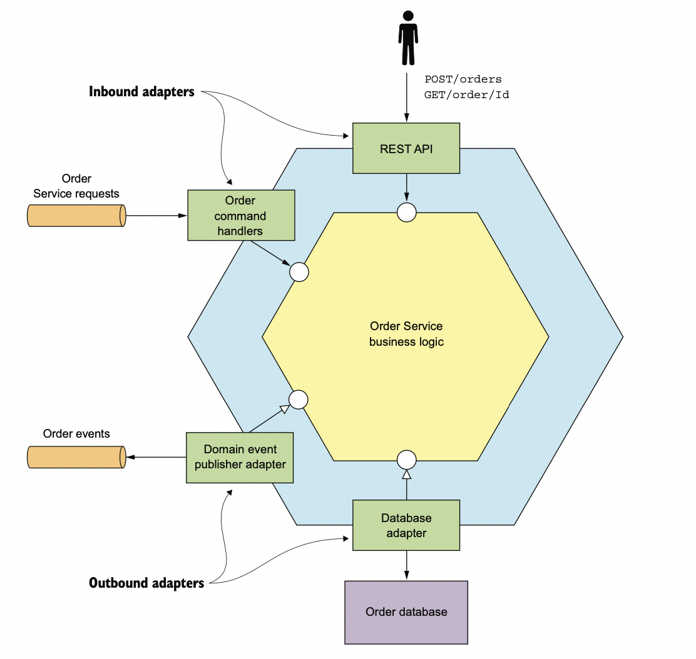
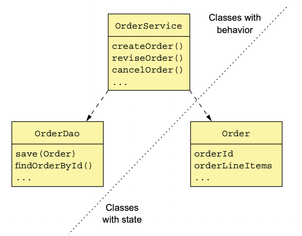

# 5.1.0 소개

Order Service는 중심에 실질적인 비지니스 로직을 갖고, Inboud/Outbound 어댑터가 주변을 감싼 **육각형 아키텍쳐**구조를 가진다.

- **Inbound Adapter:** Client의 요청을 받아 비지니스 로직을 실행한다.
- **Outbound Adapter:** 외부 API의 호출을 담당하며, 비지니스 로직에서 호출하게 된다.

 

주문 서비스에서는 다음과 같은 어댑터들이 있다.

- **RestAPI Adapter:** Rest 요청을 받아 비지니스 로직을 호출하는 Inbound Adapter
- **OrderCommandHandler:** Command 메세지를 받아 비지니스 로직을 호출하는 Inbound Adapter
- **DB Adapter:** 비지니스 로직이 DB 접근을 위해 호출하는 Outbound Adapter
- **Domain Event Publisher Adapter:** 이벤트를 메세지 브로커에 발행하는 Outbound Adapter

# 5.1.1 Transaction Script Pattern

객체 지향적인 접근 또한 설계에 좋지만, 간단한 비지니스 로직에서는 오히려 복잡하게 느껴질수도 있다.

이럴 때에는 객체 지향 설계 대신 Transaction Script Pattern을 사용하는 편이 더 좋다.

이 방법은 **동작과 상태가 분리**되어 있다는 특징이 있다.

위 그림과 같이 행동이 정의된 OrderService나 OrderDao, 그리고 행동 없이 상태만 정의된 Order가 있다.

# 5.1.2 Domain Model Pattern

Transaction Scropt Pattern으로 절차적인 개발 또한 도움이 될수도 있다.

하지만 복잡한 비지니스 로직에서는 유지보수가 어려워진다는 단점이 있다.

따라서 비지니스 로직이 조금이라도 복잡해질 우려가 있다면, 객체 지향적으로 설계해서 유지 보수성을 높이는게 좋다.

 

객체 지향적으로 설계 로직은 절차 지향적인 로직보다 작은 클래스들이 얽히고 얽힌 형태를 가지게 된다.

클래스는 **문제 영역에 대응**된다.

따라서 문제 영역에 대응되기만 하면 상태/동작 둘 중 어느 하나를 꺼려하지 않고 가질 수 있다.

위와 같이 Domain Model Pattern을 사용하게 되면 **Service가 비지니스 로직이 포함된 도메인 객체를 호출**하기 때문에 **Service의 코드가 간결**해 진다.

또한 Order 클래스의 상태 값은 **메소드를 통해서만 접근 가능**하다.

 

이러한 설계는 다음과 같은 장점들이 있다.

- **설계나 유지보수가 쉽다:** 작은 여러가지 클래스들로 구성되어 있고, 현실 세계의 문제 상황에 대응되기 때문에 클래스의 이름만으로도 쉽게 이해할 수 있다.
- **테스트가 간편하다:** 각 클래스는 개별적으로 테스트가 가능하다.
- **확장이 간편하다:** 객체 지향 설계에서는 이미 수많은 설계 패턴들이 알려져있기 때문에 확장에 있어서 훨씬 능동적이다.

# 5.1.3 Domain Driven Design

복잡한 비지니스 로직의 개발을 위해 객체 지향 프로그래밍을 개선한 접근 방식이다.

DDD 방식으로 설계하면 **각 서비스는 자체적인 도메인 모델**을 가지며, **application-wide domain model 문제를 해결**할 수 있다.

 

일반적으로 DDD에서는 다음과 같은 Block들로 설계한다.

- **Entity:** JPA에서 `@Entity`를 붙인 클래스들로, 식별자를 가진다.
- **Value Object:** 여러 값들을 모아둔 객체이다.
- **Factory:** 일반 생성자로 사용하기에는 복잡한 객체들을 쉽게 생성하기 위한 메소드/객체로, 정적 메소드로 구현할 수 있다.
- **Repository:** DB 접근 로직을 캡슐화한 객체
- **Service:** 비지니스 로직을 구현한 객체

여기에 사람들이 잘 사용하지 않는 Aggregate라는 Block도 있는데, MSA에서 매우 유용한 패턴이다.

자세한 내용은 5.2장에서 다룬다.