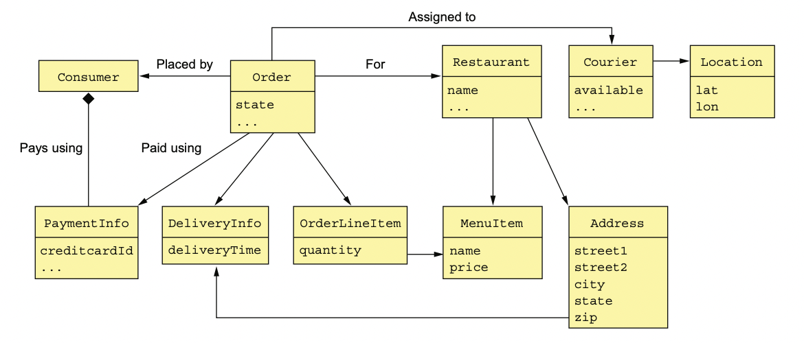

# 5.2.0 기존의 비지니스 모델

다음은 한 Application의 Domain Model 중 하나이다.

서로 연관된 클래스들끼리 그물망처럼 얽힌 전형적인 도메인 모델이다.

Customer, Order, Restaurant 등 각 비지니스 객체에 대응되는 클래스가 존재한다.

하지만 **비지니스 객체들의 경계가 불분명**하다.

예를 들어 Order이라는 비지니스 객체는 어느 클래스에 대응되는 비지니스 객체인지 알기 쉽지 않다.

이러한 불분명한 비지니스 객체는 MSA에서 문제가 생길 가능성이 높기 때문에 조심해야 한다.

# 5.2.1 불분명한 경계 문제

Order 객체가 어떤 작업을 한다고 가정했을 때, 범위가 불분명하다 라는 문제가 있다.

범위가 불분명하다면 여러가지 비지니스 규칙을 지키기 힘들어지게 된다.

예를 들어, *money가 10000을 넘길 수 없다*라는 규칙이 있는 상황에서 한 사용자의 money를 늘리는 요청이 동시에 들어왔다고 가정하자.

이렇게 된다면 money가 10000을 넘기게 되는 상황이 일어날수도 있다.

DDD Aggregate를 사용하면 이 문제를 해결할 수 있다.

