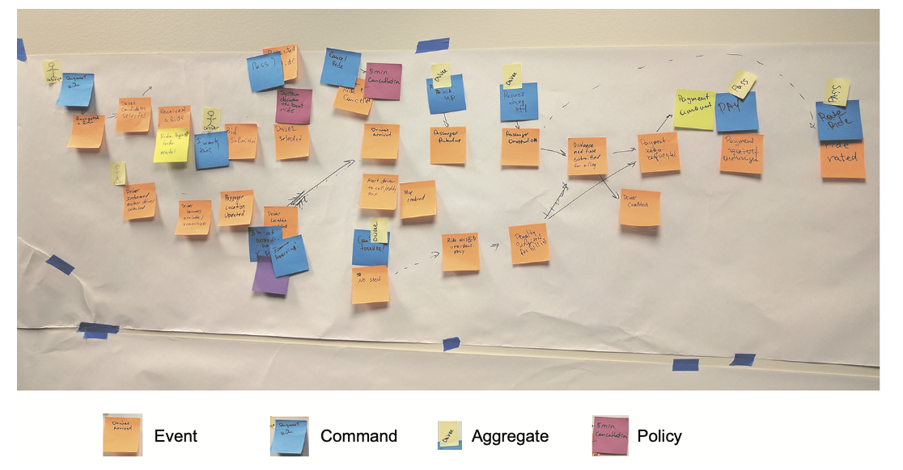

# 5.3.1 변경 이벤트를 발행하는 이유

다른 서비스나 Component들이 Domain 객체의 변화를 인지할 필요가 있는 경우가 있기 때문에 사용해야 한다.

다음과 같은 상황에서 사용될 수 있다.

- **Choreography 기반의 Saga를 사용할 때**
- **Replica를 둔 서비스를 이용할 때**
- **Message Broker나 WebHook을 통해 다음 비지니스 로직을 수행할 때**
- **WebSocket 메세지를 전달할 때**
- **Text DB(Elastic Search 등)를 수정할 때**
- **사용자에게 도메인 이벤트의 변경을 알릴 때**
- **Application이 제대로 동작하는지 분석할 때**
- **사용자의 행동을 모니터링 할 때**

또한 Aggregate의 상태 변화를 관리하는 역할도 한다.

# 5.3.2 도메인 이벤트란

**Domain Event란 과거형 동사 클래스`(OrderCreated, OrderDeleted 등)`**로, OrderId와 같은 **Property**들이 있다.

Domain Event는 주로 EventID, Timestamp, PK값과 같은 Metadata를 포함시켜 준다.

<br>

MetaData는 다음과 같은 방식들로 구성될 수 있다.

- Domain Event 클래스의 객체 필드
- 부모 클래스에 정의된 Event 객체의 일부
- Domain Event를 Wrapping하는 클래스

<br>

OrderCreatedEvent 라는 Event가 있다고 가정하면 다음과 같은 클래스가 나온다.

``` java
interface DomainEvent {}		// 자신을 구현할 클래스 Domain Event	라는것을 알리기 위한 Marker Interface

interface OrderDomainEvent extends DomainEvent {}		// Order의 Event라는 것을 알리기 위한 Marker Interface

class OrderCreated implements OrderDomainEvent {}

class DomainEventEnvelope<T extends DomainEvent> {
	private String aggregateType;		// Event의 Metadata
	private Object aggregateId;
	private T event;
	...
}
```

DomainEventEnvelope는 **Event를 감싸는 Wrapper 클래스**로, **Metadata와 Event 객체**를 담고있다.

# 5.3.3 Event Enrichment

주문 Event를 처리하는 Consumer가 있을 때, 발생한 일 들은 OrderCreated라는 이벤트 클래스에 모두 저장된다.

하지만 Consumer는 OrderCreated에 대한 이벤트를 처리하기 위해서 OrderDetail이 필요할수도 있다.

그러기 위해서는 Order Aggregate에 OrderDetail에 대한 정보를 요청해야 하는데, 오버헤드가 크다는 단점이 있다.

<br>

이러한 문제점을 개선하기 위해서 Order 이벤트에 Consumer가 필요한 정보들을 추가로 담는 방식이 Event Enrichment이다.

다른 서비스에 정보를 요청할 필요가 없기 때문에 Consumer가 간단해지게 된다.

``` java
class OrderCreated implements OrderEvent {
	private List<OrderLineItem> lineItems;
	private DeliveryInformation deliveryInformation;
	private PaymentInformation paymentInformation;
	private long restaurantId;
	private String restaurantName;
	...
}
```

하지만 **Consumer의 요구가 변하게 되면 메세지도 변해야 한다**는 단점이 있다.

또한 **모든 Consumer들을 고려해서 메세지를 설계**해야하기 때문에 유지보수성도 나빠지게 된다.

하나의 Consumer만 생각하다보면, 다른 Consumer들에서 문제가 발생할 수 있다.

> 다행히도 웬만하면 Event에 필요한 Property가 명확해서 문제가 발생할 일이 적다.

# 5.3.4 Domain Event Identify

도메인 이벤트는 여러 가지 방법으로 식별할 수 있다.

요건 정의서는 보통 `X를 수행한 후에 Y를 수행해라`라는 식으로 기술하게 된다.

예를 들어, `Order가 추가되면 소비자에게 알림을 보내라`라는 요건이 있을 수 있다.

<br>

요즘은 관계자들이 모여 **복잡한 도메인의 설계를 브레인 스토밍**하는 **Event Storming** 이라는 방식을 주로 사용한다.

각 도메인들의 관계자들이 모여 큰 화이트 보드같은 곳에 포스트잇을 붙이며 모델링을 하는 방법이다.

다음 순서로 진행된다.

1. **Event BrainStorming:** 도메인의 이벤트들을 쥐어짜내어 포스트잇으로 대략적인 타임라인에 배치해 준다.
2. **Event Trigger 표시:** 각각의 이벤트를 발생시키는 Trigger를 식별한다. 예를 들면 다음과 같다.
   - 사용자 액션은 파란색으로 어떤 커맨드를 전송하는지 표시한다.
   - 외부 시스템은 보라색으로 표시한다.
   - 기타 도메인 이벤트
   - 시간 경과
3. **Aggregate 표시:** 각 COMMAND를 소비한 후 다음 이벤트를 발생시키는 Aggregate를 표시한다.



# 5.3.5 Generate and Publish Domain Events

## Domain Event 생성

개념적으로 Domain Event는 Aggregate가 발행한다.

Aggregate는 자신의 상태가 언제 변하는지, 어떤 이벤트를 발행할지 알고있다.

Aggregate가 직접 메세징 API를 호출해도 되지만, 인프라와 비지니스 로직이 엉킬수도 있기 때문에 조심해야 한다.

<br>

따라서 **Aggregate와 Aggregate를 호출하는 서비스의 책임을 분리**하는게 좋다.

서비스는 Messaging API를 DI받아 사용하기만 하면 되기 때문에 서비스 로직에서 Messaging 로직이 단순화 된다.

<br>

Aggregate의 상태가 변할 때 이벤트를 생성하고, 이벤트를 두 가지 방법으로 서비스에 반환할 수 있다.

### Aggregate 메소드 반환값에 Event를 넣는 방법

``` java
@Entity															// Aggregate Root 엔티티
public class Ticket {
   public List<DomainEvent> accept(LocalDateTIme readyBy) {
		this.acceptTime = LocalDateTime.now();					// Ticket 수정
	    this.readyBy = readyBy;
	    return singletonList(new TicketAcceptedEvent(readyBy));	// 이벤트 반환
	}
}
```

위와 같이 Ticket Aggregate의 `accept()` 메소드가 발행한 도메인 이벤트를 반환해 준다.

Service는 Aggregate Root의 메소드를 수정하고 Event를 반환한다.

``` java
public class KitchenService {
    @Autowired
    private TicketRepository ticketRepository;
    @Autowired
    private DomainEventPublisher domainEventPublisher;

    public void accept(long ticketId, ZonedDateTime readyBy) {
        Ticket ticket =
            ticketRepository.findById(ticketId)
            .orElseThrow(() -> TicketNotFoundException.EXCEPTION);
        
        List<DomainEvent> events = ticket.accept(readyBy);				// Domain Root 변경 후 이벤트를 반환
        domainEventPublisher.publish(Ticket.class, orderId, events);	// 받아온 이벤트를 발행
    }
}
```

매우 단순하게 도메인 이벤트의 생성 책임을 분리할 수 있다.

Aggregate Root가 조금 더 복잡해진다는 단점이 있다.

<br>

혹은 Aggregate Root의 private field에 Event를 저장해 두는 방법도 괜찮다.

public class Ticket extends AbstractAggregateRoot {

```java
public void accept(ZonedDateTime readyBy) {
    ...
    this.acceptTime = ZonedDateTime.now();
    this.readyBy = readyBy;
    registerDomainEvent(new TicketAcceptedEvent(readyBy));
    // Aggregate Root가 상속받은 Abstract Aggregate Root에 정의되어 있는 registerDomainEvent를 호출한다.
}
```

서비스에서는 단지 `AggregateRoot.getDomainEvents()`를 호출해주면 된다.

하지만 이미 다른 클래스를 상속받고 있다면, 코드가 중복될수도 있다.

## 도메인 이벤트 발행 보장

3장에서 배운 도메인 이벤트를 안전하게 발행하는 방법과 다를게 없다.

서비스는 이벤트 발행을 보장하기 위해 Transactional Messaging을 사용해야 한다.

<br>

Eventuate Tram에서는 이벤트를 OUTBOX 테이블에 저장하고, Transaction이 커밋될 때 OUTBOX 테이블의 이벤트들을 발행한다.

다음과 같이 publish 메소드가 정의된 인터페이스를 제공한다.

```java
public interface DomainEventPublisher {
	void publish(String aggregateType, Object aggregateId, List<DomainEvent> domainEvents);
}
```

위 메소드는 Framework에 탑재된 MessageProducer를 통해 트랜잭션을 걸어 이벤트를 발행해 준다.

DomainEventPublisher를 서비스에서 직접 호출해도 되지만, 유효하지 않은 이벤트를 발행할수도 있다.

따라서 다음과 같이 AbstractAggregateDomainEventPublisher를 구현하는편이 낫다.

``` java
public abstract class AbstractAggregateDomainEventPublisher<A, E extends DomainEvent> {
    private Function<A, Object> idSupplier;
    private DomainEventPublisher eventPublisher;
    private Class<A> aggregateType;
    protected AbstractAggregateDomainEventPublisher(
        DomainEventPublisher eventPublisher,
        Class<A> aggregateType,
        Function<A, Object> idSupplier) {
        
        this.eventPublisher = eventPublisher;
        this.aggregateType = aggregateType;
        this.idSupplier = idSupplier;
    }
    public void publish(A aggregate, List<E> events) {
        eventPublisher.publish(aggregateType, idSupplier.apply(aggregate),
                               (List<DomainEvent>) events);
    }
}
```

타입 파라미터로 Aggregate의 타입`(A)`, DomainEvent의 타입`(E)`를 받게 되는데, 이를 통해서 Type-Safe한 이벤트 발행을 돕는다.

``` java
public class TicketDomainEventPublisher extends
    AbstractAggregateDomainEventPublisher<Ticket, TicketDomainEvent> {
    
    public TicketDomainEventPublisher(DomainEventPublisher eventPublisher) {
        super(eventPublisher, Ticket.class, Ticket::getId);
	}
    
}
```

`publish()`는 Ticket의 PK필드를 받아 도메인 이벤트를 발행해 준다.

위에서 볼 수 있다싶이 **Type-Safe를 보장**한다.

