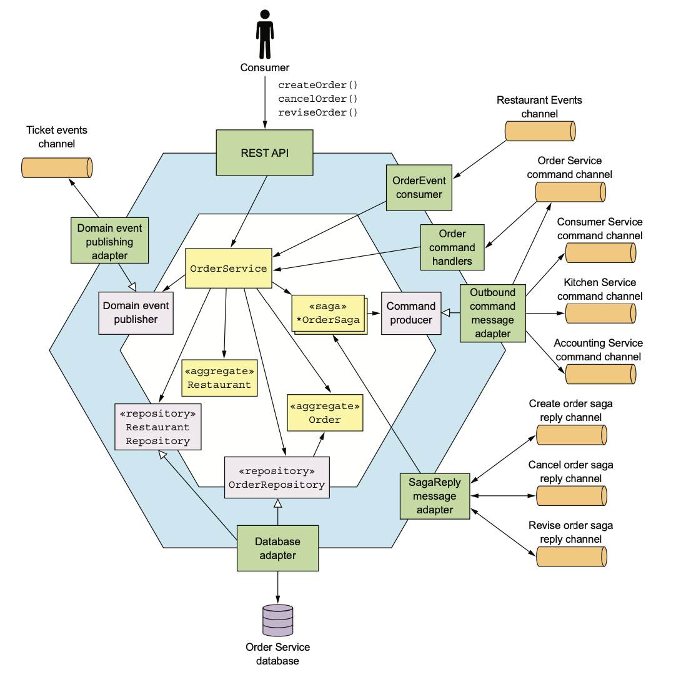

# 5.5.0 Foreground

주문 서비스는 주방 서비스와는 다르게 주로 Consumer에 의해 호출되는 서비스이다.

Order Aggregate를 중심으로 음식점 서비스를 부분적으로 복제해온 Restaurant라는 **Replica Aggregate**도 있다.

따라서 주문 서비스에서 주문 품목을 검증하고 단가를 책정할 수 있다.

 

전반적인 구조는 다음과 같다.

- **RestAPI:** Consumer의 UI에서 호출되는 RestAPI
- **OrderEventHandlers:** 음식점 서비스에서 발행한 이벤트를 구독하는 Inbound Adapter
- **OrderCommandHandler:** Saga가 호출하는 비동기 Request/Response 기반의 Inbound Adapter
- **SagaReplyAdapter:** Saga 응답 채널을 구독하고 Saga를 호출해 주는 Inbound Adapter

 

- **DB Adapter:** Repository로, DB에 접근하는 Outbound Adapter
- **DomainEventPublishingAdapter:** DomainEventPublisher의 구현체로, Order 도메인 이벤트를 발행해주는 Outbound Adapter
- **OutboundCommandMessageAdapter:** CommandPublisher의 구현체로, Command Message를 Saga 참여자들에게 보내주는 Outbound Adapter