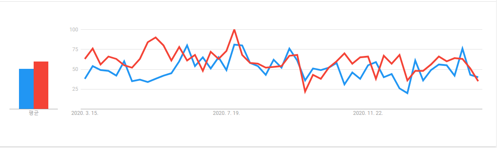

# NGINX

### 소개

- 아파치와의 관계

  > 아파치는 1996년 부터 단 한번도 1등을 놓친적 없을 정도로, 사랑받는 웹서버 이다.
  >
  > 하지만 오래된 만큼 신기술에 호환되지 않는 경우도 있을 수 있다.

  > 현재 국내에선 아파치와 nginx 모두 많이 사용되고 있고, 분포는 아래와 같다
  >
  > 
  >
  > 참고로 apache는 오래된만큼 안정성이 매우 뛰어나고, nginx는 속도면에서 apache보다 빠르다.

- 특징

  > 아파치와 다르게 비동기 이벤트 기반 구조를 가진다.

  > 동시접속 처리에 특화되어 있다.

- HTTP 서버의 역할

> http 프로토콜을 준수한다.
>
> HTML, JAVASCRIPT 등의 정보를 브라우저에게 전달하는 역할을 한다.

- 리버스 프록시로서의 역할

> 클라이언트가 가짜 서버에 요청을 보내면, 프록시 서버가 배후 서버(reverse server)로 부터 데이터를 가져오는 역할을 한다.

> 직접 App 서버에 요청하는 경우, 프로세스 한개는 응답/대기 상태가 되어야 하는데, Reverse Proxy를 통해 요청을 배분해 줄 수 있다.

> 위 두 방식 중에서, nginx는 비동기 방식을 사용하고 있다.

- 기본 원리
  - 기본적으로 nginx는 하나의 master process와 여러개의 worker process로 구성되어 있다.
    - master process란 worker process를 관리하는 프로세스이다.
    - 
    - worker process는 실질적으로 요청을 처리하는 프로세스 이다.