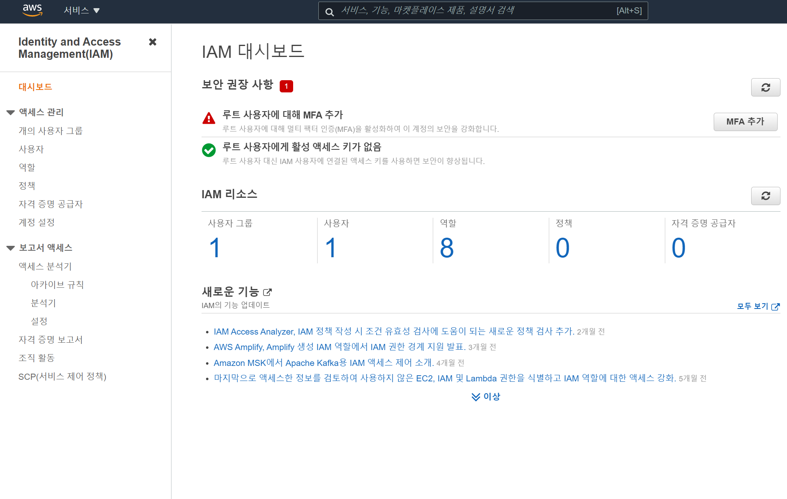
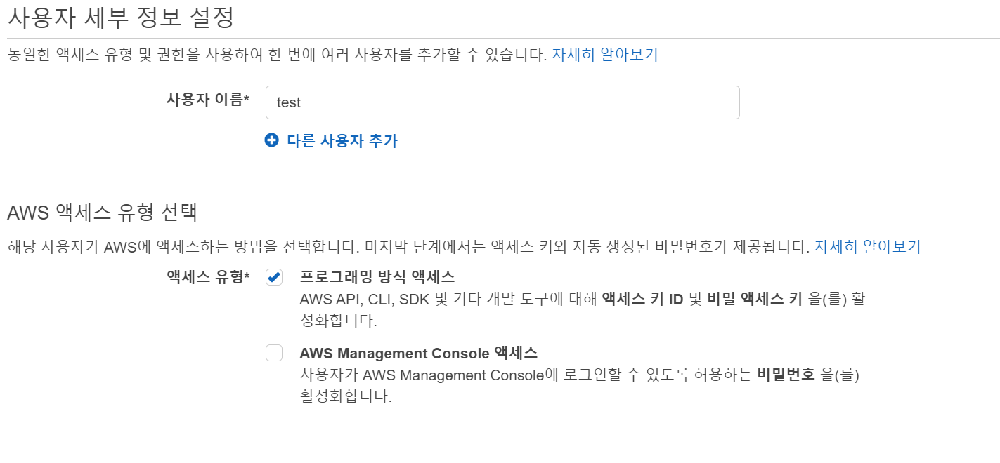
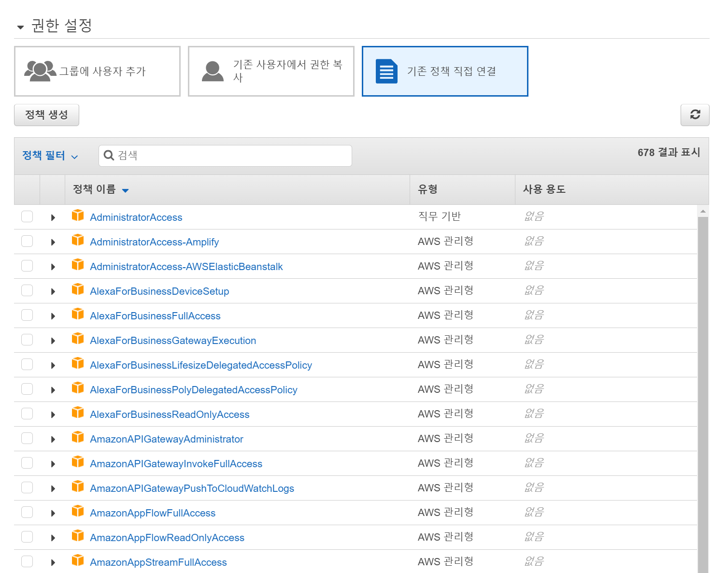
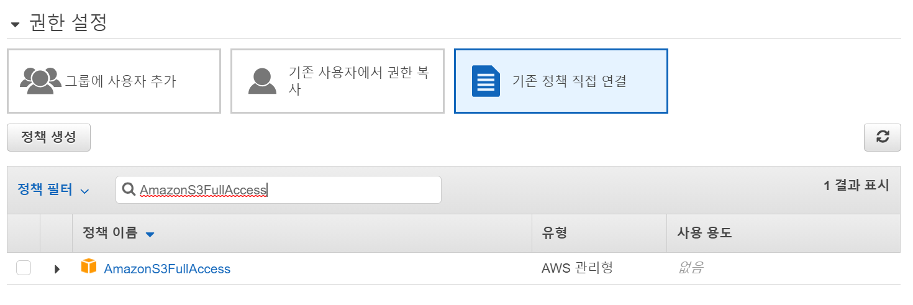
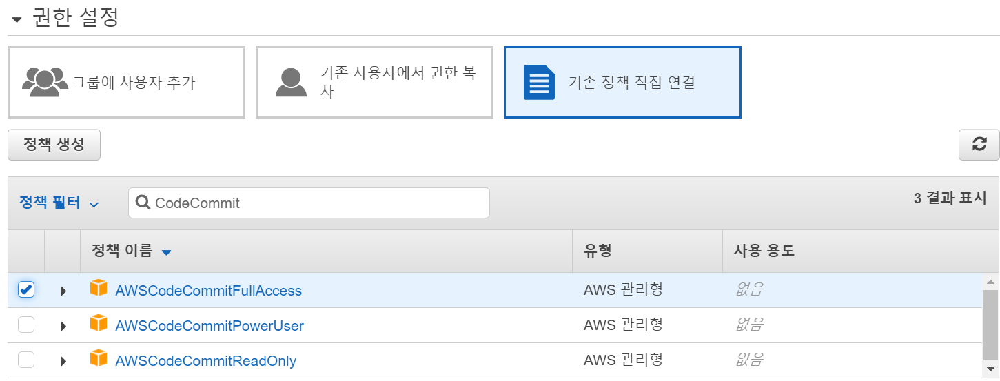
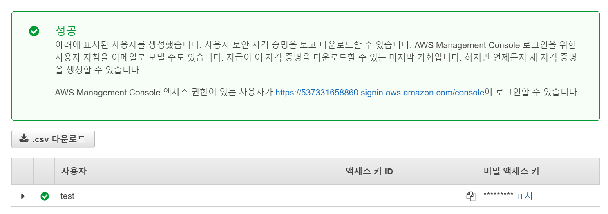

# IAM 계정 설정

> IAM이란 **AWS에 대한 Access를 제어하기 위한 서비스**이다.

이제 S3에 연결할 IAM 계정을 만들어 주어야 한다.

 

AWS에서 IAM을 검색하면 다음과 같은 화면이 나온다.

왼쪽의 사용자 탭을 선택하고 사용자 추가를 눌러준다.

위와 같이 사용자 이름, 엑세스 유형을 선택해 준다.

우선 프로그래밍 방식 엑세스를 선택해 주고, 다음을 눌러준다.

 

그 후에 기존 정책 직접 연결 버튼을 누르면 다음과 같은 화면이 나오게 된다.

우선 S3를 위한 권한을 추가해 준다.

 

그리고 CodeCommit을 위한 권한도 추가해 준다.

계속을 누르고 태그를 설정해 준다.

하지만 태그는 굳이 하지 않아도 된다.

 

다시 계속을 누르면 다음과 같이 엑세스 키와 비밀 엑세스 키를 발급해 준다.

**어딘가에 보관해 두어야 한다.** 비밀 엑세스 키는 다시 확인할 수 없기 때문에 키를 다시 만들어야 할 수도 있다.
