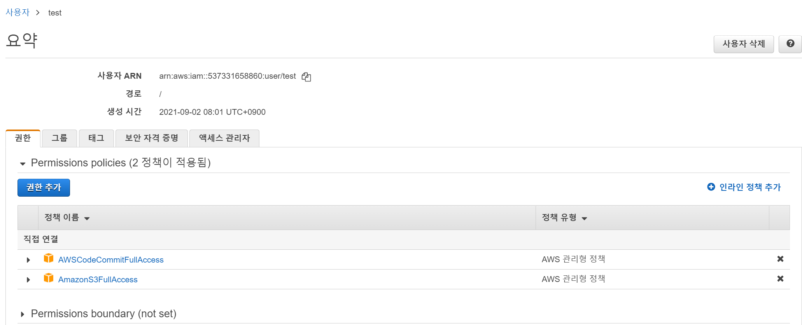
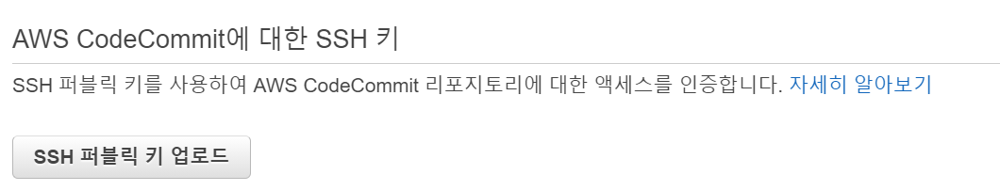
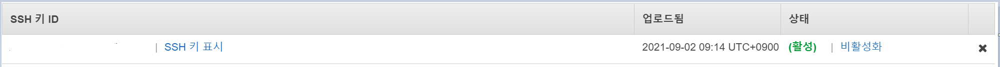
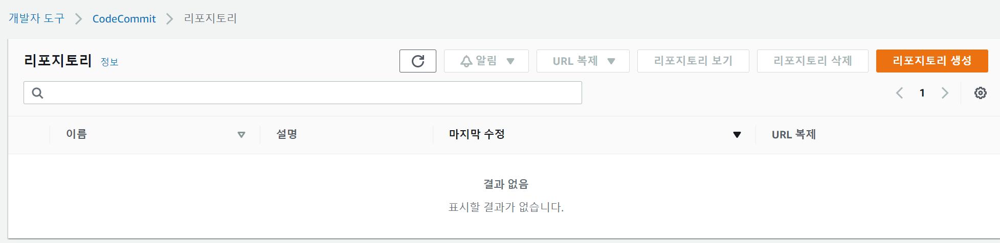
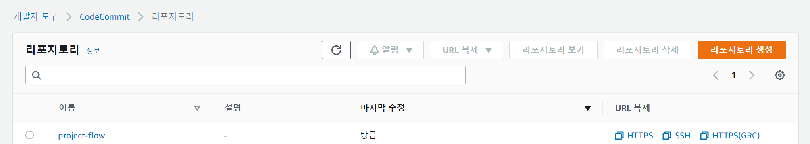

# AWS CodeCommit 세팅

Code Commit이란 AWS에서 지원하는 github라고 생각하면 간편하다.

다만 **정보가 암호화**되기 때문에 github보다 보안성이 좋다.

<br>

전에 IAM 계정을 만들었으니 이제 연동을 해보자

```
cd ~/.ssh
```

해당 위치로 가보면 `ssh-keygen.exe`라는 파일이 있다.

해당 파일을 bash에서 실행하면 다음과 같은 화면이 나온다.

```bash
Generating public/private rsa key pair.
Enter file in which to save the key (/home/user-name/.ssh/id_rsa): 파일 이름. 해당 위치에서 생성됨

Enter passphrase (empty for no passphrase): 원하는 비밀번호
Enter same passphrase again: 비밀번호 재입력

Your identification has been saved in /home/user-name/.ssh/codecommit_rsa.
Your public key has been saved in /home/user-name/.ssh/codecommit_rsa.pub.
The key fingerprint is:
45:63:d5:99:0e:99:73:50:5e:d4:b3:2d:86:4a:2c:14 user-name@client-name
The key's randomart image is:
+--[ RSA 2048]----+
|        E.+.o*.++|
|        .o .=.=o.|
|       . ..  *. +|
|        ..o . +..|
|        So . . . |
|          .      |
|                 |
|                 |
|                 |
+-----------------+
```

시키는대로 하고 나면, `설정한 이름` 파일과 `설정한 이름.pub`와 같은 파일이 생성된다.

`.pub`파일의 내용을 복사해 둔다.

<br>

이제 IAM으로 돌아가면 다음과 같은 화면을 볼 수 있다.



여기서 보안 자격 증명을 누르고, SSH 퍼블릭 키 업로드 버튼을 눌러준다.



그리고 아까 복사해둔 `.pub`의 내용을 붙여넣기 해준다.

그러면 다음과 같이 SSH 키 ID를 얻을 수 있다.



위 키를 복사해서 다시 Terminal로 이동한다.

<br>

이제 다시 `~/.ssh` 디렉토리로 이동해서 config 파일을 수정해 준다.

> 만약 없다면 만들어 준다.
>
> 윈도우의 경우에는 git bash로 vim을 이용하거나, 파일 탐색기에서 찾아서 수정하면 된다.

다음 코드를 추가해 준다.

```
Host git-codecommit.*.amazonaws.com
 User {SSH 키 ID}
 IdentityFile ~/.ssh/{pem 파일 이름}
```

<br>

config를 저장했으면 이제 테스트를 해보자.

``` 
ssh git-codecommit.ap-northeast-2.amazonaws.com
```

위와 같이 ssh를 실행하고, 아까 pem파일을 생성할 때 넣어줬던 비밀번호를 입력해 준다.

이때 다음같은 결과가 나오면 성공이다.

```
You have successfully authenticated over SSH. You can use Git to interact with AWS CodeCommit. Interactive shells are not supported.Connection to git-codecommit.ap-northeast-2.amazonaws.com closed by remote host.
Connection to git-codecommit.ap-northeast-2.amazonaws.com closed
```

<br>

## CodeCommit 생성

이제 CodeCommit 저장소를 생성한다.

github의 Repository를 생성한다고 생각하면 편하다.

<br>

AWS에서 CodeCommit을 검색하면 다음과 같은 화면이 나온다.



여기서 리포지토리 생성 버튼을 누르고, 이름을 설정하고 생성버튼을 눌러준다.

<br>

생성 후에 다시 이전 페이지로 돌아오면 다음과 같은 화면을 볼 수 있다.



여기서 SSH 주소를 복사해준다.

이제 해당 주소는 우리가 평소에 사용하던 github repository 주소라고 생각하면 된다.

