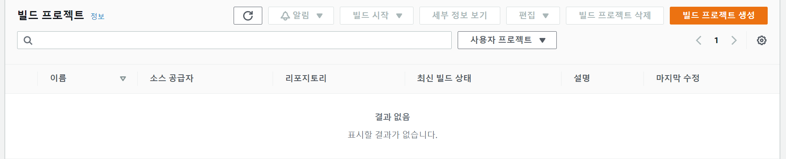
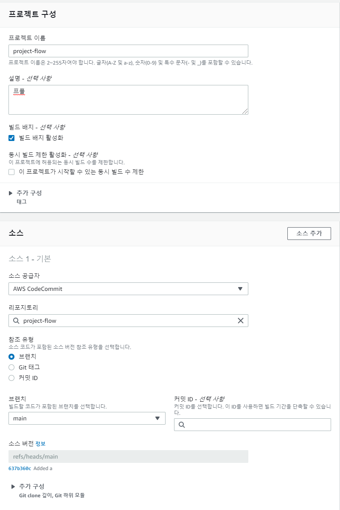
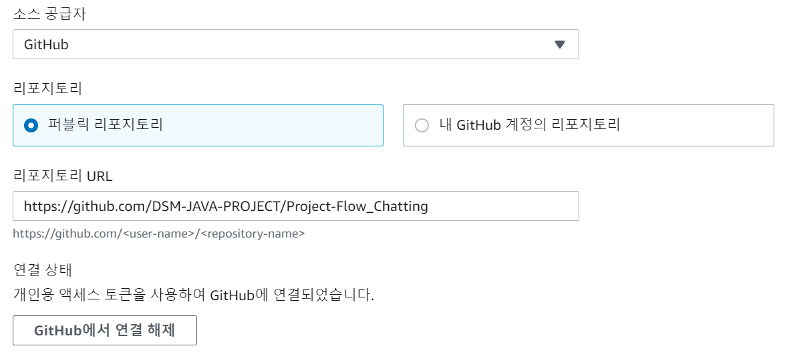
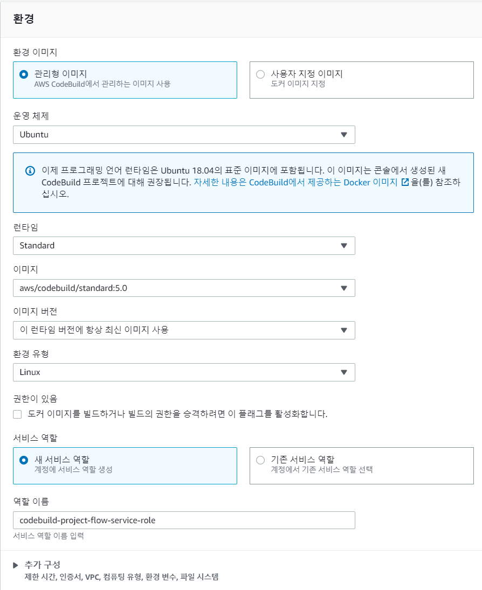
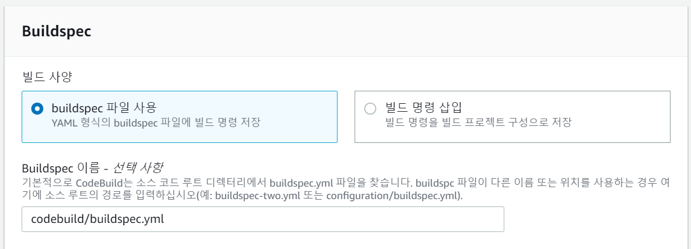
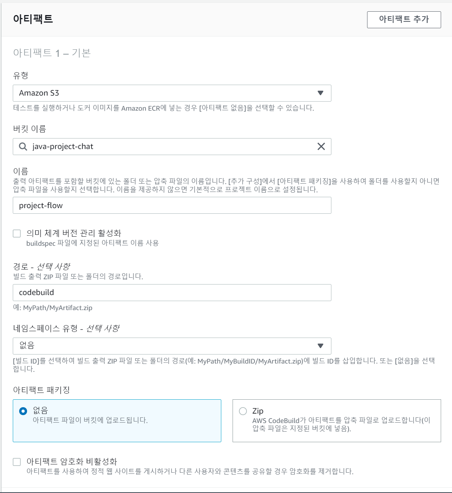
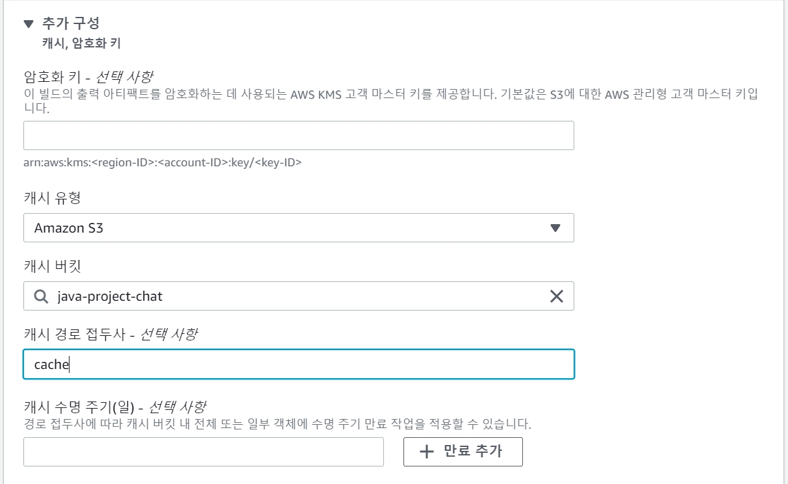
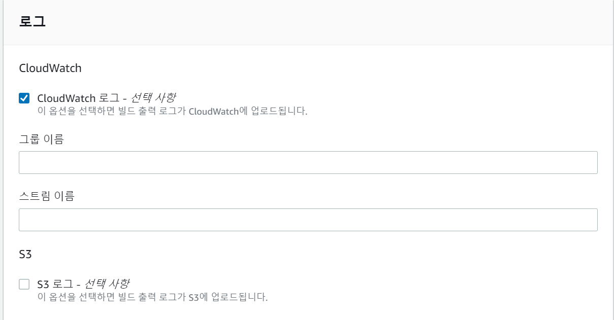

# CodeBuild 설정

AWS CodeBuild란 **완전 관리형 빌드 서비스**로 소스를 컴파일하고, 테스트를 실행하고, 배포할 파일을 생성하기까지의 작업을 관리해 준다.

Maven이나 Gradle과 같이 유명한 빌드 환경은 미리 패키징되어 지원한다.

우리는 CodeBuild를 통해 CodeCommit의 소스 코드를 빌드하고, 테스트한 후에 나온 실행 파일을 S3에 업로드 할 것이다.

<br>

## AWS 설정

우선 AWS에서 CodeBuild를 검색해서 들어가면 다음과 같은 화면이 뜬다.



여기서 빌드 프로젝트 생성을 눌러준 후에, 다음과 같이 설정해 준다.



여기서 만약 github의 소스코드를 이용하려면 다음과 같이 하면 된다.








여기서 buildSpec 이름을 바꿔준 이유는 기본적으로는 CodeCommit의 Root 디렉토리에서 yml 파일을 찾기 때문이다.



> **여기서 아키팩트 패키징은 Zip으로 설정해 준다.**
>
> CodeDeploy가 배포할 때 zip이나 tar과 같은 압축된 파일 형식으로 배포하기 때문이다.

이 부분은 CodeBuild의 결과물에 대한 처리를 위한 설정이다.

S3에 codebuild 아래에 결과 파일을 업로드 한다는 의미인데, Zip파일이 아닌 jar 파일 그대로 올리겠다는 의미이다.



추가구성에서는 필수는 아니지만 S3에 캐싱을 해준다.

의존성을 캐싱해서 한번 저장된 의존성을 새로 저장할 필요가 없게 한다.



마지막으로 로그에 대한 설정을 해줄 수 있다.

기본적으로는 CloudWatch에 저장된다.

> CloudWatch는 AWS에서 지원하는 로깅 시스템이다.

이제 생성 버튼을 눌러준다.

<br>

## buildspec.yml 설정

이제 build할 때 실행될 환경이나 명령어를 설정할 파일을 정의해 주어야 한다.

아까 전에 경로를 `codebuild/buildspec.yml`로 설정했기 때문에 codebuild 아래에 설정해 주면 된다.

<br>

```yaml
version: 0.2

phases:   # github action의 jobs와 비슷한 의미
  build:
    commands:   # build 라는 작업 실행 시 실행될 shell 명령어들
      - echo Build Starting on `date`
      - chmod +x ./gradlew
      - ./gradlew build
  post_build:
    commands:
      - echo $(basename ./build/libs/*.jar) # 해당 파일
      - pwd

artifacts:    # artifact 설정
  files:      # appspec 파일 설정, 어떤 파일을 가져갈지 선택
    - appspec.yml
    - build/libs/*.jar
  discard-paths: yes  # CodeBuild의 결과물에 해당 파일들을 추가한다.

cache:
  paths:
    - '/root/.gradle/caches/**/*' # 캐싱된 위치
```

이제 AWS CodeBuild로 이동해서 빌드 시작을 눌러서 테스트해본다.

