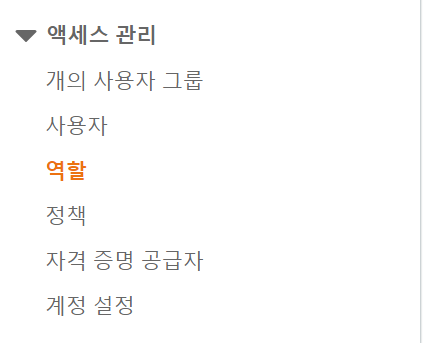
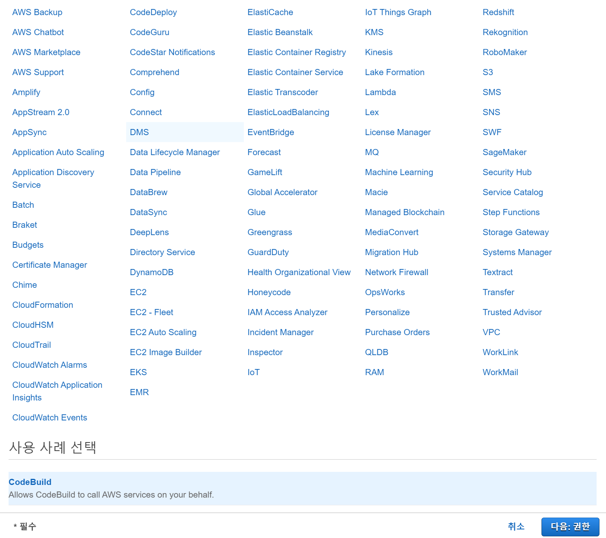
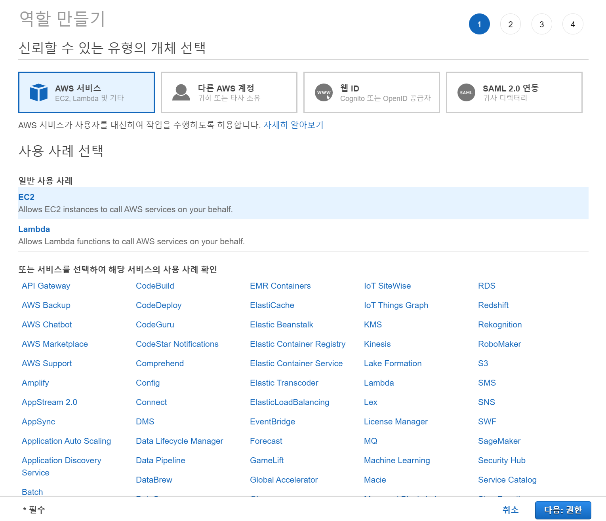
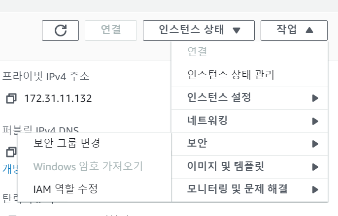
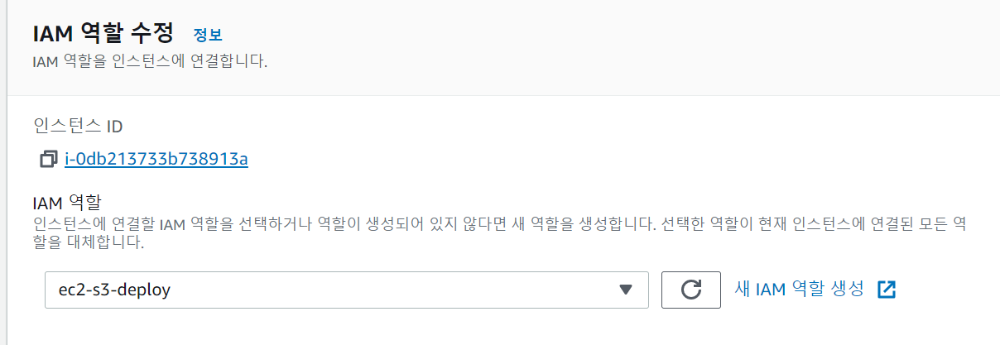

# CodeDeploy를 위한 IAM 설정

CodeDeploy에서는 2가지 IAM이 필요하다

> 하나의 계정만 만들어도 된다.

우선 CodeDeploy를 하기 위한 계정을 만들어 보자.

## CodeDeploy IAM 역할

IAM에 접속해서 다음과 같이 역할 탭으로 이동해 준다.

그리고 오른쪽 위에 역할 만들기 버튼을 눌러준다.

아래로 내려서 CodeDeploy를 선택해 준다.

이름을 설정하고 역할을 만들어 주면 된다.

 

# EC2에서 S3 접근을 위한 역할 설정

다시 역할 만들기 탭으로 들어와서 이번엔 EC2를 선택해 준다.

그리고 나서 `AmazonEC2RoleforAWSCodeDeploy`라는 정책을 추가해 준다.

해당 역할은 S3에 접근하기 위한 정책이다.

 

## EC2 역할 연결하기

이제 만든 역할을 EC2에 연결해 주어야 한다.

> 기존에 EC2 인스턴스가 있다는 가정 하에 진행된다.

자신의 EC2 인스턴스에 들어가서 오른쪽 위 작업을 누르면 다음과 같은 화면이 나온다.

여기서 보안 - IAM 역할 수정을 눌러준다.

그리고 여기서 다음과 같이 아까 만든 ec2-s3-deploy를 설정해 준다.

 

그리고 해야할 일이  하나 더 있는데, 태그를 설정해 주어야 한다.

**CodeDeploy는 태그로 배포할 인스턴스들을 식별**하기 때문에 태그를 만들어 주어야 한다.

나는 name이라는 key에 project-flow 라는 value를 넣어 주었다.
