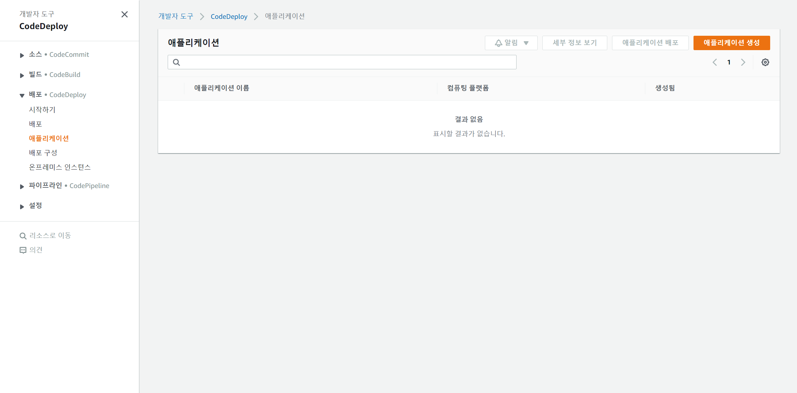
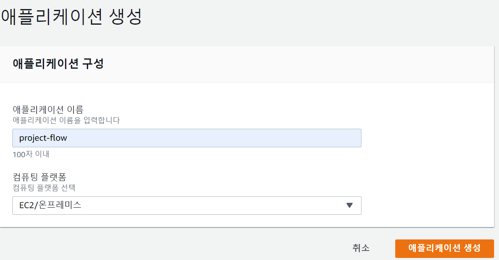
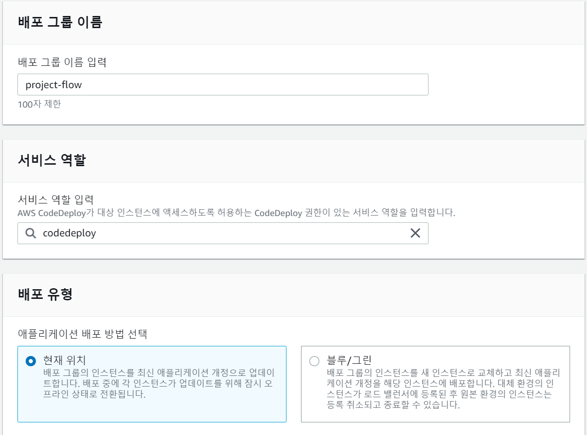
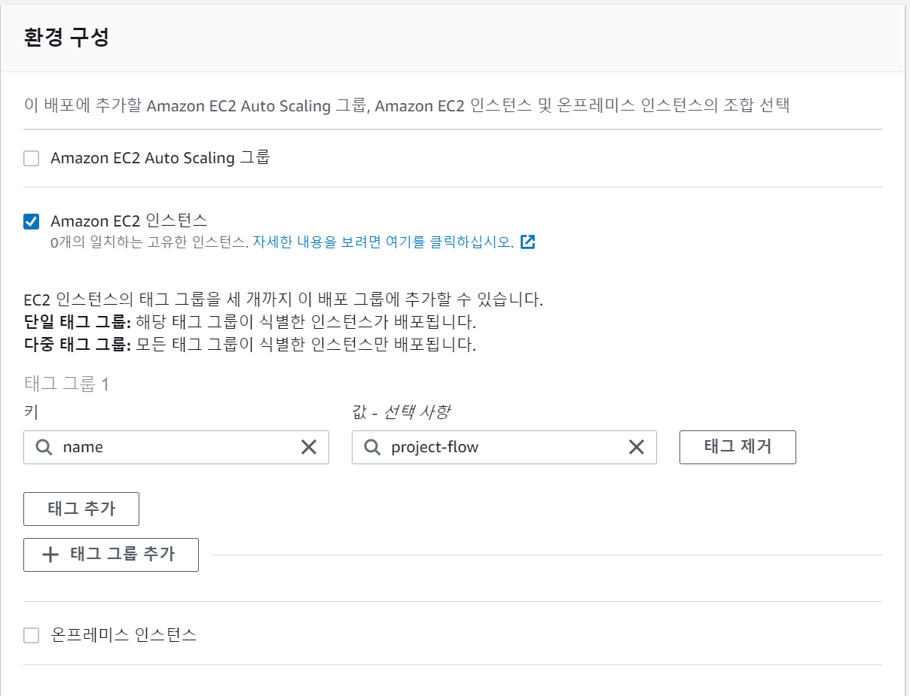
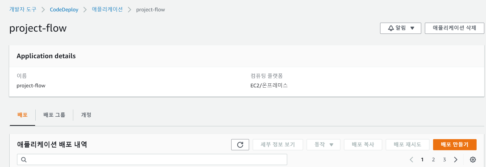

# Code Deploy 세팅

이제 CodeDeploy 설정을 해야한다.

우선 AWS에서 CodeDeploy를 검색한 후, 애플리케이션 탭으로 이동하면 다음과 같은 화면을 볼 수 있다.



애플리케이션 생성을 눌러준 후 다음과 같이 간단하게 설정해 준다.



<br>

이제 배포 그룹을 만들어 주어야 하는데, 다음과 같이 설정하면 된다.



여기서 서비스 역할은 아까 만들었던 IAM 역할의 이름을 입력하면 된다.



여기서는 아까 EC2에서 설정해둔 key - value를 설정하면 된다.

로드밸런서 설정만 꺼주고 나머지는 기본 설정으로 두어도 된다.

<br>

## appspec.yml 설정

AWS CodeDeploy는 appspec.yml을 통해 배포에 관련된 프로세스를 정의한다.

전체 배포 프로세스는 다음과 같다.

1. appspec.yml과 시작 후 실행할 shell script 정의한다.
2. buildspec.yml 파일에서 appspec.yml과 start.sh(쉘 스크립트)를 추가해서 함께 압축하도록 설정한다.
3. 소스 코드를 커밋한 후에 CodeBuild를 하게 되면 jar 파일, appspec.yml, start.sh가 묶여서 zip파일로 생성된다.
4. CodeDeploy의 zip파일을 unzip 한 후에 appspec.yml을 참고하여 배포 실행

우선 appsepc.yml부터 만들자

```yaml
# 해당 파일은 최 상단에 위치해야 함
version: 0.0
os: linux      # 운영체제. windows 아니면 linux로 해야한다.
files:
  - source:  /      # 이 위치의 파일들이
    destination: /home/ubuntu/build/  # 이 위치로 복사됨. 즉 S3의 zip 파일이 여기로 옴
permissions:    # 권한
  - object: /
    pattern: "**"
    owner: ubuntu
    group: ubuntu

hooks:
  AfterInstall:     # 설치 받아온 후 실행할 명령어
    - location: start.sh    # start.sh 라는 파일을 실행
      timeout: 60           # timeout 설정
      runas: ubuntu       # run as
```

AfterInstall은 S3에서 파일을 받아온 후에 실행할 행동을 정의하는 것이다.

<br>

## start.sh

```sh
#!/bin/bash
BUILD_JAR=$(ls /home/ubuntu/build/*.jar)
JAR_NAME=$(basename "$BUILD_JAR")
echo "> build 파일명: $JAR_NAME" >> /home/ubuntu/deploy.log

echo "> build 파일 복사" >> /home/ubuntu/deploy.log
DEPLOY_PATH=/home/ubuntu/
cp "$BUILD_JAR" $DEPLOY_PATH

echo "> 현재 실행중인 애플리케이션 pid 확인" >> /home/ubuntu/deploy.log
CURRENT_PID=$(pgrep -f "$JAR_NAME")

if [ -z "$CURRENT_PID" ]
then
  echo "> noting to kill" >> /home/ubuntu/deploy.log
else
  echo "> kill -15 $CURRENT_PID"
  kill -15 "$CURRENT_PID"
  sleep 5
fi

DEPLOY_JAR=$DEPLOY_PATH$JAR_NAME
echo "> MONGO_URL:"
echo "$MONGO_URL"
echo "> run DEPLOY_JAR"    >> /home/ubuntu/deploy.log

nohup java -jar "$DEPLOY_JAR"&
```

간략히 설명하면 만약 실행중인 application이 존재하면 해당 application을 kill 하고, jar 파일을 실행해 준다.

<br>

## buildspec.yml 수정

buildspec.yml도 수정해 주어야 한다.

```yaml
version: 0.2

phases:
  build:
    commands:
      - echo Build Starting on `date`
      - chmod +x ./gradlew
      - ./gradlew build
  post_build:
    commands:
      - echo $(basename ./build/libs/*.jar)
      - pwd

artifacts:
  files:
    - appspec.yml
    - build/libs/*.jar
    - scripts/**
  discard-paths: yes

cache:
  paths:
    - '/root/.gradle/caches/**/*'
```

다 똑같지만 scripts 폴더 밑의 파일들을 zip 파일에 추가하는 구문이 추가되었다.

<br>

## 배포 만들기

이제 다시 AWS로 돌아와서 자신의 Application을 선택하면 다음과 같은 화면이 나온다.



여기서 배포 만들기를 누르면 다음과 같은 화면이 나온다.


위와 같이 설정해서 만들어 주면 배포를 실행해볼 수 있다.

> 여기서 개정 위치는 zip파일이 저장되어 있는 위치를 의미한다.
>
> S3에서 CodeBuild 이후에 생성된 zip파일에 들어가보면 개정 위치를 확인할 수 있다.

