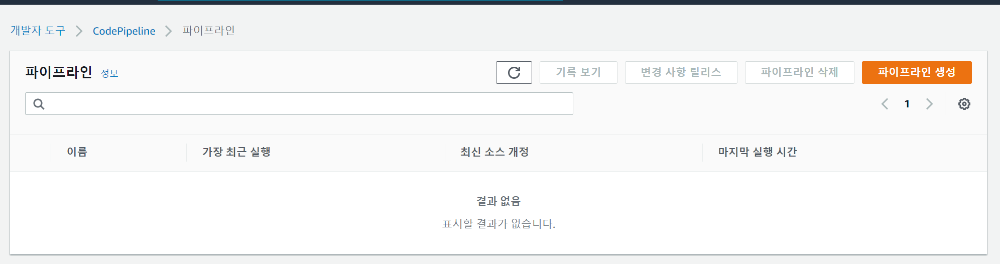
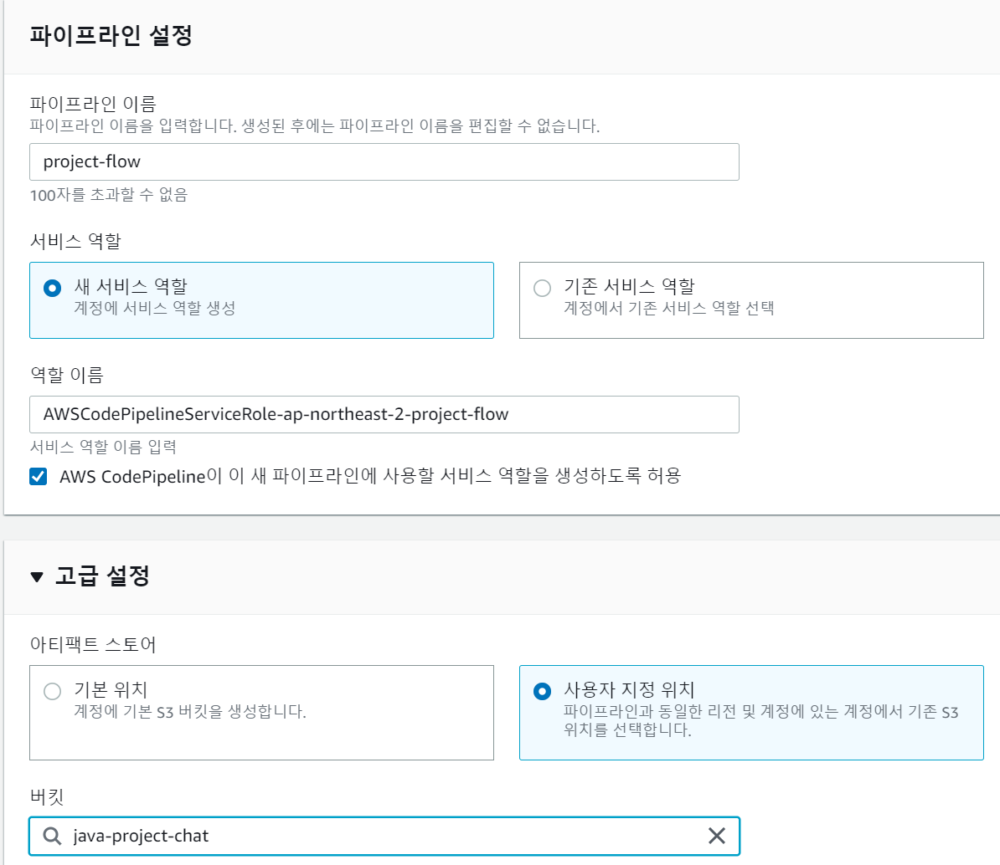
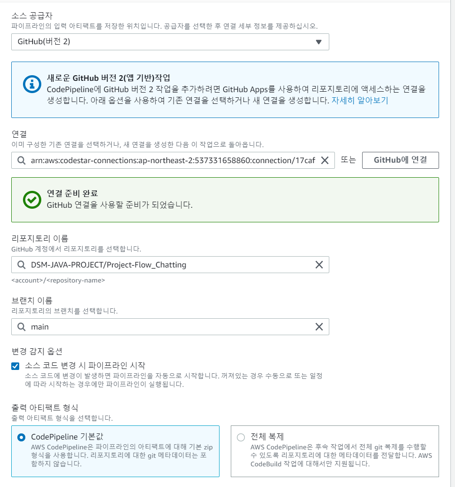
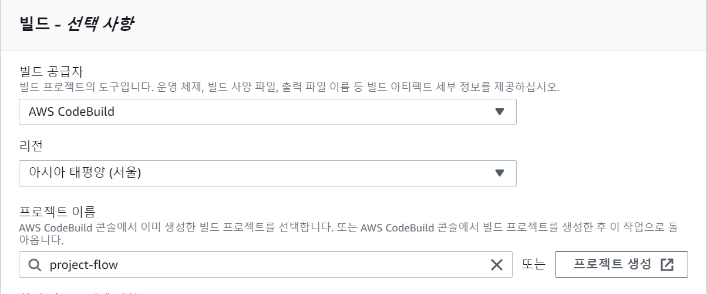
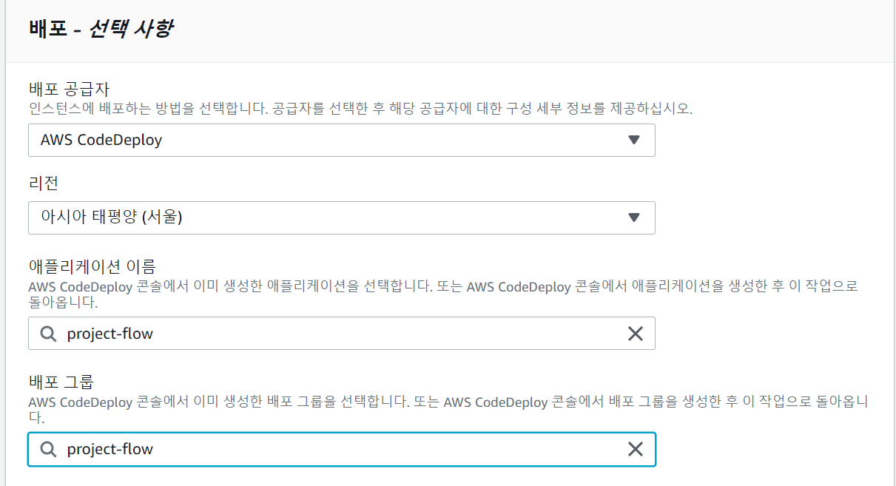

# Code Pipeline 설정

빠르고 안전하게 CI/CD를 실행하기 위한 서비스.

빌드부터 테스트, 배포, 서비스를 자동화 해준다.

 

AWS에서 CodePipeline을 검색하면 다음과 같은 화면이 나온다.

파이프 라인 생성을 누르고 다음과 같이 설정해 주면 된다.

원래 자동으로 S3 버킷을 생성해 주지만, 우리는 이미 생성해둔 버킷이 있기 때문에 사용자 지정 위치로 이전의 버킷을 선택해 준다.

 

소스 코드 스테이지는 다음과 같이 설정해 준다.

 

 

위와 같이 설정하고 다음을 눌러준다.

 

배포 스테이지도 다음과 같이 설정하고 넘어가 준다.

그리고 나서 파이프라인을 생성해 주면 된다.

