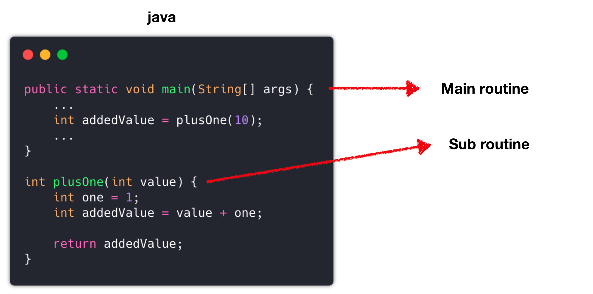
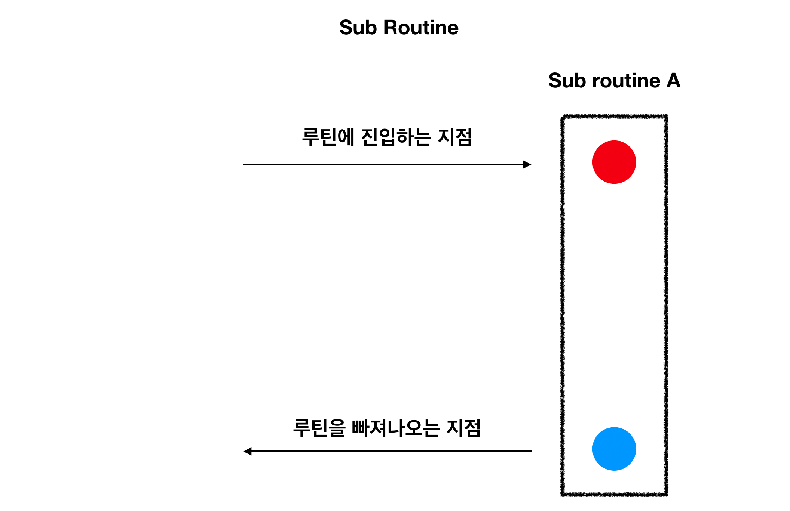
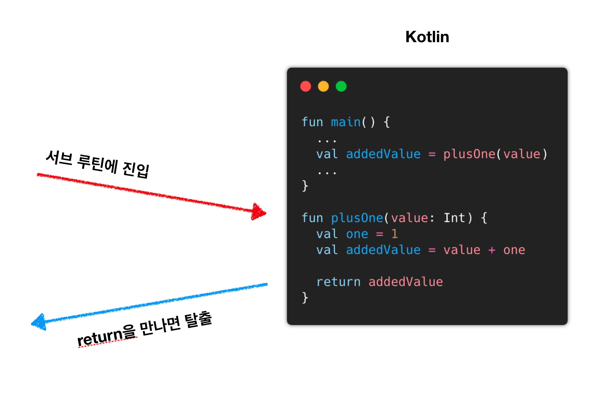
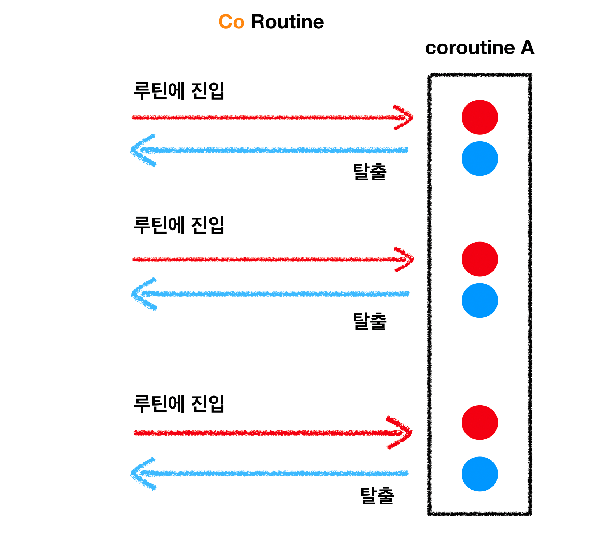
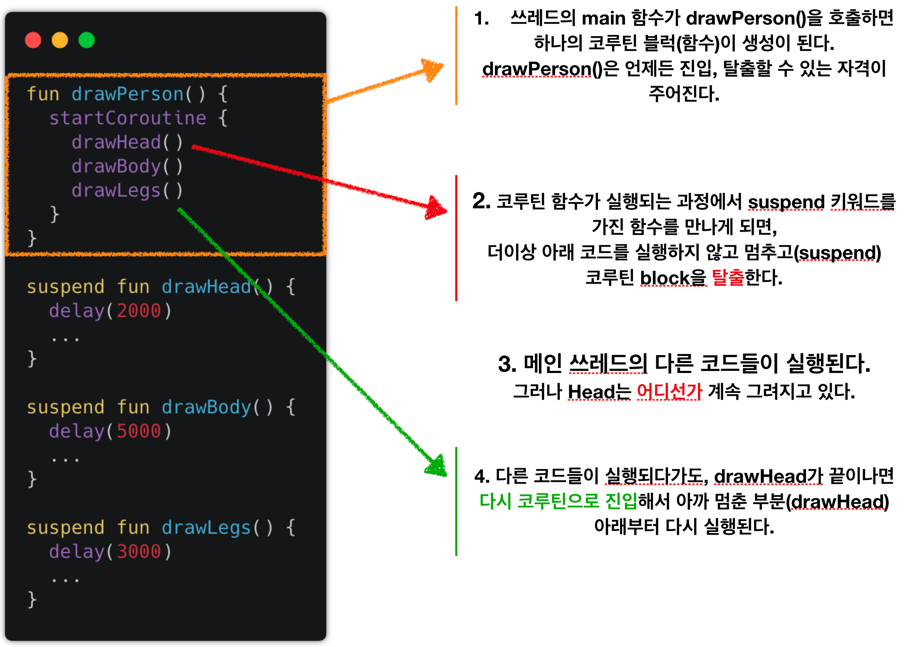

# 코루틴 기본 개념

Coroutine은 **Blocking 방식의 코드로 Non Blocking 코드**를 짜기 위해서 등장한 개념이다

우선 Main Routine과 Sub Routine이라는 개념에 대해서 알아보자



위와 같이 Main Routine과 Sub Routine이 있을 때, 일반적인 코드의 흐름은 다음과 같다.



정말 단순하게 메소드가 시작되면 Routine에 진입하고, return을 만나면 Routine에서 빠져나오게 된다.

코드로 보면 다음과 같다고 할 수 있다.



<br>

하지만 코루틴은 다음과 같은 흐름을 가진다.



Coroutine A라는 함수가 존재할 때, 이 함수는 **진입점과 탈출점이 여러개**이다.

코루틴은 이렇듯 **Return을 만나지 않더라도 Routine에서 탈출**할 수 있고, **다시 Routine에 돌아와서 원래 하던걸 이어서 할 수 있도록 기억**해준다.

<br>

좀 더 자세히 보면 다음과 같다.



1. Thread의 main이 되는 메소드가 `startCoroutine {}`을 만나면 Coroutine Block을 생성한다.
   이 블록은 위에서 소개했듯이 언제나 진입하고, 탈출할 수 있다.

   > 여기서 `startCoroutine {}`이라는 Block은 원래 코루틴에 존재하는 Block이 아니지만, 이해를 돕기 위해서 사용했다.

2. Coroutine Block이 suspend가 붙은 `drawHead()`메소드를 호출한다.

3. Coroutine Block을 탈출해서 다른 Thread에서 Head를 그린다.
   메인 쓰레드는 계속해서 다른 작업을 진행한다.

4. drawHead가 끝나면 다시 Coroutine Block으로 돌아와서 다음 작업`drawBody()`를 실행한다.

## Coroutine의 Continuation

*코루틴이 어떻게 작업을 멈추고 다시 시작하냐*라는 질문에 대한 대답은 **실행을 멈추고, 그때의 상태를 저장**함으로써 다음에 다시 이어서 실행할 수 있도록 한다.

이를 위해서 코루틴에서는 다음과 같은 Continuation이 있다.

``` kotlin
public interface Continuation<in T> {
    public val context: CoroutineContext
    
    public fun resume(value: T)
    
    public fun resumeWithException(exception: Throwable)
}
```

여기서 CoroutineContext는 **작업을 실행할 쓰레드를 결정**하도록 돕는 객체이다.

<br>

만약 코루틴을 사용할 때 `suspend`를 붙인 다음과 같은 메소드가 있다고 가정하자.

``` kotlin
suspend fun fetchUserDetail(id: Long) {
    val token = auth()
    val user = getUser(token.id, id)
    
    updateUserData(user)
}
```

위 메소드를 컴파일하면 다음과 같은 코드가 된다

``` kotlin
fun fetchUserDetail(id: Long, cont: Continuation) {
    val stateMachine = object : CoroutineImpl {
        fun resume(stateMachine) {
            this(stateMachine)		// 자신을 다시 시작해 준다.
        }
    }
    switch(stateMachine.label) {
        case 0:
        	stateMachine.id = id		// 다음에도 실행할 수 있도록 정보 저장
        	stateMachine.label = 1		// 다음에 실행할 위치
	        sm.result = auth(sm)
        case 1:
        	val id = stateMachine.id
        	val token = sm.result as String
        	stateMachine.label = 2
        	getUser(token, id, sm)
        case 2:
        	updateUserData(user, sm)
    }
}
```

위와 같이 **이전의 실행 정보`(Continuation)`를 파라미터로 받고, sm에 이전 실행 결과를 저장**한다.

## Coroutine vs Thread

Coroutine과 Thread 둘 다 Background에서 작업하는 거라서 햇갈릴수도 있다.

### Thread

- **OS의 Native Thread에 직접 연결된다.**
- **Thread 전환 시 CPU 상태체크가 필요해서 비용이 발생한다.**
- **Context Switch 비용이 존재한다.**
- **선점형 멀티테스킹 방식**

### Coroutine

- **즉시 실행되지 않는다.**
- **OS와 별개로 동작하기 때문에 비용이 절약된다.**
- **Context Switch 비용이 없다.**
- **루틴을 개발자가 지정할 수 있다.**
- **비선점형 멀티테스킹 방식**

## Suspend

### suspend란?

`suspend` 키워드를 붙이면 **Thread를 Blocking하지 않고 IO 작업을 가능**하게 한다.

### suspend 함수

**함수 형식의 suspend**이다.

``` kotlin
suspend fun greetAfter(name: String, delayMillis: Long) {
    delay(delayMillis)
    println("Hello, $name")
}
```

위 메소드는 `delay()`만큼 기다린 후에 `Hello name`을 출력하는 메소드이다.

하지만 **suspend 함수이기 때문에 Blocking 대신 그동안 Thread의 자원을 반환**해준다.

### Lambda Suspend

또한 Lambda 함수에서도 suspend 키워드를 허용한다.

```kotlin
fun connectionRetryPolicy(block: suspend () -> Unit)
```

## Coroutine Scope

**코루틴이 실행되는 생명 주기**를 설정하는 것이다.

`GlobalScope`를 예로 들면, `GlobalScope.launch { }` 키워드를 통해 Coroutine을 생성했다면 **Application과 동일한 생명 주기**를 가지게 된다.

모두 GlobalScope로 할수도 있겠지만, 적절한 생명 주기를 주지 않으면 **메모리 누수**가 발생할 수 있어 GlobalScope의 사용은 지양해야 한다.

최초로 GlobalScope에 접근했을 때 생성되며, Job을 컨트롤하는데에는 적합하지 않다.

``` kotlin
import kotlinx.coroutines.*

fun main() = runBlocking {
// 시작
    GlobalScope.launch {
        repeat(1000) { i ->
            println("I'm sleeping $i ...")
            delay(500L)
        }
    }
    delay(1300L) // 지연 후 종료
// 끝
}
```


## Coroutine Thread 관리

### Job

**백그라운드에서 실행되는 작업**이다.

Job은 **Life Cycle을 가지고 작업이 끝나면 취소**될 수 있어야 하며, **결과를 반환하지 않는다.**

> Deffered 인터페이스를 통해 결과 값을 반환하도록 Customizing할 수 있다.

Job 끼리는 부모 - 자식 관계를 가질 수 있으며, 부모 Job이 종료되면 모든 자식 Job은 함께 종료된다.

반대로 자식 Job에서 문제가 발생하면 `CancellationException`이 발생하며 부모 Job을 포함해 다른 모든 자식 Job들을 종료시킨다.

> SupervisorJob을 통해 예외 발생 시의 행동을 커스텀할 수 있다.

<br>

기본적으로 Job Instance는 다음과 같은 상황에서 생성된다.

- `launch {}`에 의해 생성된다. 해당 Block이 종료됨과 동시에 Job도 함께 종료된다.
- `CompletableJob` 인스턴스는 Factory 메소드로 생성할 수 있다. `CompletableJob.complete`을 호출해서 종료시킬 수 있다.

<br>

Job이 가질 수 있는 상태는 다음과 같다.

| State                       | isActive | isCompleted | isCancelled | 설명                                                         |
| :-------------------------- | :------- | :---------- | :---------- | ------------------------------------------------------------ |
| **New (초기 상태)**         | `false`  | `false`     | `false`     | Coroutine Builder가 CoroutineStart.LAZY를 파라미터로 받았을 때, Job을 New 상태로 생성한다.<br />start/join을 호출해서 시작될 수 있다. |
| **Active (기본 초기 상태)** | `true`   | `false`     | `false`     | Coroutine Builder에서 생성되었을 때 기본적으로 가지는 상태이다.<br />Job이 작동하고 있거나 Completable Job이 Complete 될때까지 유지된다. |
| **Completing (대기 상태)**  | `true`   | `false`     | `false`     | Job의 Body가 완료되거나, `CompletableJob.complete()`을 호출하면 Completing 상태가 된다.<br />모든 자식들이 Complete상태가 될때까지 대기한다. |
| **Cancelling (대기 상태)**  | `false`  | `false`     | `true`      | Job 실행 도중 예외가 발생하면 Cancelling 상태가 된다.<br />`cancel()` 메소드를 호출해서 즉시 Caceled 상태로 전환할 수 있다. |
| **Cancelled (종단 상태)**   | `false`  | `true`      | `true`      | 모든 자식 Job이 취소된 이후 실실적으로 취소된 상태           |
| **Completed (종단 상태)**   | `false`  | `true`      | `false`     | 모든 자식 Job이 성공한 상태                                  |


## Coroutine Dispatcher

**코루틴을 (재)시작할 Thread를 선택하는 역할**을 담당한다.

다음과 같은 종류가 있다.

- **DefaultDispatcher:** CommonPool과 같다.
- **CommonPool:** Background Pool에서 코루틴을 (재)실행해 준다.
  CPU Bound 작업에 적합하다.
- **Unconfined:** 현재 Thread에서 코루틴을 시작하되, 아무 Thread에서나 재실행될 수 있다.
  CPU를 사용하지 않는 IO Bound 등에서 적합하다.
- **newSingleThreadContext():** 단일 Thread로 Dispatcher를 생성한다.
  여기서 실행되는 코루틴은 항상 이 Thread에서만 (재)시작된다.
- **newFixedThreadPoolContext():** 지정된 크기의 Thread pool을 생성한다.

만약 `launch {}`에서 적절한 Dispatcher를 지정하지 않으면 Coroutine Scope에서 지정한 Dispatcher를 사용하게 된다.

[코루틴 설명 원본](https://wooooooak.github.io/kotlin/2019/08/25/%EC%BD%94%ED%8B%80%EB%A6%B0-%EC%BD%94%EB%A3%A8%ED%8B%B4-%EA%B0%9C%EB%85%90-%EC%9D%B5%ED%9E%88%EA%B8%B0/)

[코루틴은 어떻게 동작하는가?](https://www.youtube.com/watch?v=usaD7HyN598)

[Coroutine vs Thread](https://jaejong.tistory.com/61#recentComments)
