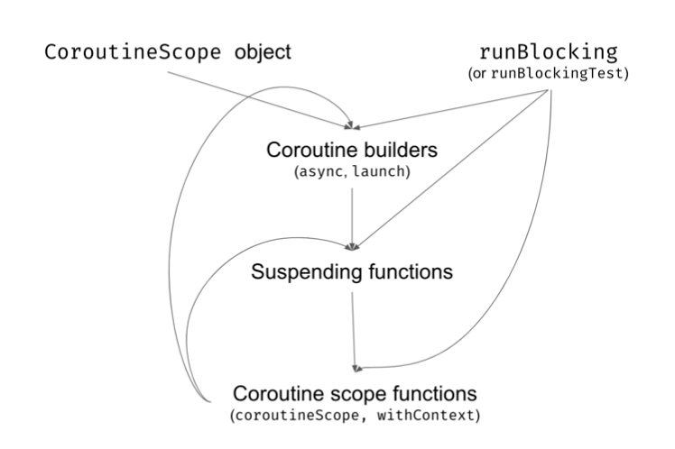

# 서론

Suspending 함수들은 다른 함수에게 Continuation을 전달해 주어야 한다.

따라서 Suspend 함수는 일반 함수를 호출할 수 있지만, 일반 함수는 suspend 함수를 호출할 수 없다.

suspend 함수는 suspend 함수에 의해 호출되어야 하고, 그 suspend함수 또한 suspend함수에 의해 호출되어야 한다.

이러한 suspend 함수는 어디선가 시작되어야 하는데, 그런 역할을 하는게 **Coroutine Builders**이다.

# Coroutine Builders의 종류

## 1. `launch`Builder

launch는 개념적으로 새로운 Thread를 실행하는 것과 비슷하다.

단지 우리는 coroutine을 실행하고, 독립적으로 실행된다는 것 뿐이다.

다음은 launch를 어떻게 사용하는가에 대한 예제이다.

``` kotlin
fun main() {
    GlobalScope.launch {
        delay(1000L)
        println("World!")
    }
    GlobalScope.launch {
        delay(1000L)
        println("World!")
    }
    GlobalScope.launch {
        delay(1000L)
        println("World!")
    }
    println("Hello,")
    Thread.sleep(2000L)
}
```

다음과 같은 결과가 나오게 된다.

```
// Hello,
// (1 sec)
// World!
// World!
// World!
```

이런게 가능한 이유는 **각각의 Coroutine이 독립적으로 존재하며 독립적으로 실행되기 때문이다.**

<br>

`launch`는 `CoroutineScope`의 확장 함수로, 부모 Coroutine과 자식 Coroutine간의 관계를 표현하는 데에 있어 매우 중요한 메커니즘인 **Structured Concurrency**의 일부분이다.

> structured concurrency는 이 챕터 뒤쪽에서 자세히 다룰 예정이다.

하지만 지금은 `GlobalScope`로 직접 `launch, async`를 호출함으로써 `structured concurrency`에 대한 이야기는 넘기겠다.

이건 흔한 예제는 아니고, 실제 상황에서 `GlobalScope`를 직접 사용하는 경우는 매우 적다.

<br>

알아차렸을수도 있는데, 맨 뒤에 `Thread.sleep(2000L)`를 붙여줬다.

이유는 main Thread가 suspend된 메소드보다 먼저 끝나버리면 안되기 때문에 기다려 주어야 한다.

왜냐하면 `delay()`가 Thread를 Blocking시키지 않기 때문인데, `delay()`는 단지 일정 시간 이후에 `resume()`할 뿐이다.

따라서 main 메소드가 먼저 끝나버리면 Coroutine은 suspend된 함수가 재실행 되기 전에 프로그램이 꺼져버리게 된다.

> 뒤에서 다시 설명하겠지만 structured concurrency를 사용하게 되면 `Thread.sleep()`이 없어도 된다.

<br>

`launch`가 동작하는 방법은 어느정도 Daemon Thread와 비슷하다.

> 여기서 Daemon Thread란 Normal Thread의 백그라운드 작업을 주로 맡아서 하는 보조적인 Thread를 의미한다.
>
> 우선순위가 낮고, Normal Thread가 종료되면 함께 종료된다는 특징이 있다.

둘 다 각각의 프로세스로 작업을 처리하며, Normal Thread가 종료됨에 따라 함께 종료된다.

```kotlin
fun main() {
    thread(isDaemon = true) {
        Thread.sleep(1000L)
        println("World!")
    }
    
    thread(isDaemon = true) {
        Thread.sleep(1000L)
        println("World!")
    }

    thread(isDaemon = true) {
        Thread.sleep(1000L)
        println("World!")
    }
    
    println("Hello,")
    Thread.sleep(2000L)
}

```

하지만 비용적인 측면에서는 Blocking된 Thread를 유지하는건 비싸지만, Coroutine을 유지하는건 거의 공짜에 가깝다.

## 2. `runBlocking` Builder

Coroutine의 기본적인 규칙은 Thread를 Blocking하지 않고 suspend하는 것 이지만, Blocking 시켜야 하는 경우도 있다.

Main 함수와 같이 프로그램이 일찍 끝나면 안되는 경우가 있다.

우리는 대부분의 경우에서 `runBlocking`을 사용할 것이다.

<br>

`runBlocking`은 굉장히 예외적인 Builder이다.

`runBlocking` 내부에서 suspend될 때마다 `runBlocking`을 호출한 Thread를 Blocking한다.

즉, `runBlocking { delay(1000L) }`은 `Thread.sleep(1000L)`과 같다.

``` kotlin
fun main() {
    runBlocking {
        delay(1000L)
        println("World!")
    }
    runBlocking {
        delay(1000L)
        println("World!")
    }
    runBlocking {
        delay(1000L)
        println("World!")
    }
    println("Hello,")
}
```

따라서 다음과 같은 결과가 나온다.

```kotlin
// (1 sec)
World!
// (1 sec)
World!
// (1 sec)
World!
Hello,
```

다음 코드도 같은 역할을 한다.

``` kotlin
fun main() {
    Thread.sleep(1000L)
    println("World!")
    
    Thread.sleep(1000L)
    println("World!")
    
    Thread.sleep(1000L)
    println("World!")
    println("Hello,")
}
```

<br>

실제로 `runBlocking`이 사용되는 몇 가지 경우가 있다.

먼저 main 함수는 `runBlocking`을 사용하지 않으면 프로그램이 종료되기 때문에 `runBlocking`을 사용해야 한다.

다음으로 unit테스트를 진행할 때 사용해야 하는데, unit테스트를 할 때에도 종료되면 안되기 때문에 `runBlocking`을 사용한다.

```kotlin
fun main() = runBlocking {
    
}

class MyTests {
    @Test
    fun `a test`() = runBlocking {
        
    }
}

```

여기서 `Thread.sleep()`을 `delay()`로 변경하려면 `launch`를 사용할 수도 있지만, 나중에 structured concurrency에 대해 배우고 나면 `runBlocking`이 더 유용한걸 알 수 있다.

``` kotlin
fun main() = runBlocking {
    GlobalScope.launch{
        delay(1000L)
        println("World!")
    }
    GlobalScope.launch {
        delay(1000L)
        println("World!")
    }
    GlobalScope.launch {
        delay(1000L)
        println("World!")
    }
    println("Hello,")
    delay(2000L) // 아직은 필요하다.
}
```

```kotlin
Hello,
// (1 sec)
World!
World!
World!
```

`runBlocking`은 굉장히 중요한 Builder이지만 현대 프로그래밍에서는 거의 쓸 일이 없다.

단위 테스트에서는 주로 대체자인 `runTest`를 사용하고, main 함수는 suspend 함수로 만든다.

> `runTest`는 뒤에 Testing Coroutine에서 자세히 설명한다.

``` kotlin
suspend fun main() {
    GlobalScope.launch {
        delay(1000L)
        println("World!")
    }
    GlobalScope.launch {
        delay(1000L)
        println("World!")
    }
    GlobalScope.launch {
        delay(1000L)
        println("World!")
    }
    println("Hello,")
    delay(2000L)
}
        
```

main을 suspend 시키는게 훨씬 편하다.

하지만 아직은 `runBlocking`을 계속 쓸 예정이다.

## 3. `async` Builder

`async`는 `launch`와 비슷하지만 값을 반환할 수 있다.

`async`는 `Deferred<T>` 타입을 반환하고, `Deferred`는 값이 준비되었을 때 반환해주는 suspend 메소드인 `await()`이 있다.

``` kotlin
fun main() = runBlocking {
    val resultDeferred: Deferred<Int> = GlobalScope.async {
        delay(1000L)
        42
    }
	val result: Int = resultDeferred.await() // (1 sec)
    println(result) // 42
}
```

`launch`와 비슷하게 `async`는 호출되었을 때 **coroutine을 즉시 시작**시킨다.

만약 값이 준비된 후에 `await()`을 호출하게 되면 즉시 값을 반환하게 되고, 값이 준비되지 않았다면 준비될때까지 suspend된다.

``` kotlin
fun main() = runBlocking {
    val res1 = GlobalScope.async {
        delay(1000L)
        "Text 1"
    }
    
    val res2 = GlobalScope.async {
        delay(3000L)
        "Text 2"
    }
    
    val res3 = GlobalScope.async {
        delay(2000L)
        "Text 3"
    }
    
    println(res1.await())
    println(res2.await())
    println(res3.await())
}
```

다음과 같은 결과가 나오게 된다.

``` kotlin
// (1 sec)
Text 1
// (2 sec)
Text 2
Text 3
```

`async`는 `launch`에서 값을 반환하는 것 말고 추가적인 기능들을 지원한다.

`launch`는 모두 `async`로 바꿔도 잘 동작하지만, `async`는 값을 반환해야 한다는 상징적인 의미가 있기 때문에, 꼭 필요한 곳에서만 사용해야 한다.

``` kotlin
fun main() = runBlocking {
	// async의 오남용
    GlobalScope.async {
        delay(1000L)
        println("World!")
    }
    
    println("Hello,")
    delay(2000L)
}
```

```kotlin
Hello,
// (1 sec)
World!
```

<br>

`async` builder는 동시에 두 곳에서 데이터를 수집하고 병합하는 등 **두 가지의 처리를 병렬로 처리할 때 사용**된다.

``` kotlin
scope.launch {
    val news = async {
        newsRepo.getNews()
            .sortedByDescending { it.date }
	}
    
    val newsSummary = newsRepo.getNewsSummary()
    // 이것도 async로 감쌀 수 있지만, 중복되기 때문에 하지 않았다.
    
    view.showNews(
        newsSummary,
        news.await()
    )
}
```

# Structured Concurrency

만약 Coroutine을 `GlobalScope`로 시작하게 되면 프로그램은 그 Coroutine을 위해 기다려주지 않는다.

전에 말했듯이, Coroutine은 아무 Thread도 Blocking하지 않기 때문에, 프로그램이 종료되는 것을 막지 않는다.

``` kotlin
fun main() = runBlocking {
    GlobalScope.launch {
        delay(1000L)
        println("World!")
    }
    
    GlobalScope.launch {
        delay(2000L)
        println("World!")
    }
    
    println("Hello,")
//    delay(3000L)
}
// Hello,
```

처음에 GlobalScope가 필요한 이유는 `lunch`와 `async`가 `CoroutineScope`의 확장 함수이기 때문이다.

하지만 `runBlocking`을 선언하는 부분을 보면 `block`의 Receiver가 CoroutineScope로 되어있다.

``` kotlin
fun <T> runBlocking(
    context: CoroutineContext = EmptyCoroutineContext,
    block: suspend CoroutineScope.() -> T
): T

fun CoroutineScope.launch(
    context: CoroutineContext = EmptyCoroutineContext,
    start: CoroutineStart = CoroutineStart.DEFAULT,
    block: suspend CoroutineScope.() -> Unit
): Job

fun <T> CoroutineScope.async(
    context: CoroutineContext = EmptyCoroutineContext,
    start: CoroutineStart = CoroutineStart.DEFAULT,
    block: suspend CoroutineScope.() -> T
): Deferred<T>
```

즉 **`GlobalScope`를 제거해도 된다.**

``` kotlin
fun main() = runBlocking {
    
	launch {
        delay(1000L)
        println("World!")
    }
    
    this.launch {
        delay(2000L)
        println("World!")
    }
    
    println("Hello,")
}
```

따라서 **`launch`는 `runBlocking`의 자식이 된다.**

부모로서의 자식이 모두 끝날때까지 기다려야 한다는 책임이 있는데, 자식을 인지할 수 있으므로 **`runBlocking`은 자식들이 모두 끝날 때까지 suspend된다.**

``` kotlin
fun main() = runBlocking {
    this.launch {
        delay(1000L)
        println("World!")
    }
    
    launch {
        delay(2000L)
        println("World!")
    }
    
    println("Hello,")
}
```

다음과 같은 결과가 나오게 된다.

``` kotlin
Hello,
// (1 sec)
World!
// (1 sec)
World!
```

각각의 `launch`는 개별적인 coroutine을 생성하고, `runBlocking`은 **모든 자식 coroutine들이 종료될때까지 기다려준다.**

<br>

부모는 자식을 위해 scope를 제공하고, 자식들은 해당 scope에서 실행된다.

이렇게 구축된 관계를 `structured concurency`라고 한다.

부모 - 자식 관계의 중요한 특징은 다음과 같다.

- 자식은 부모에게서 context를 상속받는다.

  > Coroutine context에서 설명하겠지만, context는 재정의 될 수 있다.

- 부모는 모든 자식이 끝날때까지 suspend된다.

- 부모가 취소되면 모든 자식들도 취소된다.

- 자식에서 오류가 발생하면 부모도 파괴한다.

<br>

주의할점은 다른 coroutine builder들과는 다르게 **`runBlocking`은 CoroutineScope의 확장 함수가 아니다.**

따라서 **`runBlocking`은 자식이 될 수 없고, 오직 root로만 존재할 수 있다.**

# The Bigger Picture

전에 말했듯이 suspend 함수는 다른 suspend 함수에 의해 호출되어야 하고, 모든 것은 coroutine builder에 의해 시작되어야 한다.

`runBlocking`을 제외하고, builder들은 CoroutineScope에서 시작되어야 한다.

우리가 사용한 간단한 예제에선 scope를 `runBlocking`에서 제공했지만 어느정도 큰 Application에서는 개발자 혹은 프레임워크에 의해 제공된다.

첫 번째 builder에서 scope를 제공하면, 다른 builder들에서 첫 번째 builder의 scope에서 시작할 수 있다.

<br>

아래 실제 프로젝트에서 자주 사용될만한 예제들을 가져왔다.

``` kotlin
// for both of android / kotlin

class NetworkUserRepository(private val api: UserApi) : UserRepository {
    suspend fun getUser(): User = api.getUser().toDomainUser()
}

class NetworkNewsRepository(
    private val api: NewsApi,
    private val settings: SettingsRepository,
) : NewsRepository {
    suspend fun getNews(): List<News> =
    	api.getNews()
    		.map { it.toDomainNews() }
    
    suspend fun getNewsSummary(): List<News> {
        val type = settings.getNewsSummaryType()
        return api.getNewsSummary(type)
    }
}

// for android

class MainPresenter(
    private val view: MainView,
    private val userRepo: UserRepository,
	private val newsRepo: NewsRepository
) : BasePresenter {
    fun onCreate() {
        scope.launch {
            val user = userRepo.getUser()
            view.showUserData(user)
        }
        
        scope.launch {
            val news = async {
                newsRepo.getNews()
                	.sortedByDescending { it.date }
            }
            
            val newsSummary = async {
                newsRepo.getNewsSummary()
            }
            view.showNews(newsSummary.await(), news.await())
        }
    }
}

// for backend

@Controller
class UserController(
    private val tokenService: TokenService,
    private val userService: UserService
){
    @GetMapping("/me/{userId}") 
    suspend fun findUser(
        @PathVariable userId: String,
        @RequestHeader("Authorization") authorization: String
    ): UserJson {
        val userId = tokenService.readUserId(authorization)
        val user = userService.findUserById(userId)
        return user.toJson()
    }
}
```

여기서 문제가 있는데, 어디에서도 scope를 지정하지 않았다.

하지만 파라미터로 scope를 지정해주는건 좋은 방법이 아니기 때문에 builder를 위한 scope를 제공해주는 `coroutineScope`를 사용할 수 있다.

## coroutineScope 사용하기

user 데이터와 user가 조회한 게시글 목록을 비동기적으로 조회해서 병합해야 한다고 상상해보자.

`async`를 호출하기 위해서는 scope가 필요하지만, scope를 지정해준적이 없다.

scope를 생성하기 위해서 `coroutineScope`를 사용하면 된다.

``` kotlin
suspend fun getArticlesForUser(userToken: String?): List<ArticleJson> = coroutineScope {
    val articles = async {
        articleRepository.getArticles()
    }
    
    val user = userService.getUser(userToken)
    
    articles.await()
    	.filter { canSeeOnList(user, it) }
    	.map { toArticleJson(it) }
}
```

> 여기서 `async`를 하지 않아도 동시에 조회할 수 있다.
>
> 하지만, 동시에 조회한다는걸 강조하기 위해 `async`를 붙여줬다.

**`coroutineScope`는 단지 람다 식을 위한 scope를 생성해 주는 suspend 함수일 뿐이다.**

위 예제에서는 람다식의 반환 타입인 `List<ArticleJson>`을 반환해 줬다.

<br>

`coroutineScope`는 suspend 함수 안에서 scope가 필요할 때 사용하는 굉장히 중요한 함수이다.

사용하는 입장에서는 굉장히 편하게 사용할 수 있도록 설계되었지만, 제대로 분석하기 위해서는 context, cancelling, Exception handling에 대한 개념이 필요하다.

<br>

또한 main 함수에서 `runBlocking` 대신 사용할수도 있다.

``` kotlin
suspend fun main(): Unit = coroutineScope {
    launch {
        delay(1000L)
        println("World!")
    }
    println("Hello,")
}
```



우리는 일반적으로 scope를 시작하거나, `runBlocking`을 호출하여 사용한다.

여기서, 우리는 또 다른 builder들이나 suspend 함수를 호출할 수 있다.

suspend 함수는 builder들을 호출할 수 없기 때문에 `coroutineScope`와 같은 scope 함수를 호출하게 된다.

