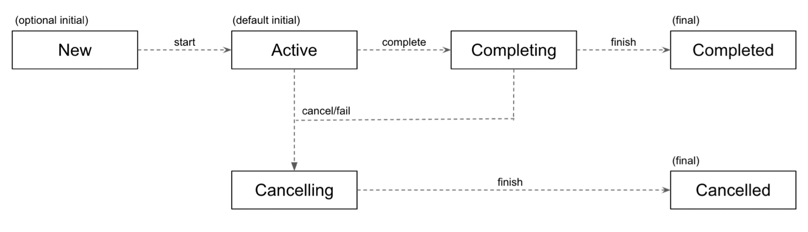

# 서론

*Structured Concurrency*챕터에서 다음과 같은 부모 - 자식 관계의 특징들을 설명했다.

- 자식은 부모에게서 context를 상속한다.
- 부모는 모든 자식이 정상적으로 끝날 때까지 suspend된다.
- 부모가 cancel되면 모든 자식이 cancel된다.
- 자식이 파괴되면 부모도 파괴된다.

부모의 context를 상속받는 것은 coroutine builder의 기본적인 동작이다.

``` kotlin
fun main(): Unit = runBlocking(CoroutineName("main")) {
    val name = coroutineContext[CoroutineName]?.name
    println(name) // main
    
    launch {
        delay(1000)
        val name = coroutineContext[CoroutineName]?.name
        println(name) // main
    }
}
```

상속을 제외한 나머지 3개의 특징들은 `Job` context에 의존한다.

게다가 `Job`은 coroutine을 cancel하는데에 사용될 수도 있고, 상태 추적 등 많은 곳에서 사용될 수 있다.

# Job

## Job이란?

개념적으로, `Job`은 Lifecycle을 가지고 있는, 취소될 수 있는 것을 의미한다.

`Job`은 Interface이긴 하지만 구체적인 구현과 상태를 가지고 있기 때문에 abstract class라고 생각해도 된다.

`Job`의 lifecycle은 `Job`의 state 변수의 값에 따라 바뀌게 된다.



0. **New:** Active상태로 가기 전, 기다리는 상태이다.

   CoroutineBuilder에서 특별히 `start` 파라미터를 줘서 LAZY하게 동작할 수 있도록 한 것이다.

1. **Active:** `Job`이 자신이 맡은 일을 수행하는 상태를 말한다.

   Job을 생성하면 기본적으로는 즉시 시작하며, 이 상태에서는 **자식 Coroutine을 시작할 수 있다.**

2. **Completing:** `Job`의 내용이 성공적으로 수행된 상태로, 자식 Coroutine들이 성공하기를 기다리는 상태이다.

3. **Completed:** 모든 자식 Coroutine들이 성공적으로 종료된 상태이다.

   만약 실패 시 Completed가 아닌 Cancelling 상태로 가게 된다.

   

4. **Cancelling:** Connection을 닫거나 자원을 free시킬 마지막 기회이다.

5. **Cancelled:** 성공적으로 cancel된 상태

<br>

상태는 `toString()`으로 출력할 수 있으며 아래 예제에서 `Job`의 상태가 변화하는걸 확인할 수 있다.

``` kotlin
suspend fun main() = coroutineScope {
    val job = Job()
    
    println(job) // JobImpl{Active}@ADD
    job.complete() // Job을 complete시킨다.
    println(job) // JobImpl{Completed}@ADD
	
    val activeJob = launch {
        delay(1000)
    }
    
    println(activeJob) // StandaloneCoroutine{Active}@ADD
    activeJob.join() // (1 sec)
    
    println(activeJob) // StandaloneCoroutine{Completed}@ADD
    
    val lazyJob = launch(start = CoroutineStart.LAZY) {
        delay(1000)
    }
    
    println(lazyJob) // LazyStandaloneCoroutine{New}@ADD
    lazyJob.start()
    
    println(lazyJob) // LazyStandaloneCoroutine{Active}@ADD
    lazyJob.join() // (1 sec)
    
    println(lazyJob) //LazyStandaloneCoroutine{Completed}@ADD
}

```

> main함수가 종료되면 안되기 때문에 `join()`을 통해 해당 `job`이 끝날 때까지 Coroutine을 대기시켰다.


| State          | isActive | isCompleted | isCancelled | 설명                                                         |
| :------------- | :------- | :---------- | :---------- | ------------------------------------------------------------ |
| **New**        | `false`  | `false`     | `false`     | Coroutine Builder가 CoroutineStart.LAZY를 파라미터로 받았을 때, Job을 New 상태로 생성한다.<br />start/join을 호출해서 시작될 수 있다. |
| **Active**     | `true`   | `false`     | `false`     | Coroutine Builder에서 생성되었을 때 기본적으로 가지는 상태이다.<br />Job이 작동하고 있거나 Completable Job이 Complete 될때까지 유지된다. |
| **Completing** | `true`   | `false`     | `false`     | Job의 Body가 완료되거나, `CompletableJob.complete()`을 호출하면 Completing 상태가 된다.<br />모든 자식들이 Complete상태가 될때까지 대기한다. |
| **Cancelling** | `false`  | `false`     | `true`      | Job 실행 도중 예외가 발생하면 Cancelling 상태가 된다.<br />`cancel()` 메소드를 호출해서 즉시 Caceled 상태로 전환할 수 있다.<br />메모리 정리나 Connection을 free할 상태이다. |
| **Cancelled**  | `false`  | `true`      | `true`      | 모든 자식 Job이 취소된 이후 실실적으로 취소된 상태           |
| **Completed**  | `false`  | `true`      | `false`     | 모든 자식 Job이 성공한 상태                                  |

## Coroutine Builder에서 부모 Job을 기반으로 Job 생성하기

Kotlin Coroutine 라이브러리에서는 자기만의 `Job`을 만든다.

대부분이 `Job`을 반환해 주기 때문에 밖에서 사용될 수 있다.

대표적인 예시로 `launch`를 들 수 있는데, 여기서 반환받은 Job은 결과 타입이다.

``` kotlin
fun main(): Unit = runBlocking {
    val job: Job = launch {
        delay(1000)
        println("Test")
    }
}
```

`async`는 `Deffered<T>`를 반환해 주지만, `Deffered`도 `Job`의 구현체이기 때문에 똑같이 사용할 수 있다.

``` kotlin
fun main(): Unit = runBlocking {
    val ret: Deferred<String> = async {
        delay(1000)
        "Test"
    }
    
    val job: Job = ret
}
```

`Job`이 `CoroutineContext`의 일종이기 때문에 `coroutineContext[Job]`으로 접근할 수 있다.

게다가 확장 프로퍼티가 있기 때문에 더욱 쉽게 접근할 수 있다.

``` kotlin
val CoroutineContext.job: Job
	get() = get(Job) ?: error("Current context doesn't...")
```

`Job`이 `CoroutineContext`를 자식에게 전달하는 방법은 다른것들과 조금 다르다.

원래는 `CoroutineContext`를 건들지 않고 그냥 자식에게 넘겨주며, 모든 `CoroutineBuilder`들은 각각의 `Job`을 가지며, 각각의 `Job`은 부모 `Job`과 관계를 가진다.

이것이 자식들을 기다리고, 취소하고, 예외 처리를 구현할 수 있게 하는 토대가 되는 개념이다.

``` kotlin
fun main(): Unit = runBlocking {
    val job: Job = launch {
        delay(1000)
    }
    
    val parentJob: Job = coroutineContext.job
    println(job == parentJob) // false
    
    val parentChildren: Sequence<Job> = parentJob.children
    println(parentChildren.first() == job) // true
}

```

`Structured concurrency`메커니즘은 새로운 `Job`이 부모의 `Job`을 덮어쓰게 되면 제대로 동작하지 않을 것이다.

이걸 테스트하기 위해 `Job()`을 통해 새로운 Job context를 만들어 덮어쓰기 해보겠다.

``` kotlin
fun main(): Unit = runBlocking {
    launch(Job()) { // 새로운 Job으로 덮어쓰여진다.
        delay(1000)
        println("Will not be printed")
    }
}
```

이렇게 하면 아무것도 출력되지 않고 즉시 종료되는걸 알 수 있다.

`launch`의 Job context가 덮어쓰기 되었기 때문인데,
우리가 새로 만든 `Job()`은 부모 context 즉, `runBlocking`의 context와 전혀 관계가 없고 자신만의 context를 가지고 있기 때문이다.

<br>

Coroutine이 부모 Job과의 관계를 차단될 때에는 넘겨준 context를 제외한 어떤 관계도 갖지 않게 된다.

이런 방법을 통해 **`Structured concurrency`를 잃을 수 있다.**

따라서 이렇게 할 때에는 굉장히 조심해야 한다.

## 자식을 await하기

`Job`의 매우 중요한 이점중 하나는 **모든 자식이 completed가 될 때까지 기다릴 수 있다는 것**이다.

그것을 위해서 우리는 `join()`메소드를 통해 Job이 종단 상태`(completed, cancelled)`에 도달할 때 까지 suspend되도록 할 수 있다.

``` kotlin
fun main(): Unit = runBlocking {
    val job1 = launch {
        delay(1000)
        println("Test1")
    }
    
    val job2 = launch {
        delay(1000)
        println("Test2")
    }
    
    job1.join()
    job2.join()
    println("All tests are done")
}
// 1초 뒤
Test1
Test2
All tests are done
```

또한, `Job`에는 `children`이라는 property가 있는데 이를 통해 **모든 자식 Context를 불러올 수 있다.**

이를 응용하면 다음과 같이 모든 자식들이 종단 상태가 될 때까지 suspend 시킬 수 있다.

``` kotlin
fun main(): Unit = runBlocking {
    launch {
        delay(1000)
        println("Test1")
    }
    
    launch {
        delay(1000)
        println("Test2")
    }
    
    coroutineContext[Job]
        ?.children
        ?.forEach { it.join() }
    
    println("All tests are done")
}
// 1초 튀
Test1
Test2
All tests are done
```

## Job Factory 함수

`Job()`이라는 Factory 함수를 통해 **`Job`을 Coroutine 없이도 생성할 수 있다.**

`Job()`함수는 **어떤 context와도 관계를 가지지 않는 `Job`**을 만들어 준다.

<br>

`Job()` 함수를 사용할 때 가장 흔하게 하는 실수는 `Job()` 밑에서 coroutine을 실행하고 `join()`함수를 사용하는 것이다.

왜냐하면 **`Job`의 상태를 바꾸지 않기 때문에 프로그램은 종료되지 않게 된다.**

``` kotlin
suspend fun main(): Unit = coroutineScope {
    val job = Job()
    
    launch(job) { // 새로운 Job
        delay(1000)
        println("Text 1")
    }
    
    launch(job) { // 새로운 job
        delay(2000)
        println("Text 2")
    }
    job.join() // job과 coroutineScope를 join한다.
    println("Will not be printed")
}
// 1초 뒤
Text 1
// 1초 뒤
Text 2
// 프로그램이 계속해서 실행된다.
```

더 나은 방법은 `Job`의 children들을 `join()`시켜 주는게 더 낫다.

``` kotlin
suspend fun main(): Unit = coroutineScope {
    val job = Job()
    launch(job) { // 부모의 Job을 덮어쓰기 한다.
        delay(1000)
        println("Text 1")
    }
    launch(job) { // 부모의 Job을 덮어쓰기 한다.
        delay(2000)
        println("Text 2")
    }
    job.children.forEach { it.join() }
	println("program end")
}
// 1초 뒤
Text 1
// 1초 뒤
Text 2
program end
```

`Job()`은 생성자 호출처럼 보이지만, `Job`은 인터페이스 이고 `Job()`은 생성자 처럼 보이는 함수이다.

게다가, 실제로 `Job()`의 반환 타입은 `CompletableJob`이다.

``` kotlin
public fun Job(parent: Job? = null): CompletableJob
```

`CompletableJob`은 `Job`인터페이스에서 두 가지 메소드가 추가되었다.

- **`complete(): Boolean`** 이게 호출되면 모든 자식 coroutine들은 완료될 때 까지 계속해서 실행되고,
  이 때 새로운 Coroutine은 생성될 수 없다.
  `Job`이 성공적으로 수행되었으면 `true`, 그게 아니면 `false`가 반환된다.

- **`completeExceptionally(exception: Throwable): Boolean`** 지정된 예외를 발생시켜서 종료시킨다.
  모든 자식`Job`들은 `CancellationException`으로 wrapping된 예외와 함께 즉시 cancel된다.

<br>

여기서, *정말 `complete()`메소드를 호출해서 이 `Job`이 종료된게 맞을까?* 라는 의문이 들 수도 있다.

다음 예제를 보자.

``` kotlin
fun main() = runBlocking {
    val job = Job()
    launch(job) {
        repeat(5) { num ->
			delay(200)
			println("Rep$num")
		}
    }
    
    launch {
        delay(500)
        job.complete()
    }
    
    job.join()
    
    launch(job) {
        println("Will not be printed")
    }
    
    println("Done")
}

Rep0
Rep1
Rep2
Rep3
Rep4
Done
```

위 예제는 보다싶이 **`Job`의 `complete()`메소드가 호출된 이후로 job context를 받은 `launch`는 실행되지 않았다.**

그럼 다음 예제도 보자.

``` kotlin
fun main() = runBlocking {
    val job = Job()
    launch(job) {
        repeat(5) { num ->
			delay(200)
			println("Rep$num")
		}
	}
    
    launch {
        delay(500)
        job.completeExceptionally(Error("Some error"))
    }
    
    job.join()
    launch(job) {
        println("Will not be printed")
    }
    println("Done")
}
// Rep0
// Rep1
// Done
```

위에서 볼 수 있다싶이, 200ms마다 출력되는 `Rep$num`이 두 번 출력된 이후에 `job.completeExceptionally()`가 호출되어 job context가 더이상 coroutine을 생성할 수 없는걸 확인할 수 있다.

`complete()`함수는 주로 `job`의 마지막 Coroutine이 실행된 후에 호출된다.

그 덕분에, 우리는 그냥 `join()`함수를 통해 complete될 때 까지 기다라기만 하면 된다.

``` kotlin
suspend fun main(): Unit = coroutineScope {
    val job = Job()
    launch(job) {
        delay(1000)
        println("Text 1")
    }
    
    launch(job) {
        delay(2000)
        println("Text 2")
    }
    
    job.complete()
    job.join()
}
// 1초 후
Text 1
// 1초 후
Text 2
```

<br>

`Job()`의 파라미터로 부모를 넘겨줄 수 있다.

그 덕분에 `Job`은 부모 `Job`이 종료되었을 때 종료되도록 할 수 있다.

``` kotlin
suspend fun main(): Unit = coroutineScope {
    val parentJob = Job()
    val job = Job(parentJob)
    
    launch(job) {
        delay(1000)
        println("Text 1")
    }
    
    launch(job) {
        delay(2000)
        println("Text 2")
    }
    
    delay(1100)
    parentJob.cancel() // 부모 Job cancel()
    job.children.forEach { it.join() }
}

Text 1
```


1. RDB에 운동 결과를 저장
2. Redis에 일일 랭크를 저장
3. Rank를 조회할 때 Redis에서 조회
4. Redis의 Rank를 하루에 한 번씩 RDS로 올려줌