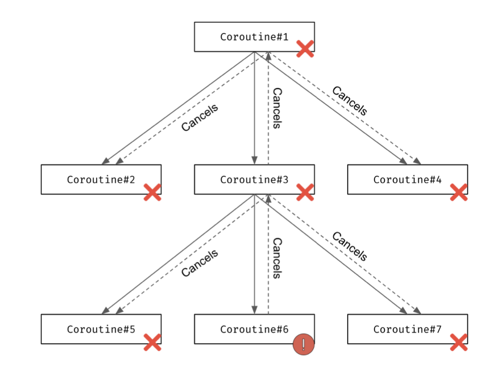
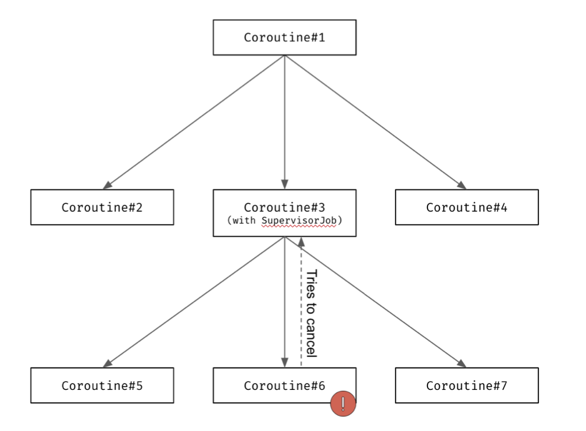
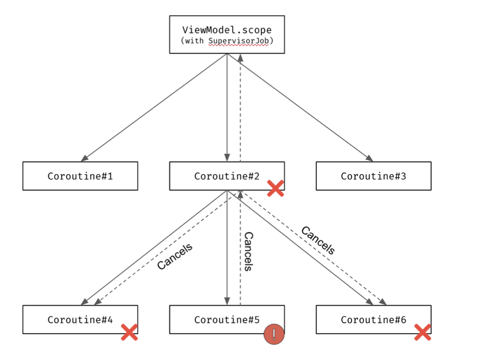

# 서론

Coroutine의 Exception Handling 또한 중요한 개념 중 하나이다.

일반적인 프로그램에서 Catch되지 않은 Uncaught Exception이 발생하면 break되는것처럼 Coroutine도 break시킨다.

# 예외 전파

다른점이라곤 coroutine builder들은 추가적으로 부모 coroutine들도 cancel시키며,
그 부모들은 cancel될 때 자식까지 cancel시키는 방식으로 최종적으로 가장 부모인 `runBlocking`까지 계속해서 전파된다.

root coroutine인 `runBlocking`까지 전파되게 되면 `runBlocking`도 예외를 다시 던져서 프로그램을 종료시킨다.

<br>

아래 예제를 보자.

``` kotlin
fun main(): Unit = runBlocking {
    launch {
        launch {
            delay(1000)
            throw Error("Some error")
        }
        
        launch {
            delay(2000)
            println("Will not be printed")
        }
        
        launch {
            delay(500) // 예외가 던져지는 것 보다 빠르게 실행된다.
            println("Will be printed")
        }
    }

    launch {
        delay(2000)
        println("Will not be printed")
    }
}

Will be printed
Exception in thread "main" java.lang.Error: Some error...
// 예외가 던져진 이후, 모든 coroutine들이 cancel되어 아무것도 출력되지 않는다.
```

`launch`를 더 선언한다고 해서 바뀌는건 없다.

Exception이 전파되는건 부모에서 자식으로, 자식에서 부모로 양방향으로 전파된다.



# Coroutine이 break되는걸 중단하기

Coroutine이 break되기 전에 예외를 catch하는건 좋지만, `Job`을 통해 통신하기 때문에 catch 구문은 너무 늦는다.

``` kotlin

fun main(): Unit = runBlocking {
    // 여기서 try - catch는 너무 늦는다.
    try {
        launch {
            delay(1000)
            throw Error("Some error")
        }
    } catch (e: Throwable) { // 도움이 되지 않는다.
        println("Will not be printed")
    }
    
    launch {
        delay(2000)
        println("Will not be printed")
    }
}

Exception in thread "main" java.lang.Error: Some error...
```

## SupervisorJob

Coroutine이 break 되는걸 방지하는 가장 좋은 방법은 `SupervisorJob`을 이용하는 방법이다.

`SupervisorJob`은 **자식의 Exception들을 무시하는 특별한 방식의 `Job`이다.**


다음과 같이도 사용할 수 있다.



보통 여러 Coroutine 을 실행시키는 `Job`에서 scope로 사용된다.

``` kotlin
fun main(): Unit = runBlocking {
    val scope = CoroutineScope(SupervisorJob())
    
    scope.launch {
        delay(1000)
        throw Error("Some error")
    }
    
    scope.launch {
        delay(2000)
        println("Will be printed")
    }
    
    delay(3000)
}

Exception...
Will be printed
```

일반적으로 하는 실수는 아래 코드처럼 **부모 coroutine을 파라미터로 넣는 것**이다.

``` kotlin
fun main(): Unit = runBlocking {
    // 이렇게 하면 안된다.
    // 부모가 없고 자식이 하나밖에 없는 SupervisorJob은 일반 Job처럼 동작한다.
    launch(SupervisorJob()) {
        launch {
            delay(1000)
            throw Error("Some error")
        }
        
        launch {
            delay(2000)
            println("Will not be printed")
        }
    }
    delay(3000)
}

Exception...
```

위 예제에서는 `SupervisorJob`을 파라미터로 받은 `launch`만 `SupervisorJob`의 직접적인 자식이 된다.

이런 상황에서는 `SupervisorJob`을 사용해서 얻는 이득이 거의 없다.

> Exception이 `runBlocking`까지 전파되지는 않는다.



`SupervisorJob`은 여러 Coroutine Builder들의 context로 사용되었을 때 더욱 큰 의미를 가진다.

각각의 coroutine은 cancel될 수 있지만, 서로서로는 cancel 시킬 수 없다.

``` kotlin
fun main(): Unit = runBlocking {
    val job = SupervisorJob()
    launch(job) {
        delay(1000)
        throw Error("Some error")
    }
    
    launch(job) {
        delay(2000)
        println("Will be printed")
    }
    
    job.join()
}

// 1초 후
Exception...
// 1초 후
Will be printed
```

### SupervisorScope

다른 방법은 Coroutine Builder를 `SupervisorScope`로 감싸는 것이다.

굉장히 간단하며, 자식의 Exception에 전파되지 않을 수 있기 때문에 유용하다.

``` kotlin
fun main(): Unit = runBlocking {
    supervisorScope {
        launch {
            delay(1000)
            throw Error("Some error")
        }
        
        launch {
            delay(2000)
            println("Will be printed")
        }
    }
    
    delay(1000)
    println("Done")
}

Exception...
Will be printed
// 1초 뒤
Done
```

`SupervisorScope`의 자세한 내용들은 다음 챕터에서 설명할 것이다.

일반적으로는 개별적인 여러 작업들을 실행하는 것이다.

``` kotlin
suspend fun notifyAnalytics(actions: List<UserAction>) = supervisorScope {
    actions.forEach { action ->
		launch {
            notifyAnalytics(action)
        }
	}
}
```

<br>

Exception의 전파를 멈추는 또 다른 방법은 `CoroutineScope`를 사용하는 것이다.

`CoroutineScope`는 부모에게 영향을 끼치지 않고, try - catch로 잡을 수 있다.

### Await

하지만 위에서 사용한 것 만으로는 부족할 때도 있다.

`async`는 다른 Coroutine Builder들과 비슷하게 부모를 break시켜 버린다.

하지만 다른점은 `supervisorJob`이나 `supervisorScope`를 사용하였더도, **`await()`을 호출하는 순간 부모를 break시키게 된다.**

다음 예제를 보자.

``` kotlin
class MyException : Throwable()

suspend fun main() = supervisorScope {
    val str1 = async<String> {
        delay(1000)
        throw MyException()
    }
    
    val str2 = async {
        delay(2000)
        "Text2"
    }
    
    try {
        println(str1.await())
    } catch (e: MyException) {
        println(e)
    }
    println(str2.await())
}

MyException
Text2
```

Coroutine이 Exception과 함께 종료되었고, 반환할 값이 없기 때문에 `MyException`이 `await()`에서 던져진다.

또한 다른 `async`는 다른 Coroutine의 영향을 받지 않고 계속해서 실행된다.

## CancelationException은 부모에게 전파되지 않는다.

만약 예외가 `CancellationException`의 하위 타입이면 부모에게 전파되지 않고, 현재 Coroutine만 취소된다.

``` kotlin
object MyNonPropagatingException : CancellationException()

suspend fun main(): Unit = coroutineScope {
    launch { // 1번 Coroutine을 실행한다.
        launch { // 1번 Coroutine의 자식 Coroutine을 실행한다.
            delay(2000)
            println("Will not be printed")
        }
        throw MyNonPropagatingException // 1번 Coroutine'만' cancel시키면서 자식 Coroutine을 cancel시킨다.
    }
    launch { // 2번 Coroutine을 실행한다.
        delay(2000)
        println("Will be printed")
    }
}

// 2초 뒤
Will be printed
```

# Coroutine Exception Handler

예외 처리를 할 때, 모든 예외들을 공통적으로 처리해야 한다면 default 동작을 정하는게 좋을 때도 있다.

이를 위해 `CoroutineExceptionHandler`을 사용하면 편한데, **예외가 부모로 전파되는걸 막아주진 않는다.**

하지만 예외가 발생했을 때, logging을 하는 등 특정 동작을 수행하면 편하다.

대표적으로 stackTrace를 출력하는게 default로 되어있는 `CoroutineExceptionHandler`이다.

``` kotlin
fun main(): Unit = runBlocking {
    val handler = CoroutineExceptionHandler { ctx, exception ->
		println("Caught $exception")
	}
    
    val scope = CoroutineScope(SupervisorJob() + handler)
    
    scope.launch {
        delay(1000)
        throw Error("Some error")
    }
    
    scope.launch {
        delay(2000)
        println("Will be printed")
    }
    
    delay(3000)
}

Caught java.lang.Error: Some error
Will be printed
```