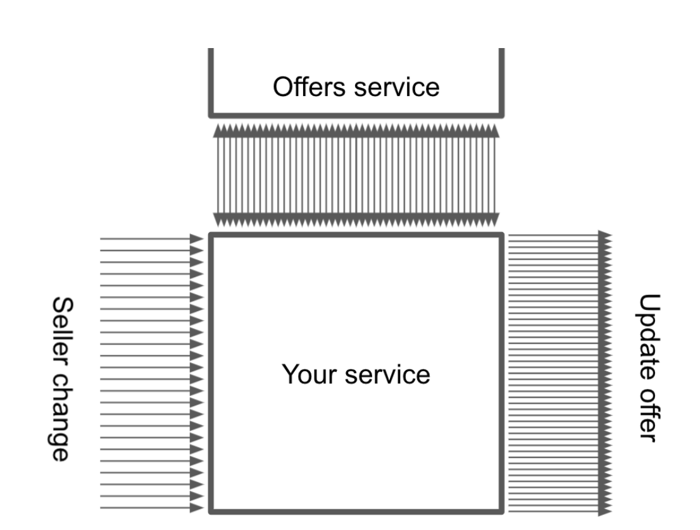
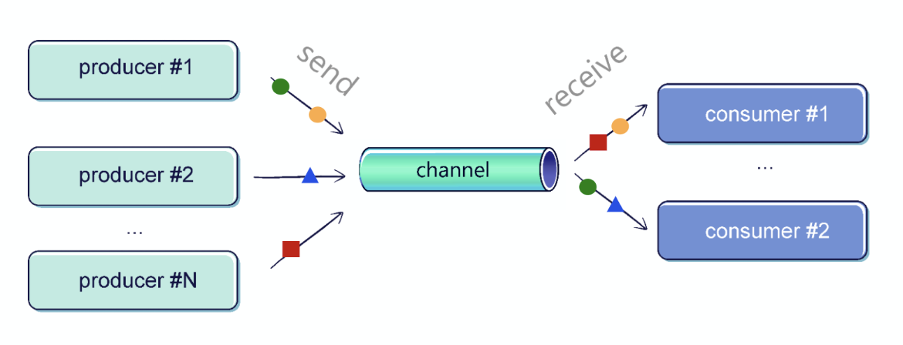
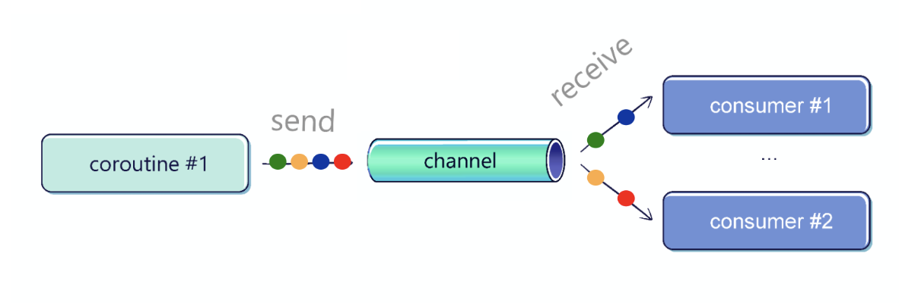

## 서론

Channel API는 **coroutine간의 통신 방식**이다.

많은 사람들이 파이프에 비유하지만, 글쓴이는 공용 책장 이라는 표현을 선호한다.

> 외국에서 길거리에 있는 작은 방으로, 다음과 같이 책을 가져와 누군가가 읽을 수 있도록 한다.
>
> 

여기서 한 명은 다른 사람이 읽을 수 있도록 책을 가져오고, 다른 사람은 그걸 자유롭게 가져갈 수 있다.

이게 `kotlinx.coroutines`의 `Channel`이 동작하는 방법이다.

`Channel`은 Producer`(Sender)`와 Consumer`(Receiver)`의 수에 제한을 두지 않지만, 보통은 Producer와 Consumer 하나씩 있는게 일반적이다.

또한 채널에 전송된 각각의 값들은 한 번만 수신된다.





`Channel`은 두 가지 인터페이스를 구현한 인터페이스 이다.

- Element의 전송과 channel을 닫기 위한 `SendChannel` 인터페이스
- Element를 받기 위한 `ReceiveChannel`

``` kotlin
interface SendChannel<in E> {
    suspend fun send(element: E)
    fun close(): Boolean
}

interface ReceiveChannel<out E> {
    suspend fun receive(): E
}

interface Channel<E> : SendChannel<E>, ReceiveChannel<E>
```

이러한 구분 덕분에, Channel의 진입점을 `ReceiveChannel` 또는 `SendChannel`으로 제한할 수 있다.

`send()`와 `receive()`는 둘 다 suspend 함수로, 중요한 특징이다.

- 만약 `Channel`에 element가 없을 때 `receive()`를 호출했을 때, 해당 coroutine은 suspend된다.
  우리가 아까 예제로 들었던 것 처럼, 책장에 책이 없다면 누군가가 책을 넣을 때까지 기다려야 한다.

- 반면에, `send()`는 `Channel`의 한계에 도달하게 되면 suspend 된다.

  > 곧 나오겠지만 대부분의 `Channel`은 제한이 있다.

  우리가 예제로 든 책장처럼, 책장이 가득 찼다면 누가 책을 가져갈 때까지 기다려야 한다

`Channel`의 가장 간단한 예제를 보기 위해, 여러 Producer와 여러 Consumer가 있어야 한다.

Producer는 Element를 전송하고, Consumer는 그것을 받는다.

``` kotlin
suspend fun main(): Unit = coroutineScope {
    val channel = Channel<Int>()
    
    launch {
       repeat(5) { index ->
           delay(1000)
           println("Producing next one")
           channel.send(index * 2)
       }
    }
    
    launch {
        repeat(5) {
            val received = channel.receive()
            println(received)
        }
    }
}

// 1초 뒤
Producing next one
0
// 1초 뒤
Producing next one
2
// 1초 뒤
Producing next one
4
// 1초 뒤
Producing next one
6
// 1초 뒤
Producing next one
8
```

이 코드는 완벽과는 거리가 멀다.

1. Consumer는 몇 개의 Element가 전송될지 알고 있어야 한다.

2. Producer가 전송하고 싶을 때까지 전송해 주고 싶을수도 있다.

   이를 위해 `consumeEach()`라는 메소드를 통해 각각의 메세지가 왔을 때마다 처리할 수 있다.

   > `consumeEach()`는 내부적으로 반복문을 돌며 Receive하고, 처리 도중 문제가 발생하면 channel을 닫아버린다.

``` kotlin
suspend fun main(): Unit = coroutineScope {
    val channel = Channel<Int>()
    launch {
       repeat(5) { index ->
           println("Producing next one")
           delay(1000)
           channel.send(index * 2)
		}
        channel.close()
   }
    
    launch {
        for (element in channel) {
            println(element)            
        }
        // channel.consumeEach { element ->
        //     println(element)
        // }
    }
}
```

이 방법의 가장 큰 단점은 까먹거나, 예외가 발생하는 등의 이유로 `Channel`을 close하지 않을수도 있다는 것이다.

만약 Producer가 예외때문에 coroutine이 cancel되면, Consumer는 계속해서 Element를 기다린다.

따라서 `ReceiveChannel`을 반환하는 `produce()`라는 Coroutine Builder를 사용하는게 훨씬 편하다.

``` kotlin
// x가 max보다 작을 때 까지 send한다.
fun CoroutineScope.produceNumbers(max: Int) = produce {
    for (i in 1..max) {
        send(i)
    }
}
```

`produce()`는 어찌 되었건 **채널이 close되면 끝낸다.**

> finished, stopped, cancelled 아무거나 상관없다.

그 덕분에 우린 close를 걱정하지 않아도 된다.

이러한 장점 때문에 `produce()`는 `Channel`을 생성할 때 주로 사용되는 방법이다.

## Channel 종류

우리가 설정한 채널의 용량에 따라 4가지 종류로 나뉘게 된다.

- **Unlimited:** `Channel.UNLIMITED`을 용량으로 가지는 채널로, 무제한의 Buffer를 가지고 있기 때문에 `send()`는 suspend 되지 않는다.
- **Buffered:** 정해진 양의 용량 또는 `Channel.BUFFERED`을 용량으로 가지는 채널로, `Channel.BUFFERED`은 기본적으로 64까지고, JVM에서 `kotlinx.coroutines.channels.defaultBuffer`설정을 override하면 바꿀 수 있다.
- **Rendezvous(기본값):** 0 또는 `Channel.RENDEZVOUS`(사실상 0과 같다)을 용량으로 가지는 채널로, **Producer와 Consumer가 만나야지만 메세지를 교환할 수 있다.**
  즉, 둘 중 하나는 다른 하나를 기다려야 하기 때문에 suspend 된다.
- **Conflated:** `Channel.CONFLATED`를 용량으로 가지는 채널로, 단 하나 Buffer만이 존재하기 때문에 두 개의 메세지를 보내면 항상 오래된게 덮어씌워진다.

이제 실전으로 넘어가서 `Channel`을 직접적으로 사용하겠지만, `produce()`함수를 이용해도 된다.

우선 Buffer의 테스트를 위해 Producer는 빠르게, Consumer는 느리게 만들겠다.

<br>

### Unlimited

우선 `Channel.Unlimited`는 **모든 Element를 처리해야 한다.**

``` kotlin
suspend fun main(): Unit = coroutineScope {
    val channel = produce(capacity = Channel.UNLIMITED) {
        repeat(5) { index ->
			send(index * 2)
			delay(100)
			println("Sent")
		}
    }
    
    delay(1000)
    
    for (element in channel) {
        println(element)
        delay(1000)
    }
}

Sent
// 0.1초 뒤
Sent
// 0.1초 뒤
Sent
// 0.1초 뒤
Sent
// 0.1초 뒤
Sent
// 0.6초 뒤
0
// 1초 뒤
2
// 1초 뒤
4
// 1초 뒤
6
// 1초 뒤
8
// 1초 뒤
```

### Buffered

정해진 크기의 Buffer가 가득 찰 때까지 우선 Produce한 후에, **Producer는 Consumer가 처리할 때까지 suspend된다.**

``` kotlin
suspend fun main(): Unit = coroutineScope {
    val channel = produce(capacity = 3) {
        repeat(5) { index ->
			send(index * 2)
			delay(100)
			println("Sent")
		}
    }
    
    delay(1000)
    
    for (element in channel) {
        println(element)
        delay(1000)
    }
}

Sent
// 0.1초 뒤
Sent
// 0.1초 뒤
Sent
// 0.8초 뒤
0
Sent
// 1초 뒤
2
Sent
// 1초 뒤
4
// 1초 뒤
6
// 1초 뒤
8
// 1초 뒤
```

### RENDEZVOUS

기본 설정값인 `Channel.RENDEZVOUS`을 용량으로 선택하게 되면, `send()`하기 전에 Consumer와 연결되기를 기다린다.

``` kotlin
suspend fun main(): Unit = coroutineScope {
    val channel = produce {
        // or produce(capacity = Channel.RENDEZVOUS) {
        repeat(5) { index ->
			send(index * 2)
			delay(100)
			println("Sent")
		}
    }
    
    delay(1000)
    
    for (element in channel) {
        println(element)
        delay(1000)
    }
}
0
Sent
// 1초 후
2
Sent
// 1초 후
4
Sent
// 1초 후
6
Sent
// 1초 후
8
Sent
// 1초 후
```

### Conflated

마지막으로, `Channel.CONFLATED`을 용량으로 선택하게 되면 이전의 Element를 지우고 덮어쓴다.

``` kotlin
suspend fun main(): Unit = coroutineScope {
    val channel = produce(capacity = Channel.CONFLATED) {
        repeat(5) { index ->
			send(index * 2)
			delay(100)
            println("Sent")
        }
    }
    delay(1000)
    
    for (element in channel) {
        println(element)
        delay(1000)
    }
}

Sent
// 0.1초 후
Sent
// 0.1초 후
Sent
// 0.1초 후
Sent
// 0.1초 후
Sent
// 0.6초 후
8
```

## Buffer Overflow가 발생했을 때

Buffer가 가득 찼을 때의 행동을 정의할 수 있다.

- **SUSPEND:** Buffer가 가득 찼을 때, `send()`메소드에서 suspend된다.
- **DROP_OLDEST:** Buffer가 가득 찼을 때, 가장 오래된 Element를 지운다.
- **DROP_LATEST:** Buffer가 가득 찼을 때, 가장 최근의 Element를 지운다.

눈치 챘을지 모르겠지만 `Channel.CONFLATED`은 용량을 1로 설정하고 On Buffer Overflow를 `DROP_OLDEST`로 설정한 것과 같다.

현재, `produce()` 함수에서는 on Buffer Overflow를 따로 설정할 수 없다.

> 주석을 보면, 너무 많은 파라미터를 허용하기 때문에 Public API로는 사용할 수 없다고 한다.

``` kotlin
suspend fun main(): Unit = coroutineScope {
    val channel = Channel<Int>(
        capacity = 2,
        onBufferOverflow = BufferOverflow.DROP_OLDEST
    )
    
    launch {
        repeat(5) { index ->
			channel.send(index * 2)
            delay(100)
            println("Sent")
		}
        channel.close()
    }
    
    delay(1000)
    
    for (element in channel) {
        println(element)
        delay(1000)
    }
}


Sent
// 0.1초 후
Sent
// 0.1초 후
Sent
// 0.1초 후
Sent
// 0.1초 후
Sent
// 0.6초 후
6
// 1초 후
8
```

> 여기서 `Channel`은 인터페이스이기 때문에 `Channel()`은 가짜 생성자다.

## 전달되지 않은 Element handler

`Channel()`함수의 파라미터중 우리가 알아야 할건 `onUndeliveredElement`이다.

`Element`는 여러 이유로 handle되지 않을수도 있다.

대부분 `Channel`이 닫히거나, cancel되는 등의 이유지만, `receive()`나  `receiveOrNull()`, `hasNext()`에서도 예외가 발생할 수도 있다.

일반적으로 **`onUndeliveredElement`는 이 `Channel`에 의해 전송된 리소스를 닫을 때 사용**한다.

``` kotlin
val channel = Channel<Resource>(capacity) { resource ->
	resource.close()
}
// or
//val channel = Channel<Resource>(
//    capacity,
//    onUndeliveredElement = { resource ->
//		resource.close()
//	}
//)

// Producer
val resourceToSend = openResource()
channel.send(resourceToSend)

// Consumer
val resourceReceived = channel.receive()

try {
   // 받은 resource를 처리
} finally {
    resourceReceived.close()
}
```

## Fan-out

여러 Coroutine은 하나의 `Channel`로부터 Receive할 수 있지만, 적절하게 Receive하려면 for 반복문을 사용해야 한다.

> `consumeEach()`는 여러 Coroutine에서 사용하기에 부적합하다.



``` kotlin
fun CoroutineScope.produceNumbers() = produce {
    repeat(10) {
        delay(100)
        send(it)
    }
}

fun CoroutineScope.launchProcessor(
    id: Int,
    channel: ReceiveChannel<Int>
) = launch {
    for (msg in channel) {
        println("#$id received $msg")
    }
}

suspend fun main(): Unit = coroutineScope {
    val channel = produceNumbers() repeat(3) { id ->
		delay(10)
		launchProcessor(id, channel)
	}
}

#0 received 0
#1 received 1
#2 received 2
#0 received 3
#1 received 4
#2 received 5
#0 received 6
// ...
```

각각의 `Element`는 공정하게 Coroutine들에게 분배된다.

`Channel`은 `Element`를 대기하는 Coroutine을 FIFO(First In First Out) 큐에 저장한다.

그렇기 때문에 Coroutine들에게 `Element`들이 순서대로 분배될 수 있다.

## Fan-in

Fan-out과 반대로 여러 Coroutine이 하나의 `Channel`에 `Element`를 전송할 수도 있다.


``` kotlin
suspend fun sendString(
    channel: SendChannel<String>,
    text: String,
    time: Long
) {
    while (true) {
        delay(time)
        channel.send(text)
    }
}

fun main() = runBlocking {
    val channel = Channel<String>()
    launch {
        sendString(channel, "foo", 200L)
    }
    launch {
        sendString(channel, "BAR!", 500L)
    }
    
    repeat(50) {
        println(channel.receive())
    }
    coroutineContext.cancelChildren()
}
```

## 여러 Channel 병합하기

가끔씩, 여러 `Channel`들을 하나로 합쳐야 할수도 있다.

이를 위해 다음 확장함수를 만들 수 있는데, `produce()`함수를 통해 여러 `Channel`을 병합해 준다.

``` kotlin
fun <T> CoroutineScope.fanIn(
    channels: List<ReceiveChannel<T>>
): ReceiveChannel<T> = produce {
    for (channel in channels) {
        launch {
            for (elem in channel) {
                send(elem)
            }
        }
    }
}
```

## pipeline

가끔 하나의 `Channel`에 produce된 값을 기반으로 다른 `Channel`에 전달하고 싶을 수도 있다.

이런 상황에서, 우린 이걸 *pipeline*이라고 부른다.

``` kotlin
// 1부터 3까지 숫자를 produce하는 채널
fun CoroutineScope.numbers(): ReceiveChannel<Int> = produce {
    repeat(3) { num ->
		send(num + 1)
	}
}

// channel에서 num을 받아 제곱해서 send하는 채널
fun CoroutineScope.square(numbers: ReceiveChannel<Int>) = produce {
    for (num in numbers) {
        send(num * num)
    }
}

suspend fun main() = coroutineScope {
    val numbers = numbers()
    val squared = square(numbers)
    for (num in squared) {
        println(num)
    }
}

1
4
9
```

## Coroutine간의 통신을 위한 Channel

`Channel`은 여러 Coroutine들이 서로 통신할 때 사용하기 좋다.

`Channel`은 공정성과 충돌(*shared state* 등)이 없음을 보장한다.

<br>

실제로 알아보기 전에 바리스타가 커피를 만들고 있는 상황을 상상해 보자.

각각의 바리스타들은 개별적으로 동작하는 각각의 coroutine이어야 한다.

각각의 커피들은 서로 다른 준비 시간을 가지지만, 주문이 온 순서대로 주문을 처리하고 싶다.

가장 쉬운 방법은 주문과 결과를 `Channel`로 전송하는 것이다.

이를 위한 바리스타는 다음과 같이 정의할 수 있다.

``` kotlin
suspend fun CoroutineScope.serveOrders(
    orders: ReceiveChannel<Order>,
    baristaName: String
): ReceiveChannel<CoffeeResult> = produce {
    for (order in orders) {
        val coffee = prepareCoffee(order.type)
        send(
            CoffeeResult(
                coffee = coffee,
                customer = order.customer,
                baristaName = baristaName
            )
        )
    }
}
```

pipeline을 설정하기 위해, 아까 봤던 `fanIn()` 확장 함수를 사용할 수 있다.

여기서는 여러 바리스타의 주문들을 합치기 위해서 사용될 수 있다.

``` kotlin
val coffeeResults = fanIn(
    serveOrders(ordersChannel, "Alex"),
    serveOrders(ordersChannel, "Bob"),
    serveOrders(ordersChannel, "Celine"),
)
```

## 일반적인 사용

우리가 일반적으로 `Channel`을 이용하는건 한 곳에서 값을 Produce하고, 다른쪽에서 처리하고 싶을 때 사용한다.

예를 들어 사용자의 클릭이나 서버의 알림에 응답하거나, 검색 결과를 시간에 따라 수정하는 것과 같다.

> 항공사나 네이버 쇼핑과 같이 여러 웹사이트를 조회해서 가장 저렴한 것을 찾아주는 것 등이 있을 수 있다.

하지만 대부분의 경우에는 `Channel`과 `Flow`의 결합체인 `channelFlow`나 `callbackFlow`를 사용한다.

<br>

글쓴이는 더 복잡한 경우에서 채널이 유용하다는걸 알았다.

예를 들어, 우리가 아마존과 같은 온라인 쇼핑몰을 운영하고 있다고 가정해보자.

우리의 서비스가 Seller들로부터 대량의 수정 요청을 받고, 이런 변경사항들이 모두 Offer에게 적용되어야 한다고 가정해 보자.

각각의 수정 요청에서, 우린 먼저 업데이트 할 Offer를 찾아야 하고, 하나씩 하나씩 수정해 나가야 한다.


이걸 전통적인 방법으로 하나하나 하는건 좋지 못한 방법이다.

하나의 판매자만 해도 수백, 수천개의 Offer들이 들어올 수 있다.

이 모든걸 하나의 긴 프로세스로 처리하는건 좋은 방법이 아니다.

<br>

1. 내부적으로 예외가 발생하거나, 서버가 재시작되면 우리가 어디까지 했는지 알수가 없다.
2. 하나의 큰 Seller가 서버를 마비시킬 수도 있다.
3. 서비스나 네트워크에 너무 많은 부하가 가면 안되기 때문에 동시에 너무 많은 네트워크 요청을 보내면 안된다.

해결법은 pipeline을 이용하는 것이다.

첫 번째 `Channel`은 처리해야 판매자 포함하고 있고, 두 번째 `Channel`은 update할 Offer들을 포함하고 있다.

이 `Channel`들은 Buffer를 가지고, 두 번째 `Channel`의 Buffer는 우리의 서비스가 이미 너무 많은 Offer 요청이 왔음에도 추가로 더 요청이 올 때, 더 많은 요청이 가지 않도록 막아준다.

그 덕분에 우리 서버는 같은 시간에 처리하는 Offer들의 수를 일정하게 유지시켜 준다.

<br>

또한 중간에 중복을 제거하는 등의 단계를 추가하기도 쉽다.

각 `Channel`을 listening할 Coroutine의 수를 설정함에 따라, 동시에 얼마나 많은 요청을 외부 서비스에 넘길지 정할 수도 있다.

이런것들을 잘 이용하는 것은 우리가 개발할 때, 굉장한 자유도를 가질 수 있다.

Persistence나 `Element`의 Uniqueness와 같은 장점들을 쉽게 추가할수도 있다.


``` kotlin
suspend fun handleOfferUpdates() = coroutineScope {
    val sellerChannel = listenOnSellerChanges()
    val offerToUpdateChannel = produce(capacity=UNLIMITED) {
        repeat(NUMBER_OF_CONCURRENT_OFFER_SERVICE_REQUESTS) {
            launch {
                for (seller in sellerChannel) {
                    val offers = offerService
                    	.requestOffers(seller.id)
                    offers.forEach { send(it) }
                }
            }
        }
    }
    
    repeat(NUMBER_OF_CONCURRENT_UPDATE_SENDERS) {
        launch {
            for (offer in offerToUpdateChannel) {
                sendOfferUpdate(offer)
            }
        }
    }
}
```

