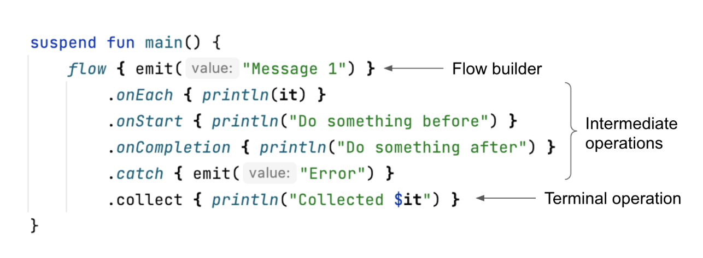

## 서론

`Flow`는 비동기적으로 계산되는 stream이라고 할 수 있다.

`Flow`인터페이스는 단지 `collect()`함수만 정의해 놨다.

> 여기서 `collect()`는 List의 `forEach`와 비슷하다.

``` kotlin
interface Flow<out T> {
    suspend fun collect(collector: FlowCollector<T>)
}
```

볼 수 있듯이, `collect()`는 `Flow`의 유일한 멤버 메소드다.

다른 모든 함수들은 확장 함수로 구현되어 있다.

이런 면에서 `Iterator` 인터페이스나 `Sequence`인터페이스와 비슷하다고 할 수 있다.

``` kotlin
interface Iterable<out T> {
    operator fun iterator(): Iterator<T>
}

interface Sequence<out T> {
    operator fun iterator(): Iterator<T>
}
```

## 값을 출력하는 방법 비교

`Flow`개념은 RxJava나 Reactor에 더 잘 설명되어 있을 것이다.

하지만 더 좋은 예제가 있다.

하나 이상의 값을 반환하는 함수가 있다고 해보자.

이 값들이 동시에 발행되었다고 가정할 때, List나 Set과 같은 Collection을 사용한다.

``` kotlin
fun allUsers(): List<User> = api
	.getAllUsers()
	.map { it.toUser() }
```

여기서 중요한건 **List나 Set은 모두 계산된 Collection이라는 것**이다.

값들의 계산이 시간이 꽤 걸리기 때문에, 모든 값들이 반환될 때까지 기다려야 한다.

``` kotlin
fun getList(): List<String> = List(3) {
    Thread.sleep(1000)
    "User$it"
}

fun main() {
    val list = getList()
    println("Function started")
    list.forEach { println(it) }
}

// 3초 뒤
Function started
User0
User1
User2
```

만약 Element가 하나씩 계산된다면 값이 나오자마자 처리할 수 있도록 하는게 낫다.

이건 `Sequence`로 문제를 해결할 수 있다.

``` kotlin
fun getSequence(): Sequence<String> = sequence {
    repeat(3) {
        Thread.sleep(1000)
        yield("User$it")
    }
}

fun main() {
    val list = getSequence()
    println("Function started")
    list.forEach { println(it) }
}

Function started
// 1초 뒤
User0
// 1초 뒤
User1
// 1초 뒤
User2
```

`Sequence`는 필요할 때 CPU 작업이나 blocking작업이라면 값을 필요로할 때 계산하도록 해주는 최고의 방법이다.

이미 알겠지만, `Sequence`의 종단 연산자들은 suspend함수가 아니다.

즉 내부적으로 Blocking이 일어난다는 의미고, `delay()`함수도 호출할 수 없다는 의미다.

``` kotlin
fun getSequence(): Sequence<String> = sequence {
    repeat(3) {
        delay(1000) // 컴파일 에러
        yield("User$it")
    }
}
```

`Flow`는 sequence의 오남용을 막기 위해 만들어졌다.

예를 들어 유저 정보를 HTTP 요청을 통해 가져오고 싶을 수 있다.

만약 위 코드를 그대로 사용하면 동작은 하겠지만 Thread를 Blocking해버린다.

``` kotlin
fun allUsersSequence(
    api: UserApi
): Sequence<User> = sequence {
    var page = 0
    do {
        val users = api.takePage(page++) // suspend함수이기 때문에 컴파일 에러가 발생한다.
        yieldAll(users)
    } while (!users.isNullOrEmpty())
}

```

Thread를 Blocking하는건 굉장히 위험하며, 우리가 원하지 않는 결과가 도출될 수도 있다.

더 명확하게 하기 위해 아래 예제를 보자.

`Sequence`를 사용했고, 그렇기 때문에 종단 연산자는 Blocking할 것이다.

따라서 **launch의 Thread와 같은 Thread를 사용한 Coroutine들이 모두 기다리게 된다.**

``` kotlin
fun getSequence(): Sequence<String> = sequence {
    repeat(3) {
        Thread.sleep(1000)
        // 만약 delay(1000)이 있었다면 같은 결과가 나타난다.
        yield("User$it")
    }
}

suspend fun main() {
    withContext(newSingleThreadContext("main")) {
        launch {
            repeat(3) {
                delay(100)
                println("Processing on coroutine")
            }
        }
        val list = getSequence()
        list.forEach { println(it) }
    }
}

// 1초 뒤
User0
// 1초 뒤
User1
// 1초 뒤
User2
Processing on coroutine
// 0.1초 뒤
Processing on coroutine
// 0.1초 뒤
Processing on coroutine
```

이 경우에는 `Sequence` 대신 `Flow`를 사용해야 한다.

`Flow`는 `Sequence`의 방식에서 Coroutine을 추가로 지원한다.

`Flow`의 builder와 연산자는 suspend 함수고, 그에 따라 structured concurrency와 적절한 예외 처리도 지원한다.

``` kotlin
fun getFlow(): Flow<String> = flow {
    repeat(3) {
        delay(1000)
        emit("User$it")
    }
}

suspend fun main() {
    withContext(newSingleThreadContext("main")) {
        launch {
            repeat(3) {
                delay(100)
                println("Processing on coroutine")
            }
        }
        val list = getFlow()
        list.collect { println(it) }
    }
}

// 0.1초 뒤
Processing on coroutine
// 0.1초 뒤
Processing on coroutine
// 0.1초 뒤
Processing on coroutine
// 0.7초 뒤
User0
// 1초 뒤
User1
// 1초 뒤
User2
```

Flow는 data stream에서 coroutine이 필요할 때 사용해야 한다.

예를 들어, API에서 페이지별로 user stream을 반환하는 상황 이라고 할 수 있다.

이 함수의 호출자는 다음 페이지의 user가 fetch 되는대로 UI에 띄우는 등 처리할 수 있고, 가져올 페이지 수도 정할 수 있다.

예를 들어 `allUsersFlow(api).first()`를 호출하게 되면 **오직 첫 번째 요소만 fetch하게 된다.**

반대로 `allUsersFlow(api).toList()`를 호출하게 되면 모두 조회하게 된다.

만약 `allUsersFlow(api).find { it.id == id }`를 호출하게 되면 조건에 맞는 무언가를 찾을 때까지만 fetch한다.

``` kotlin
fun allUsersFlow(
    api: UserApi
): Flow<User> = flow {
    var page = 0
    do {
        val users = api.takePage(page++) // suspending
        emitAll(users)
    } while (!users.isNullOrEmpty())
}
```

## Flow의 특징

- Flow의 종단 연산자들은 suspend 함수들이다.
- Coroutine의 기능들을 지원한다.
  - coroutine context나 예외 처리 관련 기능
  - structured concurrency

- `flow`는 suspend하지 않고, 따라서 scope도 필요로 하지 않는다.
- 종단 연산자는 suspend이기 때문에 호출한 coroutine과 부모 - 자식 관계를 맺는다.

<br>

아래 예제는 `CoroutineName`을 추가한 context가 `collect	`에서 flow builder의 람다식으로 어떻게 넘어가는지를 보여준다.

또한 `launch`가 `flow`에 의해 적절하게 cancel됨을 보여준다.

``` kotlin
// 이 함수는 suspend 함수가 아니고, CoroutineScope를 필요로 하지 않는다.
fun usersFlow(): Flow<String> = flow {
    repeat(3) {
        delay(1000)
        val ctx = currentCoroutineContext()
        val name = ctx[CoroutineName]?.name
        emit("User$it in $name")
    }
}

suspend fun main() {
    val users = usersFlow()
    
    withContext(CoroutineName("Name")) {
        val job = launch {
            // collect는 suspend 함수다.
            users.collect { println(it) }
        }
        
        launch {
            // 2100ms 이후에 cancel된다.
            delay(2100)
            println("I got enough")
            job.cancel()
        }
    }
}

// 1초 뒤
User0 in Name
// 1초 뒤
User1 in Name
// 1초 뒤
I got enough
```

## Flow 용어

모든 `Flow`는 몇 가지 요소로 구성되어 있다.

- Flow는 어디선가 시작되어야 한다.

  주로 flow builder를 통해 객체를 변환시켜서 시작되거나, 다른 함수에서 호출해서 가져온다.

  가장 중요한 옵션은 다음 챕터에서 설명하게 된다.

- `flow`에서 종단 연산자는 terminal operation이라고 부른다.
  여기서만 suspend되고 scope가 필요하기 때문에 매우 중요하다.
  일반적인 terminal operation은 `collect()`인데, 다른 종류들도 꽤 많다.

- terminal operation 전에는 intermediatediate operation, 즉 중간 연산자가 있을 수  있다.
  각각의 중간 연산자는 각각의 방법으로 flow를 변화시키게 된다.



## 실제의 use case

대부분의 경우에서 `Channel`보단 `Flow`를 필요로 하는 경우가 많다.

Data Stream을 요구할 경우, 필요할 때 요청하길 바라는 경우가 많기 때문이다.

DB의 변화를 감지하거나, 센서의 값 변화를 감지할 때와 같이 무언가를 관찰하고 있을 때, 웬만한 경우에는 Observer가 없다면 Listening할 필요도 없기 때문이다.

이것이 대부분의 경우에서 `Flow`를 선호하는 이유이다.

`Flow`의 일반적인 사용 방법은 다음과 같다.

- SSE, WebSocket, 푸쉬알림 등으로 온 메세지를 받을 때
- 사용자의 동작을 Observing할 때
- sensor 등과 같이 기기와 관련된 정보들을 받을 때
- DB의 변화를 Observing할 때

`Room`라이브러리를 통해 DB의 변화를 Observing하는건 다음과 같이 할 수 있다.

``` kotlin
@Dao
interface MyDao {
    @Query("SELECT * FROM somedata_table")
    fun getData(): Flow<List<SomeData>>
}
```

이제 API에서 response로 온 값을 `Flow`로 처리하는 방법에 대해 알아보자.

먼저, SSE나 푸쉬 알림으로 채팅을 구현하고 있다고 가정해 보자.

두 가지 정보 모두 `Flow`로 변화를 관찰하고, 합치고, view를 수정하기 편하다.

또 다른 예제로 시간이 지날수록 점점 더 나에게 맞는 추천 결과가 반환되는 메인 페이지가 있을 수 있다.

<br>

이러한 경우를 제외하더라도 `Flow`는 여러 동시성 작업을 동시에 수행하고 싶을 때에도 유용하다.

예를 들어, seller들의 목록이 있다고 가정하자.

각각의 seller들을 위한 offer를 fetch해서 보여줘야 한다.

``` kotlin
suspend fun getOffers(
    sellers: List<Seller>
): List<Offer> = coroutineScope {
    sellers
    	.map { seller ->
			async { api.requestOffers(seller.id) }
		}
    	.flatMap { it.await() }
}
```

위 방법은 웬만하면 괜찮지만, 한 가지 단점이 있다.

seller들이 많다면 한 번에 요청을 보내게 되는데, 이건 client의 입장에서도 요청을 받는 server의 입장에서도 좋지 않다.

물론 이걸 제한할 수는 있겠지만, 사용하는 쪽에서 제어하고 싶다면 `Flow`를 사용할 수 있다.

이 경우에 동시에 20개만 요청하도록 제한을 걸고싶다면 `flatMapMerge`라는 함수에서 concurreny를 20으로 설정해서 사용할 수 있다.

``` kotlin
suspend fun getOffers(
    sellers: List<Seller>
): List<Offer> = 
	sellers
    	.asFlow()
	    .flatMapMerge(concurrency = 20) { seller ->
    	    suspend { api.requestOffers(seller.id) }.asFlow()
		}.toList()

```

Collection 대신 `Flow`에서 연산을 수행함으로써 동시성 제어, 예외 처리등의 장점을 얻을 수 있다.

<br>

마지막으로 suspend 함수 대신 `Flow`를 통해 reactive 스타일의 코드를 짜는 곳도 있다.

안드로이드에서는 RxJava와 같이 쓰는게 대중적이지만, `Flow`가 더 낫다고 취급되는 경우도 있다.

함수에서 나의 값을 반환할 때 `Flow`가 사용되는 경우도 많다.

글쓴이는 그냥 suspend 함수를 쓰는걸 선호하지만, `Flow`를 사용하는것도 괜찮은 방법이다.

