## 서론

아까 전에 `Flow`를 값이 흐르는 파이프에 비유했다.

그렇기 때문에 **값들은 곱해지고, 버려지고, 변경되고, 결합되는 등 변경될 수 있다.**

`Flow`의 생성과 종단 연산자 사이의 연산자들을 *Flow processing*이라고 부른다.

> Collection과 비슷하다.

## map

먼저 중요한 함수 중 하나는 `map()`이다.

`map()`는 **변경 함수에 따라 Element를 변경시켜준다.**

``` kotlin
suspend fun main() {
    flowOf(1, 2, 3) // [1, 2, 3]
    	.map { it * it } // [1, 4, 9]로 변경된다.
    	.collect { print(it) } // 149
}
```

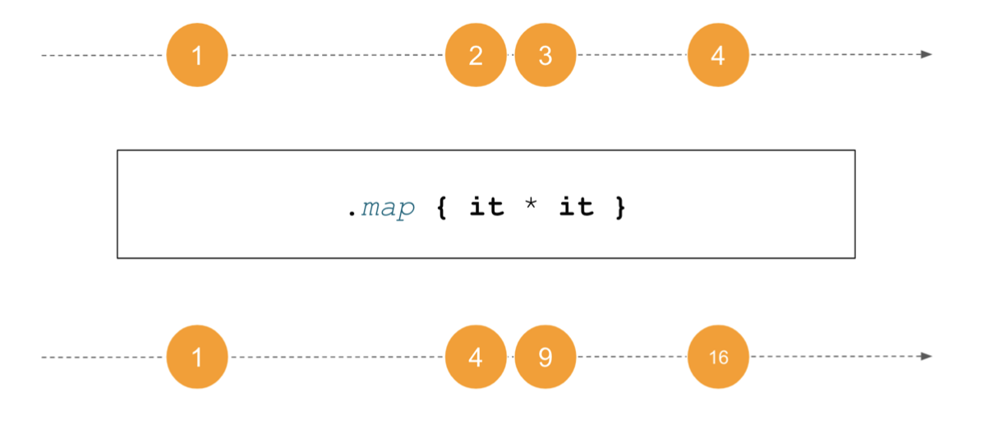

여기서 수평선은 시간을 의미하고, 노란 원에 있는 데이터는 해당 시간에 `Flow`에서 emit한 Element를 나타낸다.

위 쪽 선은 변환되기 전의 `Flow`, 아래 쪽 선은 변환된 후의 `Flow`를 나타낸다.

이 다이어그램은 다음과 같이 여러 연산자들을 나타낼수도 있다.

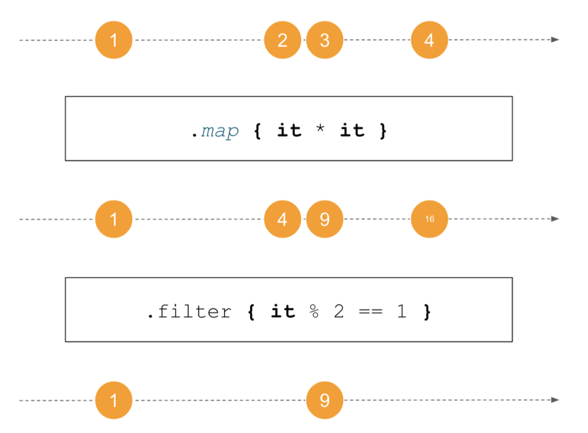

<br>

대부분의 Flow processing 함수들은 이전에 배웠던 것들로 쉽게 만들 수 있다.

`map()`은 `Flow`를 만들어 값을 받아, 처리하고, 반환하고 싶은 값을 emit하면 된다.

다음 `map()`은 실제 코드에서 살짝 단순화된 버전이다.

``` kotlin
fun <T, R> Flow<T>.map(
    transform: suspend (value: T) -> R
): Flow<R> = flow { // 새로운 Flow 생성
    collect { value -> // Receiver로 받은 람다식
        emit(transform(value))
    }
}
```

`map`은 굉장히 많이 사용되는 함수로, pakcing-unpacking이나 다른 타입으로의 변환 등에 사용할 수 있다.

``` kotlin
// 들어온 이벤트를 action으로 변경해 준다.
fun actionsFlow(): Flow<UserAction> =
	observeInputEvents()
        .map { toAction(it.code) }

// User를 Json으로 바꾸는 
fun getAllUser(): Flow<UserJson> =
	userRepository.getAllUsers()
		.map { it.toUserJson() }
```

## filter

다음으로 중요한 함수는 **주어진 조건에 만족하는 Element만 반환하는 `filter()`함수**가 있다.

``` kotlin
suspend fun main() {
    (1..10).asFlow() // [1, 2, 3, 4, 5, 6, 7, 8, 9, 10]
        .filter { it <= 5 } // [1, 2, 3, 4, 5]
        .filter { isEven(it) } // [2, 4]
        .collect { print(it) } // 24
}

fun isEven(num: Int): Boolean = num % 2 == 0
```

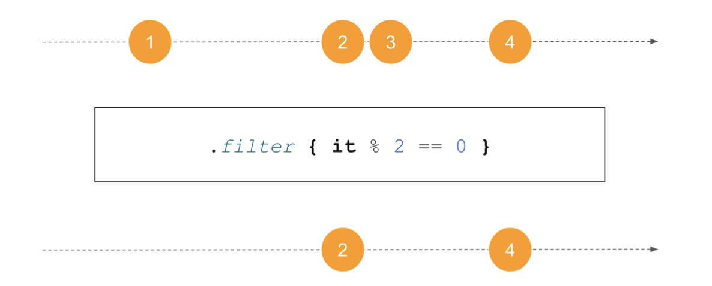

이 함수로 `flow` builder를 통해 간단하게 구현할 수 있다.

``` kotlin
fun <T> Flow<T>.filter(
    predicate: suspend (T) -> Boolean
): Flow<T> = flow { // 새로운 Flow 생성
    collect { value -> // Receiver로 받은 람다식
		if (predicate(value)) {
            emit(value)
        }
	}
}
```

우린 그냥 if문에 들어갈 조건문만 넣어주면 된다.

`filter()`는 주로 **필요 없는 정보를 제거**할 때 사용된다.

``` kotlin
fun actionsFlow(): Flow<UserAction> =
	observeInputEvents()
        .filter { isValidAction(it.code) }
        .map { toAction(it.code) }
```

## take / drop

**원하는 개수의 Element를 통과시키고 싶을 때 `take()`를 사용한다.**

``` kotlin
suspend fun main() {
    ('A'..'Z').asFlow()
        .take(5) // [A, B, C, D, E]
        .collect { print(it) } // ABCDE
}
```

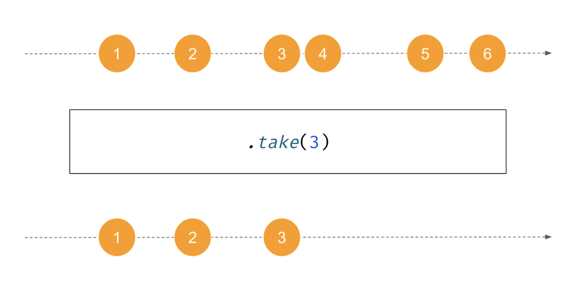

반대로 **`drop()`은 특정 개수의 Element를 무시한다.**

``` kotlin
suspend fun main() {
    ('A'..'Z').asFlow()
    	.drop(20) // [U, V, W, X, Y, Z]
    	.collect { print(it) } // UVWXYZ
}
```

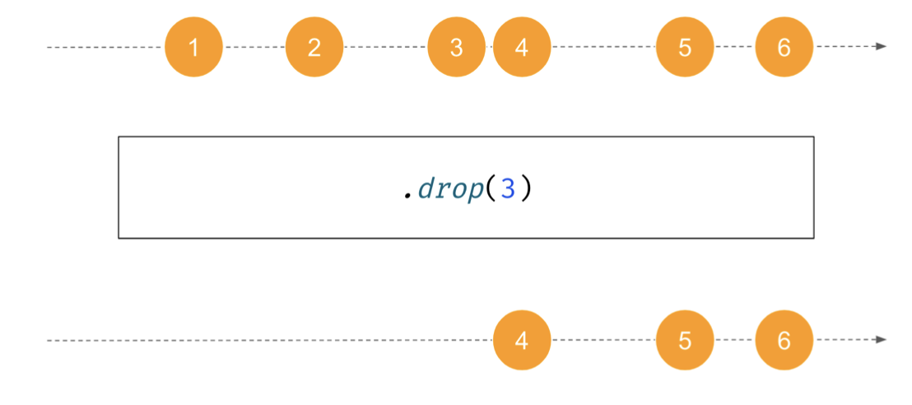

## Flow Processing은 어떻게 동작할까?

앞서 Flow Processing 함수들 몇 개와 `Flow`의 생명 주기 함수들을 보았다.

이것들은 굉장히 간단하게 구현되었고, 직접 열어봐도 한 눈에 알아볼 수 있을 정도로 특별할 것 없다.

이러한 함수들은 대부분 `flow` builder와 `collect()`, 그리고 람다식으로 구현되어 있다.

여기 대표적인 Flow Processing인 `map()`과 `flowOf()`을 간단하게 표현한 코드가 있다.

``` kotlin
suspend fun main() {
    flowOf('a', 'b')
        .map { it.uppercase() }
        .collect { print(it) } // AB
}

fun <T, R> Flow<T>.map(
    transform: suspend (value: T) -> R
): Flow<R> = flow {
    collect { value ->
        emit(transform(value))
    }
}

fun <T> flowOf(
    vararg elements: T
): Flow<T> = flow {
    for (element in elements) {
        emit(element)
    }
}
```

만약 `filter()`와 `map()` 함수를 inline하면 다음 코드면 된다.

``` kotlin
suspend fun main() {
    flow map@{ // 1
        flow flowOf@{ // 2
            for (element in arrayOf('a', 'b')) { // 3
                this@flowOf.emit(element) // 4
            }
        }.collect { value -> // 5
			this@map.emit(value.uppercase()) // 6
        }
    }.collect { // 7
        print(it) // 8
    }
}
```

이제 이 코드를 하나 하나 분석해 보자.

1. 1번에서 `flow@map`이 시작된다.
2. 7번에서 `collect()`가 호출된다.
3. 각각의 Element에 대해서 `map()`, 즉 대문자로 변경이 시작된다.
4. 2번에서 또 다른 `flow@flowOf` 가 호출된다.
5. 5번에서 `collect()`가 호출된다.
6. 3번에서 `a`와 `b`가 있는 배열을 `for - each`로 반복한다.
7. 4번에서 먼저 `a`를 `flow@flowOf`에 emit해준다.
8. 4번에서 emit된 값은 5번으로 전달된다.
9. 6번에서 그 값들을 대문자로 바꾸어 다시 `flow@map`으로 emit해 준다.
10. 7번에서 대문자로 바뀐 값이 모인다.
11. 8번에서 대문자로 바뀐 값을 출력한다.
12. 다시 3번으로 돌아간다.
13. 이번엔 `b`를 emit한다.
14. 4번에서 emit된 값을 5번으로 전달한다.
15. 6번에서 그 값들을 대문자로 바꾸어 다시 `flow@map`으로 emit해 준다.
16. 7번에서 대문자로 바뀐 값이 모인다.
17. 8번에서 대문자로 바뀐 값을 출력한다.

<br>

대부분의 Flow Processing 함수들과 `Flow`의 생명주기 함수들은 비슷하게 동작하기 때문에 이를 알면 `Flow`가 어떻게 동작하는지 알기 쉽다.

## merge, zip, combine

### merge

여러 개의 `Flow`들을 하나로 합친다고 생각해보자.

여기에는 몇 가지 방법이 있는데, 먼저 가장 간단하게 **`Flow`들의 Element들을 하나로 합치는 방법**이 있다.

이 방법은 `merge()`함수를 이용하게 되는데, 변경도 없고, Element의 출처는 신경쓰지 않는다는 특징이 있다.

``` kotlin
suspend fun main() {
    val ints: Flow<Int> = flowOf(1, 2, 3)
    val doubles: Flow<Double> = flowOf(0.1, 0.2, 0.3)
    
    val together: Flow<Number> = merge(ints, doubles)
    print(together.toList())
    // [1, 0.1, 0.2, 0.3, 2, 3]
    // or [1, 0.1, 0.2, 0.3, 2, 3]
    // or [0.1, 1, 2, 3, 0.2, 0.3]
    // 등 순서에 관계 없이 합쳐짐
}
```

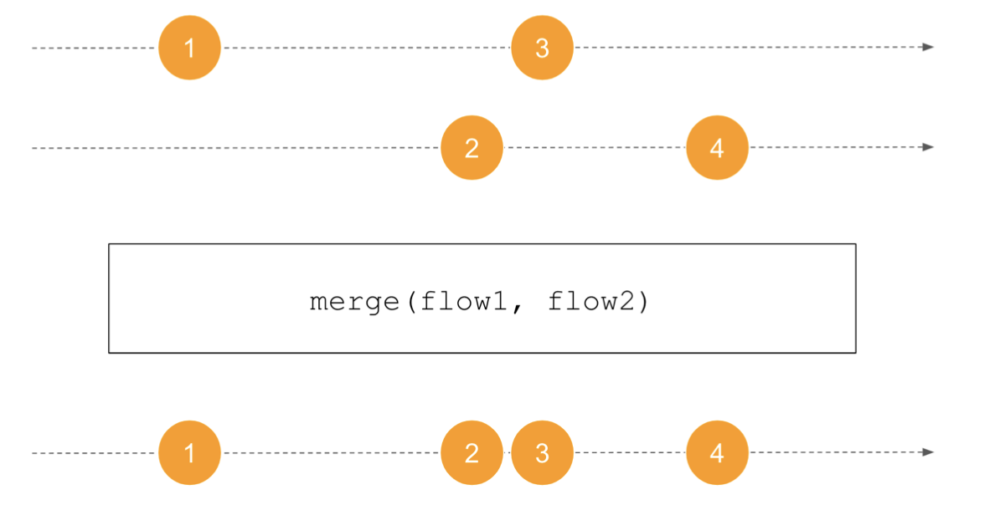

주의할 점은 **하나의 `Flow`에서 반대쪽 `Flow`가 Element를 전송하기를 기다리지 않는다는 것이다.**

무슨 소린가 싶을 수 있는데 다음 예제를 보자.

``` kotlin
suspend fun main() {
    val ints: Flow<Int> = flowOf(1, 2, 3)
    	.onEach { delay(1000) }
    val doubles: Flow<Double> = flowOf(0.1, 0.2, 0.3)
    
    val together: Flow<Number> = merge(ints, doubles)
    together.collect { println(it) }
}

0.1
0.2
0.3
// 1초 뒤
1
// 1초 뒤
2
// 1초 뒤
3
```

위 예제에서 첫 번째 `Flow`는 delay되어 하나씩 천천히 emit하고 있는 반면에, 두 번째 `Flow`는 빠르게 emit을 끝낸다.

<br>

`merge()`는 여러 Event가 있는데 같은 처리 과정을 거친다면 사용해야 한다.

``` kotlin
fun listenForMessages() {
    merge(userSentMessages, messagesNotifications)
        .onEach { displayMessage(it) }
        .launchIn(scope)
}
```

### zip

다음으로 **두 `Flow`에서 나온 Element를 하나씩 짝 지어주는 `zip()`함수가 있다.**

함수가 어떻게 묶여서 `Flow`에 emit될 지를 정해줄 수 있다.

각각의 Element들은 하나씩만 짝 지어질 수 있고, 만약 반대쪽 Element가 emit되지 않고 있다면 기다려야 한다.

만약 한 쪽 `Flow`가 모든 Element를 emit했는데 반대쪽 `Flow`에서는 아직 emit할 Element가 남아있다면, **남은 Element들은 유실되며 끝난다.**

> 남녀 한 쌍으로 묶여서 춤을 춘다고 생각하면 된다.
>
> 순서대로 남성 한 명은 여성 한 명만을 짝으로 가질 수 있고, 어느 한 쪽의 짝이 나오지 않는다면 계속 기다려야 한다.
>
> 만약 모든 여성이 남성과 짝지어졌지만, 짝 지어지지 않은 남성이 있다면 춤을 추지 못한다.

``` kotlin
suspend fun main() {
    val flow1 = flowOf("A", "B", "C")
    	.onEach { delay(400) }
    val flow2 = flowOf(1, 2, 3, 4)
    	.onEach { delay(1000) }
    
    flow1.zip(flow2) { f1, f2 -> "${f1}_${f2}" }
        .collect { println(it) }
}

// 1초 뒤
A_1
// 1초 뒤
B_2
// 1초 뒤
C_3
```

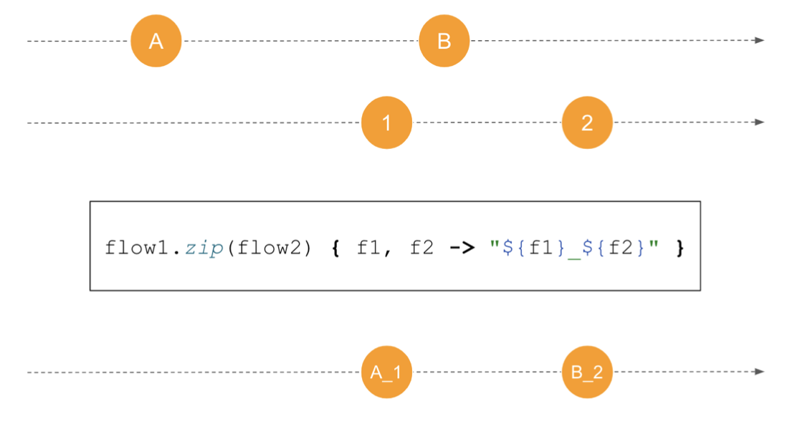

### combine

마지막으로 `combine()`이 있는데, `zip()`과 비슷한 점이 많다.

- Element끼리 짝을 짓는다.
- 느린 쪽의 `Flow`를 기다려 준다.

하지만 `combine()`을 사용할 때에는 **새로운 Element가 이전 Element의 자리를 대체한다**는 특징이 있다.

만약 첫 번째 쌍이 맞춰졌고 다음 Element가 도착했다면, 한 번 쌍이 맞춰진 Element와 새로 온 Element가 쌍이 맞춰진다.

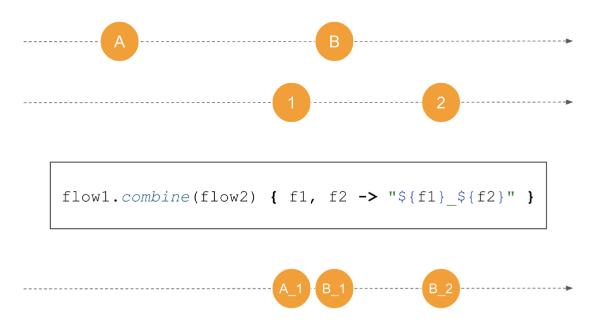

`zip()`은 하나의 `Flow`가 Element를 소진하면 끝나는 것에 반해, **`combine()`은 이러한 제한 없이 둘 다 Element를 소진한 후에야 종료된다.**

``` kotlin
suspend fun main() {
    val flow1 = flowOf("A", "B", "C")
    	.onEach { delay(400) }
    
    val flow2 = flowOf(1, 2, 3, 4)
    	.onEach { delay(1000) }
    
    flow1.combine(flow2) { f1, f2 -> "${f1}_${f2}" }
        .collect { println(it) }
}

// 1초 뒤
B_1
// 0.2초 뒤
C_1
// 0.8초 뒤
C_2
// 1초 뒤
C_3
// 1초 뒤
C_4
```

`combine()`은 변경이 잦은 두 개의 `Flow`를 관찰할 때 사용할 수 있다.

처음에 무조건 한 쌍이 이루어져야 하기 때문에, 한 쪽에서만 변경되면 관측이 안될 수도 있다.

그렇기 때문에 기본값을 주게 되면 **둘 중 어느쪽에서 변경사항이 발생해도 모두 관측할 수 있다.**

``` kotlin
userUpdateFlow.onStart { emit(currentUser) }
```

일반적으로는 View에서 둘 중 하나만 변경될 수 있는 경우에 이걸 사용하면 좋다.

예를 들어, 알림 뱃지가 있는데 이게 현재 사용자의 상태, 그리고 알림이 오면 변경되어야 한다고 가정해 보자.

그러면 우린 둘 다 View를 수정하기 위해 관찰하고 있어야 한다.

``` kotlin
userStateFlow
    .combine(notificationsFlow) { userState, notifications ->
        updateNotificationBadge(userState, notifications)
    }
.collect()
```

## fold와 scan

Collection Processing함수를 사용한다면 `fold()`함수를 알 것이다.

**모든 값들을 하나로 계산할 때 사용**되며, 두 개의 값에 대한 연산을 넣어주면 초깃값으로 시작해 연산을 Element마다 반복해 준다.

<br>

예를 들어, 초깃값이 0이고 연산이 덧셈 이라고 가정해 보자.

그러면 다음과 같은 순서로 결과는 모든 숫자의 합이 될 것이다.

1. 결과에 초깃값 0이 할당된다.
2. 첫 번째 Element가 연산을 수행한다. 즉, 기존의 결과에 이 값을 더해준다.
3. 다음 Element가 연산을 수행하여 `초깃값 + 첫 번째 Element`인 값에 새로운 Element를 더해준다.
4. 반복된다.

``` kotlin
fun main() {
    val list = listOf(1, 2, 3, 4)
    val res = list.fold(0) { acc, i -> acc + i } // 기본값 0으로 계속 더함
    println(res) // 10
    
    val res2 = list.fold(1) { acc, i -> acc * i } // 기본값 1로 계속 곱함
    println(res2) // 24
}
```

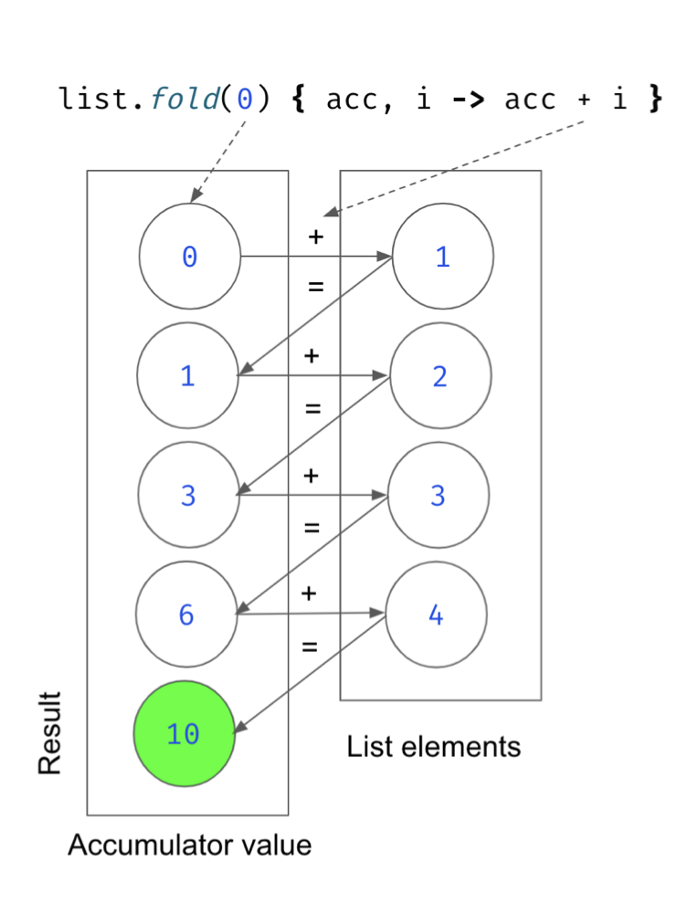

`fold()`는 종단 연산자로, `Flow`에서도 사용할 수 있다.

하지만  **`collect()`처럼 `Flow`가 종료될 때까지 suspend되게 된다.**

``` kotlin
suspend fun main() {
    val list = flowOf(1, 2, 3, 4)
    	.onEach { delay(1000) }
    val res = list.fold(0) { acc, i -> acc + i }
    println(res)
}

// 4초 후
10
```

<br>

Collection Processing에서 `fold()`대신 `scan()`이라는 것도 있는데, **`fold()`와 다르게 중간 연산자**이다.

``` kotlin
fun main() {
    val list = listOf(1, 2, 3, 4)
    val res = list.scan(0) { acc, i -> acc + i }
    println(res) // [0, 1, 3, 6, 10]
}
```


`Flow`에서도 역시 지원하는데, **값을 받는 즉시 처리하기 때문에 유용하다.**

``` kotlin
suspend fun main() {
    flowOf(1, 2, 3, 4)
        .onEach { delay(1000) }
        .scan(0) { acc, v -> acc + v }
        .collect { println(it) }
}

0
// 1초 뒤
1
// 1초 뒤
3
// 1초 뒤
6
// 1초 뒤
10
```

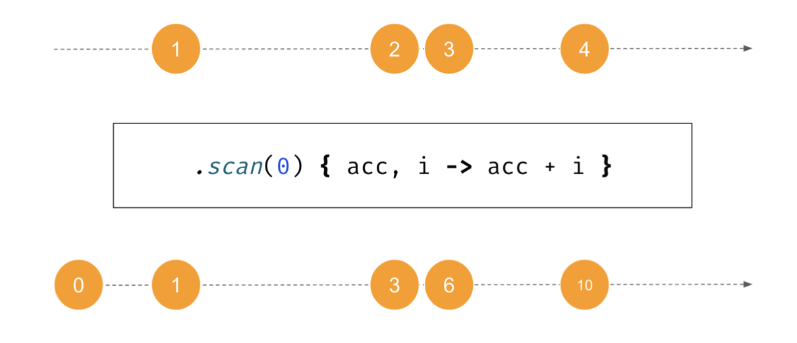

`scan()`은 `collect()`전에 넣어주기만 하면 간단하게 사용할 수 있다.

1. 초깃값을 emit해 준다.
2. 다음 값이 들어올 때마다 연산을 한 후의 값을 emit한다.

``` kotlin
fun <T, R> Flow<T>.scan( initial: R,
    operation: suspend (accumulator: R, value: T) -> R
): Flow<R> = flow {
    var accumulator: R = initial
    emit(accumulator)
    
    collect { value ->
        accumulator = operation(accumulator, value)
        emit(accumulator)
    }
}
```

`scan()`은 주로 `flow()`에 변경이 생겼을 때, 변경에 대한 결과 값이 필요할 때 사용한다.

``` kotlin
val userStateFlow: Flow<User> = userChangesFlow
	.scan(user) { acc, change -> user.withChange(change) }

val messagesListFlow: Flow<List<Message>> = messagesFlow
	.scan(emptyList()) { acc, message -> acc + message }
```

## flatMapConcat, flatMapMerge, flatMapLatest

Collection Process에서 자주 사용되는 또 다른 함수는 `flatMap()`이다.

Collection의 경우에는 `map()`과 비슷하지만 **평탄화된 Collection을 반환해 주어야 한다.**

예를 들어 전에는 부서 목록이 있고, 각각의 부서에는 직원 목록이 있다고 해보자.

여기서 만약 직원 목록을 꺼내오려면 `flatMap()`을 사용하면 된다.

``` kotlin
val allEmployees: List<Employee> = departments
	.flatMap { department -> department.employees }

// 만약 map을 사용했다면 List<List<Employee>>와 같이 타입이 더럽고 처리하기 힘들다.
val listOfListsOfEmployee: List<List<Employee>> = departments
	.map { department -> department.employees }
```

<br>

그렇다면 `Flow`에서는 `flatMap()`을 언제 쓸 수 있을까?

Collection Process처럼 `Flow<Flow<>>`와 같은 타입을 `Flow<>`로 풀어줄 수도 있을 것 같다.

하지만 문제는 **`Flow`의 값은 나중에 들어올 수도 있다는 것**이다.

그렇다면 `Flow<Flow>`의 Element인 `Flow`는 첫 번째 `Flow`가 처리된 후 두 번째 `Flow`가 처리될까? 아니면 동시에 일어날까?

명확한 답이 없기에, `Flow`에는 `flatMap()`함수가 없다.

그 대신, `flatMapConcat()`, `flatMapMerge()`, `flatMapLatest()`가 있다.

### flatMapConcat

`flatMapConcat()`은 **하나의 `Flow`씩 처리하는 방법**이다.

따라서 첫 번째 `Flow`가 처리된 후에 두 번째 `Flow`를 처리할 수 있다.

이것이 아래 예제에서 `1_A`, `2_A`, `3_A`, `1_B`와 같은 순서로 출력되는 이유다.

``` kotlin
fun flowFrom(elem: String) =
	flowOf(1, 2, 3)
		.onEach { delay(1000) }
		.map { "${it}_${elem} " }

suspend fun main() {
    flowOf("A", "B", "C")
        .flatMapConcat { flowFrom(it) }
        .collect { println(it) }
}

// 1초 뒤
1_A
// 1초 뒤
2_A
// 1초 뒤
3_A
// 1초 뒤
1_B
// 1초 뒤
2_B
// 1초 뒤
3_B
// 1초 뒤
1_C
// 1초 뒤
2_C
// 1초 뒤
3_C
```

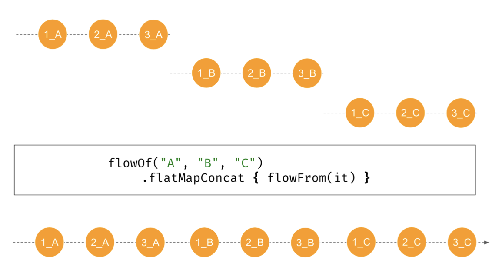

### flatMapMerge

두 번째로, **`Flow`들을 동시에 처리하는 방법**인 `flatMapMerge()`가 있다.

``` kotlin
fun flowFrom(elem: String) = flowOf(1, 2, 3)
	.onEach { delay(1000) }
	.map { "${it}_${elem} " }

suspend fun main() {
    flowOf("A", "B", "C")
        .flatMapMerge { flowFrom(it) }
        .collect { println(it) }
}

// 1초 뒤
1_A
1_B
1_C
// 1초 뒤
2_A
2_B
2_C
// 1초 뒤
3_A
3_B
3_C
```

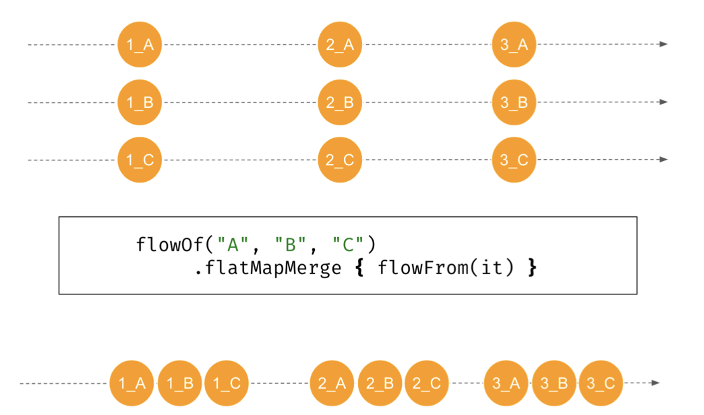

동시에 처리될 `Flow`의 개수는 `concurrency` 파라미터로 넘겨줄 수 있다.

기본적으로 16개지만, JVM에서는 `DEFAULT_CONCURRENCY_PROPERTY_NAME`에 값을 따로 설정해 주면 바꿀 수 있다.

``` kotlin
suspend fun main() {
    flowOf("A", "B", "C")
        .flatMapMerge(concurrency = 2) { flowFrom(it) }
        .collect { println(it) }
}

// 1초 뒤
1_A
1_B
// 1초 뒤
2_A
2_B
// 1초 뒤
3_A
3_B
// 1초 뒤
1_C
// 1초 뒤
2_C
// 1초 뒤
3_C
```

이건 일반적으로 **각각의 Element에 대해 API요청이 있을 때 사용한다.**

예를 들어, 카테고리 목록이 있고 각각의 카테고리마다 Offer들을 요청해야 한다고 해보자.

`async()`를 통해 할 수 있겠지만, `flatMapMerge()`를 이용했을 때의 장점은 다음과 같다.

- 한 번에 몇 개가 동시에 실행될지 파라미터로 쉽게 결정할 수 있다.
- 일단 `Flow`를 반환해 주고, 나중에 실제 요소가 도착했을 때 값을 줄 수 있다.

``` kotlin
suspend fun getOffers(
    categories: List<Category>
): List<Offer> = coroutineScope {
    categories
        .map { async { api.requestOffers(it) } }
        .flatMap { it.await() }
}

// 더 나은 방법
suspend fun getOffers(
    categories: List<Category>
): Flow<Offer> = coroutineScope {
    categories.asFlow()
        .flatMapMerge(concurrency = 20) {
            suspend { api.requestOffers(it) }.asFlow()
            // flow { emit(api.requestOffers(it)) } 도 괜찮다.
        }
}
```

### flatMapLatest

`flatMapLatest()`는 조금 특이한데, **새로운 `Flow`를 요청하면 처리하고 있던 `Flow`를 무시해 버린다.**

따라서 `A`, `B`, `C` 사이에 delay가 없다면 `1_C`, `2_C`, `3_C`만 출력될 것이다.

``` kotlin
fun flowFrom(elem: String) =
	flowOf(1, 2, 3)
		.onEach { delay(1000) }
		.map { "${it}_${elem} " }

suspend fun main() {
    flowOf("A", "B", "C")
        .flatMapLatest { flowFrom(it) }
        .collect { println(it) }
}

// 1초 뒤
1_C
// 1초 뒤
2_C
// 1초 뒤
3_C
```

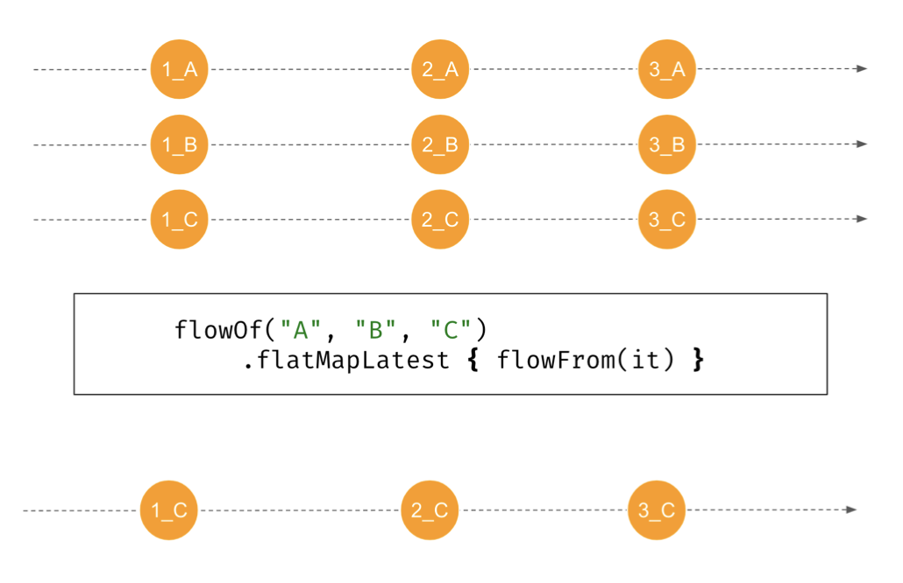

Flow가 처음에 `delay()`되면 더 재밌어진다.

``` kotlin
fun flowFrom(elem: String) =
	flowOf(1, 2, 3)
		.onEach { delay(1000) }
		.map { "${it}_${elem} " }

suspend fun main() {
    flowOf("A", "B", "C")
        .onEach { delay(1200) }
        .flatMapLatest { flowFrom(it) }
        .collect { println(it) }
}

// 2.2초 뒤
1_A
// 1.2초 뒤
1_B
// 1.2초 뒤
1_C
// 1초 뒤
2_C
// 1초 뒤
3_C
```

1.2초 뒤에 `A`부터 `flatMapLatest()`함수에 들어가게 된다.

`flowFrom()`에서 처음에 1초만에 `1_A`라는 값을 `Flow`에 바로 emit해 주게 된다.

하지만, 0.2초 후 다음 Element인 `B`가 나타나게 되고, 이 값 또한 1초만에 `1_B`라는 값을 emit하고 다음 Element인 `C`에게 자리를 넘겨주게 된다.

이제 마지막 `Flow`이기 때문에 `C`는 방해받지 않고 `1_C`, `2_C`, `3_C`를 모두 emit할 수 있다.

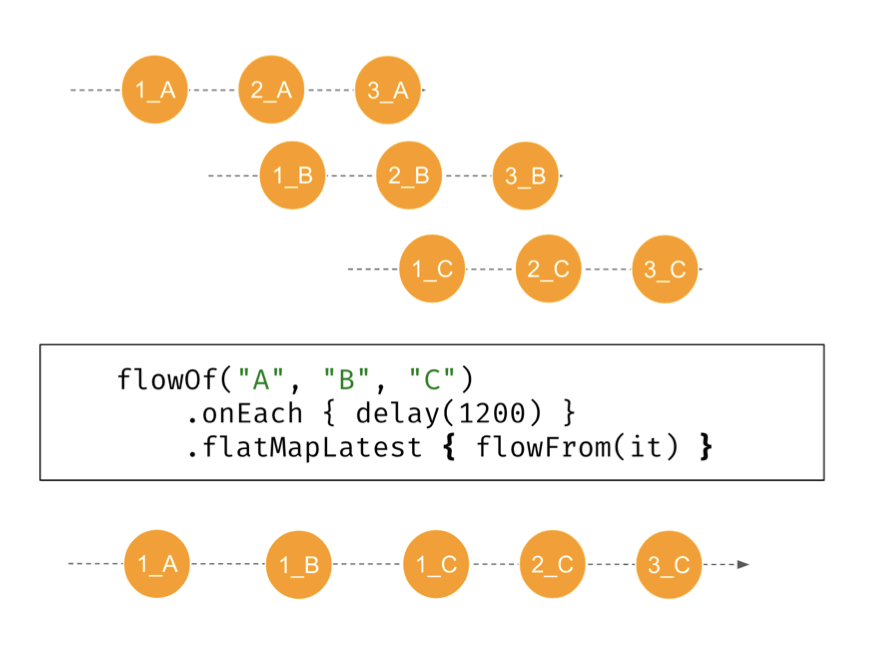

## 종단 연산자

마지막으로, Flow Processing을 끝내는 종단 연산자가 있다.

지금까지는 `collect()`만 사용해 왔다.

하지만 여러 종류가 있고, Collection이나 Sequence에서 제공하는 것과 비슷한 것들을 `Flow`도 제공한다.

개수를 세기 위한 `count()`, 첫 번째 Element를 가져오기 위한 `first()`나 `firstOrNull()`, Element의 값을 계산하기 위한 `fold()`와 `reduce()`등이 있다.

이러한 연산자들은 suspend함수들이고, `Flow`가 completed일 때 값을 가져오게 된다.

``` kotlin
suspend fun main() {
    val flow = flowOf(1, 2, 3, 4) // [1, 2, 3, 4]
       .map { it * it } // [1, 4, 9, 16]
    
    println(flow.first()) // 1
    println(flow.count()) // 4
    println(flow.reduce { acc, value -> acc * value }) // 576
    println(flow.fold(0) { acc, value -> acc + value }) // 30
}

```

지금은 `Flow`에 종단 연산자들이 그렇게 많지는 않지만, 필요하다면 직접 만들수도 있다.

예를 들어 Int를 sum해주는 함수는 다음과 같이 만들 수 있다.

``` kotlin
suspend fun Flow<Int>.sum(): Int {
    var sum = 0
    collect { value ->
		sum += value
	}
    return sum
}
```

