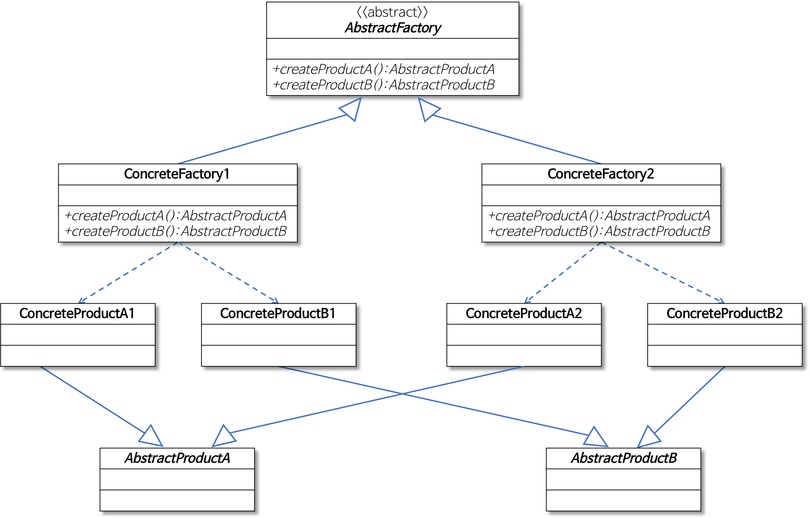

# Factory 패턴

### 소개

---

Factory 패턴은 디자인 패턴 중 하나로, **객체 생성을 인터페이스를 통해 하는 것**을 의미한다.


new 키워드를 사용하던 방법은 변경 또는 확장에서 불리하다.

하지만 인터페이스에 맞춰서 코딩하게 되면 다형성에 의해 변화에 쉽게 대응할 수 있다.


### Factory Method 패턴

---

Factory Method 패턴은 **객체 생성을 위한 인터페이스**를 정의한다.

객체를 만들 때, **어떤 클래스의 인스턴스를 만들지는 서브클래스에서 정한다.**

Factory Method 패턴은 객체를 생성해서 반환하는 것이다.


이 디자인 패턴이 사용되는 이유는, 결합도를 낮춰주기 때문에 자주 사용된다.


### Factory Method 패턴예제

---

``` java
switch(type){
    case("space"):
        suit = new SpaceSuit();
        break;
    case("hydro"):
        suit = new HydroSuit();
        break;
    case("stealth"):
        suit = new StealthSuit();
        break;
    default:
        suit = new CombatSuit();

```

위와 같이 type에 따라 new 키워드를 통해 다른 객체를 생성하는 코드가 있다.

만약 suit의 종류가 하나 추가되면 case를 추가해야 하는데, case가 하나 추가하는 작업은 부담스럽다.


이럴때 Factory 패턴을 사용하면 된다.

``` java
public abstract class Suit{
    public abstract String getName();
}

public class SpaceSuit extends Suit{

    @Override
    public String getName(){
        return "SpaceSuit";
    }
}

public class HydroSuit extends Suit{

    @Override
    public String getName(){
        return "HydroSuit";
    }
}

public class StealthSuit extends Suit{

    public String getName(){
        return "StealthSuit";
    }
}

public class CombatSuit extends Suit{

    @Override
    public String getName(){
        return "CombatSuit";
    }
}
```

이렇게 하게 되면 다형성에 의해 Suit라는 타입에 모든 Suit들이 올 수 있다.

``` java
public abstract class SuitFactory{
    public abstract Suit createSuit(String type);
}

public class TypeSuitFactory extends SuiFactory{

    @Override
    public createSuit(String type){
        Suit suit = null;

        switch(type){
            case("space"):
                suit = new SpaceSuit();
                break;
            case("hydro"):
                suit = new HydroSuit();
                break;
            case("stealth"):
                suit = new StealthSuit();
                break;
            default:
                suit = new CombatSuit();
        }
        return suit;
    }
}
```

또한 Factory를 분리해서 실제 사용할 때에는 Factory 패턴의 코드를 신경쓸 필요가 없게 된다.

그리고 비지니스 로직의 변경에 따라 코드의 수정을 최소화 할 수 있다.


### Abstract Method 패턴

---

**구체적인 클래스에 의존하지 않고, 서로 연관되거나 의존적인 객체들의 조합을 만드는 인터페이스**이다.



- AbstractFactory는 모든 Factory의 부모 클래스 이다.
- ConcreteFactory는 AbstractFactory를 구현한 클래스로, 추상메소드를 오버라이딩해서 실질적으로 객체를 생성한다.
- AbstractProduct는 인터페이스로, Factory에서 만들 모든 객체들이 implements 하고 있다.
- ConcreteProduct는 구체적인 객체를 의미한다.


어떻게 보면 Factory Method 패턴을 좀 더 캡슐화한 방법이다.

그렇다고 해서 Factory Method 패턴은 별로고 Abstract Method 패턴은 좋다 라는게 아니다.

둘 각각의 특징을 가지고 있으니 상황에 맞게 사용하면 된다.


### Abstract Factory 패턴 예제

``` java
public interface BuildingMaterialsFactory {
    public Cement createCement();
    public Wood createWood();
}

public class EuropeMaterialsFactory implements BuildingMaterialsFactory {
    public Cement createCement() {
        return new MixtureCement();
    }

    public Wood createWood() {
        return new WalnutWood();
    }
}


public class AsiaMaterialsFactory implements BuildingMaterialsFactory {
    public Cement createCement() {
        return new PortlandCement();
    }

	public Wood createWood() {
		return new OakWood();
	}
}
```

해당 Factory를 사용하는 클래스는 다음과 같이 하면 된다.

``` java
public class EuropeStyleUniversity extends Building {	// Building 이라는 객체
    private BuildingMaterialsFactory materialsFactory;

    public EuropeStyleUniversity(BuildingMaterialsFactory materialsFactory) {
        this.materialsFactory = materialsFactory;
        super.name = "유럽식 건물";
    }

    @Override
    public void buildFoundation() {
        System.out.println("분수");
        super.cement = materialsFactory.createCement();
        super.wood = materialsFactory.createWood();
    }
}

public class EuropeConstructionFirm extends ConstructionFirm {
    @Override
    public Building getBuildingInstance(BuildingType type) {
        Building building = null;

        BuildingMaterialsFactory materialsFactory = new EuropeMaterialsFactory();

        switch (type) {
            case HOSPITAL:
                building = new EuropeStyleHospital(materialsFactory);
                break;
            case UNIVERSITY:
                building = new EuropeStyleUniversity(materialsFactory);
                break;
        }

        return building;
    }
}

```

