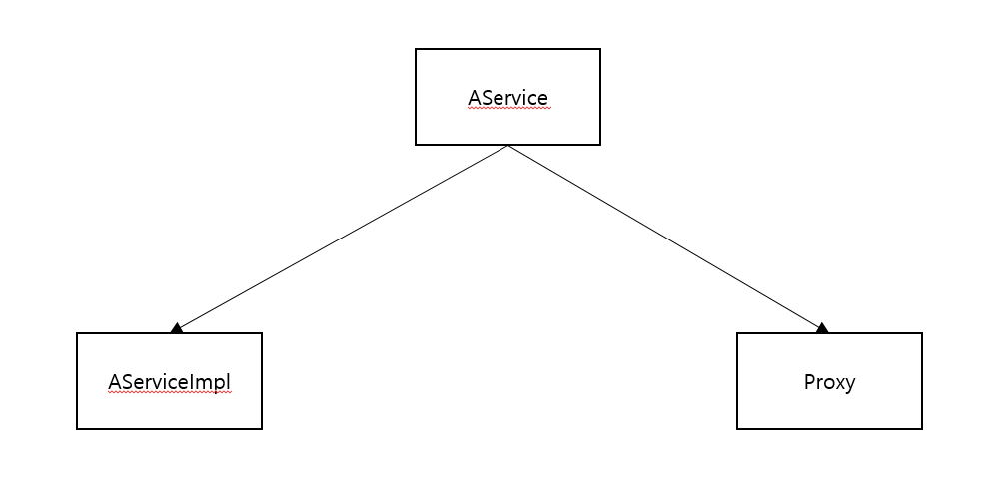

# Bean 주입을 받을 때 interface타입으로 받는 이유

> 인터페이스가 있고, 그에 대한 구현체가 있을 때 굳이 class가 아닌 interface를 DI받는 이유

## Basic Knowledge


위 그림과 같이 Proxy 가 요청을 대신 받고, Proxy가 실제 객체를 호출해 준다.

이러한 Proxy의 종류에는 Dynamic Proxy와 Cglib 두가지 종류가 있다.

<br>

### Dynamic Proxy

Dynamic Proxy는 **인터페이스 기준으로 Proxy를 생성**하며 **Reflection으로 proxy 객체를 생성**한다.

인터페이스 기반으로 Proxy를 생성할 때 사용된다.

<br>

### Cglib

Cglib은 **클래스의 상속**을 통해 객체를 생성하며, **인터페이스 또는 클래스를 기반으로 proxy를 생성**한다.

타겟 클래스의 바이트코드를 조작한다.

성능이 더 좋고 예외가 발생할 확률도 더 낮다고 한다.

클래스 기반으로 Proxy를 생성할 때 사용된다.

<br>

### Spring Bean과의 관계

Spring Bean에선 인터페이스의 유무에 따라 Proxy를 만드는 방법이 달라진다.


위 그림과 같이 인터페이스의 유무에 따라 있으면 Dynamic Proxy, 없으면 CGLib를 사용하게 된다.

<br>

## 이유

우선 다음과 같이 생긴 코드가 있다고 가정해 보자.

``` java
public interface AService {
    void hello();
}

@Service
public class AServiceImpl implements AService {
    @Override
    public void hello() {
        System.out.println("hello");
    }
}
```

여기서는 JDK Dynamic Proxy를 통해 Proxy 객체가 생성된다.

Proxy 객체는 AService의 구현체가 되는데, 즉 상속관계는 다음과 같다.



따라서 다음과 같이 Bean 주입을 받아오면 문제가 없다.

``` java
@RequiredArgsConstructor
public class A {
    private final AService aService;
}
```

하지만 만약 다음과 같이 Bean 주입을 받아오면 문제가 발생한다.

``` java
@RequiredArgsConstructor
public class A {
    private final AServiceImpl aService;
}
```

이유는 주입을 받을 때 Proxy 객체를 받아오게 되는데, 기존에는 다형성에 의해 Proxy가 AService로 변경될 수 있지만 AServiceImpl로는 변환될 수 없다.

따라서 **인터페이스가 존재한다면 빈 주입을 항상 인터페이스로 받아야 한다.**