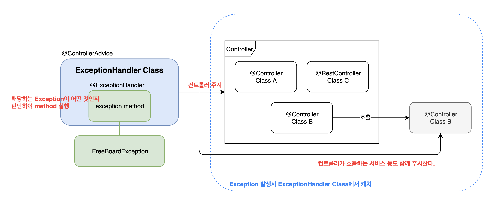

# @ExceptionHandler 어노테이션

### Annotation 설명

@ExceptionHandler 어노테이션은 @Controller 어노테이션이나 @RestController 어노테이션이 붙은 Bean에서 발생하는 예외를 잡아서 처리해 준다.

매개값으로 어떤 Exception을 받는다.

해당 Exception이 발생했을 때 그것을 감지해서 해당 메소드를 실행한다.

> 넓은 범위의 Exception을 잡고 싶다면, 모든 Exception의 부모인 Exception.class를 매개값으로 넣어줄 수 있다.

> 혹은 모든 커스텀 Exception의 부모가 되는 Exception 클래스를 하나 만들어서, 해당 Exception을 매개값으로 넣어주어도 된다.

이렇게 한곳에서 Exception을 처리하게 되면 로깅 처리 등 얻는 이점이 많다.

### 관련 Annotation

#### @ControllerAdvice

@Controller 어노테이션이 붙은 모든 클래스들에서 Exception이 발생하면 감지한다.

즉, Service만 Exception 감지는 불가능하다.

> 보통 Controller에서 Service를 호출하기 때문에, 결국 Service의 Exception 또한 감지한다.

특정 클래스만 명시하는 것이 가능하다.

해당 어노테이션이 붙은 클래스 아래에 @ExceptionHandler 어노테이션이 붙은 메소드를 여러개 선언할 수 있다.

#### @RestControllerAdvice

@ControllerAdvice와 같지만, @RestController 어노테이션이 붙은 클래스들을 감지한다.

