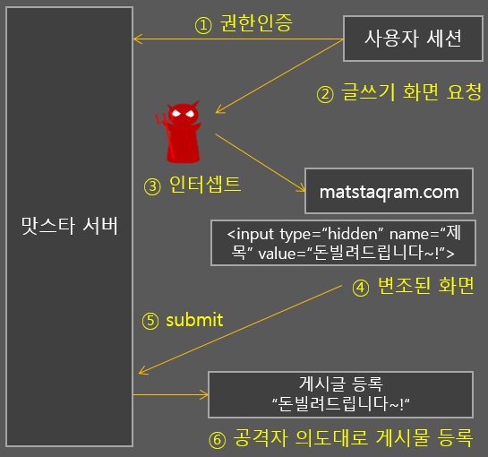
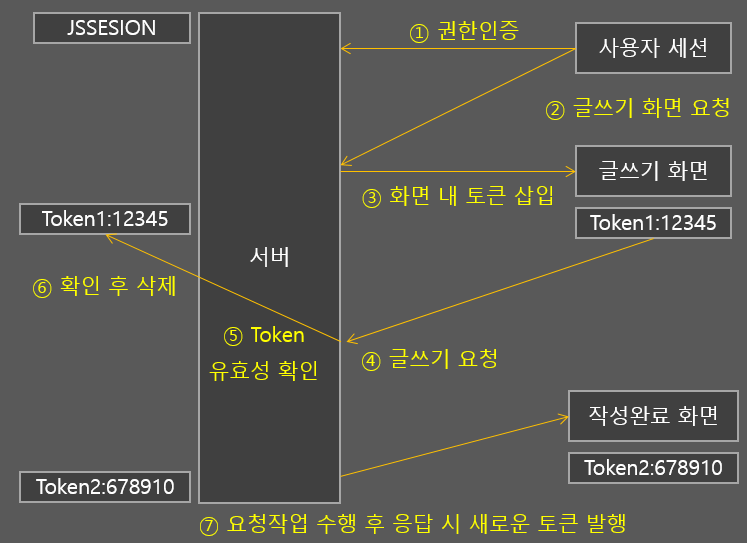

# CSRF

### CSRF란

**사용자의 의지와 무관하게 공격자의 의도대로 서버에 특정 요청을 보내도록 하는 공격 방식**

> 내가 서비스를 이용하고 있을 때, 교묘하게 URI만 살짝 틀고 완전히 동일한 UI를 만들게 된다.
>
> 그러면 나는 가짜 사이트 인걸 알지 못하고 글쓰기를 하게 된다.
>
> 사실 서버에 전송되는 데이터는 내가 쓴 글이 아닌 hidden 타입으로 숨어있던 데이터가 들어가게 된다.



이렇게 위조된 페이지에서 요청을 보내는걸 막기 위해 많은 방법들이 있지만 그 중 하나가 CSRF Token 이다.

### CSRF 토큰이란

서버에 들어온 요청이 실제 서버에서 허용한 요청이 맞는지 검증하는 토큰이다.

> 즉 **내가 의도한 곳에서 온 요청이 맞는지 검증** 한다.



1. 서버에 권한을 인증 받는다.
2. 글쓰기 화면을 요청한다.
3. 이 때 **CSRF 토큰이 발급되어 반환하고** 화면을 보여준다.
4. Token을 가지고 서버에 글쓰기 요청을 보낸다.
5. Token이 유효한지 확인한다.
6. 토큰을 삭제한다.
7. 다시 발급시켜 준다.

위와 같은 과정을 통해 인증한다.

이러한 인증은 POST 요청에서만 작동하게 된다.

> GET 요청에서 작동하려 하면 다른 사이트에서 링크를 타고 들어올때나 RESTful API 처리 등이 불가능 하기 때문에 POST에서만 작동한다.

### CSRF ON SPRING BOOT

Spring Boot에서 CSRF는 Spring Security가 지원한다.

Spring Security는 취약점을 조심하기 위해서 **CSRF를 활성화 하는 것을 권장**한다.

> CSRF는 세션을 사용할 때 그나마 더 안전하지만, Cookie를 사용할 때에는 위험할 수 있다.

#### 사용

``` java
@EnableWebSecurity
public class SecurityConfig extends WebSecurityConfigurerAdapter {
    @Override
    protected void configure(HttpSecurity http) throws Exception {
        http
                .csrf()
                    .csrfTokenRepository(CookieCsrfTokenRepository.withHttpOnlyFalse())
    }
}
```

> 단순히 csrf를 활성화 하는 부분

위와 같은 방법으로 csrf를 활성화 시킬 수 있다.

#### 방식

1. 서버에 GET 요청이 들어온다.

2. XSRF 토큰을 발급한다.

3. Set-cookie 라는 이름의 XSRF 토큰과 함께 response를 반환한다.

4. 브라우저가 XSRF 토큰으로 쿠키에 저장한다.

5. POST와 같이 서버의 상태가 변화하는 요청을 할 때 header에 토큰 값을 넣어서 요청한다.

   > 토큰은 body와 cookie 모두 전송된다.
   >
   > 이유는 브라우저가 쿠키 값을 알아서 요청에 추가하기 때문이다.

6. 스프링은 body와 cookie의 토큰 값을 비교한다.

7. 만약 다르면 403이 발생한다.

##### scrfTokenRepository

``` java
static final String DEFAULT_CSRF_COOKIE_NAME = "XSRF-TOKEN";

static final String DEFAULT_CSRF_PARAMETER_NAME = "_csrf";

static final String DEFAULT_CSRF_HEADER_NAME = "X-XSRF-TOKEN";

private String parameterName = DEFAULT_CSRF_PARAMETER_NAME;

private String headerName = DEFAULT_CSRF_HEADER_NAME;

private String cookieName = DEFAULT_CSRF_COOKIE_NAME;
```

scrfTokenRepository는 위와 같이 되어 있다.

- DEFAULT_CSRF_COOKIE_NAME는 저장될 쿠키의 이름을 정한다.

- DEFAULT_CSRF_PARAMETER_NAME는 파라미터로 넘어올 때 파라미터 이름을 정한다.

  > POST 요청을 보낼 때 _csrf로 보내면 된다.

- DEFAULT_CSRF_HEADER_NAME는 헤더를 받을 때 헤더의 이름을 정한다.

  > X-XSRF-TOKEN 이라는 이름의 헤더에 토큰 정보가 담기게 된다.

``` java

	/**
	 * Sets the name of the HTTP request parameter that should be used to provide a token.
	 * @param parameterName the name of the HTTP request parameter that should be used to
	 * provide a token
	 */
	public void setParameterName(String parameterName) {
		Assert.notNull(parameterName, "parameterName is not null");
		this.parameterName = parameterName;
	}

	/**
	 * Sets the name of the HTTP header that should be used to provide the token.
	 * @param headerName the name of the HTTP header that should be used to provide the
	 * token
	 */
	public void setHeaderName(String headerName) {
		Assert.notNull(headerName, "headerName is not null");
		this.headerName = headerName;
	}

	/**
	 * Sets the name of the cookie that the expected CSRF token is saved to and read from.
	 * @param cookieName the name of the cookie that the expected CSRF token is saved to
	 * and read from
	 */
	public void setCookieName(String cookieName) {
		Assert.notNull(cookieName, "cookieName is not null");
		this.cookieName = cookieName;
	}

	/**
	 * Sets the HttpOnly attribute on the cookie containing the CSRF token. Defaults to
	 * <code>true</code>.
	 * @param cookieHttpOnly <code>true</code> sets the HttpOnly attribute,
	 * <code>false</code> does not set it
	 */
	public void setCookieHttpOnly(boolean cookieHttpOnly) {
		this.cookieHttpOnly = cookieHttpOnly;
	}

	private String getRequestContext(HttpServletRequest request) {
		String contextPath = request.getContextPath();
		return (contextPath.length() > 0) ? contextPath : "/";
	}

	/**
	 * Factory method to conveniently create an instance that has
	 * {@link #setCookieHttpOnly(boolean)} set to false.
	 * @return an instance of CookieCsrfTokenRepository with
	 * {@link #setCookieHttpOnly(boolean)} set to false
	 */
	public static CookieCsrfTokenRepository withHttpOnlyFalse() {
		CookieCsrfTokenRepository result = new CookieCsrfTokenRepository();
		result.setCookieHttpOnly(false);
		return result;
	}

	private String createNewToken() {
		return UUID.randomUUID().toString();
	}

	/**
	 * Set the path that the Cookie will be created with. This will override the default
	 * functionality which uses the request context as the path.
	 * @param path the path to use
	 */
	public void setCookiePath(String path) {
		this.cookiePath = path;
	}

	/**
	 * Get the path that the CSRF cookie will be set to.
	 * @return the path to be used.
	 */
	public String getCookiePath() {
		return this.cookiePath;
	}

	/**
	 * Sets the domain of the cookie that the expected CSRF token is saved to and read
	 * from.
	 * @param cookieDomain the domain of the cookie that the expected CSRF token is saved
	 * to and read from
	 * @since 5.2
	 */
	public void setCookieDomain(String cookieDomain) {
		this.cookieDomain = cookieDomain;
	}

	/**
	 * Sets secure flag of the cookie that the expected CSRF token is saved to and read
	 * from. By default secure flag depends on {@link ServletRequest#isSecure()}
	 * @param secure the secure flag of the cookie that the expected CSRF token is saved
	 * to and read from
	 * @since 5.4
	 */
	public void setSecure(Boolean secure) {
		this.secure = secure;
	}
```

위와 같이 많은 setter들이 있는데, 해당 메소드들을 통해 파라미터 이름, 쿠키 이름 등을 지정할 수 있다.

``` java
@Override
public CsrfToken generateToken(HttpServletRequest request) {
	return new DefaultCsrfToken(this.headerName, this.parameterName, createNewToken());
}
```

generateToken 부분은 위와 같이 되어 있는데, headerName, parameterName, UUID를 통해 DefaultCsrfToken 객체를 생성한다.

```java
@Override
public void saveToken(CsrfToken token, HttpServletRequest request, HttpServletResponse response) {
   String tokenValue = (token != null) ? token.getToken() : "";
   Cookie cookie = new Cookie(this.cookieName, tokenValue);
   cookie.setSecure((this.secure != null) ? this.secure : request.isSecure());
   cookie.setPath(StringUtils.hasLength(this.cookiePath) ? this.cookiePath : this.getRequestContext(request));
   cookie.setMaxAge((token != null) ? -1 : 0);
   cookie.setHttpOnly(this.cookieHttpOnly);
   if (StringUtils.hasLength(this.cookieDomain)) {
      cookie.setDomain(this.cookieDomain);
   }
   response.addCookie(cookie);
}
```

saveToken은 null 검증 후 Cookie에 CsrfToken을 저장한다.

``` java
@Override
public CsrfToken loadToken(HttpServletRequest request) {
	Cookie cookie = WebUtils.getCookie(request, this.cookieName);
	if (cookie == null) {
		return null;
	}
	String token = cookie.getValue();
	if (!StringUtils.hasLength(token)) {
		return null;
	}
	return new DefaultCsrfToken(this.headerName, this.parameterName, token);
}
```

토큰을 가져오는 부분으로, 토큰을 가져오는데 성공한다면 반환시켜 준다.