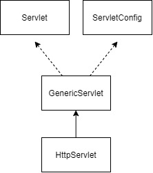

# SERVLET

## SERVLET이란

서버 사이드에서 돌아가는 프로그램으로, **클라이언트의 요청을 처리**하고 **결과를 다시 클라이언트에게 전송**하는 **Servlet 클래스의 규칙을 따른** 프로그램

이라고 할 수 있다.

WAS 안에서 동작하며 **요청을 처리**하고 **응답**하는 역할을 담당한다.

Servlet 클래스는 HttpServlet 클래스를 상속받아서 사용하며, Servlet Container에 의해 관리된다.

## 구조

위와 그림과 같이 `GenericServlet` 이라는 클래스가 `Servlet`과 `ServletConfig` 라는 클래스를 상속받아 사용한다.

또한 우리가 실질적으로 사용하는 `HttpServlet`은 `GenericServlet`을 상속 받아 사용하게 된다.

## 생명주기 메소드

### init()

서블릿 요청 시 **처음 한번만**실행되며, 초기화 작업을 담당한다.

### doGet(), doPost(), doPatch() 등

요청 시 마다 get, post, patch 등 메소드에 따라 **매번** 실행되는 메소드 이다.

### destroy()

서블릿이 메모리에서 소멸될 때 호출되며, 마무리를 한다.

## Servlet Container

**서블릿들의 생명주기를 관리**해주는 Component 이다.

**HTTP 요청**을 받아서 **Servlet을 실행**시키고,결과를 전달한다.\

**서블릿과 Web Server 사이를 연결시켜준다.**

> Web Server와 Web Application Server(WAS)는 다른 종류이며, **다른 특징**을 가지고 있다.
>
> - Web Server
>
>   웹 서버는 클라이언트의 요청을 받아 웹 컨테이너로 전달하고, 웹 컨테이너의 결과를 클라이언트에 반환한다.
>
>   **정적**인 데이터를 전송하는 서버이다.
>
>   단순 html과 같은 정적인 데이터를 처리할 때엔 WAS보다 빠르다.
>
> - Web Application Server
>
>   다양한 기능을 컨테이너에 구현하고 다양한 역할을 수행하는 서버
>
>   요청을 **내부적으로 연산을 처리한 후** 내용을 웹 서버로 전달한다.
>
>   **동적**인 데이터를 전송하는 서버이다.

**멀티쓰레드**를 지원한다.

## Servlet의 처리

1. Web Server가 **Request를 Web Container에게 위임**한다.(Servlet Container)
   1. 어떤 URL과 매핑되어 있는지 확인한다.
   2. 클라이언트의 URL을 통해 적절한 Servlet을 찾는다.
2. Servlet Container(Web Container)가 Service를 호출하기 위해 Servlet 객체를 메모리에 올린다.
   1. 적절한 Servlet 파일을 컴파일 한다.
   2. 컴파일된 파일을 메모리에 올려서 Servlet 객체를 초기화 한다.
   3. 로드될 때 **Servlet의 init() 메소드가 실행**된다.
3. request가 올때마다 thread를 생성해서 처리한다.

## Servlet과 Thread

Servlet Container가 요청마다 thread를 생성하고 지우는건 오버헤드가 커서 비효율적이다.

따라서 WAS는 thread 들을 만들어 pool에 저장해 둔다.

이러한 thread가 저장되는 pool을 **thread pool**이라고 한다.