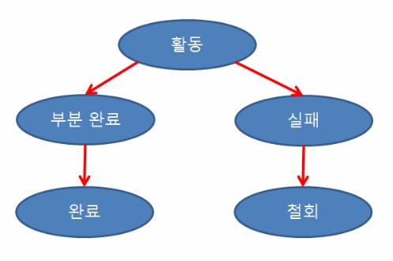
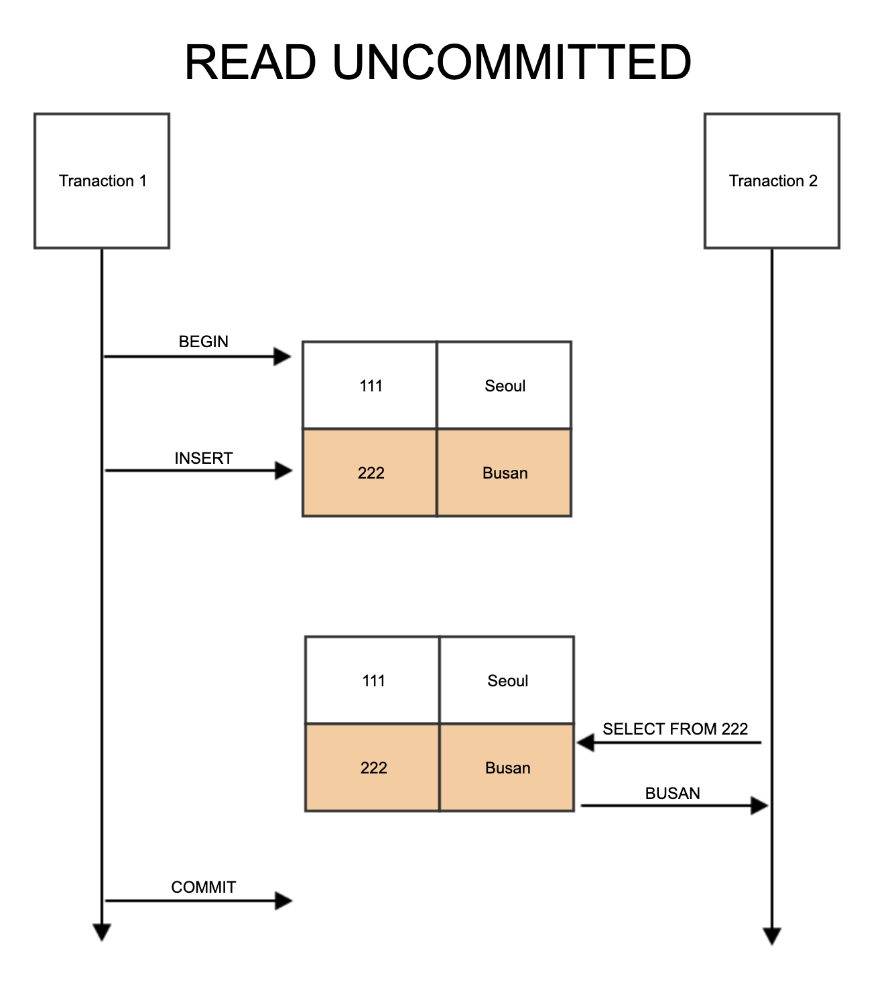
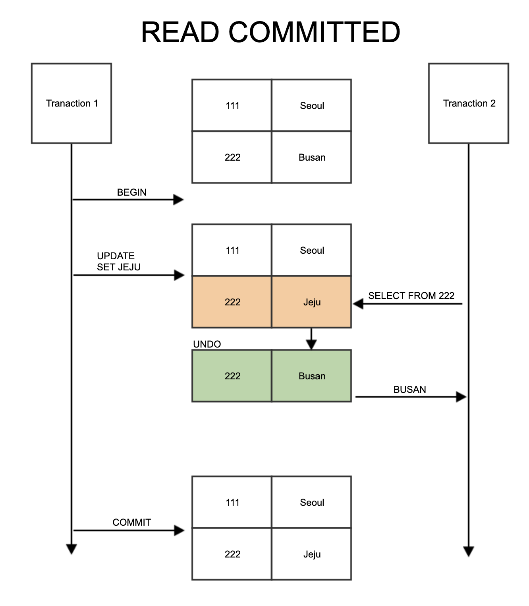
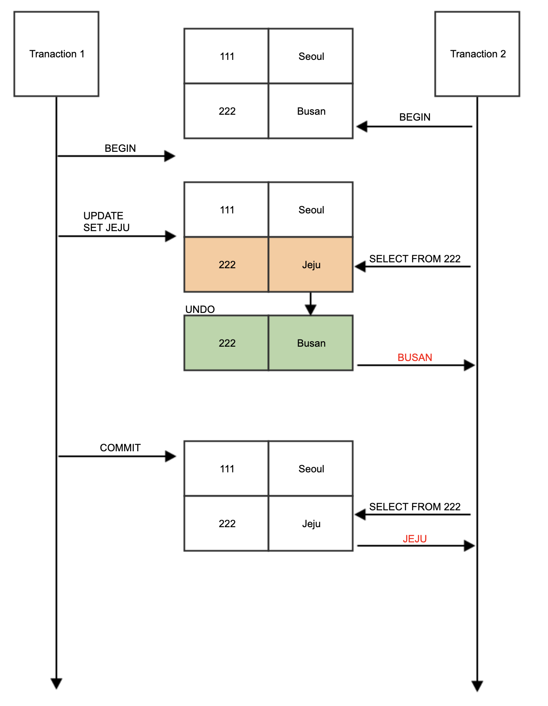
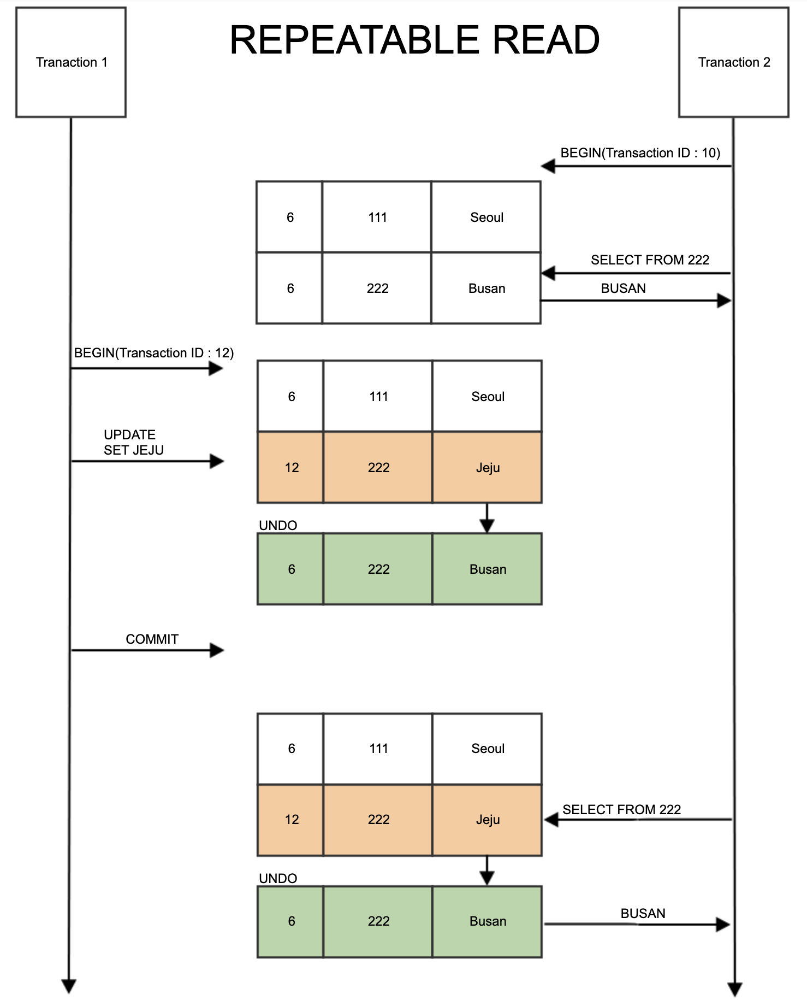

# Transaction

### 소개

---

우리가 기본적으로 알고있는 Transaction이란 **데이터베이스의 상태를 변화시키기 위한 작업의 단위**를 의미한다.

하나의 트랜잭션은 취소시킬 수 있고, 문제가 발생하지 않았다면 적용시킬 수 있다.

Spring에서 트랜잭션은 Database와 비슷하지만 별개로 작동하는 AOP 기술이다.

크게 **`@Transactional` 어노테이션을 이용하는 방법과 설정 파일을 이용하는 방법**으로 나뉘어 사용할 수 있다.

### 트랜잭션의 특징

---

| 종류                       | 설명                                                         |
| -------------------------- | ------------------------------------------------------------ |
| Atomicity(원자성)          | 트랜잭션의 연산은 데이터베이스에 모두 반영되거나, 전혀 반영되지 않아야 한다. |
| Consistency(일관성)        | 트랜잭션이 완료되면 일관성 있게 DB에 반영해야 한다.          |
| Isolation(독립성, 격리성)  | 트랜잭션은 독립적으로 처리되어야 하고 각각의 트랜잭션은 간섭할 수 없다. |
| Durability(영속성, 지속성) | 완료된 트랜잭션은 영구적으로 지속되어야 한다.                |

이러한 **트랜잭션의 특징들은 100% 지켜지지 못한다.**

왜냐하면 특징들을 완전히 지키려 하면 **동시성이 굉장히 떨어지기 때문이다.**

> 동시성이란 하나의 프로세스에서 많은것을 처리하는 것이다.

그렇기 때문에 DBMS는 다음과 같은 특징들을 다 지키지는 못하고 **격리 수준**이라는 것을 통해 원칙을 덜 지키고 동시성을 얻는다.

### 트랜잭션의 상태

---

트랜잭션의 상태는 크게 5개로 나뉠 수 있다.

| 이름      | 설명                                                         |
| --------- | ------------------------------------------------------------ |
| 활동      | 말 그대로 트랜잭션이 활동중인 상태로, 다른 모든 상태의 시작이다. |
| 부분 완료 | 트랜잭션이 성공적으로 수행되었지만, Commit을 수행하기 직전의 상태이다. |
| 완료      | 부분 완료 상태에서 Commit 연산을 수행한 상태이다.            |
| 실패      | 트랜잭션의 실행 도중 오류가 발생하여 중지된 상태이다.        |
| 철회      | 비정상적으로 종료된 트랜잭션을 적용하지 않기 위해 ROLLBACK 연산을 수행한 상태이다. |

### Spring Transaction

---

스프링에서 트랜잭션은 일반적으로 `@Transactional`어노테이션을 통해 **선언적 트랜잭션**을 이용한다.

메소드 위에 `@Transactional`이 선언되게 되면 해당 클래스에 **트랜잭션 기능이 적용된 프록시 객체**가 생성된다.

이 프록시 객체는 **`@Transactional`이 붙은 메소드가 호출되었을 때** `PlatformTransactonManager`를 사용해서 **트랜잭션을 시작**한다.

해당 메소드의 **성공 여부에 따라 Rollback 또는 Commit을 수행**한다.

#### 격리 수준

---

밑에 나오는 격리 수준을 각각 트랜잭션마다 설정해줄 수 있다.

- Default

  DB의 격리 수준을 따르게 된다.

- READ_UNCOMMITTED

- READ_COMMITTED

- REPEATABLE_READ

- SERIALIZABLE

#### 전파 옵션

---

트랜잭션 동작 도중 다른 트랜잭션이 호출될 때 어떻게 동작할지 선택한다.

- **Required**

  Default 속성으로, 부모 트랜잭션 안에서 실행되고 부모 트랜잭션이 존재하지 않으면 생성하게 된다.

- **Supports**

  이미 시작된 트랜잭션이 존재하지 않으면 트랜잭션 없이 진행하고, 존재하면 트랜잭션에 참여하게 된다.

- **Requires_new**

  항상 새로운 트랜잭션이 시작되게 된다.

- **Mandatory**

  이미 시작된 트랜잭션이 있으면 참여한다.

  Requires와 비슷하지만, 만약 실행중인 트랜잭션이 없다면 예외가 발생한다.

  혼자 독립적인 트랜잭션으로 참여하면 안될 때 사용된다.

- **Not_supported**

  트랜잭션을 사용하지 않도록 한다.

  이미 실행중인 트랜잭션이 존재하면 해당 트랜잭션을 보류시키게 된다.

- **Never**

  트랜잭션을 사용하지 않도록 한다.

  Not supported와 다르게 이미 실행중인 트랜잭션이 존재하면 예외가 발생하게 된다.

- **Nested**

  이미 실행중인 트랜잭션이 있다면 중첩 트랜잭션을 시작한다.

  중첩 트랜잭션은 트랜잭션 안에서 트랜잭션이 시작되는 것을 의미한다.

  독립적인 트랜잭션을 시작하는 Required_new와는 다르다.

  중첩 트랜잭션은 부모의 커밋과 롤백은 영향을 받지만, 자신의 커밋과 롤백은 부모에게 영향을 주지 않는다.

#### readOnly

---

트랜잭션을 **읽기 전용**으로 설정할 수 있는 속성

**성능 최적화** 또는 **쓰기 작업 방지**를 위해 사용된다.

readOnly 트랜잭션 내부에서 `INSERT/DELETE/UPDATE`가 발생하면 예외가 발생하게 된다.

### 롤백 예외

---

기본적으로 선언적 트랜잭션에서는 Runtime Exception발생 시 롤백이 수행된다.

하지만 예외가 발생하지 않거나 Check Exception이 발생하면 커밋이 수행된다.

> Check Exception이 발생해도 커밋이 수행되는 이유는 보통 체크 예외가 보통의 Runtime Exception처럼 예외적인 상황에서 발생하지 않고,
>
> 주로 **비지니스적 의미를 담은 값을 반환** 할 때 사용되기 때문이다.

이렇듯 Runtime Exception에서만 발생되던 롤백을 바꿔줄 수 있다.

- **rollbackFor**

  특정 예외가 발생하면 강제로 롤백한다.

  `rollbackFor=UserNotFoundException.class`처럼 사용할 수  있다.

- noRollbackFor

  특정 예외는 발생해도 롤백되지 않는다.

  `noRollbackFor=UserNotFoundException.class`

### Timeout

---

트랜잭션이 해당 시간동안 끝나지 않으면 롤백시켜 버린다.

### InnoDB의 Lock

---

InnoDB는 ACID 원칙을 지키기 위해 **Lock**을 지원한다.

#### Shared Lock

---

Shared Lock은 Read를 허용하는 Lock이다.

만약 한 트랜잭션이 Shared Lock을 가지고 있고, 다른 트랜잭션이 Shared Lock을 요청한다면, 즉시 승인하게 된다.

따라서 둘 모두 Shared Lock을 가지게 된다.

하지만 만약 Exclusive Lock을 요청한다면 즉시 승인하지 않는다.

#### Exclusive Lock

---

Exclusive Lock은 update 또는 delete를 허용하는 Lock이다.

만약 한 트랜잭션이 Exclusive Lock을 가지고 있다면 다른 트랜잭션에서 Shared Lock이든 Exclusive Lock이든 요청을 거부한다.

또한 다른 트랜잭션은 Lock을 가지고 있는 트랜잭션이 끝날때까지 기다려야 한다.

#### Intention Lock

---

InnoDB는 테이블에 걸린 Lock과 로우에 걸린 Lock을 공존하게 해주는 `Multiple Granularity Locking`을 지원한다.

MGL을 위해 InnoDB는 Intention Lock을 사용하는데, Intention Lock은 **테이블 단위의 Lock**이다.

### 트랜잭션의 격리 수준

---

트랜잭션의 격리 수준이란, **여러 트랜잭션이 있을 때 특정 트랜잭션이 다른 트랜잭션을 변경 및 조회할 수 있도록 허용할지 말지**를 결정하는 것이다.

트랜잭션의 격리 수준에는 4가지가 있다.

> 격리 수준은 `ANSI/ISO`에서 정한 4가지가 있다.

#### Read UnCommitted

각 트랜잭션에서 변경 내용이 commit 또는 rollback 여부에 상관 없이 값을 읽을 수 있다.

문제가 많기 때문에 사용하지 않기를 권장한다.

> 트랜잭션의 작업이 완료되지 않았는데 다른 트랜잭션에서 변경된 값을 볼 수 있다.
>
> 따라서 `Dirty Read`현상이 발생한다.

위 그림과 같이 다른 트랜잭션이 수정되었을 때 커밋되지 않아도 해당 트랜잭션에서 수정된 값을 읽을 수 있다.

#### Read Committed

관계형 데이터베이스에서 주로 사용하고 있는 방법이다.

`Dirty Read`현상이 발생하지 않는다.

실제 테이블이 아닌, **Undo 영역에서 백업된 정보에서 값을 가져온다**.

> Undo 영역이란 롤백, 복구를 위한 영역이다.
>
> 따라서 트랜잭션의 이전 정보를 담고 있기 때문에, Undo 영역에서 백업된 정보는 **트랜잭션 이전의 정보**이다.

하지만 이러한 방식에도 문제는 존재한다.

하지만 **하나의 트랜잭션에서 같은 SQL을 발생시켰음에도 다른 결과가 반환**된다.

따라서 `Repeatable Read`의 정합성에 어긋난다.

#### Repeatable Read

Repeatable Read는 하나의 트랜잭션에서 **Read 작업을 여러번 수행하더라도 같은 결과를 반환하는도록 보장하는 방법**이다.

Repeatable Read는 처음 Read 작업을 했을 때, **Snapshot을 구축한다.**

그리고 그 이후부터, 직접 접근해서 정보를 찾는게 아닌, **스냅샷에서 정보를 찾게 된다.**

그렇기 때문에 하나의 트랜잭션에서는 하나의 스냅샷을 이용하기 때문에 항상 같은 정보를 유지할 수 있다.

> 참고로 해당 트랜잭션에서 Update나 Insert, Delete 작업을 수행하게 되면 스냅샷 정보가 변경된다.

하지만 `PhantomRead(유령 읽기)`현상은 발생한다.

이유는 스냅샷에서 정보를 가져오긴 하지만, **INSERT 및 DELETE에선 정합성을 보장하지 않기 때문**이다.

UPDATE된 정보는 스냅샷에서 정보를 가져오기 때문에 문제가 없지만, 다른 트랜잭션에서 INSERT/DELETE가 발생했다면 해당 정보를 읽어올 수 있다.

해당 트랜잭션에서 ROLLBACK이 발생했다면 다시 정보가 사라지게 된다.

> `This is the default isolation level for InnoDB. Consistent reads within the same transaction read the snapshot established by the first read`

#### Serializable

**가장 엄격한 격리 수준**으로 **동시성을 포기하고 안정성에 비중**을 두었다.

우리가 일반적인 SELECT문을 작성하면, Serializable에선 SELECT ... FOR SHARE 로 변환한다.

FOR SHARE의 의미는 **shared lock을 건다는 의미**이다.

따라서 **해당 트랜잭션이 끝나기 전까지 해당 SELECT의 대상을 수정/삭제 할 수 없다.**

만약 UPDATE 를 하려 하면, 계속해서 대기 상태에 들어가게 된다.

> 일정 시간 이후 timeout이 발생한다.

### 발생 문제 정리

