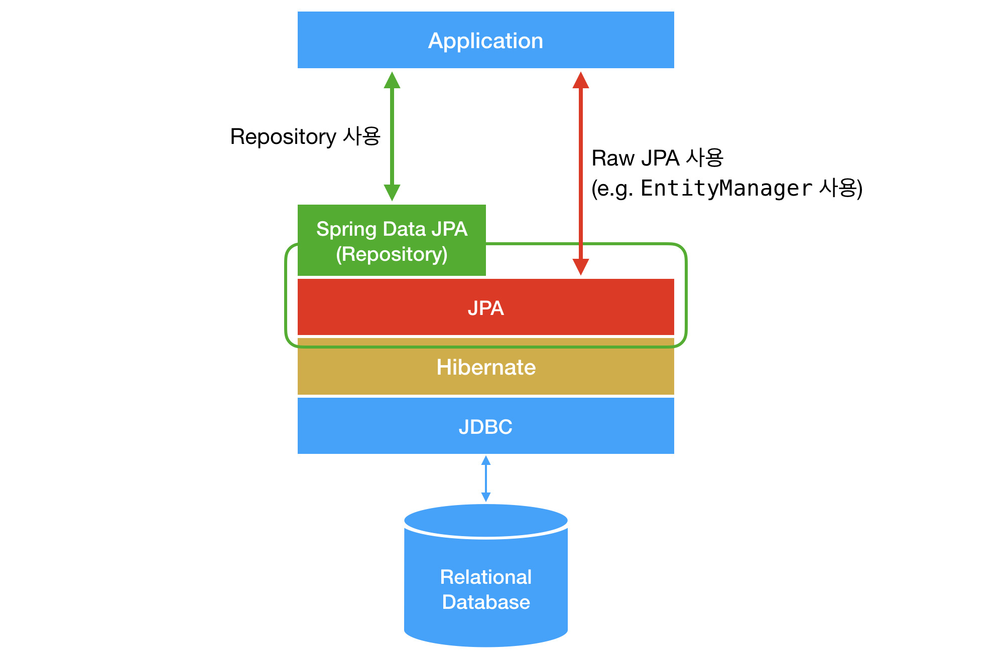

# 책의 구성

### 1~9장

#### 이론에 대해 알아보게 된다.

### 10장

#### 객체지향 쿼리 언어 JPQL ~ SQL에 대해 설명한다.

### 11~12장

#### 실무에서 사용되는 JPA를 설명하는 활용편이다.

### 13~16장

#### 트랜잭션, 락, 캐시, 성능 최적화 등 JPA의 고급 주제들을 다루게 된다.

# 예제 코드

<a href="https://github.com/holyeye/jpabook">깃허브 링크</a>

위 깃허브 링크에서 예제 코드를 확인할 수 있다.

# 들어가며

>  이 책을 정리하는 것은 지극히 개인적으로 공부하고 싶어서 이기 때문에, 내가 너무 잘 알고있는 내용이나 eclipse IDE와 같은 나와 큰 상관이 없는 내용은 생략될 수 있다.

**이 책은 Spring Data Repository가 아닌 Raw JPA 를 이용한다.**

> 즉, Repository를 이용하지 않는다는 의미이다.

### JPA의 장점과 단점

단점

- 초기 적용이 어렵다

- 약간 성능 이슈가 있다.

  > 성능 이슈는 네이티브 SQL 등을 통해 직접적으로 사용할 수 있다.
  >
  > 조회 성능 이슈는 JPA의 문제가 아닌 SQL 자체의 문제다.

장점

- 반복적인 CRUD 줄이기

- 조회 결과를 매핑시키는것을 자동으로 해준다.

- 데이터베이스의 교체가 간편하다.

  > 원래 데이터베이스를 교체할 때에는 SQL문 전체를 고쳐야 할수도 있지만, JPA는 데이터베이스에 구애받지 않기 때문에 간편하다.

- 전자정부에서 표준으로 자리잡고 있다. 즉, 표준이기 때문에 많은 사람들이 사용하고 있다.

### 주의

이 책에서 DB를 다룰 때, 모두 대문자로 한다.

하지만 DB 이름은 소문자로 하는게 추천된다.

[DB 이름 규칙](../../../database/column_name_rule.md)

이 책의 엔티티를 보고 적용할 생각이라면 위의 이름 규칙을 따르는게 좋다.